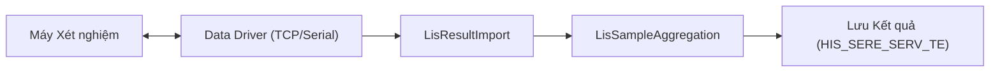

# Thiết kế Kỹ thuật: Phân hệ LIS

## 1. Tổng quan Architecture
Phân hệ LIS bao gồm 12 plugin chuyên dụng nằm trong namespace `LIS.Desktop.Plugins.*`.
Các plugin này xử lý giao tiếp phần cứng (Máy xét nghiệm) và quy trình nghiệp vụ xét nghiệm phức tạp.

## 2. Danh mục Plugin

| Nhóm | Plugin Key | Số file | Chức năng |
|:---|:---|:---|:---|
| **Quản lý Mẫu** | `LisSample` | ~20 | Đăng ký mẫu mới. |
| | `LisSampleList` | 21 | Danh sách mẫu, tìm kiếm. |
| | `LisSampleUpdate` | 36 | Cập nhật kết quả thủ công/duyệt. |
| **Kết nối Máy** | `LisMachine` | 24 | Khai báo máy xét nghiệm. |
| | `LisMachineIndex` | 22 | Mapping chỉ số máy <-> dịch vụ HIS. |
| | `LisResultImport` | 18 | Parse kết quả từ máy (HL7, ASTM). |
| **Chuyên sâu** | `LisMicrobiology` | ~20 | Vi sinh & Kháng sinh đồ. |
| | `LisSampleAggregation`| 27 | Tổng hợp kết quả từ nhiều nguồn. |

## 3. Kiến trúc Chi tiết

### 3.1. Luồng Dữ liệu Máy Xét nghiệm (Analyzer Integration)

*   **Giao thức**: Hỗ trợ HL7, ASTM, và các giao thức độc quyền (Serial Port).
*   **Result Import**: Plugin `LisResultImport` chịu trách nhiệm parse các gói tin raw data thành đối tượng kết quả.

### 3.2. Mapping Dữ liệu (`LisMachineIndex`)
Đây là thành phần quan trọng nhất để máy hiểu được dịch vụ của HIS.
*   **Machine Test Code**: Mã xét nghiệm trên máy (VD: `GLU`, `HGB`).
*   **HIS Service Code**: Mã dịch vụ trên HIS (VD: `XN001`).
*   **Conversion**: Hệ số chuyển đổi đơn vị (Result * Factor).

### 3.3. Quy trình Duyệt Kết quả
Kết quả sau khi từ máy về sẽ ở trạng thái "Chưa duyệt".
Plugin `LisSampleUpdate` cung cấp giao diện cho bác sĩ:
1.  Xem kết quả máy và kết quả chạy lại (Rerun).
2.  Gắn cờ bất thường (L/H) dựa trên chỉ số tham chiếu.
3.  Ký duyệt (Digital Signature).

## 4. Tích hợp Hệ thống
*   **Chỉ định**: Nhận chỉ định từ `ServiceExecute` (Phòng khám) hoặc `Treatment` (Nội trú).
*   **Billing**: Tự động ghi nhận dịch vụ đã thực hiện để tính tiền.
*   **In ấn**: Sử dụng `MPS` để in phiếu kết quả (Mẫu ngang/dọc, nhiều kích thước).

## 5. Cấu hình
Sử dụng `HIS.Desktop.LocalStorage.LisConfig`:
*   `AUTO_VALIDATE`: Tự động duyệt nếu kết quả bình thường.
*   `BARCODE_PREFIX`: Cấu hình tiền tố mã vạch.
