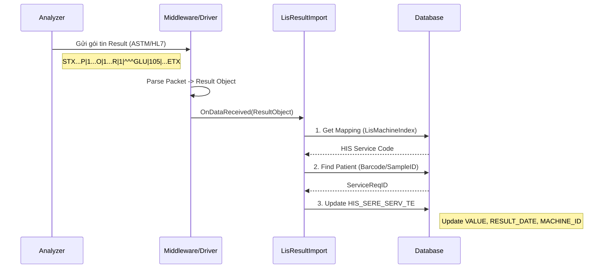

# Technical Spec: Kết nối Thiết bị (Equipment Connection)

## 1. Business Mapping
*   **Ref**: [Quy trình Kết nối Máy Xét nghiệm](../../02-business-processes/laboratory/03-equipment-connection.md)
*   **Scope**: Quản lý thiết bị, cấu hình giao tiếp (Communication), và mapping kết quả từ máy vào dịch vụ HIS.
*   **Key Plugin**: `HIS.Desktop.Plugins.LisMachine` & `HIS.Desktop.Plugins.LisMachineIndex`.

## 2. Core Components
### 2.1. Quản lý Máy (LisMachine)
*   **Plugin**: `HIS.Desktop.Plugins.LisMachine`.
*   **Chức năng**: Khai báo danh sách máy, chọn driver xử lý.
*   **Thuộc tính quan trọng**:
    *   `MachineName`: Tên hiển thị.
    *   `DriverClass`: Tên lớp Driver xử lý trong DLL (Middleware).
    *   `ConnectionParams`: Chuỗi cấu hình (COM Port, BaudRate, IP, Port).

### 2.2. Mapping Chỉ số (LisMachineIndex)
*   **Plugin**: `HIS.Desktop.Plugins.LisMachineIndex`.
*   **Chức năng**: "Phiên dịch" mã test của máy sang mã dịch vụ của HIS.
*   **Logic Mapping**:
    *   Input: `MachineID` + `MachineTestCode` (Ví dụ: 'COBAS_6000' + 'GLU').
    *   Output: `ServiceCode` HIS (Ví dụ: 'BIO_GLU_001').
    *   Factor: Hệ số nhân (Nếu đơn vị đo khác nhau).

## 3. Process Flow (Technical Deep Dive)

### 3.1. Luồng Nhận Kết quả (Result Import)

## 4. Database Schema

### 4.1. HIS_MACHINE_INDEX (Bảng Mapping)
*   `ID`: PK.
*   `MACHINE_ID`: FK to HIS_MACHINE.
*   `TEST_CODE`: Mã xét nghiệm do máy gửi ra (Quan trọng).
*   `SERVICE_ID`: FK to HIS_SERVICE_TYPE (Dịch vụ tương ứng trên HIS).
*   `CONVERSION_FACTOR`: Hệ số quy đổi (Mặc định = 1).
*   `ROUND_PART`: Làm tròn số thập phân.

### 4.2. HIS_MACHINE (Danh mục máy)
*   `MACHINE_NAME`: Tên máy.
*   `IS_ACTIVE`: Trạng thái sử dụng.
*   `CONNECTION_TYPE`: TCP/Serial/File.

## 5. Middleware Architecture
Hệ thống sử dụng cơ chế **Dynamic Driver Loading**:
1.  HIS đọc tên Class Driver từ DB (`HIS_MACHINE.DRIVER_CLASS`).
2.  Sử dụng Reflection để khởi tạo instance của Driver đó.
3.  Driver chịu trách nhiệm mở cổng kết nối và lắng nghe sự kiện.
4.  Khi có dữ liệu, Driver bắn event `DataReceived` về HIS Core để xử lý.

## 6. Common Issues
*   **Trôi kết quả**: Do cấu hình sai `BaudRate` hoặc `Parity` với cổng COM.
*   **Không map được**: Do `TEST_CODE` máy gửi ra khác với `TEST_CODE` đã khai báo (Ví dụ: máy gửi `GLU-P` nhưng khai báo là `GLU`). -> Cần check Log Raw Data.
