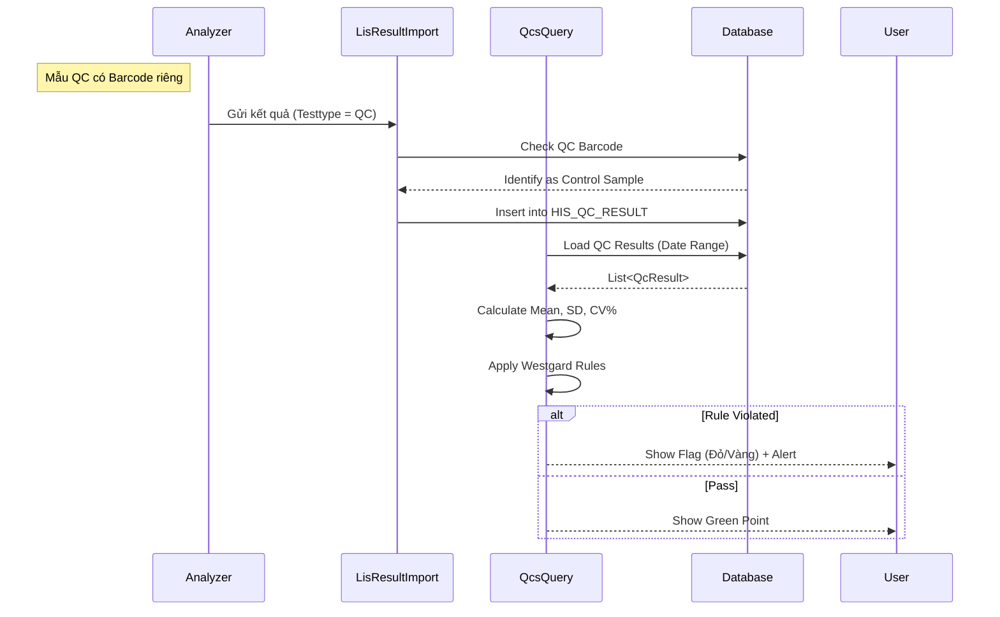

# Technical Spec: Quản lý Chất lượng (Quality Control - QC)

## 1. Business Mapping
*   **Ref**: [Qản lý Chất lượng Xét nghiệm](../../02-business-processes/laboratory/04-quality-control.md)
*   **Scope**: Quản lý mẫu chuẩn (Control), chạy nội kiểm hàng ngày, vẽ biểu đồ Levey-Jennings và cảnh báo quy tắc Westgard.
*   **Key Plugin**: `QCS.Desktop.Plugins.QcsQuery`.

## 2. Core Components
### 2.1. Plugin Structure
*   **Plugin Name**: `QCS.Desktop.Plugins.QcsQuery`
*   **Controller**: `QcsQueryProcessor`.
*   **Data Visualization**: Sử dụng `DevExpress.XtraCharts` để vẽ biểu đồ Levey-Jennings.

### 2.2. Logic Nghiệp vụ (QC Rules)
*   **Westgard Rules**: Hệ thống implement các logic check:
    *   `1-2s`: Warning.
    *   `1-3s`: Error (Reject run).
    *   `2-2s`: Error (Reject run).
    *   `R-4s`: Error (Reject run).
    *   `4-1s`: Warning/Error (Trend).
    *   `10x`: Warning (Systematic Error).
*   **Z-Score**: Tính toán `(Result - Mean) / SD` để chuẩn hóa dữ liệu trên biểu đồ.

## 3. Process Flow (Technical Deep Dive)

### 3.1. Luồng Nhập/Nhận Kết quả QC

## 4. Database Schema

### 4.1. HIS_QC_LOT (Lô mẫu chuẩn)
*   `ID`: PK.
*   `LOT_NUMBER`: Số lô.
*   `EXP_DATE`: Hạn sử dụng.
*   `MACHINE_ID`: Máy áp dụng.

### 4.2. HIS_QC_NORMATION (Thiết lập dải chuẩn)
*   `ID`: PK.
*   `LOT_ID`: FK.
*   `TEST_CODE`: Mã xét nghiệm.
*   `MEAN_VALUE`: Giá trị trung bình.
*   `SD_VALUE`: Độ lệch chuẩn.

### 4.3. HIS_QC_RESULT (Kết quả chạy máy)
*   `ID`: PK.
*   `NORMATION_ID`: FK (Link tới thiết lập dải chuẩn).
*   `VALUE`: Giá trị máy chạy ra.
*   `RESULT_DATE`: Thời điểm chạy.
*   `IS_ACCEPTED`: Đã duyệt hay chưa.
*   `NOTE`: Ghi chú nguyên nhân lỗi (nếu có).

## 5. Integration Points
*   **LisResultImport**: Module nhận kết quả tự động cần phân biệt được mẫu thường và mẫu QC (thường qua Sample ID prefix hoặc Flag từ máy).
*   **LisMachine**: QC gắn liền với từng máy cụ thể.

## 6. Common Issues
*   **Sai khai báo**: Nhập sai Mean/SD khiến biểu đồ hiển thị sai lệch hoàn toàn (tất cả điểm đều out range).
*   **Nhiễu dữ liệu**: Máy gửi nhầm kết quả bệnh nhân vào ID của mẫu QC.
