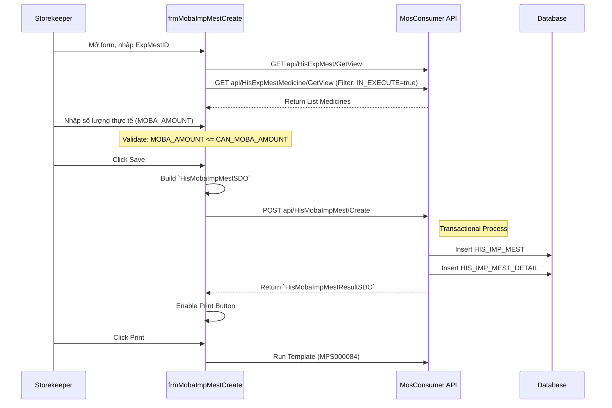

# Technical Spec: Quản lý Kho Dược Mobile (Mobile Inventory)

## 1. Business Mapping
*   **Ref**: [Quy trình Quản lý Kho Dược Mobile](../../02-business-processes/mobile-app/01-business-overview.md#21-quan-ly-kho-duoc-mobile-inventory)
*   **Scope**: Tài liệu này mô tả chi tiết kỹ thuật cho module Quản lý Kho trên thiết bị di động, bao gồm danh sách phiếu nhập và quy trình tạo phiếu nhập từ phiếu xuất (Thu hồi).
*   **Key Plugins**: 
    *   `HIS.Desktop.Plugins.HisMobaImpMestList`
    *   `HIS.Desktop.Plugins.MobaImpMestCreate`
    *   `HIS.Desktop.Plugins.ApproveMobaImpMest`

## 2. Core Components
### 2.1. Plugin Main Structure
*   **Extension Point**: `DesktopRootExtensionPoint`.
*   **Components**:
    *   `HIS.Desktop.Plugins.HisMobaImpMestList`: Hiển thị dashboard theo dõi trạng thái các phiếu nhập.
    *   `HIS.Desktop.Plugins.MobaImpMestCreate`: Form tạo phiếu nhập mới (thường là nhập thu hồi từ khoa lâm sàng).

### 2.2. User Interface (UI)
*   **Dashboard**: `UCHisMobaImpMestList.cs`.
    *   Chức năng: Tìm kiếm (theo Mã phiếu, Mã điều trị), Lọc theo trạng thái (Chờ duyệt, Đã duyệt).
    *   GridControl hiển thị danh sách `V_HIS_MOBA_IMP_MEST`.
*   **Create Form**: `frmMobaImpMestCreate.cs`.
    *   Nhập liệu: Load thông tin phiếu xuất (`HIS_EXP_MEST`), chọn số lượng thực nhập (`MOBA_AMOUNT`).

## 3. Process Flow (Technical Deep Dive)

### 3.1. Luồng Tạo Phiếu Nhập Thu Hồi (Create Import from Export)
Quy trình này cho phép kho dược nhập lại thuốc thừa từ các khoa lâm sàng dựa trên phiếu xuất đã có.

### 3.2. Logic Validate (Client-Side)
Logic validate nằm chủ yếu trong sự kiện `ValidateRow` của GridControl (`frmMobaImpMestCreate.cs`):
*   **Quantity Limit**: Số lượng nhập (`MOBA_AMOUNT`) không được lớn hơn số lượng khả dụng (`CAN_MOBA_AMOUNT`).
*   **Positive Number**: Số lượng phải > 0.

## 4. Database Schema
Các bảng dữ liệu chính tham gia vào quy trình:

### 4.1. HIS_IMP_MEST (Header)
Bảng phiếu nhập kho.
*   `ID`: PK.
*   `IMP_MEST_CODE`: Mã phiếu nhập (Sinh tự động).
*   `IMP_MEST_TYPE_ID`: Loại nhập (VD: Nhập thu hồi).
*   `MOBA_EXP_MEST_ID`: ID phiếu xuất gốc (Reference).

### 4.2. HIS_IMP_MEST_DETAIL (Detail)
Chi tiết thuốc/vật tư nhập.
*   `ID`: PK.
*   `IMP_MEST_ID`: FK.
*   `MEDICINE_ID` / `MATERIAL_ID`: FK tham chiếu danh mục.
*   `AMOUNT`: Số lượng nhập.

## 5. API Endpoints
Các API endpoint chính được sử dụng trong module:

| Context | Endpoint | Method | Description |
| :--- | :--- | :--- | :--- |
| **Get List** | `api/HisMobaImpMest/GetView` | GET | Lấy danh sách phiếu nhập mobile |
| **Get Export** | `api/HisExpMest/GetView` | GET | Lấy thông tin phiếu xuất gốc |
| **Create** | `api/HisMobaImpMest/Create` | POST | Tạo mới phiếu nhập thu hồi |
| **Approval** | `api/HisImpMest/Approval` | POST | Duyệt phiếu nhập (trong module Approve) |

## 6. Integration Points
*   **Print Service**: Sử dụng `Inventec.Common.RichEditor` để in phiếu (Mã báo cáo: `MPS000084`).
*   **Scanner**: Hỗ trợ text input tại `txtImpCode`, `txtExpMestCode` nhận tín hiệu từ máy quét mã vạch (Suffix: Enter).
