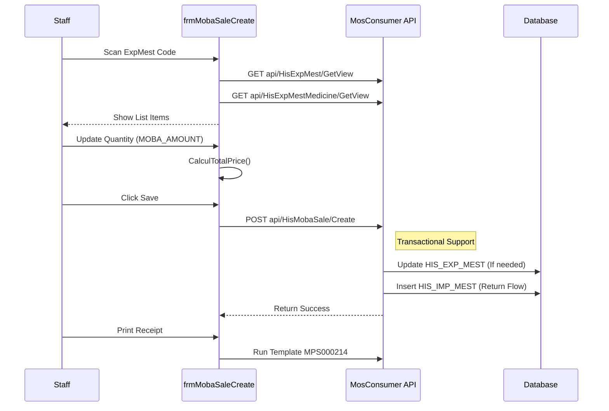

# Technical Spec: Bán hàng Di động (Mobile Point of Sale)

## 1. Business Mapping
*   **Ref**: [Quy trình Bán thuốc & Vật tư (Point of Sale)](../../02-business-processes/mobile-app/01-business-overview.md#22-ban-thuoc--vat-tu-point-of-sale)
*   **Scope**: Tài liệu này mô tả kỹ thuật cho module Bán hàng (hoặc Nhập trả lại từ phiếu xuất) trên thiết bị di động.
*   **Key Plugin**: `HIS.Desktop.Plugins.MobaSaleCreate`.

## 2. Core Components
### 2.1. Plugin Main Structure
*   **Extension Point**: `DesktopRootExtensionPoint`.
*   **Plugin Name**: `HIS.Desktop.Plugins.MobaSaleCreate`.
*   **Module Type**: `PROCESSED_FORM`.

### 2.2. User Interface (UI)
*   **Main Form**: `frmMobaSaleCreate.cs`.
    *   **Tabs**: Medicine (Thuốc), Material (Vật tư).
    *   **Grid**: `gridControlExpMestMedicine`, `gridControlExpMestMaterial`.
    *   **Input**: `MOBA_AMOUNT` (Số lượng thực tế).
    *   **Summary**: Tự động tính lại tổng tiền (`CalculTotalPrice`) khi thay đổi số lượng.

## 3. Process Flow (Technical Deep Dive)

### 3.1. Luồng Bán hàng/Nhập Trả
Cho phép tạo phiếu mới dựa trên một phiếu xuất đã có (hoặc danh sách y lệnh).

## 4. Database Schema
Module này tác động chủ yếu lên các bảng xuất nhập tồn.

### 4.1. HIS_EXP_MEST (Export Header)
*   `ID`: PK.
*   `EXP_MEST_CODE`: Mã phiếu xuất.
*   `EXP_MEST_TYPE_ID`: Loại xuất (Xuất bán, Xuất trả).

### 4.2. HIS_IMP_MEST (Return Import)
Nếu quy trình là nhập trả lại (từ phiếu xuất bán không hết).
*   `MOBA_EXP_MEST_ID`: Liên kết với phiếu xuất gốc.

## 5. API Endpoints

| Endpoint | Method | Description |
| :--- | :--- | :--- |
| `api/HisMobaSale/Create` | POST | Tạo phiếu bán hàng/nhập trả mobile |
| `api/HisExpMest/GetView` | GET | Lấy thông tin phiếu xuất gốc |
| `api/HisMedicine/Get` | GET | Lấy thông tin chi tiết thuốc (Giá, VAT) |

## 6. Common Issues
*   **Price Calculation**: Logic tính toán giá (`CalculTotalPrice`) cần đồng bộ chính xác với logic trên server để tránh lệch tiền khi lưu.
*   **Stock Availability**: Cần kiểm tra tồn kho (`CAN_MOBA_AMOUNT`) real-time để tránh bán quá số lượng tồn.
