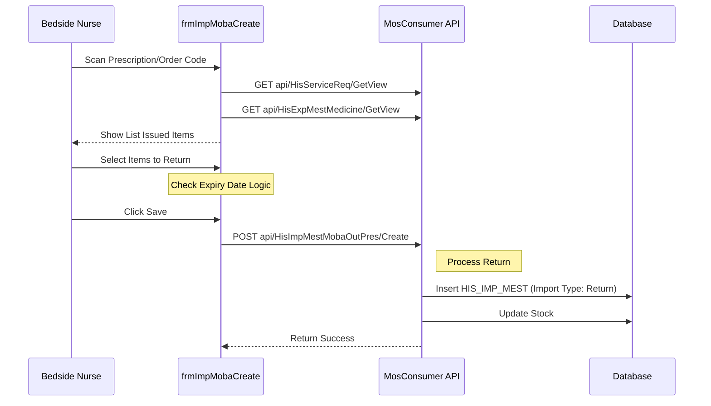

# Technical Spec: EMR & Chăm sóc (EMR & Nursing)

## 1. Business Mapping
*   **Ref**: [Quy trình Bệnh án Điện tử & Chăm sóc (EMR & Nursing)](../../02-business-processes/mobile-app/01-business-overview.md#23-ke-don--chi-dinh-tai-giuong-mobile-cpoe)
*   **Scope**: Tài liệu này mô tả kỹ thuật cho các tác vụ tại giường, tập trung vào việc xử lý thuốc/vật tư (Thu hồi/Hoàn trả) từ y lệnh/đơn thuốc đã kê.
*   **Key Plugins**:
    *   `HIS.Desktop.Plugins.MobaExamPresCreate`: Thu hồi từ phiếu chỉ định/y lệnh.
    *   `HIS.Desktop.Plugins.MobaPrescriptionCreate`: Thu hồi từ đơn thuốc (bao gồm thuốc thang).

## 2. Core Components
### 2.1. Plugin Main Structure
*   **Extension Point**: `DesktopRootExtensionPoint`.
*   **Modules**:
    *   `MobaExamPresCreate`: Xử lý `frmImpMobaCreate`.
    *   `MobaPrescriptionCreate`: Xử lý `frmMobaPrescriptionCreate`.

### 2.2. User Interface (UI)
*   **Return Form**: `frmImpMobaCreate.cs` / `frmMobaPrescriptionCreate.cs`.
    *   **Input**: Nhập Mã đơn thuốc/Y lệnh (`SERVICE_REQ_ID`).
    *   **List**: Hiển thị danh sách thuốc/vật tư đã xuất.
    *   **Action**: Chọn số lượng cần thu hồi (trả lại kho).
    *   **Validate**: Kiểm tra hạn sử dụng (`CheckExpDate`), số lượng khả dụng.

## 3. Process Flow (Technical Deep Dive)

### 3.1. Luồng Thu Hồi Thuốc Tại Giường (Bedside Return)
Quy trình này cho phép Điều dưỡng/Dược sĩ lâm sàng thu hồi thuốc thừa từ chỉ định của bác sĩ để nhập lại kho.

### 3.2. Logic Validate
*   **Tracking**: Bắt buộc nhập thông tin theo dõi (`HIS_TRACKING`) nếu cấu hình `IsTrackingRequired=1`.
*   **Quantity**: Số lượng thu hồi (`TH_AMOUNT`) <= Số lượng khả dụng (`AVAI_AMOUNT`).
*   **Remedy Count**: (Đối với thuốc thang) Kiểm tra logic số thang thuốc khi thu hồi.

## 4. Database Schema
### 4.1. HIS_SERVICE_REQ (Y lệnh/Chỉ định)
*   `ID`: PK.
*   `SERVICE_REQ_CODE`: Mã y lệnh.
*   `TREATMENT_ID`: Mã đợt điều trị.

### 4.2. HIS_IMP_MEST (Phiếu nhập thu hồi)
*   `IMP_MEST_TYPE_ID`: Loại nhập (Nhập thu hồi y lệnh).
*   `SERVICE_REQ_ID`: Link tới y lệnh gốc.

## 5. API Endpoints

| Endpoint | Method | Description |
| :--- | :--- | :--- |
| `api/HisServiceReq/GetView` | GET | Lấy thông tin y lệnh |
| `api/HisImpMestMobaOutPres/Create` | POST | Tạo phiếu nhập thu hồi từ ngoại trú/y lệnh |
| `api/HisExpMestMedicine/GetView` | GET | Lấy danh sách thuốc đã xuất |
| `api/HisTracking/Get` | GET | Lấy thông tin tracking (điều dưỡng thực hiện) |

## 6. Integration Points
*   **Tracking System**: Tích hợp với hệ thống theo dõi người thực hiện (`HIS_TRACKING`).
*   **Rich Editor**: In phiếu biên bản thu hồi (`MPS000084`).
