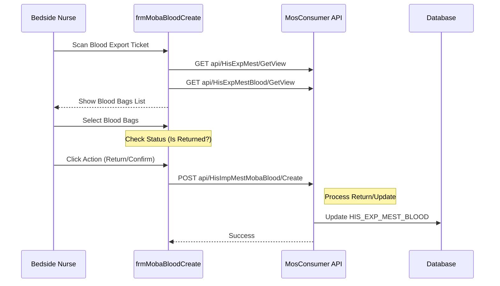

# Technical Spec: Lấy mẫu & Truyền máu (Mobile Specimen & Blood)

## 1. Business Mapping
*   **Ref**: [Quy trình Lấy mẫu Xét nghiệm tại chỗ (Mobile Specimen Collection)](../../02-business-processes/mobile-app/01-business-overview.md#24-lay-mau-xet-nghiem-tai-cho-mobile-specimen-collection)
*   **Scope**: Tài liệu này mô tả kỹ thuật cho module xác nhận máu/chế phẩm máu tại giường (Blood Transfusion Verification) và xử lý hoàn trả máu (Blood Return).
*   **Key Plugin**: `HIS.Desktop.Plugins.MobaBloodCreate`.
*   **Note**: Các chức năng lấy mẫu xét nghiệm (Test Tube Sampling) có thể sử dụng chung logic với `HIS.Desktop.Plugins.HisSampleRoom` hoặc trên nền tảng Web App khác. Module này tập trung vào xử lý túi máu (`HIS_BLOOD`).

## 2. Core Components
### 2.1. Plugin Main Structure
*   **Extension Point**: `DesktopRootExtensionPoint`.
*   **Components**:
    *   `MobaBloodCreate`: Form Mobile xử lý túi máu.

### 2.2. User Interface (UI)
*   **Main Form**: `frmMobaBloodCreate.cs`.
    *   **Input**: `EXP_MEST_ID` (Phiếu xuất kho máu).
    *   **Grid**: `gridControlExpMestBlood` hiển thị danh sách túi máu đã xuất cho bệnh nhân.
    *   **Action**: Chọn túi máu để xác nhận (hoặc nhập trả).
    *   **Validation**: Kiểm tra trạng thái túi máu (`IS_TH` - Đã thu hồi).

## 3. Process Flow (Technical Deep Dive)

### 3.1. Xác nhận/Hoàn trả Máu tại giường
Quy trình này cho phép điều dưỡng kiểm tra và xác nhận các túi máu tại phòng bệnh trước khi truyền hoặc trả lại khoa huyết học.

### 3.2. Logic Validate
*   **Status Check**: Túi máu đã thu hồi (`IS_TH=1`) sẽ bị vô hiệu hóa, không cho chọn lại.
*   **Tracking**: Bắt buộc nhập thông tin người thực hiện (`HIS_TRACKING`).

## 4. Database Schema
### 4.1. HIS_EXP_MEST_BLOOD (Export Detail)
*   `EXP_MEST_ID`: FK Phiếu xuất.
*   `BLOOD_ID`: FK Túi máu.
*   `IS_TH`: Cờ đánh dấu đã thu hồi (1=True).

### 4.2. HIS_BLOOD (Blood Bag)
*   `ID`: PK.
*   `BLOOD_CODE`: Mã túi máu.
*   `BLOOD_TYPE_ID`: Nhóm máu.

## 5. API Endpoints

| Endpoint | Method | Description |
| :--- | :--- | :--- |
| `api/HisImpMestMobaBlood/Create` | POST | Tạo phiếu nhập/xác nhận máu mobile |
| `api/HisExpMestBlood/GetView` | GET | Lấy danh sách túi máu đã xuất |
| `api/HisTracking/Get` | GET | Lấy thông tin tracking |

## 6. Integration Points
*   **Blood Bank Module**: Tích hợp chặt chẽ với phân hệ Ngân hàng máu (`HIS.Desktop.Plugins.BloodBank`).
*   **Barcode Scanner**: Hỗ trợ quét mã túi máu và mã phiếu xuất.
