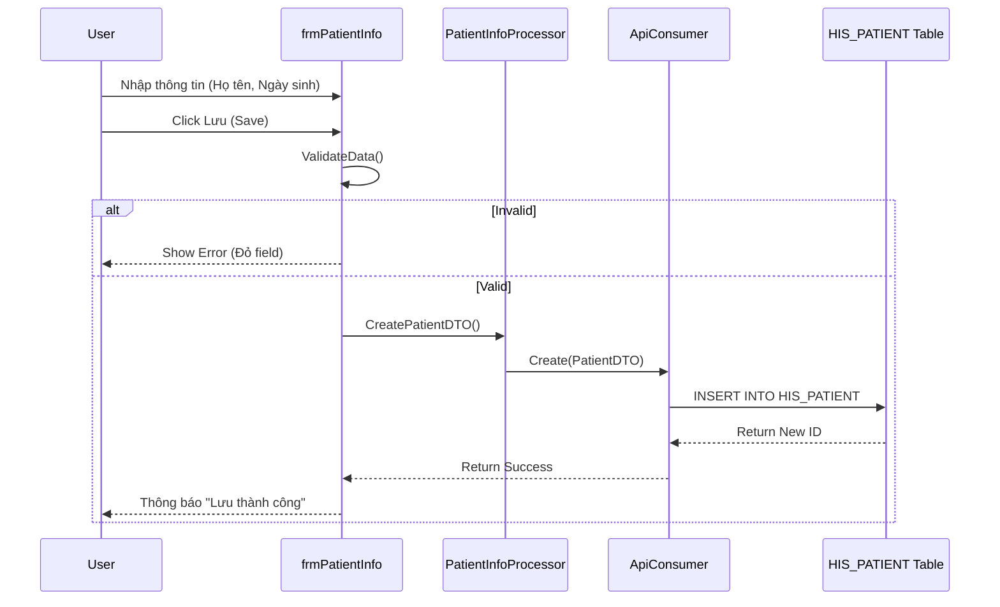

# Technical Spec: Quản lý Hồ sơ & MPI (MPI & Patient Records)

## 1. Business Mapping
*   **Ref**: [Quản lý Hồ sơ & Lịch sử Người bệnh](../../02-business-processes/patient-management/02-mpi-patient-records.md)
*   **Scope**: Quản lý Master Patient Index (MPI), thông tin hành chính, hợp nhất hồ sơ trùng và lịch sử khám bệnh.
*   **Key Plugin**: `HIS.Desktop.Plugins.PatientInfo`.

## 2. Core Components (Codebase Mapping)

### 2.1. Plugin Structure
*   **Plugin Name**: `HIS.Desktop.Plugins.PatientInfo`
*   **Processor**: `PatientInfoProcessor` - Xử lý logic CRUD bệnh nhân.
*   **Behavior**: `PatientInfoBehavior` - Validate dữ liệu UI.
*   **Forms**:
    *   `frmPatientInfo.cs`: Form chính thêm/sửa bệnh nhân.
    *   `frmPatientInfo1.cs`: Form rút gọn (Popup).

### 2.2. Data Validation (BHYT Rules)
Logic validate nằm trong `frmPatientInfo__Validation.cs`:
*   **Mã thẻ BHYT**: Checksum độ dài 15 ký tự, mã tỉnh, mã quyền lợi.
*   **Ngày sinh**: Validate logic (Ví dụ: Trẻ em < 6 tuổi phải có thẻ BHYT hoặc Giấy khai sinh).
*   **CMND/CCCD**: Check trùng lặp unique trên toàn hệ thống.

## 3. Process Flow (Technical Deep Dive)

### 3.1. Luồng Tạo mới Bệnh nhân (Create Patient)

### 3.2. Luồng Gộp Hồ sơ (Merge Patient)
Xử lý khi phát hiện 2 `PatientCode` nhưng là cùng 1 người.
*   **Logic**: Chuyển toàn bộ dữ liệu liên quan (Treatment, ServiceReq, Transaction) từ `PatientSource` sang `PatientTarget`.
*   **Database Constraints**: Phải update FK trên khoảng 50+ bảng liên quan đến `PATIENT_ID`.
*   **Trạng thái**: Mark `PatientSource.IS_ACTIVE = 0` (Soft Delete).

## 4. Database Schema

### 4.1. HIS_PATIENT (Master Data)
Bảng trung tâm lưu trữ MPI.
*   `ID`: PK (bigint).
*   `PATIENT_CODE`: Mã bệnh nhân (Unique, Index).
*   `VIR_PATIENT_NAME`: Tên đầy đủ (Upper Case).
*   `DOB`: Ngày sinh (long/unix timestamp).
*   `GENDER_ID`: Giới tính.
*   `WORK_PLACE`: Nơi làm việc.
*   `ETHNIC_ID`: Dân tộc.
*   `CAREER_ID`: Nghề nghiệp.
*   `PROVINCE_CODE`, `DISTRICT_CODE`, `COMMUNE_CODE`: Địa chỉ hành chính.

### 4.2. HIS_PATIENT_TYPE_ALTER
Lịch sử chuyển đổi đối tượng BHYT <-> Dịch vụ.
*   `ID`: PK.
*   `TREATMENT_ID`: FK.
*   `PATIENT_TYPE_ID`: Loại đối tượng (1: BHYT, 2: Thu phí).
*   `LEVEL_CODE`: Mức hưởng BHYT (80%, 95%, 100%).
*   `RIGHT_ROUTE_CODE`: Tuyến khám (Đúng tuyến/Trái tuyến).

## 5. Integration Points
*   **`HIS.Desktop.Plugins.Register`**: Module tiếp đón gọi `PatientInfo` dưới dạng popup để sửa thông tin nhanh.
*   **`HIS.Desktop.Plugins.Reception`**: Tương tự Register.
*   **Cổng Giám định BHYT**: API check thẻ online để auto-fill thông tin hành chính.

## 6. Common Issues
*   **Trùng thông tin**: Bệnh nhân đã có trong hệ thống nhưng tiếp đón tạo mới -> Gây phân mảnh lịch sử -> Cần quy trình Check trùng trước khi tạo.
*   **Lỗi Font chữ**: Tên bệnh nhân bị lỗi encoding khi nhập từ bộ gõ cũ -> Cần chuẩn hóa Unicode dựng sẵn (NFC).
