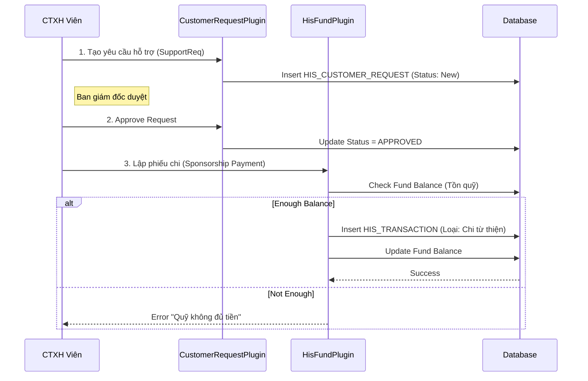

# Technical Spec: Công tác Xã hội (Social Work)

## 1. Business Mapping
*   **Ref**: [Công tác Xã hội & Chăm sóc Khách hàng](../../02-business-processes/patient-management/03-social-work.md)
*   **Scope**: Quản lý yêu cầu hỗ trợ, duyệt chi từ quỹ từ thiện và chăm sóc khách hàng.
*   **Key Plugins**: `HIS.Desktop.Plugins.CustomerRequest`, `HIS.Desktop.Plugins.HisFund`.

## 2. Core Components (Codebase Mapping)

### 2.1. Plugin: CustomerRequest
*   **Purpose**: Ghi nhận yêu cầu từ người bệnh hoặc khoa lâm sàng.
*   **Implementation**:
    *   `CustomerRequestProcessor.cs`: Xử lý nghiệp vụ CRUD yêu cầu.
    *   `ICustomerRequest.cs`: Interface định nghĩa behaviour.
    *   `CustomerRequestBehavior.cs`: Logic xử lý sự kiện UI.
    *   `UCCustomerRequest.cs`: User Control nhúng vào các form khác.

### 2.2. Plugin: HisFund (Quỹ Từ thiện)
*   **Purpose**: Quản lý nguồn tiền và phiếu chi hỗ trợ.
*   **Implementation**:
    *   `HisFundProcessor.cs`: Quản lý danh mục quỹ, số dư.
    *   `TransactionProcessor`: Xử lý giao dịch thu/chi (liên kết module Tài chính).

## 3. Process Flow (Technical Deep Dive)

### 3.1. Luồng Duyệt Chi Hỗ trợ (Funding Approval)

## 4. Database Schema

### 4.1. HIS_CUSTOMER_REQUEST
Bảng lưu yêu cầu hỗ trợ.
*   `ID`: PK.
*   `CUSTOMER_NAME`, `PHONE`: Thông tin người yêu cầu.
*   `REQUEST_TYPE_ID`: Loại yêu cầu (1: Hỗ trợ tài chính, 2: Tư vấn, 3: Phản ánh).
*   `CONTENTS`: Nội dung chi tiết.
*   `PROCESS_STATUS`: Trạng thái xử lý.

### 4.2. HIS_FUND
Danh mục quỹ.
*   `ID`: PK.
*   `FUND_CODE`, `FUND_NAME`: Tên quỹ (VD: Quỹ Bếp ăn tình thương).
*   `TOTAL_AMOUNT`: Tổng tiền hiện có.
*   `IS_ACTIVE`: Trạng thái hoạt động.

### 4.3. HIS_PATIENT_PROGRAM
Bảng liên kết bệnh nhân vào chương trình hỗ trợ.
*   `PATIENT_ID`: FK.
*   `PROGRAM_ID`: Chương trình (VD: Mổ mắt miễn phí).
*   `FROM_TIME`, `TO_TIME`: Thời gian hiệu lực.

## 5. Integration Points
*   **Module Viện phí (`Fee`)**: Khi phiếu chi từ thiện được duyệt, hệ thống viện phí cần ghi nhận khoản thanh toán này cho bệnh nhân (giảm trừ số tiền phải đóng).
*   **Module SMS Brandname (`ChanelManager`)**: Gửi SMS thông báo kết quả duyệt hỗ trợ cho bệnh nhân.
