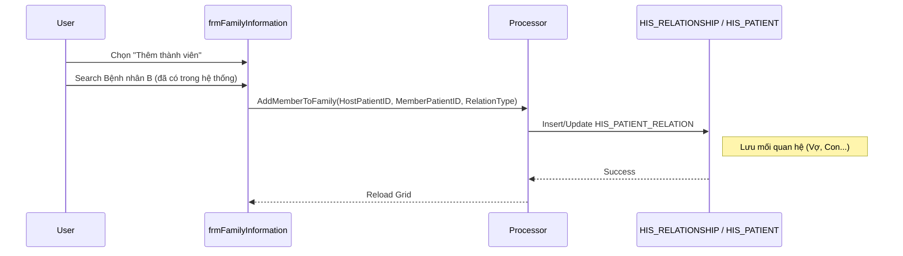

# Technical Spec: Thông tin Hộ gia đình (Family Information)

## 1. Business Mapping
*   **Ref**: [Quản lý Thông tin Hộ gia đình](../../02-business-processes/patient-management/04-family-information.md)
*   **Scope**: Quản lý danh sách thành viên trong hộ gia đình, mối quan hệ chủ hộ, phục vụ Y tế cơ sở và theo dõi bệnh di truyền.
*   **Key Plugin**: `HID.Desktop.Plugins.FamilyInformation` (Lưu ý Namespace `HID` - Health ID, thường dùng cho y tế dự phòng/cơ sở).

## 2. Core Components (Codebase Mapping)

### 2.1. Project Structure
*   **Namespace**: `HID.Desktop.Plugins.FamilyInformation`
*   **Base Interface**: `IFamilyInformationBase`
*   **Main Process**: `FamilyInformationProcessor`
*   **UI Form**: `frmFamilyInformation.cs`

### 2.2. Class Diagram (Simplified)
*   `FamilyInformationFactory`: Factory pattern để khởi tạo plugin.
*   `FamilyInformationBehavior`: Điều khiển luồng dữ liệu từ Form xuống Processor.
*   `FamilyInformationProcessor`: Chứa các hàm `GetFamilyMembers`, `UpdateRelationship`.

## 3. Process Flow (Technical Deep Dive)

### 3.1. Link Thành viên vào Hộ (Link Member)
Quy trình gom nhóm các Patient ID vào một Reference Code chung (Hộ khẩu/Mã hộ).

## 4. Database Schema

### 4.1. HIS_PATIENT (Extension)
Thông tin hộ gia đình thường được link trực tiếp hoặc qua bảng phụ.
*   `MAC_DUNG_CHUNG`: Một số thiết kế dùng trường này để group hộ gia đình.
*   `REPRESENTATIVE_PATIENT`: Người đại diện/Chủ hộ.

### 4.2. HIS_RELATIONSHIP (Bảng quan hệ)
*   `ID`: PK.
*   `PATIENT_ID`: FK (Người được tham chiếu).
*   `RELATIVE_ID`: FK (Người thân).
*   `RELATION_TYPE_ID`: Loại quan hệ (1: Bố/Mẹ, 2: Vợ/Chồng, 3: Con).

## 5. Integration Points
*   **`HIS.Desktop.Plugins.Patient`**: Gọi plugin FamilyInformation thông qua interface `CallModule(ModuleData)`.
*   **Y tế Xã/Phường**: Dữ liệu này được đồng bộ mạnh mẽ xuống các trạm y tế để làm sổ quản lý sức khỏe hộ gia đình (`FamilyFolder`).

## 6. Common Issues
*   **Vòng lặp quan hệ**: A là bố B, B là bố A (Circular Reference) -> Cần logic validate cây phả hệ.
*   **Redundant Data**: Một người thuộc nhiều hộ (Do lỗi nhập liệu) -> Cần ràng buộc 1 người chỉ thuộc 1 hộ active tại 1 thời điểm.
