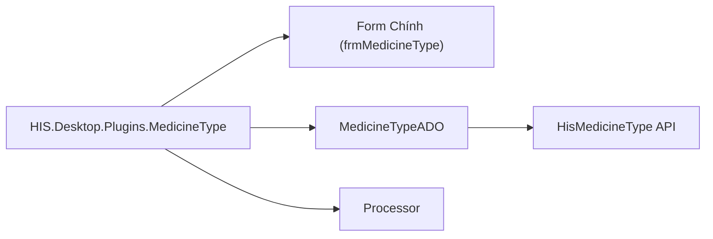

# Thiết kế Kỹ thuật: Module Pharmacy

## 1. Tổng quan Architecture
Module Pharmacy được xây dựng trên kiến trúc Plugin của HIS Desktop, sử dụng các namespace `HIS.Desktop.Plugins.*`.
Tài liệu này mô tả chi tiết các plugin, API consumer, và cấu trúc dữ liệu phục vụ cho [Quy trình Nghiệp vụ Dược](../../../02-business-processes/pharmacy/01-business-overview.md).

## 2. Danh sách Plugin & Namespace

| Nhóm Chức năng | Prefix Plugin | Namespace Chính | Số lượng File |
|:---|:---|:---|:---|
| **Master Data** | `MedicineType`, `MaterialType` | `HIS.Desktop.Plugins.MedicineType` | ~40-50 |
| **Nhập kho** | `ImpMest*` | `HIS.Desktop.Plugins.ImpMestCreate`... | > 80 |
| **Xuất kho** | `ExpMest*` | `HIS.Desktop.Plugins.ExpMestSaleCreate`... | > 78 |
| **Tồn kho** | `MediStock*` | `HIS.Desktop.Plugins.MediStockSummary` | ~49 |
| **Đấu thầu** | `Bid*` | `HIS.Desktop.Plugins.BidCreate` | ~47 |

## 3. Chi tiết Thiết kế (Deep Dive)

### 3.1. Master Data (Danh mục)
*   **Plugin Chính**: `HIS.Desktop.Plugins.MedicineType`
*   **Thành phần**:
    *   `Run/frmMedicineType.cs`: Form quản lý danh sách thuốc.
    *   `ADO/MedicineTypeADO.cs`: Đối tượng chuyển đổi dữ liệu.
*   **API Consumer**: `MedicineTypeApiConsumer` (`/api/HisMedicineType/*`).

**Class Diagram:**

### 3.2. Nhập kho (Import)
*   **Plugin Chính**: `ImpMestCreate` (80 files).
*   **Quy trình**:
    1.  Nhận dữ liệu từ UI (`frmImpMestCreate`).
    2.  Validate nghiệp vụ (Hạn dùng, Giá thầu).
    3.  Gọi API qua `ImpMestApiConsumer`.
    4.  In phiếu nhập qua MPS (`Mps000070` - `Mps000079`).

### 3.3. Xuất kho (Export)
*   **Plugin Chính**: `ExpMestSaleCreate` (Bán lẻ), `ExpMestDepaCreate` (Xuất khoa).
*   **Logic quan trọng**:
    *   Tích hợp `HIS.UC.MedicineInStock` để check tồn kho realtime.
    *   Trừ tồn kho ngay khi duyệt phiếu.

### 3.4. Quản lý Tồn kho (MediStock)
*   **Backend Cache**: Dữ liệu tồn kho được cache tại `HIS.Desktop.LocalStorage.BackendData` để tăng tốc độ query.
*   **Tính toán**: `Tồn cuối = Tồn đầu + Nhập - Xuất`.
*   **In ấn**: Sử dụng MPS (`Mps000150`...) để in báo cáo tồn kho, thẻ kho.

## 4. Database Schema (Tham chiếu)
Các bảng dữ liệu chính (Mapping với `Core.ADO`):
*   `HIS_MEDICINE_TYPE`: Danh mục thuốc.
*   `HIS_MATERIAL_TYPE`: Danh mục vật tư.
*   `HIS_IMP_MEST`: Phiếu nhập (Header).
*   `HIS_EXP_MEST`: Phiếu xuất (Header).
*   `HIS_MEDI_STOCK`: Kho dược.

## 5. Tích hợp & Giao tiếp
*   **API**: Tất cả giao tiếp qua `HIS.Desktop.ApiConsumer`.
*   **Events**: Sử dụng PubSub để báo tin (`InventoryChanged`, `MedicineUpdated`) cho các plugin khác.
