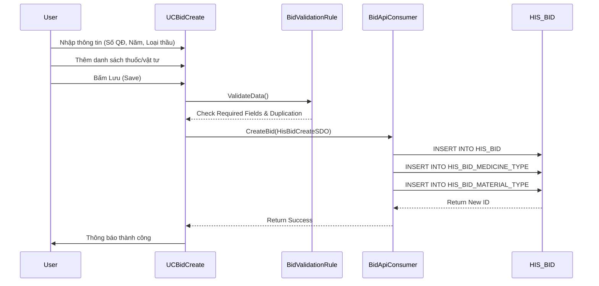

# Technical Spec: Quản lý Thầu (Anticipation & Bidding)

## 1. Business Mapping
*   **Ref**: [Quy trình Quản lý Thầu](../../02-business-processes/pharmacy/02-anticipation-bidding.md)
*   **Scope**: Tài liệu này mô tả chi tiết kỹ thuật cho module Quản lý Hồ sơ thầu và Kế hoạch mua sắm.
*   **Key Plugin**: `HIS.Desktop.Plugins.BidCreate` (Tạo gói thầu).

## 2. Core Components (Codebase Mapping)

### 2.1. Plugin Main Structure
*   **Plugin Name**: `HIS.Desktop.Plugins.BidCreate`
*   **Extension Point**: `DesktopRootExtensionPoint` (Name: `HIS.Desktop.Plugins.BidCreate`).
*   **Processor**: `BidCreateProcessor.cs`.
*   **UI Main**: `UCBidCreate.cs`.
    *   `UCBidCreate` chứa logic hiển thị danh sách gói thầu và các tab chi tiết (Thuốc, Vật tư).
    *   **Sub-Modules**:
        *   `HIS.Desktop.Plugins.BidDetail`: Xem/Sửa chi tiết gói thầu.
        *   `HIS.Desktop.Plugins.BidUpdate`: Cập nhật thông tin gói thầu.
        *   `HIS.Desktop.Plugins.BidRegulation`: Cấu hình quy định thầu.

### 2.2. User Interface (UI) Logic
*   **Grid Control**: Sử dụng `HIS.Desktop.UC.GridView` để hiển thị danh sách thầu.
*   **Tabs**:
    *   Tab 1: Thông tin chung (Mã thầu, Năm, Gói thầu).
    *   Tab 2: Danh sách Thuốc (Mapping với `HIS_BID_MEDICINE_TYPE`).
    *   Tab 3: Danh sách Vật tư (Mapping với `HIS_BID_MATERIAL_TYPE`).
*   **Validation**:
    *   `BidNumberValidationRule.cs`: Kiểm tra trùng số quyết định thầu.
    *   `BidYearValidationRule.cs`: Kiểm tra năm đấu thầu hợp lệ.

## 3. Process Flow (Technical Deep Dive)

### 3.1. Luồng Tạo Gói thầu (Create Bid)

### 3.2. Luồng Cập nhật Hiệu lực (Active/Inactive)
*   Plugin triggers update trạng thái `IS_ACTIVE` của gói thầu.
*   Logic: Khi một gói thầu active, các thuốc trong gói thầu đó sẽ hiển thị để nhập kho (`ImpMestCreate`).

## 4. Database Schema
Các bảng dữ liệu chính tham gia vào quy trình:

### 4.1. HIS_BID (Header)
Bảng thông tin chung về gói thầu.
*   `ID`: PK, Auto-increment.
*   `BID_NUMBER`: Số quyết định thầu.
*   `BID_NAME`: Tên gói thầu.
*   `BID_YEAR`: Năm đấu thầu.
*   `VALID_FROM`: Hiệu lực từ.
*   `VALID_TO`: Hiệu lực đến.
*   `ALLOW_UPDATE`: Cho phép chỉnh sửa hay không.

### 4.2. HIS_BID_MEDICINE_TYPE (Detail Thuốc)
Danh sách thuốc trong gói thầu.
*   `ID`: PK.
*   `BID_ID`: FK ref `HIS_BID`.
*   `MEDICINE_TYPE_ID`: FK ref `HIS_MEDICINE_TYPE` (Loại thuốc).
*   `AMOUNT`: Số lượng trúng thầu.
*   `PRICE`: Giá trúng thầu.

### 4.3. HIS_BID_MATERIAL_TYPE (Detail Vật tư)
Danh sách vật tư y tế trong gói thầu.
*   `ID`: PK.
*   `BID_ID`: FK ref `HIS_BID`.
*   `MATERIAL_TYPE_ID`: FK ref `HIS_MATERIAL_TYPE`.
*   `AMOUNT`: Số lượng.
*   `PRICE`: Giá trúng thầu.

## 5. Integration Points
*   **Module Nhập kho (`ImpMestCreate`)**:
    *   Khi tạo phiếu nhập mua, API sẽ query dữ liệu từ `HIS_BID` và `HIS_BID_MEDICINE_TYPE` để lấy giá và số lượng thầu còn lại.
    *   Query: `GetBidActive()` -> Filter Medicine -> Check `Price`.

## 6. Config & Settings
*   `BID_EXTRA_CONFIG`: Các cấu hình mở rộng cho thầu (nếu có).
*   Config cho phép nhập vượt số lượng thầu hay không (`ALLOW_OVER_BID_AMOUNT`).
