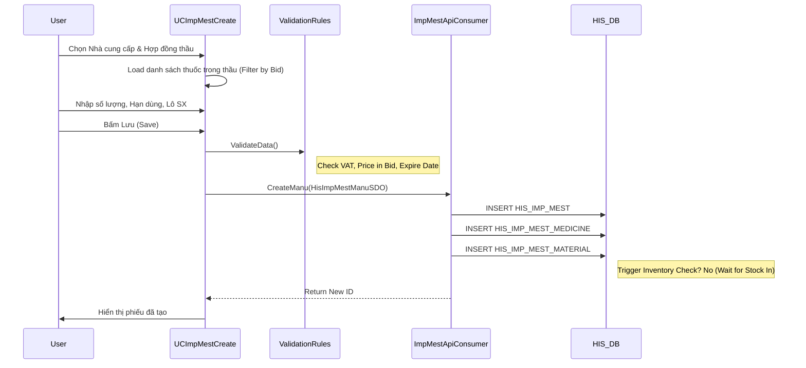

# Technical Spec: Nhập Kho Dược (Inventory Import)

## 1. Business Mapping
*   **Ref**: [Quy trình Nhập kho](../../02-business-processes/pharmacy/03-inventory-import.md)
*   **Scope**: Tài liệu này mô tả chi tiết kỹ thuật cho quy trình tạo phiếu nhập kho (Nhập mua, Nhập tặng, Nhập khác).
*   **Key Plugin**: `HIS.Desktop.Plugins.ImpMestCreate` (Tạo phiếu nhập).

## 2. Core Components (Codebase Mapping)

### 2.1. Plugin Main Structure
*   **Plugin Name**: `HIS.Desktop.Plugins.ImpMestCreate`
*   **Extension Point**: `DesktopRootExtensionPoint`.
*   **Processor**: `ImpMestCreateProcessor.cs`.
*   **UI Main**: `UCImpMestCreate.cs` (Partial class, rất lớn).
    *   `UCImpMestCreate__Plus__GoiThau.cs`: Xử lý logic chọn thầu.
    *   `UCImpMestCreate__Plus__Update.cs`: Xử lý lưu và cập nhật.
    *   `UCImpMestCreate__Plus__Print141.cs`: In ấn các mẫu phiếu 141.

### 2.2. Import Types (SCENARIO Support)
Plugin hỗ trợ nhiều loại phiếu nhập khác nhau thông qua `IMP_MEST_TYPE_ID`:
*   **Nhập mua (Manu)**: `HisImpMestManuSDO`.
*   **Nhập đầu kỳ (Init)**: `HisImpMestInitSDO`.
*   **Nhập kiểm kê thừa (Inve)**: `HisImpMestInveSDO`.
*   **Nhập khác (Other)**: `HisImpMestOtherSDO` (Nhập tặng, nhập điều chuyển).

## 3. Process Flow (Technical Deep Dive)

### 3.1. Luồng Nhập Mua (Import from Supplier)

### 3.2. Logic Tính Giá & Thuế
*   **VAT**: Tính toán dựa trên `VAT_RATIO`. Giá nhập = Giá hợp đồng * (1 + VAT).
*   **Giá bán**: Tự động tính giá bán dựa trên thặng số bán lẻ (Markup) config trong `HIS_MEDICINE_TYPE` hoặc quy định thầu.

## 4. Database Schema
Các bảng dữ liệu chính tham gia vào quy trình nhập kho:

### 4.1. HIS_IMP_MEST (Header)
*   `ID`: PK.
*   `IMP_MEST_CODE`: Mã phiếu nhập (Gen tự động theo format config).
*   `IMP_MEST_TYPE_ID`: Loại nhập.
*   `IMP_TIME`: Thời gian nhập.
*   `SUPPLIER_ID`: Nhà cung cấp (FK `HIS_SUPPLIER`).
*   `IMP_MEST_STT_ID`: Trạng thái (Draft/Active).

### 4.2. HIS_IMP_MEST_MEDICINE (Detail)
*   `ID`: PK.
*   `IMP_MEST_ID`: FK.
*   `MEDICINE_TYPE_ID`: FK.
*   `AMOUNT`: Số lượng nhập.
*   `PRICE`: Giá nhập (chưa VAT).
*   `VAT_RATIO`: % Thuế VAT.
*   `BID_ID`: Gói thầu tương ứng (nếu nhập thầu).
*   `PACKAGE_NUMBER`: Số lô.
*   `EXPIRED_DATE`: Hạn dùng.

## 5. Integration Points
*   **Quản lý Thầu (`BidCreate`)**: Lấy thông tin giá trúng thầu để validate giá nhập.
*   **Quản lý Công nợ (`TransactionDebt`)**: Sau khi phiếu nhập được duyệt, hệ thống công nợ sẽ ghi nhận khoản phải trả nhà cung cấp.
*   **Quản lý Kho (`MediStock`)**: Khi phiếu chuyển trạng thái `IMPORTED`, số lượng tồn kho sẽ tăng lên.

## 6. Config & Common Issues
*   **Config**: `ALLOW_UNKNOW_BID`: Cho phép nhập thuốc ngoài thầu (nếu `False`, bắt buộc chọn thầu).
*   **Issue**: Lỗi "Không tìm thấy giá thầu" -> Kiểm tra gói thầu có Active và còn hiệu lực không.
