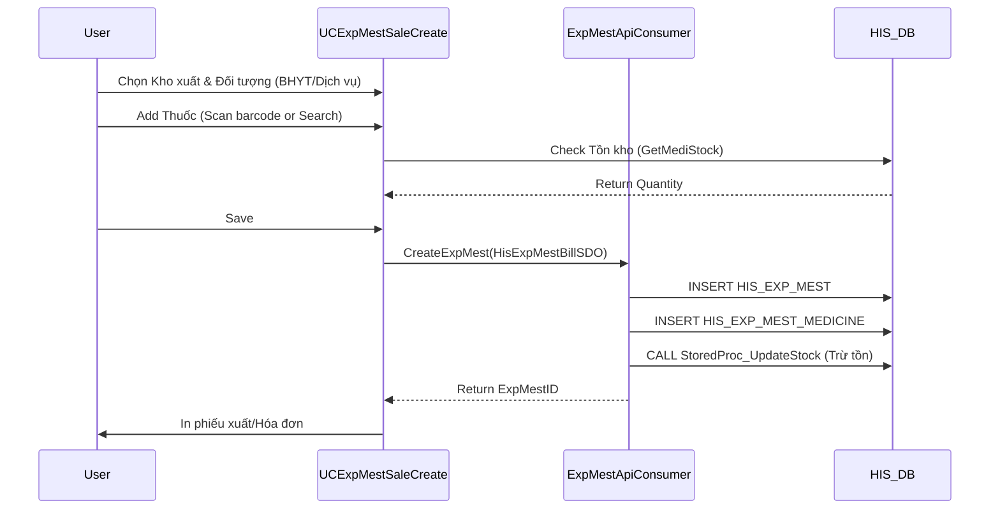

# Technical Spec: Xuất Kho Dược (Inventory Export)

## 1. Business Mapping
*   **Ref**: [Quy trình Xuất kho](../../02-business-processes/pharmacy/04-inventory-export.md)
*   **Scope**: Mô tả kỹ thuật cho các quy trình xuất bán lẻ, xuất cấp phát nội bộ và xuất cho bệnh nhân nội trú.
*   **Key Plugins**:
    *   `HIS.Desktop.Plugins.ExpMestSaleCreate`: Xuất bán lẻ (Ngoại trú/Khách vãng lai).
    *   `HIS.Desktop.Plugins.ExpMestDepaCreate`: Xuất lĩnh về khoa phòng.
    *   `HIS.Desktop.Plugins.ExpMestMedicine`: Xuất bù cơ số/Xuất theo y lệnh (Backend).

## 2. Core Components

### 2.1. Export Main Plugins
*   **ExpMestSaleCreate** (Bán lẻ):
    *   **UI**: `UCExpMestSaleCreate.cs`.
    *   **Features**: Tích hợp thanh toán (hoặc xuất trước trả sau), in phiếu thu.
    *   **Logic**: Kiểm tra tồn kho khả dụng (`IsStockAvailable`), check giá bán.
*   **ExpMestDepaCreate** (Xuất khoa):
    *   **UI**: `UCExpMestDepaCreate.cs`.
    *   **Logic**: Load phiếu dự trù từ các khoa (`HIS_IMP_MEST` type `REQ`), duyệt và tạo phiếu xuất.

### 2.2. Common Components
*   **Stock Check Control**: `HIS.UC.MedicineInStock` - UserControl hiển thị tồn kho realtime của thuốc được chọn.
*   **Barcode Scanner**: Plugin hỗ trợ bắn mã vạch để fill thuốc nhanh (`KeyPreview = true`, catch barcode sequence).

## 3. Process Flow (Deep Dive)

### 3.1. Luồng Xuất Bán Lẻ

### 3.2. Luồng Xuất Khoa (Cấp phát)
1.  **Load Dự trù**: Gọi API lấy danh sách phiếu yêu cầu lĩnh (`HIS_IMP_MEST` trạng thái `REQUEST`) từ các khoa.
2.  **Duyệt (Approve)**: Dược sĩ duyệt số lượng thực tế cấp (có thể < số lượng xin).
3.  **Tạo phiếu xuất**: Hệ thống tạo `HIS_EXP_MEST` (Type: `DEPA`) linked với phiếu dự trù gốc.
4.  **Hoàn tất**: Update trạng thái phiếu dự trù thành `APPROVED`.

## 4. Database Schema

### 4.1. HIS_EXP_MEST (Header)
*   `ID`: PK.
*   `EXP_MEST_CODE`: Mã phiếu xuất.
*   `EXP_MEST_TYPE_ID`: Loại xuất (1=Sale, 2=Prescription, 3=Department, ...).
*   `MEDI_STOCK_ID`: Kho xuất.
*   `REQ_ROOM_ID`: Khoa/Phòng yêu cầu (nếu xuất khoa).

### 4.2. HIS_EXP_MEST_MEDICINE (Detail)
*   `ID`: PK.
*   `EXP_MEST_ID`: FK.
*   `MEDICINE_ID`: FK ref `HIS_MEDICINE` (Specific instance of medicine in stock).
    *   *Lưu ý*: Xuất kho thường trỏ trực tiếp đến dòng `HIS_MEDI_STOCK` hoặc `HIS_MEDICINE` cụ thể để trừ đúng lô/hạn dùng.
*   `AMOUNT`: Số lượng xuất.
*   `PRICE`: Giá xuất.

## 5. Integration Points
*   **Thu ngân (Cashier)**:
    *   Nếu là xuất bán lẻ thu tiền trực tiếp: Tích hợp `HIS.Desktop.Plugins.PharmacyCashier` để tạo giao dịch tài chính (`HIS_TRANSACTION`).
*   **Bệnh án điện tử (EMR)**:
    *   Phiếu xuất thuốc được link vào hồ sơ bệnh án nếu xuất cho bệnh nhân nội trú.

## 6. Config & Settings
*   `EXP_MEST_ALLOW_NEGATIVE`: Cho phép xuất âm hay không (Nguy hiểm, thường là False).
*   `EXP_MEST_AUTO_STRAT`: Chiến thuật trừ tồn kho (FEFO - First Expire First Out).
