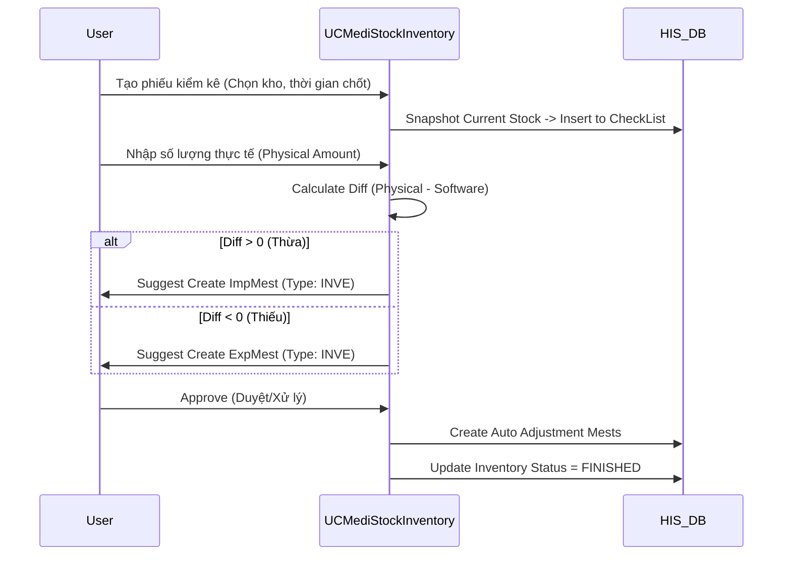

# Technical Spec: Kiểm kê và Điều chỉnh (Inventory Check)

## 1. Business Mapping
*   **Ref**: [Quy trình Kiểm kê](../../02-business-processes/pharmacy/05-inventory-check.md)
*   **Scope**: Quy trình chốt số liệu tồn kho, nhập số thực tế và xử lý chênh lệch (Thừa/Thiếu).
*   **Key Plugin**: `HIS.Desktop.Plugins.MediStockInventory` (Kiểm kê kho).

## 2. Core Components

### 2.1. Plugin Structure
*   **Plugin**: `HIS.Desktop.Plugins.MediStockInventory`.
*   **Process Name**: `MediStockInventoryProcessor.cs`.
*   **UI**: `UCMediStockInventory.cs`.
    *   Màn hình danh sách phiếu kiểm kê.
    *   Màn hình chi tiết: Grid nhập số lượng thực tế theo Lô/Hạn dùng.

### 2.2. Logic "Khóa kho" (Lock Stock)
*   Khi bắt đầu kiểm kê, hệ thống có option **Khóa kho** (`CheckPoint` logic).
*   Tại thời điểm tạo phiếu kiểm kê, hệ thống chốt số lượng tồn phần mềm (`SoftwareAmount`) vào bảng detail kiểm kê. Mọi giao dịch nhập/xuất phát sinh sau thời điểm này sẽ không ảnh hưởng đến số liệu `SoftwareAmount` đã chốt.

## 3. Process Flow

### 3.1. Quy trình Kiểm kê

## 4. Database Schema

### 4.1. HIS_MEDI_STOCK_INVENTORY (Header)
*   `ID`: PK.
*   `MEDI_STOCK_ID`: Kho kiểm kê.
*   `INVENTORY_TIME`: Thời gian kiểm kê.
*   `FINISH_TIME`: Thời gian kết thúc.

### 4.2. HIS_MEST_INVE_USER (User tham gia)
*   Danh sách hội đồng kiểm kê.

## 5. Integration Points
*   **ImpMestCreate / ExpMestCreate**:
    *   Module kiểm kê không trực tiếp sửa số lượng tồn kho.
    *   Nó gọi API `CreateImpMest(Inve)` hoặc `CreateExpMest(Inve)` để điều chỉnh. Đây là nguyên tắc kế toán (Audit trail).

## 6. Common Issues
*   **Lệch số liệu sau kiểm kê**: Thường do người dùng nhập/xuất lùi ngày vào khoảng thời gian trước khi chốt kiểm kê nhưng sau khi đã tạo phiếu kiểm kê.
    *   *Solution*: Hệ thống cần block giao dịch lùi ngày vào kỳ đã kiểm kê.
