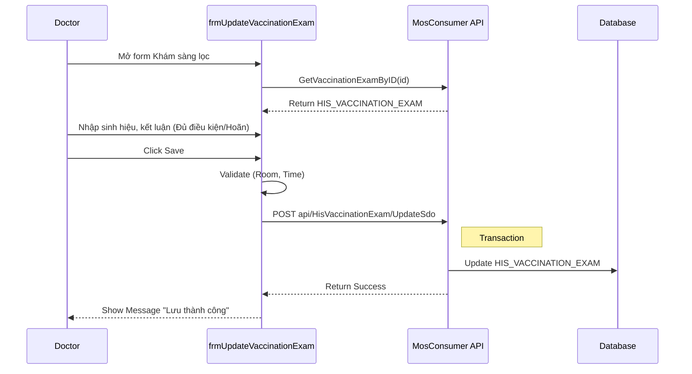
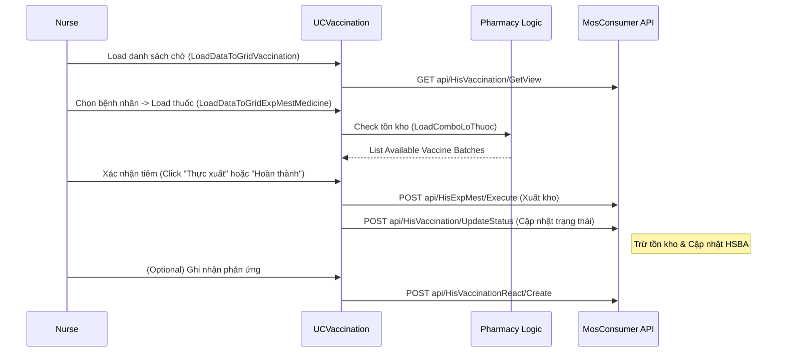

# Technical Spec: Tiêm chủng (Vaccination)

## 1. Business Mapping
*   **Ref**: [Quy trình Tiêm chủng & Y tế Dự phòng](../../02-business-processes/preventive-medicine/01-vaccination.md)
*   **Scope**: Tài liệu này mô tả chi tiết kỹ thuật cho quy trình tiêm chủng, bao gồm khám sàng lọc, thực hiện tiêm và theo dõi sau tiêm.
*   **Key Plugins**: 
    *   `HIS.Desktop.Plugins.UpdateVaccinationExam` (Khám sàng lọc).
    *   `HIS.Desktop.Plugins.Vaccination` (Quản lý tiêm).

## 2. Core Components (Codebase Mapping)
### 2.1. Plugin: Khám Sàng lọc
*   **Plugin Name**: `HIS.Desktop.Plugins.UpdateVaccinationExam`
*   **Processor**: `UpdateVaccinationExamProcessor.cs`.
*   **UI Main**: `frmUpdateVaccinationExam.cs`.
    *   Form này cho phép bác sĩ nhập thông tin sinh hiệu (`HIS_DHST` - gián tiếp hoặc trực tiếp trên form tùy cấu hình), và kết luận (`HIS_VACCINATION_EXAM`).
    *   **Logic quan trọng**:
        *   `GetVaccinationExamByID()`: Load thông tin khám cũ.
        *   `ProcessSave()`: Gọi API `api/HisVaccinationExam/UpdateSdo` để lưu kết quả.
        *   Validate: Kiểm tra `REQUEST_ROOM_ID` và `REQUEST_TIME`.

### 2.2. Plugin: Quản lý Tiêm chủng
*   **Plugin Name**: `HIS.Desktop.Plugins.Vaccination`
*   **Processor**: `VaccinationProcessor.cs`.
*   **UI Main**: `UCVaccination.cs` (UserControl).
*   **User Interface**:
    *   `gridControlVaccination`: Danh sách bệnh nhân chờ tiêm/đã tiêm.
    *   `gridControlExpMestMedicine`: Danh sách thuốc/vắc-xin chỉ định (tương ứng phiếu xuất `EXP_MEST`).
    *   `ucExecute` (Panel): Khu vực nhập thông tin phản ứng sau tiêm (`HIS_VACCINATION_REACT`).
*   **Sub-Forms**:
    *   `frmVaccination.cs`: Màn hình chi tiết mũi tiêm (nếu mở rời).
    *   `frmChangeMedicine.cs`: Cho phép đổi lô vắc-xin trong kho nếu lô chỉ định hết hoặc cận date.

## 3. Process Flow (Technical Deep Dive)

### 3.1. Luồng Khám Sàng lọc (Screening Flow)

### 3.2. Luồng Thực hiện Tiêm (Vaccination Execution)

## 4. Database Schema

### 4.1. HIS_VACCINATION_EXAM
Lưu thông tin khám sàng lọc.
*   `ID`: PK.
*   `VACCINATION_EXAM_CODE`: Mã phiếu khám.
*   `CONCLUDE`: Kết luận (1: Đủ điều kiện, 0: Không đủ).
*   `REQUEST_ROOM_ID`: Phòng yêu cầu.
*   `REQUEST_TIME`: Thời gian yêu cầu.

### 4.2. HIS_VACCINATION
Lưu thông tin mũi tiêm chính.
*   `ID`: PK.
*   `PATIENT_ID`: ID Bệnh nhân.
*   `VACCINE_TYPE_ID`: Loại vắc-xin.
*   `VACCINATION_STT_ID`: Trạng thái (New, Processing, Finish).

### 4.3. HIS_VACCINATION_REACT
Lưu thông tin phản ứng sau tiêm.
*   `ID`: PK.
*   `VACCINATION_ID`: FK ref HIS_VACCINATION.
*   `REACT_TYPE_ID`: Loại phản ứng (Ref `HIS_VACC_REACT_TYPE`).
*   `REACT_PLACE_ID`: Vị trí phản ứng.
*   `DESCRIPTION`: Mô tả chi tiết.

### 4.4. HIS_EXP_MEST_MEDICINE
Bảng chi tiết phiếu xuất, liên kết vắc-xin với mũi tiêm.
*   `EXP_MEST_ID`: ID phiếu xuất.
*   `MEDICINE_ID`: ID thuốc trong kho (quản lý Lô/Hạn dùng).
*   `AMOUNT`: Số lượng (thường là 1 liều).

## 5. Integration Points
*   **HIS_EXECUTE_ROOM**: Phòng thực hiện tiêm (Filter `IS_VACCINE == 1`).
*   **ACS_USER**: Người dùng (Bác sĩ khám, Điều dưỡng tiêm).
*   **HIS_MEDI_STOCK**: Kho dược (nguồn vắc-xin).

## 6. Common Issues
*   **Lỗi Tồn kho**: Bác sĩ chỉ định lô thuốc A, nhưng khi tiêm kho thực tế đã hết hoặc bị khóa -> Cần dùng `frmChangeMedicine` để đổi lô khác.
*   **Lỗi Trạng thái**: Không thể lưu phản ứng cho mũi tiêm chưa "Hoàn thành" (Finish).
*   **Filter Data**: `UCVaccination` lọc dữ liệu theo `VACCINATION_STT_ID` (2: New/3: Processing/4: Finish), cần chú ý khi user báo "không thấy bệnh nhân".
