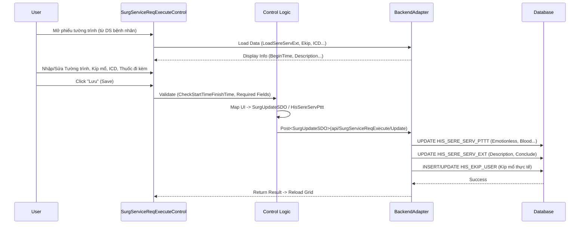

# Đặc tả Kỹ thuật: Phẫu thuật - Thủ thuật (Surgery Management)

## 1. Mapping Nghiệp vụ (Business Mapping)
Tài liệu này mô tả chi tiết các màn hình và logic kỹ thuật hỗ trợ cho quy trình nghiệp vụ Phẫu thuật - Thủ thuật:
*   **Business Process Reference**: [01-surgery-management.md](../../02-business-processes/specialized/01-surgery-management.md)
*   **Phạm vi**:
    *   Duyệt mổ (Approval).
    *   Quản lý danh mục phẫu thuật (Catalog).
    *   Thực hiện & Tường trình phẫu thuật (Execution & Report).

## 2. Core Components (Codebase Mapping)

### 2.1. Plugin: Duyệt Phẫu thuật (Surgery Approval)
*   **Plugin Name**: `HIS.Desktop.Plugins.ApprovalSurgery`
*   **UI Forms**: `UCApprovalSurgery.cs`
*   **Chức năng**:
    *   Xem danh sách yêu cầu phẫu thuật (`HIS_SERVICE_REQ` type `PT`).
    *   Lên lịch mổ (`HIS_PTTT_CALENDAR`), xếp phòng (`HIS_BED`).
    *   Duyệt thành viên kíp mổ (`HIS_EKIP_TEMP`).

### 2.2. Plugin: Thực hiện & Tường trình (Surgery Execution)
*   **Plugin Name**: `HIS.Desktop.Plugins.SurgServiceReqExecute`
*   **UI Forms**: `SurgServiceReqExecuteControl.cs`
*   **Chức năng**:
    *   Ghi nhận thời gian bắt đầu/kết thúc (`BEGIN_TIME`, `END_TIME`).
    *   Ghi nhận cách thức phẫu thuật, phương pháp vô cảm.
    *   Nhập ICD trước/sau mổ.
    *   Tường trình phẫu thuật (Mô tả, Kết luận).
*   **Key Logic Files**:
    *   `SurgServiceReqExecuteControl___Process.cs`: Xử lý logic lưu trữ `ProcessSereServPttt`, validate thời gian `CheckStartTimeFinishTime`.
    *   `SurgServiceReqExecuteControl___Load.cs`: Load dữ liệu `LoadSereServExt` (thông tin mở rộng), `LoadGridSereServInEkip` (kíp mổ).

### 2.3. Plugin: Danh mục Phẫu thuật (Surgery Catalog)
*   **Plugin Name**: `HIS.Desktop.Plugins.ScnSurgery`
*   **Namespace**: `SCN.EFMODEL.DataModels` (Data)
*   **Chức năng**: Quản lý danh mục các gói phẫu thuật (ít dùng trong luồng lâm sàng hàng ngày, chủ yếu cho config).

## 3. Process Flow (Technical Deep Dive)

### 3.1. Quy trình Tường trình Phẫu thuật (Surgery Reporting Flow)

## 4. Database Schema

### 4.1. HIS_PTTT_CALENDAR (Lịch mổ)
| Column | Type | Description |
| :--- | :--- | :--- |
| `ID` | NUMBER | PK |
| `PLAN_TIME_FROM` | NUMBER(14) | Thời gian dự kiến bắt đầu |
| `PLAN_TIME_TO` | NUMBER(14) | Thời gian dự kiến kêt thúc |
| `SERVICE_REQ_ID` | NUMBER | Link đến yêu cầu mổ |

### 4.2. HIS_SERE_SERV_PTTT (Chi tiết PTTT)
Bảng quan trọng nhất lưu thông tin chuyên môn của ca mổ.
| Column | Type | Description | Mapping UI |
| :--- | :--- | :--- | :--- |
| `SERE_SERV_ID` | NUMBER | FK to Dịch vụ | |
| `PTTT_METHOD_ID` | NUMBER | Phương pháp PTTT | `cboMethod` |
| `EMOTIONLESS_METHOD_ID` | NUMBER | Phương pháp vô cảm | `cbbEmotionlessMethod` |
| `PTTT_GROUP_ID` | NUMBER | Loại phẫu thuật (Loại 1, ĐB...) | `cbbPtttGroup` |
| `BLOOD_ABO_ID` | NUMBER | Nhóm máu | `cbbBlood` |
| `DEATH_WITHIN_ID` | NUMBER | Tử vong trên bàn mổ | `cboDeathSurg` |
| `BEFORE_PTTT_ICD_CODE` | VARCHAR2 | ICD trước mổ | `txtIcdCode2` |
| `AFTER_PTTT_ICD_CODE` | VARCHAR2 | ICD sau mổ | `txtIcdCode3` |

### 4.3. HIS_SERE_SERV_EXT (Thông tin Mở rộng)
| Column | Type | Description | Mapping UI |
| :--- | :--- | :--- | :--- |
| `DESCRIPTION` | CLOB | Mô tả trình tự phẫu thuật | `txtDescription` |
| `CONCLUDE` | VARCHAR2 | Kết luận/Cách thức phẫu thuật | `txtConclude` |
| `BEGIN_TIME` | NUMBER(14) | Thời gian rạch da (thực tế) | `dtStart` |
| `END_TIME` | NUMBER(14) | Thời gian kết thúc (thực tế) | `dtFinish` |

## 5. Integration Points
*   **Vật tư tiêu hao**: Tích hợp module chọn thuốc/vật tư trong gói (`LoadGridSereServInAttach`) để tính chi phí cho ca mổ.
*   **Cận lâm sàng**: Xem kết quả xét nghiệm/CĐHA ngay trên màn hình tường trình để tham khảo.
*   **Hồ sơ bệnh án**: Kết quả tường trình (`Description`) được đồng bộ vào bệnh án điện tử (EMR) để ký số.

## 6. Common Issues
1.  **Lệch thời gian**: Thời gian Start/Finish thực tế xung đột với thời gian Y lệnh hoặc thời gian Vào/Ra viện. Hệ thống có check trong `CheckStartTimeFinishTime`.
2.  **Kíp mổ không lưu**: Phải chọn đúng Vai trò (`EXECUTE_ROLE_ID`) cho từng bác sĩ trong kíp. Nếu thiếu vai trò bắt buộc, hệ thống từ chối lưu.
3.  **Khóa hồ sơ**: Nếu hồ sơ bệnh án đã đóng (`IsLock = 1`), không thể sửa tường trình phẫu thuật.
