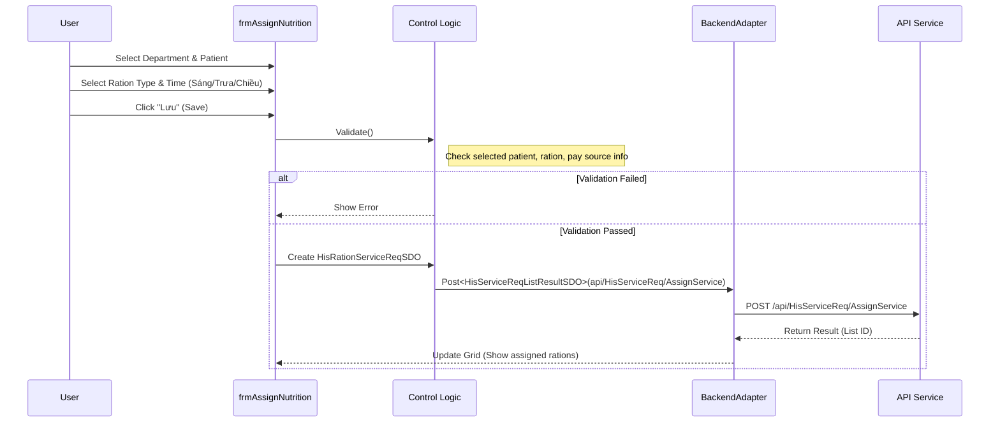

# Thiết kế Kỹ thuật: Quản lý Dinh dưỡng (Nutrition Management)

## 1. Business Mapping
*   **Ref**: [Quy trình Quản lý Dinh dưỡng](../../02-business-processes/specialized/02-nutrition-management.md)
*   **Scope**: Quản lý việc chỉ định suất ăn cho bệnh nhân nội trú, tổng hợp phiếu báo ăn và in phiếu.
*   **Key Plugin**: `HIS.Desktop.Plugins.AssignNutrition`.

## 2. Core Components (Codebase Mapping)

### 2.1. Plugin Main Structure
*   **Plugin Name**: `HIS.Desktop.Plugins.AssignNutrition`.
*   **Extension Point**: `DesktopRootExtensionPoint`.
*   **Processor**: `AssignNutritionProcessor.cs`.
    *   **Logic**: Xử lý logic khởi tạo và hiển thị form chỉ định dinh dưỡng.

### 2.2. User Interface (UI)
*   **Main Form**: `frmAssignNutrition.cs`.
*   **Key Partial Files**:
    *   `__Load.cs`: Load danh sách bệnh nhân theo khoa/phòng, danh sách dịch vụ suất ăn.
    *   `__Save.cs`: Xử lý logic validate và lưu chỉ định.
    *   `__Validate.cs`: Kiểm tra quy tắc chỉ định (trùng giờ ăn, đối tượng chi trả).

## 3. Process Flow (Technical Deep Dive)

### 3.1. Chỉ định Suất ăn (Assign Ration)
Logic lưu trữ nằm trong `frmAssignNutrition__Save.cs`.

1.  **Select Target**: User chọn khoa/phòng -> Grid hiển thị danh sách bệnh nhân (`V_HIS_TREATMENT_BED_ROOM`).
2.  **Select Ration**: User chọn loại suất ăn (cơm, cháo, súp...) trên `gridViewService`.
3.  **Select Time**: Chọn bữa ăn (Sáng, Trưa, Chiều) thông qua `RationTimeIds`.
4.  **Validation**:
    *   `ValidData()`: Đảm bảo có chọn bệnh nhân và dịch vụ.
    *   `ValidSereServWithOtherPaySource()`: Kiểm tra nguồn chi trả (BHYT/Viện phí).
    *   Check `MinDuration`: Kiểm tra khoảng cách giữa các lần chỉ định (nếu có cấu hình).
5.  **Create SDO**:
    *   Tạo `HisRationServiceReqSDO`.
    *   Map `RationServiceSDO` cho từng dịch vụ được chọn.
    *   Map `TreatmentIds` (hỗ trợ chỉ định hàng loạt cho nhiều bệnh nhân).
6.  **Call API**:
    *   Endpoint: `api/HisServiceReq/AssignService` (Dùng chung endpoint với chỉ định dịch vụ nhưng payload khác).
    *   Adapter: `BackendAdapter.Post<HisServiceReqListResultSDO>`.

### 3.2. Quản lý Thực đơn & Giờ ăn
*   **Master Data**:
    *   `HIS.Desktop.Plugins.HisRationGroup`: Nhóm suất ăn (bệnh lý, tự chọn).
    *   `HIS.Desktop.Plugins.RationSchedule`: Lịch phân bổ suất ăn.
    *   `HIS.Desktop.Plugins.HisRationTime`: Định nghĩa các khung giờ ăn.

### 3.3. Tổng hợp & In ấn
*   **Plugin**: `HIS.Desktop.Plugins.RationSumPrint`.
*   **Function**: Tổng hợp số lượng suất ăn theo khoa/phòng hoặc toàn viện để gửi xuống nhà bếp.
*   **Flow**:
    *   Load dữ liệu `HIS_SERE_SERV` với filter loại dịch vụ là Suất ăn.
    *   Group by `DEPARTMENT_ID`, `SERVICE_ID`.
    *   Export Report (MPS).

## 4. Database Schema

### 4.1. HIS_SERVICE_REQ (Yêu cầu)
*   `SERVICE_REQ_TYPE_ID`: Loại yêu cầu (Thường là `SUAT_AN` hoặc `KHAC`).
*   `SERVICE_REQ_STT_ID`: Trạng thái (Đã yêu cầu, Đã tổng hợp).

### 4.2. HIS_SERE_SERV (Chi tiết Suất ăn)
*   `SERVICE_ID`: FK (Ref `HIS_SERVICE` - Dịch vụ suất ăn).
*   `AMOUNT`: Số lượng.
*   `PATIENT_TYPE_ID`: Đối tượng chi trả.
*   `RATION_TIME_ID` (Custom Field/Ext): Khung giờ ăn (lưu trong JSON hoặc bảng mở rộng nếu có).

## 5. Integration Points
*   **Khoa Lâm sàng**: Bác sĩ/Điều dưỡng chỉ định tại khoa.
*   **Khoa Dinh dưỡng**: Nhận phiếu báo ăn tổng hợp.
*   **Viện phí**: Dữ liệu suất ăn được đẩy sang bảng kê chi phí để thanh toán (nếu bệnh nhân trả tiền) hoặc BHYT chi trả.

## 6. Common Issues
*   **Missing Time**: Quên chọn giờ ăn (Sáng/Trưa/Chiều) dẫn đến nhà bếp không biết chuẩn bị.
*   **Bulk Assign Error**: Khi chỉ định hàng loạt, nếu 1 bệnh nhân bị lỗi (ví dụ hồ sơ đang khóa), API có thể trả về lỗi cho cả batch hoặc partial success (cần check `HisServiceReqListResultSDO`).
