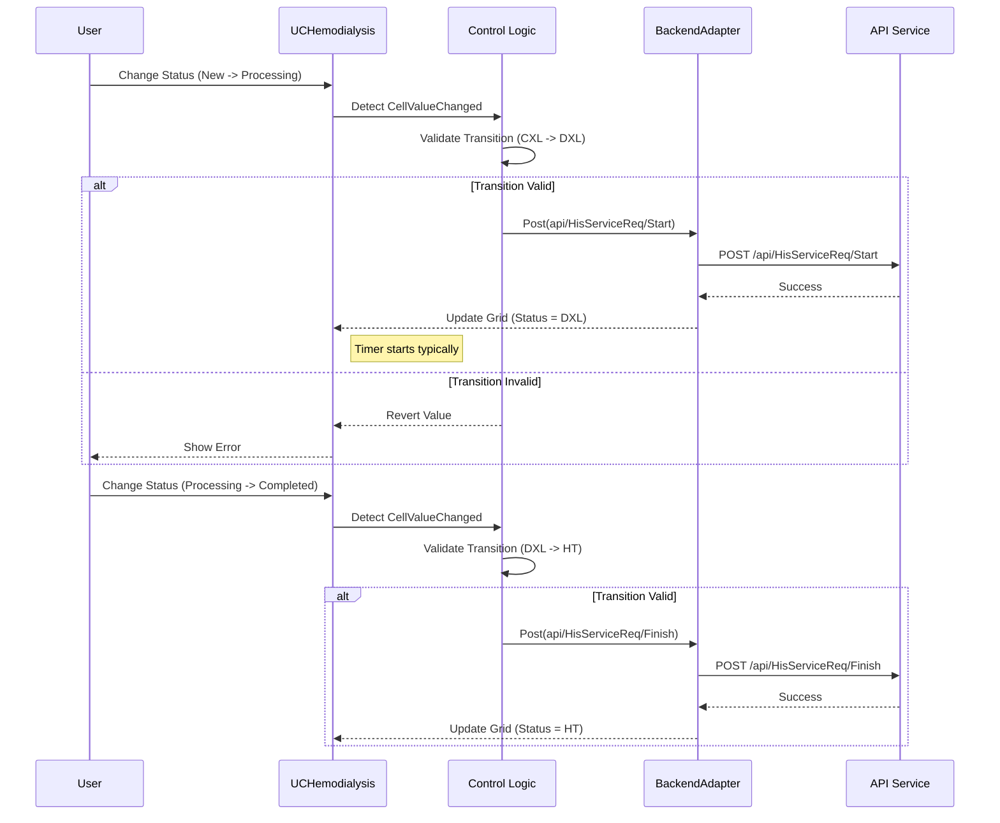

# Technical Spec: Quản lý Thận nhân tạo (Hemodialysis)

## 1. Business Mapping
*   **Ref**: [Quy trình Thận nhân tạo](../../02-business-processes/specialized/03-hemodialysis.md)
*   **Scope**: Quản lý danh sách bệnh nhân chạy thận, theo dõi quá trình chạy thận, quản lý máy và vật tư tiêu hao trong ca chạy thận.
*   **Key Plugin**: `HIS.Desktop.Plugins.Hemodialysis`.

## 2. Core Components (Codebase Mapping)

### 2.1. Plugin Main Structure
*   **Plugin Name**: `HIS.Desktop.Plugins.Hemodialysis`.
*   **Extension Point**: `DesktopRootExtensionPoint`.
*   **Processor**: `HemodialysisProcessor.cs`.
*   **Icon**: `phong.png`.

### 2.2. User Interface (UI)
*   **Main Control**: `UCHemodialysis.cs`.
    *   **Grid Patient**: Hiển thị danh sách bệnh nhân đang có chỉ định chạy thận hoặc đang trong ca.
    *   **Grid Old Pres**: Hiển thị lịch sử đơn thuốc/chỉ định cũ.
    *   **Grid Detail**: Chi tiết vật tư/thuốc trong đơn.
*   **Repositories**:
    *   `InitComboRepositoryStatus`: Load trạng thái yêu cầu (`HIS_SERVICE_REQ_STT`).

## 3. Process Flow (Technical Deep Dive)

### 3.1. Load Danh sách Bệnh nhân (Queuing)
Hệ thống hiển thị danh sách bệnh nhân cần chạy thận dựa trên các chỉ định cận lâm sàng đặc thù.
*   **Filter Logic** (`FillDataToGridPatient`):
    *   API: `api/HisServiceReq/GetView8`.
    *   Filter: `IS_KIDNEY = true`.
    *   ServiceReqType: Bao gồm nhiều loại (`ID__AN` - Ăn, `ID__CDHA` - Chẩn đoán hình ảnh, `ID__PT` - Phẫu thuật...).
    *   **Sort**: Ưu tiên theo `INTRUCTION_TIME` (Thời gian y lệnh) và `KIDNEY_SHIFT` (Ca chạy thận).

### 3.2. Quản lý Trạng thái Ca (Status Management)
Logic thay đổi trạng thái nằm trong sự kiện `gridViewPatient_CellValueChanged`.

*   **Start (Bắt đầu ca)**:
    *   Condition: Chuyển từ `CXL` (Chưa xử lý) -> `DXL` (Đang xử lý).
    *   API: `api/HisServiceReq/Start` (`HisRequestUriStore.HIS_SERVICE_REQ_START`).
*   **Finish (Kết thúc ca)**:
    *   Condition: Chuyển từ `DXL` -> `HT` (Hoàn thành).
    *   API: `api/HisServiceReq/Finish` (`HisRequestUriStore.HIS_SERVICE_REQ_FINISH`).
*   **Undo**: Cho phép Un-Start và Un-Finish nếu user thao tác nhầm.

### 3.3. Tích hợp Tủ thuốc/Vật tư (Cabinet)
*   **Column**: `CREATE_CABINET_PRE`.
*   **Logic**: Cho phép tạo phiếu lĩnh từ tủ trực (Cabinet) cho bệnh nhân chạy thận.
*   **Condition**: Yêu cầu phải ở trạng thái `HT` (Hoàn thành) mới được tạo phiếu lĩnh bù (Tùy cấu hình).

## 4. Database Schema

### 4.1. HIS_SERVICE_REQ (Yêu cầu)
*   `IS_KIDNEY`: Flag đánh dấu yêu cầu liên quan đến chạy thận.
*   `KIDNEY_SHIFT_ID`: Ca chạy thận (Sáng/Chiều/Tối).
*   `EXECUTE_ROOM_ID`: Phòng thực hiện (Phòng thận nhân tạo).
*   `MACHINE_ID`: Máy chạy thận được gán.

### 4.2. HIS_SERE_SERV (Dịch vụ)
*   Lưu trữ các dịch vụ chạy thận, dây lọc máu, quả lọc,...

## 5. Integration Points
*   **Phòng Khám/Nội trú**: Bác sĩ chỉ định dịch vụ chạy thận.
*   **Kho Dược**: Lĩnh vật tư (quả lọc, dây truyền) về kho tủ trực của khoa Thận.
*   **Viện phí**: Tự động tính tiền giường/dịch vụ chạy thận theo thời gian thực hiện (nếu có cấu hình tính giờ).

## 6. Common Issues & Troubleshooting
*   **Filter Incorrect**: Không thấy bệnh nhân do `IS_KIDNEY` chưa được set = 1 khi chỉ định, hoặc sai loại dịch vụ.
*   **Stuck Status**: Không thể kết thúc ca do thiếu thông tin bắt buộc (sinh hiệu, thuốc...).
