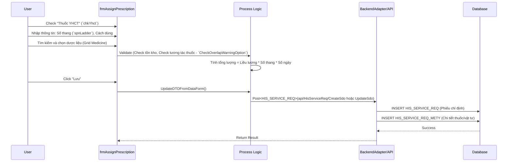

# Đặc tả Kỹ thuật: Y Học Cổ Truyền (Traditional Medicine)

## 1. Mapping Nghiệp vụ (Business Mapping)
Tài liệu này mô tả chi tiết các màn hình và logic kỹ thuật hỗ trợ cho quy trình nghiệp vụ Y Học Cổ Truyền (YHCT):
*   **Business Process Reference**: [05-traditional-medicine.md](../../02-business-processes/specialized/05-traditional-medicine.md)
*   **Phạm vi**:
    *   Kê đơn thuốc thang (Thuốc YHCT).
    *   Quản lý sắc thuốc.
    *   Kết hợp điều trị Tây y và Đông y.

## 2. Core Components (Codebase Mapping)

### 2.1. Plugin: Kê Đơn YHCT
*   **Plugin Name**: `HIS.Desktop.Plugins.AssignPrescriptionYHCT`
*   **Namespace**: `HIS.Desktop.Plugins.AssignPrescriptionYHCT`
*   **Extension Point**: `DesktopRootExtensionPoint`
*   **Mô tả**: Plugin chuyên dụng để kê đơn thuốc YHCT, cho phép kê theo thang, tính số lượng dược liệu dựa trên số thang và số ngày.
*   **UI Forms**:
    *   `frmAssignPrescription` (Main Form): Giao diện kê đơn chính. Kế thừa hoặc thiết kế tương tự form kê đơn tân dược nhưng có thêm các control đặc thù YHCT.
*   **Key Classes**:
    *   `AssignPrescriptionProcessor.cs`: Lớp khởi chạy module (`ModuleBase`), gọi `AssignPrescriptionFactory`.
    *   `frmAssignPrescription.cs`: Quản lý UI. Các control quan trọng:
        *   `chkYhct`: Checkbox kích hoạt chế độ YHCT.
        *   `lciLadder` / `spnLadder`: Nhập số thang thuốc.
        *   `lciLoiDanBacSi`: Lời dặn chuyên biệt cho các vị thuốc (sắc uống, ngâm rượu...).
    *   `frmAssignPrescription__Process.cs`:
        *   `CalculatePrice()`: Tính giá thuốc (có thể logic tính giá thang khác thuốc viên).
        *   `ProcessInstructionTimeMediForEdit()`: Xử lý thời gian dùng thuốc nhiều ngày (multi-day prescription).
        *   `ProcessSaveData()`: Logic lưu đơn thuốc.

## 3. Process Flow (Technical Deep Dive)

### 3.1. Quy trình Kê Đơn Thang (Prescribing Workflow)

### 3.2. Technical Rules
*   **Logic Số Thang**: Khi `chkYhct` = true, hệ thống hiển thị `spnLadder`. Tổng số lượng của mỗi vị thuốc = (Số lượng 1 thang) * (Số thang).
*   **Cảnh báo BHYT (`VerifyWarningOverCeiling`)**: Kiểm tra tổng chi phí đơn thuốc so với trần BHYT (nếu có cấu hình giới hạn).
*   **Stock Check (`ProcessAmountInStockWarning`)**: Kiểm tra tồn kho thời gian thực khi chọn thuốc.

## 4. Database Schema

### 4.1. HIS_SERVICE_REQ (Yêu cầu/Đơn thuốc)
| Column | Type | Description | Note |
| :--- | :--- | :--- | :--- |
| `ID` | NUMBER(19) | Primary Key | |
| `SERVICE_REQ_TYPE_ID` | NUMBER(19) | Loại phiếu | Với YHCT thường là `ID__DON_THUOC` |
| `INTRUCTION_TIME` | NUMBER(14) | Thời gian y lệnh | |
| `USE_TIME` | NUMBER(14) | Thời gian sử dụng | |

### 4.2. HIS_SERVICE_REQ_METY (Chi tiết Thuốc YHCT)
| Column | Type | Description | Note |
| :--- | :--- | :--- | :--- |
| `ID` | NUMBER(19) | PK | |
| `SERVICE_REQ_ID` | NUMBER(19) | FK to Service Req | |
| `MEDICINE_ID` | NUMBER(19) | ID Thuốc | Liên kết `HIS_MEDICINE_TYPE` |
| `AMOUNT` | NUMBER | Số lượng tổng | Đã nhân số thang |
| `SPEED` | NUMBER | Tốc độ/Liều lượng | Lượng cho 1 thang |
| `NUM_ORDER` | NUMBER | Số thứ tự trong thang | Quan trọng để in đơn |

## 5. Integration Points
*   **Kho Dược (Pharmacy)**: Tương tác trực tiếp với `HIS_MEDICINE_BEAN` (Tồn kho) để trừ kho khi cấp phát.
*   **Viện phí (Fee)**: Đơn thuốc YHCT sinh ra chi phí điều trị (`HIS_SERE_SERV`), cần được thanh toán hoặc duyệt bảo hiểm.
*   **Sắc thuốc**: Có thể tích hợp với module Dịch vụ (`AssignService`) nếu bệnh viện có dịch vụ sắc thuốc tự động tính phí.

## 6. Common Issues
1.  **Lỗi làm tròn số**: Khi tính tổng lượng dược liệu (lẻ gram), cần chú ý logic làm tròn (`Round`) trong `CalculatePrice` để khớp với kho dược.
2.  **In đơn thuốc**: Mẫu in đơn thuốc YHCT (`Report`) cần hiển thị rõ "Số thang" và cách sắc, khác với đơn tân dược. Kiểm tra template báo cáo nếu in ra không đúng format.
3.  **Mã ICD YHCT**: Yêu cầu nhập mã chẩn đoán YHCT (Chứng bệnh) song song với ICD-10 hiện đại. Form sử dụng `IcdProcessor` riêng cho `icdProcessorYHCT`.
