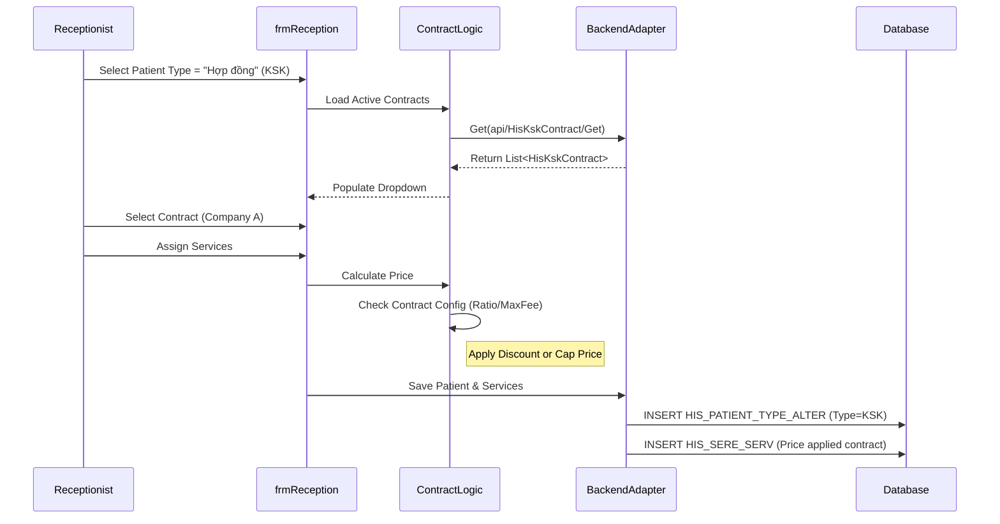

# Technical Spec: Hợp đồng Khám sức khỏe (Health Checkup Contracts)

## 1. Business Mapping
*   **Ref**: [Quy trình Hợp đồng KSK](../../02-business-processes/specialized/06-health-checkup-contracts.md)
*   **Scope**: Quản lý các hợp đồng khám sức khỏe ký kết với các cơ quan, doanh nghiệp (đoàn khám).
*   **Key Plugin**: `HIS.Desktop.Plugins.HisKskContract`.

## 2. Core Components (Codebase Mapping)

### 2.1. Plugin Main Structure
*   **Plugin Name**: `HIS.Desktop.Plugins.HisKskContract`.
*   **Extension Point**: `DesktopRootExtensionPoint`.
*   **Processor**: `HisKskContractProcessor.cs` (or implicit in `frmHisKskContract.cs`).

### 2.2. User Interface (UI)
*   **Main Form**: `frmHisKskContract.cs`.
    *   **Grid**: `gridControlFormList` hiển thị danh sách hợp đồng.
    *   **Editor**: `lcEditorInfo` (LayoutControl) chứa các trường nhập liệu chi tiết.
*   **Fields**:
    *   `txtKskContractCode`: Mã hợp đồng.
    *   `txtCustomerName`: Tên công ty/đối tác.
    *   `spRatio`: Tỷ lệ giảm giá/chiết khấu.
    *   `spMaxFee`: Trần chi phí thanh toán.

## 3. Process Flow (Technical Deep Dive)

### 3.1. Quản lý Hợp đồng (Contract CRUD)
1.  **Load List**:
    *   API: `api/HisKskContract/Get` (`HisRequestUriStore.MOSHIS_KSK_CONTRACT_GET`).
    *   Filter: `HisKskContractFilter` (Keyword, Active).
2.  **Add/Edit**:
    *   Validates: Mã hợp đồng, Tên khách hàng.
    *   Save: Gọi API `Create` hoặc `Update`.
3.  **Active/Deactive**:
    *   Hợp đồng có hiệu lực dựa trên `EXPIRE_TIME_FROM` và `EXPIRE_TIME_TO`.

### 3.2. Sử dụng trong Tiếp đón (Reception Integration)
*   Khi tiếp đón bệnh nhân thuộc đoàn khám:

    *   Receptionist chọn loại đối tượng "Hợp đồng" (KSK).
    *   Hệ thống load danh sách Hợp đồng đang hiệu lực (`Valid` + `Active`).
    *   Áp dụng `RATIO` (Miễn giảm) hoặc `MAX_FEE` (Giới hạn thanh toán) cho các dịch vụ được chỉ định.

## 4. Database Schema

### 4.1. HIS_KSK_CONTRACT
*   `KSK_CONTRACT_CODE`: Mã định danh.
*   `CUSTOMER_NAME`: Tên đối tác.
*   `VALUE`: Giá trị hợp đồng (nếu có).
*   `IS_RESTRICTED_MEDICINE_TYPE`: Cờ giới hạn danh mục thuốc (nếu có).
*   `IS_RESTRICTED_SERVICE`: Cờ giới hạn danh mục dịch vụ.

## 5. Integration Points
*   **Tiếp đón**: Chọn hợp đồng cho bệnh nhân.
*   **Viện phí**: Tính toán miễn giảm dựa trên cấu hình hợp đồng.
*   **Báo cáo**: Thống kê doanh thu theo hợp đồng/đoàn khám.

## 6. Common Issues
*   **Expire Date**: Hợp đồng hết hạn nhưng chưa được gia hạn, dẫn đến không chọn được khi tiếp đón.
*   **Max Fee Limit**: Đạt giới hạn chi phí hợp đồng, bệnh nhân phải tự chi trả phần vượt (cần thông báo rõ cho thu ngân).
