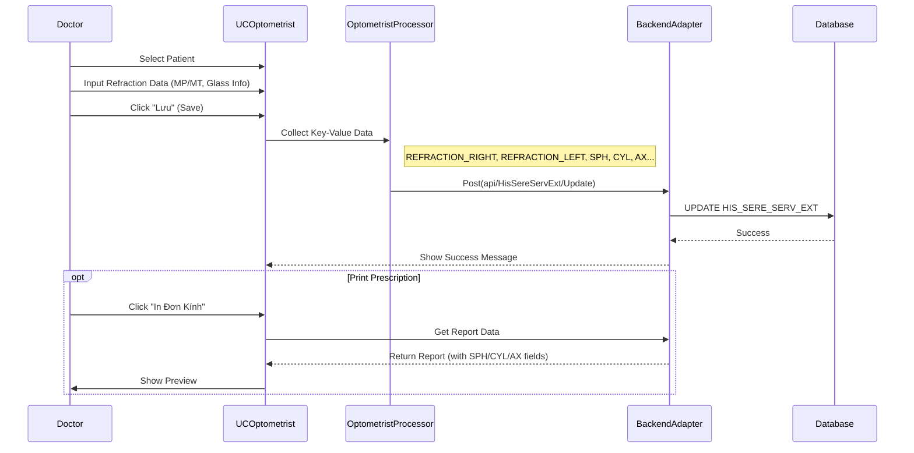

# Technical Spec: Khám Mắt & Khúc xạ (Optometry)

## 1. Business Mapping
*   **Ref**: [Quy trình Khám Mắt - Khúc xạ](../../02-business-processes/specialized/07-optometry.md)
*   **Scope**: Quản lý kết quả đo khúc xạ (Cận, Viễn, Loạn), đo nhãn áp và cấp đơn kính.
*   **Key Plugin**: `HIS.Desktop.Plugins.Optometrist`.

## 2. Core Components (Codebase Mapping)

### 2.1. Plugin Main Structure
*   **Plugin Name**: `HIS.Desktop.Plugins.Optometrist`.
*   **Extension Point**: `DesktopRootExtensionPoint`.
*   **Processor**: `OptometristProcessor.cs`.
*   **Main Control**: `UCOptometrist.cs`.

### 2.2. User Interface (UI)
*   **Layout**:
    *   **Patient List**: Danh sách bệnh nhân chờ khám mắt.
    *   **Refraction Input**: Nhập kết quả đo thị lực (MP - Mắt Phải, MT - Mắt Trái).
        *   `txtMpKhongKinh`: Thị lực không kính (MP).
        *   `txtMtKhongKinh`: Thị lực không kính (MT).
        *   `txtMpCoKinh`: Thị lực có kính (MP).
        *   `txtMtCoKinh`: Thị lực có kính (MT).
    *   **Glass Prescription**: Thông số kính (SPH, CYL, AX...).

## 3. Process Flow (Technical Deep Dive)

### 3.1. Nhập Kết quả Khám (Examination Entry)

1.  **Select Patient**: Chọn bệnh nhân từ hàng chờ.
2.  **Input Data**:
    *   Bác sĩ/KTV nhập các chỉ số đo được từ máy đo khúc xạ.
    *   Hệ thống hỗ trợ nhập text free-form hoặc structured data tùy cấu hình field.
3.  **Save Logic**:
    *   Dữ liệu được lưu vào bảng `HIS_SERE_SERV_FILE` (nếu lưu file kết quả) hoặc `HIS_SERE_SERV_EXT` (nếu lưu structured data).
    *   API: `api/HisSereServExt/Update` (Thường dùng Extension table cho dữ liệu chuyên khoa).

### 3.2. Kê Đơn Kính (Glass Prescription)
*   Hệ thống tách biệt giữa đơn thuốc (Medicine) và đơn kính (Glasses).
*   Đơn kính thường là một mẫu in (Report) lấy dữ liệu từ các trường `HIS_SERE_SERV_EXT`.
*   **Tables Mapped**:
    *   `SPH` (Độ cầu), `CYL` (Độ trụ), `AX` (Trục), `ADD` (Độ cộng thêm).
    *   `PD` (Khoảng cách đồng tử).

## 4. Integration Points
*   **Máy Đo Khúc xạ**:
    *   Currently: Nhập tay (Manual Entry).
    *   Future: Tích hợp qua COM Port/DICOM để lấy chỉ số tự động (Cần module `HIS.Device.Connector`).
*   **Phòng Kính** (Optical Shop): Dữ liệu đơn kính được bắn sang phần mềm bán kính (Store) để trừ kho gọng/mắt kính.

## 5. Database Schema

### 5.1. HIS_SERE_SERV_EXT (Mở rộng Dịch vụ)
*   Lưu trữ các chỉ số đo mắt dưới dạng Key-Value hoặc Column cố định (tùy implementation cụ thể của `Core`).
*   Các key phổ biến: `REFRACTION_RIGHT`, `REFRACTION_LEFT`, `EYE_PRESSURE`.

## 6. Common Issues
*   **Confusion Fields**: Nhập nhầm giữa mắt phải và mắt trái do giao diện 2 bên giống nhau.
*   **Unit Mismatch**: Sai số khi nhập độ (ví dụ nhập `2` thay vì `2.00`).
