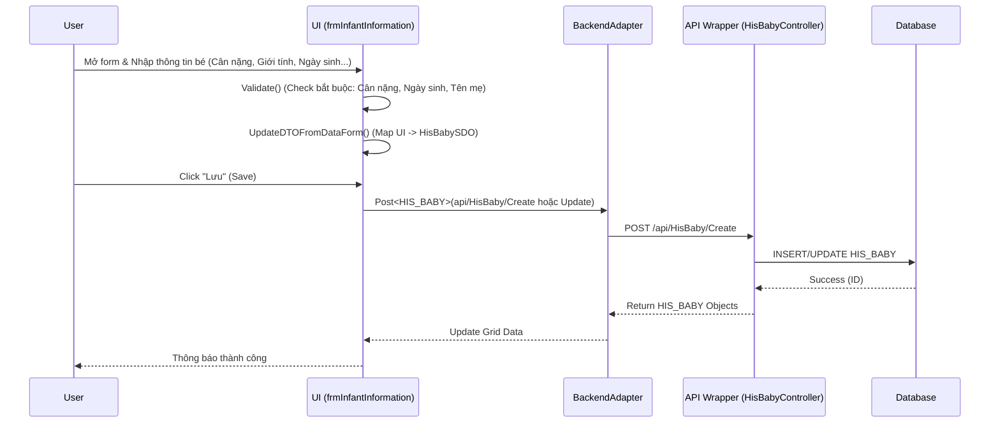

# Đặc tả Kỹ thuật: Phân hệ Sản Khoa & Quản lý Sinh (Obstetrics & Birth)

## 1. Mapping Nghiệp vụ (Business Mapping)
Tài liệu này mô tả chi tiết các màn hình và logic kỹ thuật hỗ trợ cho quy trình nghiệp vụ:
*   **Business Process Reference**: [08-obstetrics-birth.md](../../02-business-processes/specialized/08-obstetrics-birth.md)
*   **Phạm vi**:
    *   Quản lý thông tin trẻ sơ sinh (Chứng sinh).
    *   Quản lý thông tin điều trị sản khoa (Sổ sinh, Sổ thủ thuật).
*   **Lưu ý**: Một số chức năng Sản khoa sử dụng chung với module Phẫu thuật thủ thuật (`SurgServiceReqExecute`) hoặc Điều trị nội trú (`InpatientTreatment`). Tài liệu này tập trung vào các Plugin chuyên biệt cho Sản.

## 2. Core Components (Codebase Mapping)

### 2.1. Plugin: Quản lý Thông tin Trẻ Sơ sinh
*   **Plugin Name**: `HIS.Desktop.Plugins.InfantInformation`
*   **Namespace**: `HIS.Desktop.Plugins.InfantInformation`
*   **Extension Point**: `DesktopRootExtensionPoint`
*   **Mô tả**: Plugin quản lý form nhập liệu thông tin trẻ sơ sinh ngay sau sinh (cân nặng, giới tính, tình trạnh, cha mẹ...).
*   **UI Forms**:
    *   `frmInfantInformation` (Main Form): Form chính hiển thị danh sách và chi tiết trẻ sơ sinh của một hồ sơ điều trị.
*   **Key Classes**:
    *   `frmInfantInformation.cs`: Quản lý UI, load combo box (Dân tộc, Nghề nghiệp...), load danh sách trẻ (`HIS_BABY`).
    *   `frmInfantInformation___Process.cs`: Xử lý logic nghiệp vụ, tính toán tuổi thai, kiểm tra hợp lệ và mapping DTO đễ lưu trữ.

### 2.2. Common Components & Libraries
*   `HIS.Desktop.ApiConsumer`: Gọi API backend.
*   `HIS.Desktop.LocalStorage`: Lưu trữ cấu hình cục bộ và cache danh mục (Dân tộc `HIS_ETHNIC`, Nghề nghiệp `HIS_CAREER`).
*   `Inventec.Common.Adapter`: Core adapter gọi service.

## 3. Process Flow (Technical Deep Dive)

### 3.1. Quy trình Ghi nhận Thông tin Sinh (Birth Recording Flow)
Quy trình này xảy ra khi hộ sinh/bác sĩ nhập thông tin bé sau khi sinh.

### 3.2. Cấu trúc Dữ liệu & Logic
*   **SDO Mapping**: `HisBabySDO`
    *   `BornTime`: Tính toán từ Date + Hour UI controls.
    *   `BabyInfoForTreatment`: Chứa thông tin bổ sung cho quá trình điều trị (Sổ đẻ).
    *   `MotherInfo`: Thông tin mẹ lấy từ `HIS_PATIENT` (được load sẵn từ `treatmentId`).

## 4. Database Schema
Các bảng dữ liệu chính liên quan đến module Sản khoa:

### 4.1. HIS_BABY (Thông tin Trẻ sơ sinh)
| Column | Type | Description | Mapping (DTO/UI) |
| :--- | :--- | :--- | :--- |
| `ID` | NUMBER(19) | Primary Key | `CurrentData.ID` |
| `TREATMENT_ID` | NUMBER(19) | FK to HIS_TREATMENT (Hồ sơ mẹ) | `CurrentData.TreatmentId`|
| `BORN_TIME` | NUMBER(14) | Thời gian sinh (YYYYMMDDHHmmSS) | `dtBornTime` |
| `GENDER_ID` | NUMBER(19) | Giới tính | `cboGender` |
| `WEIGHT` | NUMBER | Cân nặng (gram) | `txtWeight` |
| `BIRTH_CERT_BOOK_ID` | NUMBER(19) | Quyển chứng sinh | `cboBookCode` |
| `BORN_POSITION_ID` | NUMBER(19) | Ngôi thai | `cboBornPosition` |
| `BORN_RESULT_ID` | NUMBER(19) | Kết quả sinh | `cboBornResult` |
| `IS_SURGERY` | NUMBER(1) | Có phẫu thuật/thủ thuật không | `chkIsSurgery` |

### 4.2. HIS_BIRTH_CERT (Giấy Chứng sinh)
Dữ liệu được trích xuất từ `HIS_BABY` và bổ sung thông tin hành chính để in giấy chứng sinh.

## 5. Integration Points
Module Sản khoa tích hợp chặt chẽ với các phân hệ khác:

*   **Điều trị Nội trú (Inpatient)**: `frmInfantInformation` thường được gọi từ Context Menu của hồ sơ bệnh án nội trú. Dữ liệu mẹ (`HIS_TREATMENT`) là đầu vào bắt buộc.
*   **Phẫu thuật Thủ thuật (Surgery)**: Nếu ca sinh là sinh mổ (`IS_SURGERY = 1`), quy trình sẽ liên kết với `SurgServiceReqExecute` để lập ekip mổ và tường trình phẫu thuật.
*   **Dược & Vật tư**: Kê thuốc cho bé thường được thực hiện qua module `AssignPrescription` (nhưng dưới tên hồ sơ bé hoặc mẹ tùy cấu hình BHYT).
*   **Báo cáo**: Dữ liệu `HIS_BABY` là nguồn chính cho Sổ Đẻ (A1) và Báo cáo 1080 (SSN).

## 6. Common Issues & Troubleshooting
1.  **Lỗi tính tuổi thai**: Đôi khi tuổi thai nhập vào không khớp với ngày dự sinh. Kiểm tra logic `CheckWeekCount` trong `frmInfantInformation___Process.cs`.
2.  **Mất thông tin mẹ**: Khi mở form, nếu không load được `patientLoad`, cần kiểm tra `treatmentId` truyền vào module.
3.  **Lưu thất bại do thiếu danh mục**: Một số combo box (Ngôi thai, Kiểu sinh) yêu cầu dữ liệu danh mục (`HIS_BORN_POSITION`, `HIS_BORN_TYPE`). Cần đảm bảo danh mục đã được khai báo.
