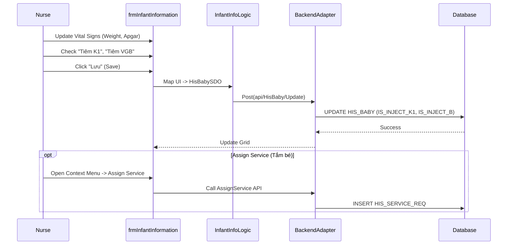

# Technical Spec: Chăm sóc Sơ sinh (Newborn Care)

## 1. Business Mapping
*   **Ref**: [Quy trình Chăm sóc Sơ sinh](../../02-business-processes/specialized/09-newborn-care.md)
*   **Scope**: Chăm sóc bé ngay sau sinh, tiêm chủng đầu đời, và theo dõi sơ sinh tại khoa Sản (hoặc chuyển khoa Nhi/Sơ sinh).
*   **Key Plugin**: `HIS.Desktop.Plugins.InfantInformation` (Shared with Obstetrics).

## 2. Core Components (Codebase Mapping)

### 2.1. Plugin Main Structure
*   **Plugin Name**: `HIS.Desktop.Plugins.InfantInformation`.
*   **Feature**: Quản lý thông tin bé sơ sinh (`frmInfantInformation` / tabs in `frmObstetricPatient`).
*   **Note**: Hiện tại chưa có Plugin riêng biệt cho "Khoa Sơ sinh" (Neonatal Dept), quy trình gắn liền với hồ sơ Mẹ.

### 2.2. User Interface (UI)
*   **Care Checklist** (in `frmObstetricPatient`):
    *   `chkIsInjeckK1`: Tiêm Vitamin K1.
    *   `chkIsInjeckB`: Tiêm Vắc-xin Viêm gan B.
    *   `chkPostpartumCare`: Chăm sóc hậu sản (6h, 24h...).
*   **Vital Signs**:
    *   Ghi nhận Cân nặng (`WEIGHT`), Chiều cao (`HEIGHT`), Vòng đầu (`HEAD`).
    *   Chỉ số Apgar (1 phút, 5 phút, 10 phút).

## 3. Process Flow (Technical Deep Dive)

### 3.1. Chăm sóc Sau sinh (Postpartum Care)

1.  **Ghi nhận chỉ số**: Điều dưỡng đo và nhập các chỉ số sinh tồn của bé.
2.  **Chỉ định Dịch vụ**:
    *   Tắm bé, thay băng rốn.
    *   Chiếu đèn (nếu vàng da) - Thực hiện qua `AssignService` thông thường.

### 3.2. Tiêm chủng (Vaccination)
*   Tích chọn đã tiêm K1/VGB.
*   Dữ liệu này cần được đồng bộ sang báo cáo TCMR (Tiêm chủng mở rộng).

### 3.3. Tách Hồ sơ (Transfer to Pediatrics)
*   Nếu bé bị bệnh cần điều trị chuyên sâu:
    *   Tạo hồ sơ bệnh án mới (Tách mẹ).
    *   Chuyển khoa sang Sơ sinh/Nhi (`HIS_TREATMENT` mới).

## 4. Database Schema

### 4.1. HIS_BABY (Thông tin Sơ sinh)
*   `IS_INJECT_K1`: Đã tiêm K1.
*   `IS_INJECT_B`: Đã tiêm VGB.
*   `IS_MOTHER_DEATH`: Mẹ tử vong (Risk factor).
*   `IS_DIFFICULT_BIRTH`: Sinh khó.

## 5. Integration Points
*   **Dược**: Lĩnh vắc-xin cho trẻ sơ sinh.
*   **Hệ thống Tiêm chủng Quốc gia**: Export dữ liệu tiêm chủng (XML/API).

## 6. Common Issues
*   **Vaccine Lot**: Quản lý lô/date vắc-xin khi tiêm tại phòng sinh thường khó khăn nếu không có module tiêm chủng chuyên sâu tích hợp.
*   **Missing Data**: Quên tích chọn đã tiêm chủng dẫn đến báo cáo sai lệch.
