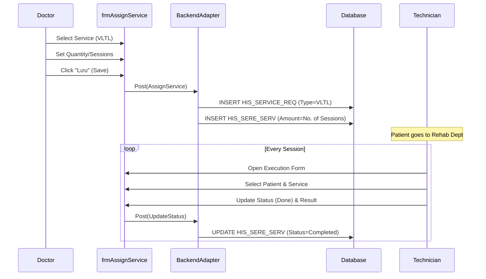

# Technical Spec: Phục hồi Chức năng (Rehabilitation)

## 1. Business Mapping
*   **Ref**: [Quy trình Phục hồi Chức năng](../../02-business-processes/specialized/10-rehabilitation.md)
*   **Scope**: Quản lý chỉ định và thực hiện các kỹ thuật Vật lý trị liệu / Phục hồi chức năng (VLTL/PHCN).
*   **Key Plugin**: Standard `HIS.Desktop.Plugins.AssignService` and `HIS.Desktop.Plugins.ServiceReqExecute`.

## 2. Core Components (Codebase Mapping)

### 2.1. Plugin Main Structure
*   **No Dedicated Plugin**: Hiện tại module này sử dụng chung core của "Chỉ định dịch vụ" và "Thực hiện dịch vụ".
*   **Configuration**:
    *   Các dịch vụ PHCN được định nghĩa trong danh mục dịch vụ (`HIS_SERVICE`).
    *   Phòng thực hiện được cấu hình là phòng Xử lý/Thủ thuật (`HIS_EXECUTE_ROOM`).

### 2.2. User Interface (UI)
*   **Chỉ định (Prescribing)**:
    *   Sử dụng `frmAssignService` (như CLS/Thăm dò chức năng).
    *   Có thể chọn theo Gói (Package) hoặc Lộ trình điều trị (Treatment Course).
*   **Thực hiện (Execution)**:
    *   Sử dụng `frmServiceReqExecute`.
    *   Ghi nhận kết quả thực hiện, số lần thực hiện.

## 3. Process Flow (Technical Deep Dive)

### 3.1. Chỉ định Liệu trình

1.  **Doctor**: Chỉ định dịch vụ VLTL (VD: Kéo giãn cột sống, Điện phân).
2.  **Frequency**: Số lượng chỉ định thường > 1 (theo đợt điều trị).
3.  **Data**: Lưu vào `HIS_SERVICE_REQ` và `HIS_SERE_SERV`.

### 3.2. Thực hiện và Theo dõi
*   Bệnh nhân đến phòng tập hàng ngày.
*   KTV xác nhận thực hiện (`UpdateStatus` = Done) cho từng lần.
*   Nếu chỉ định 1 lần nhưng làm nhiều ngày: Cần cơ chế "Thực hiện nhiều lần" (Multi-execution) - *Hiện tại có thể cần tách phiếu yêu cầu*.

## 4. Database Schema

### 4.1. HIS_SERE_SERV
*   `SERVICE_ID`: ID dịch vụ PHCN.
*   `AMOUNT`: Số lần chỉ định.
*   `HEIN_LIMIT_PRICE`: Mức giá trần BHYT (PHCN thường có giới hạn khó tính toán).

### 4.2. HIS_TRACKING (Tracking thực hiện - Proposed)
*   Nếu cần theo dõi chi tiết từng buổi tập trong liệu trình.

## 5. Integration Points
*   **Khoa Lâm sàng**: Bệnh nhân nội trú xuống tập PHCN.
*   **BHYT**: Kiểm soát trần chi phí và số ngày chỉ định (VD: BHYT chỉ thanh toán X lần/năm).

## 6. Common Issues
*   **Treatment Course**: Khó quản lý hết liệu trình nếu tái khám nhiều đợt.
*   **Consumables**: Hao phí vật tư tiêu hao (gel, điện cực) khó tính tự động theo từng lần tập.
