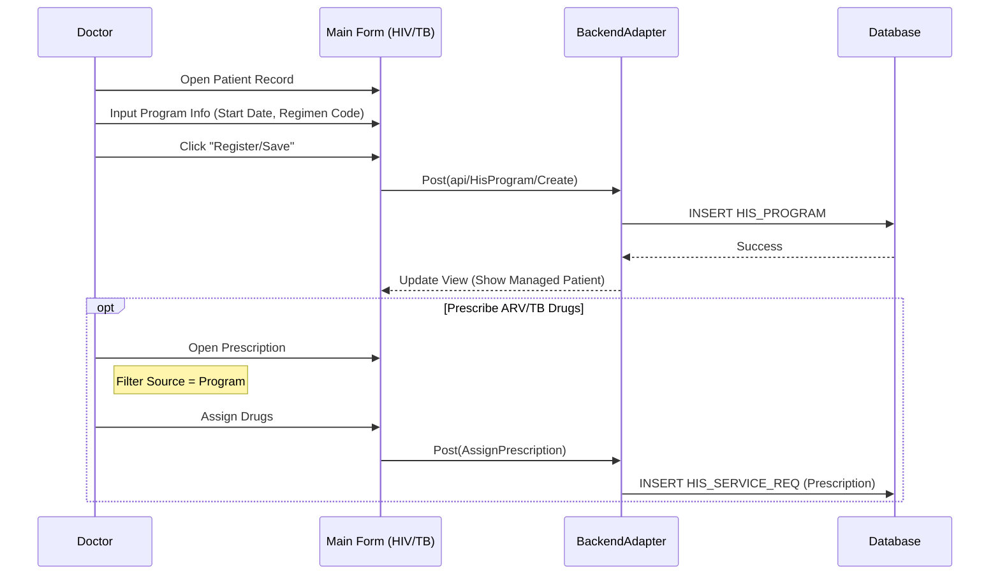

# Technical Spec: Bệnh Truyền nhiễm (Infectious Diseases - HIV/Lao)

## 1. Business Mapping
*   **Ref**: [Quy trình Bệnh Truyền nhiễm](../../02-business-processes/specialized/12-infectious-diseases.md)
*   **Scope**: Quản lý khám, điều trị và cấp phát thuốc cho bệnh nhân HIV/AIDS (ARV) và Lao (Tuberculosis).
*   **Key Plugins**:
    *   `HIS.Desktop.Plugins.HisHivTreatment` (Quản lý ARV).
    *   `HIS.Desktop.Plugins.HisTuberclusisTreatment` (Quản lý Lao).

## 2. Core Components (Codebase Mapping)

### 2.1. Plugin Main Structure
*   **HIV Module**:
    *   **Processor**: `HivTreatmentProcessor.cs`.
    *   **Main Form**: `frmHivTreatment.cs`.
    *   **Features**: Đăng ký chương trình, Theo dõi CD4, Cấp thuốc ARV.
*   **TB Module**:
    *   **Processor**: `TuberclusisTreatmentProcessor.cs`.
    *   **Main Form**: `frmTuberclusisTreatment.cs`.
    *   **Features**: Đăng ký chương trình Lao, Theo dõi phác đồ, Xét nghiệm đờm.

### 2.2. User Interface (UI)
*   **HIV Form**:
    *   `txtArvCode`: Mã số điều trị ARV.
    *   `dtStartDate`: Ngày bắt đầu điều trị.
    *   `cboRegimen`: Phác đồ điều trị (Bậc 1, Bậc 2...).
*   **TB Form**:
    *   `txtTuberclusisCode`: Mã quản lý Lao.
    *   `cboTuberclusisType`: Loại lao (Lao phổi âm tính/dương tính, Lao ngoài phổi).

## 3. Process Flow (Technical Deep Dive)

### 3.1. Tiếp nhận & Đăng ký Chương trình

1.  **Patient Registration**:
    *   Bệnh nhân được tiếp nhận vào khoa Truyền nhiễm hoặc Phòng khám ngoại trú (OPC).
    *   Đăng ký vào chương trình quản lý (`HIS_PROGRAM`).
2.  **API**:
    *   Lưu thông tin chương trình: `api/HisProgram/Create` hoặc `Update`.

### 3.2. Quản lý Điều trị (Treatment)
*   **Kê đơn thuốc**:
    *   Sử dụng module Kê đơn (`AssignPrescription`) nhưng lọc theo nguồn thuốc Chương trình (Nguồn HIV/Lao).
    *   Thuốc ARV/Lao thường được cấp miễn phí hoặc BHYT chi trả một phần, quản lý kho riêng.
*   **Theo dõi Diễn biến**:
    *   HIV: Xét nghiệm tải lượng virus, CD4 định kỳ.
    *   Lao: Xét nghiệm đờm (tháng 2, 5, 7).

## 4. Database Schema

### 4.1. HIS_PROGRAM (Chương trình Y tế)
*   `PROGRAM_CODE`: Mã chương trình (HIV/LAO).
*   `PATIENT_ID`: Link tới bệnh nhân.
*   `FROM_TIME`, `TO_TIME`: Thời gian tham gia.

### 4.2. XML Data Integration
*   Dữ liệu HIV/Lao thường cần export XML để đẩy lên hệ thống quản lý quốc gia (VAAC, VITIMES).
*   Các trường dữ liệu đặc thù được lưu trong `HIS_TREATMENT_END_TYPE` hoặc `HIS_SERE_SERV_EXT`.

## 5. Integration Points
*   **Kho Dược Chương trình**: Kho thuốc riêng biệt cho thuốc chương trình.
*   **Hệ thống Báo cáo**: Báo cáo tháng/quý cho CDC địa phương.

## 6. Common Issues
*   **Lost to follow-up**: Bệnh nhân bỏ điều trị, cần tool nhắc lịch tái khám.
*   **Dual Infection**: Bệnh nhân đồng nhiễm HIV-Lao, cần phối hợp phác đồ và tránh tương tác thuốc.
