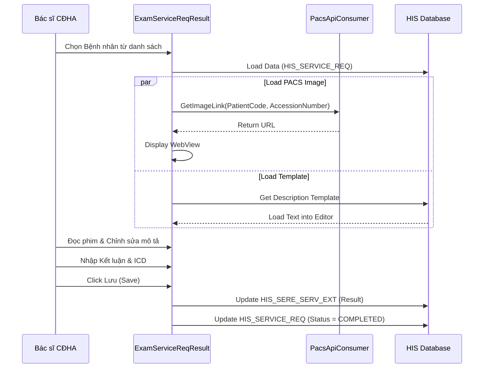

# Technical Spec: Chẩn đoán Hình ảnh (Diagnostic Imaging)

## 1. Business Mapping
*   **Ref**: [Quy trình Chẩn đoán Hình ảnh](../../02-business-processes/subclinical/01-diagnostic-imaging.md)
*   **Scope**: X-Quang, CT Scanner, MRI, Siêu âm.
*   **Key Plugins**:
    *   `HIS.Desktop.Plugins.ExamServiceReqResult`: Trả kết quả.
    *   `HIS.Desktop.Plugins.HisServiceNumOrderExecute`: Hàng đợi thực hiện.

## 2. Core Components

### 2.1. Quản lý Hàng đợi (Execution Queue)
*   **Plugin**: `HIS.Desktop.Plugins.HisServiceNumOrderExecute`.
*   **Logic**:
    *   Lọc bệnh nhân theo `EXECUTE_ROOM_ID` (Phòng thực hiện).
    *   `NumOrder`: Số thứ tự ưu tiên (Tính toán tự động dựa trên thời gian chỉ định + đối tượng ưu tiên).
    *   Action `CallPatient`: Tích hợp plugin gọi loa.

### 2.2. Nhập Kết quả & PACS View (Reporting)
*   **Plugin**: `HIS.Desktop.Plugins.ExamServiceReqResult`.
*   **UI Components**:
    *   `RichTextEditor`: Soạn thảo mô tả tổn thương.
    *   `PacsViewerControl`: Nhúng Web Browser để hiển thị ảnh DICOM từ PACS Server.
*   **Template Config**:
    *   Sử dụng `HIS_SERVICE_MACHINE_TEMPLATE` để load mẫu mô tả mặc định cho từng loại kỹ thuật (Ví dụ: "Tim phổi thẳng" sẽ có mẫu mô tả Xương sườn, nhu mô phổi...).

## 3. Process Flow (Technical Deep Dive)

### 3.1. Luồng Trả Kết quả Hình ảnh

## 4. Database Schema

### 4.1. HIS_SERE_SERV_EXT (Mở rộng)
Bảng chuyên dụng lưu trữ kết quả CLS dạng văn bản dài.
*   `SERE_SERV_ID`: FK (1-1 với HIS_SERE_SERV).
*   `DESCRIPTION`: Nội dung mô tả (HTML/RTF).
*   `CONCLUDE`: Kết luận ngắn gọn.
*   `NOTE`: Ghi chú thêm.

### 4.2. HIS_SERE_SERV_FILE (Ảnh đính kèm)
Nếu không dùng PACS full, HIS có thể lưu đường dẫn ảnh key images.
*   `ID`: PK.
*   `SERE_SERV_ID`: FK.
*   `FILE_PATH`: Đường dẫn lưu file (MinIO/FileServer).
*   `FILE_NAME`: Tên file.

## 5. Integration Points
*   **PACS**: Tích hợp hai chiều.
    *   **Chiều đi (ORM)**: Gửi bản tin HL7 ORM (Order Entry) khi bác sĩ lâm sàng chỉ định.
    *   **Chiều về (ORU/Link)**: PACS trả về Link Viewer hoặc bản tin kết quả (ít dùng hơn, thường chỉ lấy Link).
*   **Billing**: Tự động tính tiền vật tư tiêu hao (Film, thuốc cản quang) nếu có cấu hình `HIS_SERVICE_MATY`.

## 6. Common Issues
*   **Lỗi PACS Link**: Token hết hạn hoặc sai Accession Number dẫn đến không load được ảnh. -> Cần check log `PacsApiConsumer`.
*   **Mất định dạng in**: Do copy paste text từ Word vào RichTextEditor gây lỗi HTML tag. -> Cần dùng nút "Paste Plain Text".
