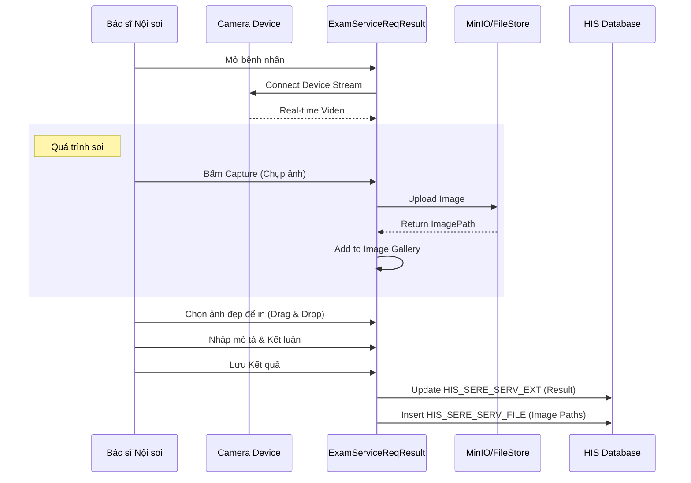

# Technical Spec: Thăm dò Chức năng (Functional Exploration)

## 1. Business Mapping
*   **Ref**: [Quy trình Thăm dò Chức năng](../../02-business-processes/subclinical/02-functional-exploration.md)
*   **Scope**: Nội soi (Tiêu hóa, Tai mũi họng), Điện tim (ECG), Điện não (EEG), Đo chức năng hô hấp.
*   **Key Plugin**: `HIS.Desktop.Plugins.ExamServiceReqResult`.

## 2. Core Components

### 2.1. Nhập Kết quả & Bắt hình (Result & Capture)
*   **Plugin**: `HIS.Desktop.Plugins.ExamServiceReqResult`.
*   **Module Camera**:
    *   Tích hợp thư viện `AForge.NET` hoặc SDK của hãng để kết nối Card Capture (USB/PCI).
    *   Cho phép Stop/Freeze hình ảnh và lưu trực tiếp vào hồ sơ bệnh nhân.
*   **Template đặc thù**:
    *   Phiếu nội soi thường có 2-4 vị trí đặt ảnh cố định.
    *   Phiếu điện tim cần import file PDF hoặc ảnh chụp dải sóng.

### 2.2. Vật tư tiêu hao (Consumables)
*   Trong quá trình nội soi thường sử dụng thuốc gây mê, kìm sinh thiết, thuốc rửa...
*   Hệ thống tự động trừ kho khi bác sĩ tick chọn "Gói vật tư" hoặc kê đơn bổ sung ngay tại màn hình `ExamServiceReqResult`.

## 3. Process Flow (Technical Deep Dive)

### 3.1. Luồng Nội soi & Bắt hình

## 4. Database Schema

### 4.1. HIS_SERE_SERV_FILE (Lưu ảnh)
*   `SERE_SERV_ID`: FK to Service.
*   `FILE_PATH`: Đường dẫn tương đối (e.g., `/2023/10/25/Endoscopy/IMG_001.jpg`).
*   `IS_PRINT`: Cờ đánh dấu ảnh này có in ra phiếu hay không.
*   `DESCRIPTION`: Chú thích dưới ảnh (nếu cần).

### 4.2. HIS_SERVICE_PATY (Vật tư tiêu hao)
*   `SERVICE_ID`: FK to HIS_SERVICE (Dịch vụ nội soi).
*   `PATIENT_TYPE_ID`: Đối tượng (BHYT/Dịch vụ).
*   `MATERIAL_ID`: Vật tư đi kèm (Găng tay, Kìm...).
*   `AMOUNT`: Số lượng định mức.

## 5. Integration Points
*   **Máy Nội soi (Olympus/Pentax/Fujifilm)**: Kết nối qua cổng Video Out (HDMI/S-Video) vào Card Capture trên máy tính HIS.
*   **Máy Điện tim**:
    *   Đời cũ: In giấy nhiệt -> Scan/Chụp ảnh upload.
    *   Đời mới: Xuất PDF/XML -> Import vào HIS.

## 6. Common Issues
*   **Không nhận Camera**: Do thiếu Driver Card Capture hoặc chưa config đúng `VideoInputDevice` trong LocalSetting.
*   **Ảnh bị nhòe/vỡ**: Do độ phân giải capture thấp (Config mặc định có thể chỉ là 640x480) -> Cần chỉnh lên HD/FullHD.
*   **Dung lượng ổ cứng**: Ảnh/Video chiếm dung lượng lớn -> Cần cơ chế dọn dẹp hoặc lưu trữ tập trung (NAS/Cloud).
