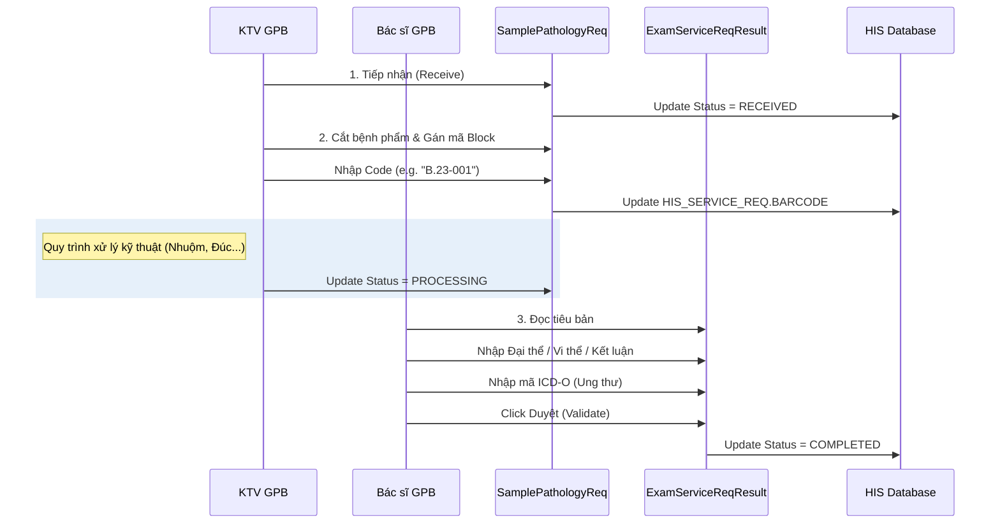

# Technical Spec: Giải phẫu bệnh (Pathology)

## 1. Business Mapping
*   **Ref**: [Quy trình Giải phẫu bệnh](../../02-business-processes/subclinical/03-pathology.md)
*   **Scope**: Sinh thiết, Tế bào học, Hóa mô miễn dịch.
*   **Key Plugin**: `HIS.Desktop.Plugins.SamplePathologyReq`.

## 2. Core Components

### 2.1. Quản lý Mẫu & Block (SamplePathologyReq)
*   **Plugin**: `HIS.Desktop.Plugins.SamplePathologyReq`.
*   **Chức năng**:
    *   Tiếp nhận bệnh phẩm (Sinh thiết/Tế bào).
    *   Gán mã `Block Code` và `Slide Code` để quản lý lưu trữ tiêu bản.
    *   In phiếu chuyển mẫu.
*   **Đặc thù**: Khác với CĐHA (không cần lấy mẫu vật lý), GPB quản lý mẫu vật lý nghiêm ngặt giống LIS.

### 2.2. Nhập Kết quả GPB
*   **Plugin**: `HIS.Desktop.Plugins.ExamServiceReqResult` (Mode Pathology) hoặc dùng Editor tích hợp luôn trong `SamplePathologyReq`.
*   **Cấu trúc dữ liệu**:
    *   **Đại thể**: Mô tả kích thước, màu sắc, tính chất mẫu bệnh phẩm thô.
    *   **Vi thể**: Mô tả cấu trúc tế bào dưới kính hiển vi.
    *   **Kết luận**: Chẩn đoán xác định.
    *   **ICD-O**: Mã hóa ung bướu (Topography & Morphology).

## 3. Process Flow (Technical Deep Dive)

### 3.1. Luồng Quy trình Giải phẫu bệnh

## 4. Database Schema

### 4.1. HIS_SERVICE_REQ (Mở rộng cho GPB)
*   `BARCODE`: Lưu mã Block/Slide (Định danh mẫu GPB).
*   `SAMPLE_NOTE`: Gnotes ghi chú tình trạng mẫu khi nhận.
*   `NUM_ORDER`: Số thứ tự mẫu trong ngày/năm.

### 4.2. HIS_ICD_O (Danh mục Ung bướu)
*   `ICD_O_CODE`: Mã (e.g., M8140/3).
*   `ICD_O_NAME`: Tên mô bệnh học (e.g., Adenocarcinoma).
*   `TYPE`: Topography (Vị trí) hoặc Morphology (Hình thái).

## 5. Integration Points
*   **Ung bướu (Oncology)**: Kết quả GPB là tiêu chuẩn vàng để lập kế hoạch điều trị ung thư. Plugin `HisCancerTreatment` sẽ load kết quả từ GPB để fill vào bệnh án ung bướu.
*   **Khoa Lâm sàng**: Bác sĩ phẫu thuật gửi bệnh phẩm đi, GPB trả kết quả về để quyết định có mổ tiếp hay không (Sinh thiết tức thì).

## 6. Common Issues
*   **Nhầm lẫn Block**: Mã Block nhập tay dễ trùng lặp -> Cần cơ chế sinh mã tự động theo quy tắc (Năm + Loại + Số tăng dần).
*   **Mất mẫu**: Mẫu bệnh phẩm thất lạc trong quá trình chuyển từ phòng mổ xuống GPB -> Cần quy trình "Handover" (Bàn giao) có ký nhận trên phần mềm.
