## Mục đích và Phạm vi

Tài liệu này đề cập đến thành phần `HIS.UC.FormType` (329 tệp), đây là công cụ xử lý biểu mẫu (form engine) cốt lõi cho tất cả các thao tác nhập liệu trong hệ thống HIS. FormType cung cấp một khung công việc (framework) có thể tái sử dụng và cấu hình được để tạo các biểu mẫu động với các mẫu xác thực dữ liệu, liên kết dữ liệu (data binding) và bố cục (layout) chuẩn hóa.

FormType là một trong 131 thành phần điều khiển người dùng trong thư viện UC. Để biết thông tin về các điều khiển khác liên quan đến bệnh nhân, hãy xem [Patient & Treatment UCs](#1.3.2). Đối với các điều khiển liên quan đến thuốc và chẩn đoán, hãy xem [Medicine & ICD UCs](#1.3.3). Đối với kiến trúc tổng thể của thư viện UC, hãy xem [Thư viện Thành phần UC](../../03-technical-specs/uc-controls/form-type-controls.md).

**Nguồn:** [`.devin/wiki.json:210-213`](../../../../.devin/wiki.json#L210-L213), [UC/HIS.UC.FormType/]()

11: ## Tổng quan Hệ thống
12: 
13: `HIS.UC.FormType` là thành phần điều khiển người dùng lớn nhất và phức tạp nhất trong thư viện UC, đóng vai trò là công cụ hiển thị biểu mẫu nền tảng cho toàn bộ ứng dụng HIS. Với 329 tệp, nó cung cấp:
14: 
15: - Tạo biểu mẫu động dựa trên siêu dữ liệu (metadata) có thể cấu hình
16: - Xác thực dữ liệu và xử lý lỗi chuẩn hóa
17: - Nhất quán về bố cục và kiểu dáng trên tất cả các plugin
18: - Liên kết dữ liệu (data binding) giữa các điều khiển UI và các mô hình miền (domain models)
19: - Quản lý trạng thái và vòng đời của biểu mẫu
20: - Hỗ trợ bản địa hóa cho các biểu mẫu đa ngôn ngữ
21: 
22: FormType được sử dụng bởi 956 plugin trên toàn hệ thống để tạo ra các giao diện nhập liệu nhất quán cho các hoạt động của bệnh viện bao gồm đăng ký bệnh nhân, theo dõi điều trị, quản lý đơn thuốc và các chức năng hành chính.
23: 
24: **Nguồn:** [UC/HIS.UC.FormType/](), [`.devin/wiki.json:203-207`](../../../../.devin/wiki.json#L203-L207)

---

28: ## Kiến trúc và Vị trí trong Hệ thống
29: 
30: ```mermaid
31: graph TB
32:     subgraph "Lớp_Plugin_-_956_Plugin"
33:         RegPlugin["HIS.Desktop.Plugins.Register<br/>(81-102 tệp)"]
34:         PrescPlugin["HIS.Desktop.Plugins.AssignPrescriptionPK<br/>(203 tệp)"]
35:         TreatPlugin["HIS.Desktop.Plugins.TreatmentFinish<br/>(101 tệp)"]
36:         OtherPlugins["Các Plugin nghiệp vụ khác"]
37:     end
38:     
39:     subgraph "Lớp_UC_-_Điều_khiển_Tái_sử_dụng"
40:         FormType["HIS.UC.FormType<br/>(329 tệp)<br/>Core Form Engine"]
41:         UCHein["His.UC.UCHein<br/>(153 tệp)"]
42:         CreateReport["His.UC.CreateReport<br/>(165 tệp)"]
43:         OtherUCs["Các UC khác (còn 128 UC)"]
44:     end
45:     
46:     subgraph "Lớp_Nền_tảng"
47:         InventecUC["Inventec.UC<br/>(1060 tệp)<br/>Base Controls"]
48:         DevExpress["DevExpress 15.2.9<br/>UI Framework"]
49:     end
50:     
51:     subgraph "Lớp_Dữ_liệu"
52:         ADO["HIS.Desktop.ADO<br/>(74 tệp)<br/>Data Models"]
53:         API["HIS.Desktop.ApiConsumer<br/>Backend API"]
54:     end
55:     
56:     RegPlugin --> FormType
57:     PrescPlugin --> FormType
58:     TreatPlugin --> FormType
59:     OtherPlugins --> FormType
60:     
61:     FormType --> InventecUC
62:     UCHein --> InventecUC
63:     CreateReport --> InventecUC
64:     OtherUCs --> InventecUC
65:     
66:     InventecUC --> DevExpress
67:     
68:     FormType -.->|Binds Data| ADO
69:     FormType -.->|Validates Against| ADO
70:     ADO -.->|Loaded From| API
71: ```
72: 
73: **Sơ đồ: Vị trí của FormType trong Kiến trúc Hệ thống**
74: 
75: Sơ đồ này cho thấy cách FormType nằm giữa lớp plugin và lớp nền tảng, đóng vai trò là giao diện chính cho tất cả các thao tác nhập liệu. Các plugin sử dụng FormType để tạo ra các biểu mẫu nhất quán, từ đó xây dựng dựa trên các điều khiển cơ bản của Inventec.UC và liên kết với các mô hình dữ liệu ADO.
76: 
77: **Nguồn:** [UC/HIS.UC.FormType/](), [HIS/Plugins/](), [Common/Inventec.UC/](), [HIS/HIS.Desktop/HIS.Desktop.ADO/]()

---

81: ## Cấu trúc Thành phần
82: 
83: ```mermaid
84: graph TB
85:     subgraph "HIS.UC.FormType_-_329_Tệp"
86:         Core["Core/"]
87:         Design["Design/<br/>Trình thiết kế biểu mẫu"]
88:         Validation["Validation/<br/>Quy tắc & Bộ xác thực"]
89:         Config["Config/<br/>Cấu hình biểu mẫu"]
90:         Processor["Processor/<br/>Bộ xử lý biểu mẫu"]
91:         ADO["ADO/<br/>Mô hình dữ liệu đặc thù"]
92:         Resources["Resources/<br/>Bản địa hóa"]
93:         Base["Base/<br/>Các lớp cơ sở"]
94:     end
95:     
96:     subgraph "Các_Thành_phần_Chính"
97:         FormTypeManager["FormTypeManager<br/>Factory & Registry"]
98:         FormTypeBuilder["FormTypeBuilder<br/>Tạo động"]
99:         ValidationEngine["ValidationEngine<br/>Xử lý quy tắc"]
100:         DataBinder["DataBinder<br/>Liên kết dữ liệu"]
101:         LayoutManager["LayoutManager<br/>Sắp xếp UI"]
102:     end
103:     
104:     Core --> FormTypeManager
105:     Core --> FormTypeBuilder
106:     Validation --> ValidationEngine
107:     Processor --> DataBinder
108:     Design --> LayoutManager
109:     
110:     FormTypeManager -.->|Ghi danh| FormTypeBuilder
111:     FormTypeBuilder -.->|Sử dụng| ValidationEngine
112:     FormTypeBuilder -.->|Sử dụng| DataBinder
113:     FormTypeBuilder -.->|Sử dụng| LayoutManager
114: ```
115: 
116: **Sơ đồ: Cấu trúc Thành phần Nội bộ của FormType**
117: 
118: Thành phần này được tổ chức thành các thư mục chuyên biệt xử lý các khía cạnh khác nhau của quản lý biểu mẫu. Core cung cấp mẫu factory để tạo biểu mẫu, trong khi Validation, Processor và Design xử lý các vấn đề chuyên biệt.
119: 
120: **Nguồn:** [UC/HIS.UC.FormType/]()

---

124: ## Các Loại Biểu mẫu
125: 
126: Dựa trên số lượng tệp (329 tệp) và các yêu cầu điển hình của hệ thống bệnh viện, FormType có khả năng cung cấp một số loại biểu mẫu sau:
127: 
128: | Loại biểu mẫu | Mục đích | Các trường hợp sử dụng điển hình |
129: |---------------|---------|-------------------|
130: | **Biểu mẫu Bệnh nhân** | Dữ liệu nhân khẩu học và đăng ký bệnh nhân | Đăng ký bệnh nhân mới, tìm kiếm bệnh nhân, cập nhật thông tin bệnh nhân |
131: | **Biểu mẫu Lâm sàng** | Nhập liệu dữ liệu y khoa | Dấu hiệu sinh tồn, mã chẩn đoán (ICD), ghi chú khám bệnh |
132: | **Biểu mẫu Đơn thuốc** | Y lệnh thuốc và điều trị | Đơn thuốc, thủ thuật y tế, chỉ định xét nghiệm |
133: | **Biểu mẫu Tài chính** | Lập hóa đơn và thanh toán | Tạo hóa đơn, thu tiền tạm ứng, xử lý thanh toán |
134: | **Biểu mẫu Hành chính** | Cấu hình hệ thống và dữ liệu danh mục | Quản lý người dùng, thiết lập phòng khám, cấu hình dịch vụ |
135: | **Biểu mẫu Báo cáo** | Lọc dữ liệu và tham số báo cáo | Chọn khoảng ngày, bộ lọc khoa phòng, tiêu chí báo cáo |
136: 
137: **Nguồn:** [UC/HIS.UC.FormType/](), [HIS/Plugins/]()

---

141: ## Quy trình Tạo và Vòng đời Biểu mẫu
142: 
143: ```mermaid
144: sequenceDiagram
145:     participant Plugin as "Plugin<br/>(ví dụ: Đăng ký)"
146:     participant Manager as "FormTypeManager"
147:     participant Builder as "FormTypeBuilder"
148:     participant Validator as "ValidationEngine"
149:     participant Binder as "DataBinder"
150:     participant Form as "Instance FormType"
151:     
152:     Plugin->>Manager: CreateForm(formConfig)
153:     Manager->>Builder: Build(formConfig)
154:     Builder->>Form: new FormTypeControl()
155:     Builder->>Form: ApplyLayout(config)
156:     Builder->>Validator: AttachValidation(rules)
157:     Builder->>Binder: SetupDataBinding(model)
158:     Builder-->>Manager: Trả về instance form
159:     Manager-->>Plugin: Trả về form đã cấu hình
160:     
161:     Plugin->>Form: Show()
162:     Plugin->>Form: LoadData(model)
163:     Binder->>Form: BindProperties(model)
164:     
165:     Plugin->>Form: SaveData()
166:     Form->>Validator: Validate()
167:     Validator-->>Form: ValidationResult
168:     alt Xác thực Thành công
169:         Form->>Binder: GetModelData()
170:         Binder-->>Form: Model đã cập nhật
171:         Form-->>Plugin: Trả về model
172:     else Xác thực Thất bại
173:         Form-->>Plugin: Hiển thị lỗi
174:     end
175: ```
176: 
177: **Sơ đồ: Quy trình Tạo biểu mẫu và Vòng đời Luồng dữ liệu**
178: 
179: Trình tự này cho thấy vòng đời điển hình của một instance FormType từ khi tạo cho đến khi liên kết dữ liệu và xác thực. Các plugin tương tác với FormTypeManager để tạo và cấu hình các biểu mẫu, sau đó chúng được hiển thị và xác thực trước khi gửi dữ liệu.
180: 
181: **Nguồn:** [UC/HIS.UC.FormType/Core/](), [UC/HIS.UC.FormType/Validation/](), [UC/HIS.UC.FormType/Processor/]()

---

185: ## Các Mô hình Liên kết Dữ liệu (Data Binding)
186: 
187: FormType triển khai một hệ thống liên kết dữ liệu mạnh mẽ kết nối các điều khiển UI với các mô hình dữ liệu từ `HIS.Desktop.ADO`. Hệ thống liên kết hỗ trợ:
188: 
189: ### Liên kết Hai chiều (Two-Way Binding)
190: 
191: ```mermaid
192: graph LR
193:     subgraph "Lớp_UI"
194:         TextBox["TextBox Control<br/>Tên bệnh nhân"]
195:         DatePicker["DatePicker Control<br/>Ngày sinh"]
196:         ComboBox["ComboBox Control<br/>Giới tính"]
197:     end
198:     
199:     subgraph "Lớp_Liên_kết"
200:         Binder["DataBinder"]
201:         PropertyMap["Ánh xạ Thuộc tính"]
202:     end
203:     
204:     subgraph "Lớp_Dữ_liệu"
205:         ADO["PatientADO Model"]
206:         Props["Thuộc tính:<br/>Name, DOB, Gender"]
207:     end
208:     
209:     TextBox <-->|"Bind: Text <-> Name"| Binder
210:     DatePicker <-->|"Bind: Value <-> DOB"| Binder
211:     ComboBox <-->|"Bind: SelectedValue <-> Gender"| Binder
212:     
213:     Binder <--> PropertyMap
214:     PropertyMap <--> ADO
215:     ADO --> Props
216: ```
217: 
218: **Sơ đồ: Kiến trúc Liên kết Dữ liệu Hai chiều**
219: 
220: Thành phần DataBinder tạo ra các liên kết hai chiều giữa các điều khiển UI và các thuộc tính của mô hình, tự động đồng bộ hóa các thay đổi theo cả hai hướng cùng với việc xác thực và chuyển đổi kiểu dữ liệu.
221: 
222: **Nguồn:** [UC/HIS.UC.FormType/Processor/](), [HIS/HIS.Desktop/HIS.Desktop.ADO/]()

---

225: ### Các Tính năng Liên kết
226: 
227: | Tính năng | Mô tả | Triển khai |
228: |---------|-------------|----------------|
229: | **Ánh xạ Thuộc tính** | Tự động ánh xạ giữa các thuộc tính của điều khiển và các trường của mô hình | Sử dụng Reflection và cấu hình dựa trên Attribute |
230: | **Chuyển đổi Kiểu** | Tự động chuyển đổi giữa các kiểu UI (string) và các kiểu mô hình (int, DateTime, v.v.) | Các bộ chuyển đổi tích hợp sẵn hỗ trợ cả bộ chuyển đổi tùy chỉnh |
231: | **Theo dõi Thay đổi** | Theo dõi các trường nào đã được sửa đổi | Hệ thống cờ Dirty để cập nhật hiệu quả |
232: | **Tích hợp Xác thực** | Xác thực dữ liệu trong quá trình liên kết | Gọi ValidationEngine trước khi xác nhận thay đổi |
233: | **Xử lý Null** | Xử lý nhẹ nhàng các giá trị null | Hỗ trợ giá trị mặc định và kiểu dữ liệu Nullable |
234: 
235: **Nguồn:** [UC/HIS.UC.FormType/Processor/]()

---

239: ## Hệ thống Xác thực
240: 
241: ```mermaid
242: graph TB
243:     subgraph "Quy_tắc_Xác_thực"
244:         Required["Trường bắt buộc"]
245:         Format["Định dạng/Mẫu"]
246:         Range["Khoảng/Độ dài"]
247:         Custom["Quy tắc Nghiệp vụ<br/>Tùy chỉnh"]
248:         CrossField["Xác thực<br/>Liên trường"]
249:     end
250:     
251:     subgraph "Bộ_máy_Xác_thực"
252:         Engine["ValidationEngine"]
253:         RuleRegistry["Sổ đăng ký Quy tắc"]
254:         ErrorProvider["ErrorProvider"]
255:     end
256:     
257:     subgraph "Phản_hồi_UI"
258:         Inline["Biểu tượng lỗi nội dòng"]
259:         Summary["Bảng tổng hợp lỗi"]
260:         Highlight["Làm nổi bật trường"]
261:     end
262:     
263:     Required --> RuleRegistry
264:     Format --> RuleRegistry
265:     Range --> RuleRegistry
266:     Custom --> RuleRegistry
267:     CrossField --> RuleRegistry
268:     
269:     RuleRegistry --> Engine
270:     Engine --> ErrorProvider
271:     
272:     ErrorProvider --> Inline
273:     ErrorProvider --> Summary
274:     ErrorProvider --> Highlight
275: ```
276: 
277: **Sơ đồ: Kiến trúc Hệ thống Xác thực**
278: 
279: Hệ thống xác thực sử dụng cách tiếp cận dựa trên quy tắc, trong đó nhiều quy tắc xác thực có thể được gắn vào mỗi trường của biểu mẫu. ValidationEngine xử lý tất cả các quy tắc và cung cấp phản hồi thông qua nhiều cơ chế UI.
280: 
281: **Nguồn:** [UC/HIS.UC.FormType/Validation/]()

---

283: ### Các Loại Quy tắc Xác thực
284: 
285: ```mermaid
286: classDiagram
287:     class IValidationRule {
288:         <<interface>>
289:         +Validate(value) ValidationResult
290:         +ErrorMessage string
291:         +ValidationLevel Level
292:     }
293:     
294:     class RequiredRule {
295:         +AllowWhitespace bool
296:         +Validate(value) ValidationResult
297:     }
298:     
299:     class FormatRule {
300:         +Pattern string
301:         +RegexOptions Options
302:         +Validate(value) ValidationResult
303:     }
304:     
305:     class RangeRule {
306:         +MinValue object
307:         +MaxValue object
308:         +Validate(value) ValidationResult
309:     }
310:     
311:     class CustomRule {
312:         +ValidationFunc Func
313:         +Validate(value) ValidationResult
314:     }
315:     
316:     class CrossFieldRule {
317:         +DependentFields string[]
318:         +Validate(values) ValidationResult
319:     }
320:     
321:     IValidationRule <|-- RequiredRule
322:     IValidationRule <|-- FormatRule
323:     IValidationRule <|-- RangeRule
324:     IValidationRule <|-- CustomRule
325:     IValidationRule <|-- CrossFieldRule
326: ```
327: 
328: **Sơ đồ: Hệ thống Thứ bậc Lớp Quy tắc Xác thực**
329: 
330: Cấu trúc phân cấp này cho thấy các loại quy tắc xác thực khác nhau có thể được áp dụng cho các trường của biểu mẫu. Tất cả các quy tắc đều triển khai interface `IValidationRule`, cho phép xử lý xác thực nhất quán.
331: 
332: **Nguồn:** [UC/HIS.UC.FormType/Validation/]()

---

336: ## Tích hợp với các Plugin
337: 
338: FormType được sử dụng bởi 956 plugin trên toàn hệ thống. Mô hình tích hợp tuân theo một cách tiếp cận nhất quán:
339: 
340: ### Mô hình Tích hợp Plugin
341: 
342: ```mermaid
343: sequenceDiagram
344:     participant Plugin as "Lớp Plugin<br/>(ví dụ: Đăng ký)"
345:     participant PluginForm as "Form Plugin<br/>(WinForms)"
346:     participant FormType as "Instance FormType"
347:     participant UCProcessor as "Bộ xử lý FormType"
348:     participant BackendData as "LocalStorage.BackendData"
349:     participant API as "ApiConsumer"
350:     
351:     Plugin->>PluginForm: Initialize()
352:     PluginForm->>FormType: CreateFormType(config)
353:     FormType->>UCProcessor: InitProcessor()
354:     
355:     PluginForm->>BackendData: LoadCachedData()
356:     BackendData-->>PluginForm: Dữ liệu danh mục đã đệm
357:     
358:     alt Nếu không có trong bộ nhớ đệm
359:         PluginForm->>API: GetMasterData()
360:         API-->>PluginForm: Dữ liệu mới
361:         PluginForm->>BackendData: UpdateCache(data)
362:     end
363:     
364:     PluginForm->>FormType: PopulateDropdowns(data)
365:     PluginForm->>FormType: ShowForm()
366:     
367:     Note over FormType: Người dùng nhập dữ liệu
368:     
369:     PluginForm->>FormType: ValidateAndSave()
370:     FormType->>UCProcessor: ProcessData()
371:     UCProcessor-->>FormType: ProcessedModel
372:     FormType-->>PluginForm: Trả về model
373:     PluginForm->>API: SaveToBackend(model)
374: ```
375: 
376: **Sơ đồ: Quy trình Tích hợp Plugin-FormType**
377: 
378: Trình tự này cho thấy cách các plugin khởi tạo các thành phần FormType, tải dữ liệu danh mục đã được đệm và xử lý dữ liệu nhập từ người dùng trước khi gửi đến API backend.
379: 
380: **Nguồn:** [UC/HIS.UC.FormType/Processor/](), [HIS/Plugins/](), [HIS/HIS.Desktop/HIS.Desktop.LocalStorage.BackendData/]()

---

382: ### Các Điểm Tích hợp Phổ biến
383: 
384: | Điểm Tích hợp | Mục đích | Ví dụ Sử dụng |
385: |-------------------|---------|---------------|
386: | **FormType Factory** | Tạo các instance biểu mẫu | `FormTypeManager.CreateForm(FormTypeEnum.PatientRegistration)` |
387: | **Tải Dữ liệu** | Điền dữ liệu hiện có vào biểu mẫu | `formType.LoadData(patientADO)` |
388: | **Kích hoạt Xác thực** | Xác thực trước khi lưu | `if (formType.Validate()) { ... }` |
389: | **Truy xuất Dữ liệu** | Lấy dữ liệu người dùng đã nhập | `var model = formType.GetData<PatientADO>()` |
390: | **Xử lý Sự kiện** | Phản ứng với các sự kiện của biểu mẫu | `formType.OnDataChanged += HandleDataChange` |
391: | **Quản lý Trạng thái** | Theo dõi trạng thái biểu mẫu | `formType.IsDirty`, `formType.IsValid` |
392: 
393: **Nguồn:** [UC/HIS.UC.FormType/Core/](), [HIS/Plugins/]()

---

397: ## Hệ thống Cấu hình
398: 
399: FormType sử dụng cách tiếp cận dựa trên cấu hình để định nghĩa cấu trúc biểu mẫu, cho phép tùy chỉnh các biểu mẫu mà không cần thay đổi mã nguồn:
400: 
401: ```mermaid
402: graph TB
403:     subgraph "Các_Nguồn_Cấu_hình"
404:         XML["Tệp cấu hình XML"]
405:         Code["Cấu hình dựa trên code"]
406:         DB["Cấu hình Cơ sở dữ liệu"]
407:     end
408:     
409:     subgraph "Đối_tượng_Cấu_hình"
410:         FormConfig["FormTypeConfig"]
411:         FieldConfig["FieldConfig[]"]
412:         ValidationConfig["ValidationConfig"]
413:         LayoutConfig["LayoutConfig"]
414:     end
415:     
416:     subgraph "Tạo_Biểu_mẫu"
417:         Parser["Bộ phân tích Cấu hình"]
418:         Builder["Trình xây dựng biểu mẫu"]
419:         Renderer["Bộ hiển thị UI"]
420:     end
421:     
422:     XML --> Parser
423:     Code --> Parser
424:     DB --> Parser
425:     
426:     Parser --> FormConfig
427:     FormConfig --> FieldConfig
428:     FormConfig --> ValidationConfig
429:     FormConfig --> LayoutConfig
430:     
431:     FieldConfig --> Builder
432:     ValidationConfig --> Builder
433:     LayoutConfig --> Builder
434:     
435:     Builder --> Renderer
436:     Renderer --> Form["Biểu mẫu đã tạo"]
437: ```
438: 
439: **Sơ đồ: Tạo biểu mẫu dựa trên cấu hình**
440: 
441: Hệ thống cấu hình cho phép các biểu mẫu được định nghĩa một cách rõ ràng thông qua XML, mã nguồn hoặc cấu hình cơ sở dữ liệu. Bộ phân tích đọc các cấu hình này và trình xây dựng sẽ tạo ra giao diện UI tương ứng.
442: 
443: **Nguồn:** [UC/HIS.UC.FormType/Config/](), [UC/HIS.UC.FormType/Design/]()

---

445: ### Cấu trúc Ví dụ về Cấu hình
446: 
447: Một cấu hình biểu mẫu điển hình bao gồm:
448: 
449: | Phần cấu hình | Các yếu tố | Mục đích |
450: |----------------------|----------|---------|
451: | **Siêu dữ liệu Biểu mẫu** | Tiêu đề, kích thước, hành vi modal | Định nghĩa hình thức và hành vi của biểu mẫu |
452: | **Định nghĩa Trường** | Tên trường, loại, nhãn, thứ tự | Định nghĩa các trường nào xuất hiện trên biểu mẫu |
453: | **Quy tắc Xác thực** | Bắt buộc, định dạng, ràng buộc khoảng | Định nghĩa các yêu cầu xác thực dữ liệu |
454: | **Quy tắc Bố cục** | Hàng, cột, nhóm | Định nghĩa cách sắp xếp các trường |
455: | **Liên kết Dữ liệu** | Ánh xạ thuộc tính mô hình | Định nghĩa cách các trường ánh xạ tới mô hình dữ liệu |
456: | **Bản địa hóa** | Các phím tài nguyên cho nhãn | Hỗ trợ nhiều ngôn ngữ |
457: 
458: **Nguồn:** [UC/HIS.UC.FormType/Config/](), [UC/HIS.UC.FormType/Resources/]()

---

462: ## Hỗ trợ Bản địa hóa
463: 
464: FormType tích hợp với hạ tầng bản địa hóa của hệ thống để hỗ trợ nhiều ngôn ngữ:
465: 
466: ```mermaid
467: graph LR
468:     subgraph "Quản_lý_Tài_nguyên"
469:         Resources["FormType.Resources/"]
470:         VN["Resources.vi-VN.resx"]
471:         EN["Resources.en-US.resx"]
472:     end
473:     
474:     subgraph "Phân_giải_khi_Chạy"
475:         LocaleManager["LocaleManager"]
476:         ResourceManager["ResourceManager"]
477:     end
478:     
479:     subgraph "Các_Yếu_tố_UI"
480:         Labels["Nhãn của trường"]
481:         Messages["Thông báo lỗi"]
482:         Buttons["Văn bản nút"]
483:         Help["Văn bản trợ giúp"]
484:     end
485:     
486:     VN --> ResourceManager
487:     EN --> ResourceManager
488:     ResourceManager --> LocaleManager
489:     
490:     LocaleManager --> Labels
491:     LocaleManager --> Messages
492:     LocaleManager --> Buttons
493:     LocaleManager --> Help
494: ```
495: 
496: **Sơ đồ: Hệ thống bản địa hóa cho FormType**
497: 
498: Hệ thống bản địa hóa sử dụng các tệp tài nguyên .resx cho các ngôn ngữ khác nhau. Khi chạy, LocaleManager sẽ chọn tài nguyên phù hợp dựa trên cài đặt ngôn ngữ hiện tại.
499: 
500: **Nguồn:** [UC/HIS.UC.FormType/Resources/](), [HIS/HIS.Desktop/HIS.Desktop.LocalStorage.ConfigApplication/]()

---

504: ## Các Lớp Cơ sở và Kế thừa
505: 
506: FormType cung cấp một số lớp cơ sở có thể được mở rộng cho các loại biểu mẫu cụ thể:
507: 
508: ```mermaid
509: classDiagram
510:     class UserControl {
511:         <<DevExpress>>
512:     }
513:     
514:     class FormTypeBase {
515:         <<abstract>>
516:         +Initialize() void
517:         +LoadData(model) void
518:         +GetData() object
519:         +Validate() bool
520:         +IsDirty bool
521:         +IsValid bool
522:     }
523:     
524:     class ValidatableFormType {
525:         +ValidationRules List
526:         +AttachValidation() void
527:         +Validate() bool
528:     }
529:     
530:     class DataBoundFormType {
531:         +DataModel object
532:         +BindData() void
533:         +UnbindData() void
534:     }
535:     
536:     class SearchFormType {
537:         +SearchCriteria object
538:         +PerformSearch() void
539:         +ResetSearch() void
540:     }
541:     
542:     class GridFormType {
543:         +GridControl GridView
544:         +DataSource IList
545:         +RefreshGrid() void
546:     }
547:     
548:     UserControl <|-- FormTypeBase
549:     FormTypeBase <|-- ValidatableFormType
550:     FormTypeBase <|-- DataBoundFormType
551:     FormTypeBase <|-- SearchFormType
552:     FormTypeBase <|-- GridFormType
553: ```
554: 
555: **Sơ đồ: Thứ bậc các Lớp Cơ sở của FormType**
556: 
557: Cấu trúc phân cấp này cho thấy cấu trúc kế thừa của các lớp cơ sở FormType. Tất cả các loại biểu mẫu đều kế thừa từ `FormTypeBase`, cung cấp các chức năng cốt lõi và các lớp chuyên biệt sẽ thêm các khả năng cụ thể.
558: 
559: **Nguồn:** [UC/HIS.UC.FormType/Base/](), [Common/Inventec.UC/]()

---

563: ## Các Mô hình Biểu mẫu Phổ biến
564: 
565: ### Biểu mẫu Master-Detail
566: 
567: Nhiều biểu mẫu lâm sàng sử dụng mô hình master-detail, trong đó một biểu mẫu chính hiển thị thông tin tóm tắt và các biểu mẫu chi tiết hiển thị dữ liệu liên quan:
568: 
569: ```mermaid
570: graph TB
571:     subgraph "Biểu_mẫu_Chính_(Master)"
572:         Master["Lưới tóm tắt<br/>điều trị bệnh nhân"]
573:         MasterData["Dữ liệu Master<br/>Bệnh nhân & Điều trị"]
574:     end
575:     
576:     subgraph "Biểu_mẫu_Chi_tiết_(Detail)"
577:         PrescDetail["Chi tiết đơn thuốc"]
578:         LabDetail["Kết quả xét nghiệm"]
579:         ExamDetail["Ghi chú khám bệnh"]
580:     end
581:     
582:     Master -->|"Chọn hàng"| MasterData
583:     MasterData -->|"Hiển thị chi tiết"| PrescDetail
584:     MasterData -->|"Hiển thị chi tiết"| LabDetail
585:     MasterData -->|"Hiển thị chi tiết"| ExamDetail
586: ```
587: 
588: **Sơ đồ: Mô hình Biểu mẫu Master-Detail**
589: 
590: Các biểu mẫu master-detail cho phép người dùng điều hướng từ chế độ xem tóm tắt đến thông tin chi tiết. FormType cung cấp hỗ trợ chuyên biệt cho mô hình này với việc tải dữ liệu đồng bộ và theo dõi thay đổi.
591: 
592: **Nguồn:** [UC/HIS.UC.FormType/Design/]()

---

594: ### Biểu mẫu Wizard
595: 
596: Các quy trình gồm nhiều bước sử dụng biểu mẫu wizard để hướng dẫn người dùng qua các bước tuần tự:
597: 
598: ```mermaid
599: stateDiagram-v2
600:     [*] --> Step1: Bắt đầu đăng ký
601:     Step1 --> Step2: Tiếp theo (Thông tin nhân khẩu)
602:     Step2 --> Step3: Tiếp theo (Thông tin bảo hiểm)
603:     Step3 --> Step4: Tiếp theo (Chọn dịch vụ)
604:     Step4 --> Confirm: Tiếp theo (Xác nhận)
605:     Confirm --> Complete: Lưu
606:     Complete --> [*]
607:     
608:     Step1 --> [*]: Hủy
609:     Step2 --> Step1: Quay lại
610:     Step3 --> Step2: Quay lại
611:     Step4 --> Step3: Quay lại
612:     Confirm --> Step4: Quay lại
```

**Sơ đồ: Máy trạng thái Biểu mẫu Wizard**

Các biểu mẫu wizard hướng dẫn người dùng qua các quy trình nhiều bước với tính năng điều hướng tới/lui và xác thực tại từng bước. FormType quản lý trạng thái của wizard và đảm bảo tính nhất quán của dữ liệu qua các bước.

**Nguồn:** [UC/HIS.UC.FormType/Processor/]()

---

622: ## Tối ưu hóa Hiệu suất
623: 
624: Với quy mô của hệ thống (956 plugin, riêng FormType đã có 329 tệp), một số tối ưu hóa hiệu suất đã được triển khai:
625: 
626: | Tối ưu hóa | Kỹ thuật | Lợi ích |
627: |--------------|-----------|---------|
628: | **Tải lười (Lazy Loading)** | Các thành phần biểu mẫu được tải khi cần | Thời gian tải ban đầu nhanh hơn |
629: | **Quản lý Pool điều khiển** | Tái sử dụng các instance biểu mẫu thay vì tạo mới | Giảm việc cấp phát bộ nhớ |
630: | **Cuộn ảo (Virtual Scrolling)** | Chỉ tải các hàng hiển thị trong lưới | Xử lý hiệu quả các bộ dữ liệu lớn |
631: | **Tra cứu đã đệm** | Đệm dữ liệu danh mục trong LocalStorage.BackendData | Giảm thiểu các lời gọi API |
632: | **Xác thực Trì hoãn** | Xác thực khi lưu thay vì xác thực trên mỗi phím bấm | Cải thiện độ phản hồi |
633: | **Thao tác Bất đồng bộ** | Các lời gọi API không gây nghẽn trong quá trình thao tác biểu mẫu | Trải nghiệm người dùng tốt hơn |
634: 
635: **Nguồn:** [UC/HIS.UC.FormType/](), [HIS/HIS.Desktop/HIS.Desktop.LocalStorage.BackendData/]()

---

639: ## Các Điểm Mở rộng
640: 
641: FormType cung cấp một số điểm mở rộng để các plugin tùy chỉnh hành vi:
642: 
643: ### Bộ xác thực Tùy chỉnh
644: 
645: Các plugin có thể đăng ký các quy tắc xác thực tùy chỉnh:
646: 
647: ```csharp
648: IValidationRule customRule = new CustomValidationRule(value => {
649:     // Logic xác thực tùy chỉnh
650:     return isValid ? ValidationResult.Success : ValidationResult.Error("Lỗi tùy chỉnh");
651: });
652: 
653: formType.AddValidationRule("fieldName", customRule);
654: ```
655: 
656: ### Bộ xử lý Tùy chỉnh (Custom Processors)
657: 
658: Các plugin có thể triển khai các bộ xử lý dữ liệu tùy chỉnh:
659: 
660: ```csharp
661: IFormProcessor customProcessor = new CustomFormProcessor();
662: formType.RegisterProcessor(customProcessor);
663: ```
664: 
665: ### Các Hook Sự kiện
666: 
667: Các plugin có thể hook vào các sự kiện vòng đời của biểu mẫu:
668: 
669: - `OnFormInitialized` - Sau khi tạo biểu mẫu
670: - `OnDataLoading` - Trước khi tải dữ liệu
671: - `OnDataLoaded` - Sau khi tải dữ liệu
672: - `OnValidating` - Trong quá trình xác thực
673: - `OnSaving` - Trước khi lưu
674: - `OnSaved` - Sau khi lưu
675: - `OnError` - Khi xảy ra lỗi
676: 
677: **Nguồn:** [UC/HIS.UC.FormType/Core/](), [UC/HIS.UC.FormType/Processor/]()

---

681: ## Tích hợp với Dữ liệu Backend
682: 
683: FormType tích hợp chặt chẽ với các lớp đệm và API:
684: 
685: ```mermaid
686: graph TB
687:     subgraph "Lớp_FormType"
688:         FormType["Instance FormType"]
689:         Processor["Bộ xử lý FormType"]
690:     end
691:     
692:     subgraph "Lớp_Đệm_(Cache)"
693:         BackendData["LocalStorage.BackendData<br/>(69 tệp)"]
694:         Cache["Bộ nhớ đệm In-Memory"]
695:     end
696:     
697:     subgraph "Lớp_API"
698:         ApiConsumer["HIS.Desktop.ApiConsumer<br/>(13 tệp)"]
699:         WebApiClient["Inventec.Common.WebApiClient"]
700:     end
701:     
702:     subgraph "Các_Dịch_vụ_Backend"
703:         REST["REST APIs"]
704:         DB["Cơ sở dữ liệu"]
705:     end
706:     
707:     FormType --> Processor
708:     Processor -->|"Yêu cầu Dữ liệu Danh mục"| BackendData
709:     
710:     BackendData -->|"Cache Hit"| Cache
711:     Cache -.->|"Trả về Dữ liệu đã đệm"| BackendData
712:     
713:     BackendData -->|"Cache Miss"| ApiConsumer
714:     ApiConsumer --> WebApiClient
715:     WebApiClient --> REST
716:     REST --> DB
717:     
718:     DB -.->|"Phản hồi"| REST
719:     REST -.->|"Phản hồi"| WebApiClient
720:     WebApiClient -.->|"Phản hồi"| ApiConsumer
721:     ApiConsumer -.->|"Cập nhật Cache"| Cache
722:     ApiConsumer -.->|"Trả về Dữ liệu"| BackendData
723:     BackendData -.->|"Trả về Dữ liệu"| Processor
724: ```
725: 
726: **Sơ đồ: Tích hợp Backend của FormType với cơ chế Đệm**
727: 
728: Sơ đồ này cho thấy cách FormType truy cập dữ liệu backend thông qua lớp đệm `LocalStorage.BackendData`, giúp giảm thiểu các lời gọi API bằng cách duy trì bộ nhớ đệm trong RAM cho các dữ liệu thường xuyên được truy cập.
729: 
730: **Nguồn:** [UC/HIS.UC.FormType/](), [HIS/HIS.Desktop/HIS.Desktop.LocalStorage.BackendData/](), [HIS/HIS.Desktop/HIS.Desktop.ApiConsumer/]()

---

734: ## Các Ví dụ Sử dụng Điển hình
735: 
736: ### Ví dụ 1: Biểu mẫu Đăng ký Bệnh nhân
737: 
738: Một plugin đăng ký bệnh nhân điển hình sẽ sử dụng FormType như sau:
739: 
740: 1. **Tạo Instance Biểu mẫu**: Gọi `FormTypeManager.CreateForm()` với cấu hình đăng ký bệnh nhân.
741: 2. **Tải Dữ liệu danh mục**: Truy xuất giới tính, các nhóm dân tộc, các tỉnh thành từ bộ đệm `BackendData`.
742: 3. **Điền vào các Dropdown**: Liên kết dữ liệu danh mục với các combo box.
743: 4. **Hiển thị Biểu mẫu**: Hiển thị biểu mẫu cho người dùng.
744: 5. **Xử lý Nhập liệu**: Người dùng nhập thông tin nhân khẩu học của bệnh nhân.
745: 6. **Xác thực**: Gọi `formType.Validate()` khi người dùng nhấn Lưu.
746: 7. **Lấy Dữ liệu**: Truy xuất dữ liệu đã được xác thực thông qua `formType.GetData<PatientADO>()`.
747: 8. **Gửi**: Gửi dữ liệu đến backend thông qua `ApiConsumer`.
748: 9. **Xử lý Phản hồi**: Cập nhật UI dựa trên thành công/thất bại.
749: 
750: **Nguồn:** [UC/HIS.UC.FormType/](), [HIS/Plugins/HIS.Desktop.Plugins.Register*/]()

---

752: ### Ví dụ 2: Biểu mẫu Nhập Đơn thuốc
753: 
754: Biểu mẫu nhập đơn thuốc minh họa cho cách sử dụng phức tạp hơn:
755: 
756: 1. **Tạo Biểu mẫu Master-Detail**: Biểu mẫu chính hiển thị đợt điều trị, biểu mẫu chi tiết hiển thị các loại thuốc.
757: 2. **Tải Dữ liệu Điều trị**: Truy xuất thông tin điều trị bệnh nhân từ bộ đệm.
758: 3. **Tải Danh mục Thuốc**: Lấy danh sách các loại thuốc có sẵn từ kho.
759: 4. **Thiết lập Lưới (Grid)**: Cấu hình lưới thuốc với các cột cho tên thuốc, liều lượng, tần suất.
760: 5. **Thêm hàng**: Người dùng thêm các loại thuốc vào lưới.
761: 6. **Xác thực Liên trường**: Xác thực tương tác thuốc và giới hạn liều lượng.
762: 7. **Tính Tổng**: Cộng tổng chi phí thuốc.
763: 8. **Xác thực Hàng loạt**: Xác thực toàn bộ đơn thuốc.
764: 9. **Gửi**: Lưu đơn thuốc vào backend.
765: 
766: **Nguồn:** [UC/HIS.UC.FormType/](), [HIS/Plugins/HIS.Desktop.Plugins.AssignPrescription*/]()

---

770: ## Mối quan hệ với các Thành phần khác
771: 
772: FormType hoạt động phối hợp với một số thành phần chính khác:
773: 
774: | Thành phần | Mối quan hệ | Các điểm tích hợp |
775: |-----------|--------------|-------------------|
776: | **HIS.UC.UCHein (153 tệp)** | Các biểu mẫu xác thực bảo hiểm | FormType chứa điều khiển UCHein để nhập dữ liệu bảo hiểm |
777: | **His.UC.CreateReport (165 tệp)** | Các biểu mẫu tham số báo cáo | FormType tạo ra các biểu mẫu bộ lọc báo cáo |
778: | **HIS.UC.Icd (65 tệp)** | Nhập mã chẩn đoán | FormType nhúng bộ chọn mã ICD |
779: | **HIS.Desktop.ADO (74 tệp)** | Các mô hình dữ liệu | FormType liên kết với các mô hình ADO |
780: | **HIS.Desktop.ApiConsumer** | Giao tiếp backend | FormType sử dụng ApiConsumer cho các thao tác lưu |
781: | **LocalStorage.BackendData** | Đệm dữ liệu | FormType truy xuất dữ liệu danh mục đã được đệm |
782: 
783: **Nguồn:** [UC/HIS.UC.FormType/](), [UC/](), [HIS/HIS.Desktop/]()

---

787: ## Hướng dẫn Phát triển
788: 
789: Khi làm việc với FormType hoặc tạo các loại biểu mẫu mới:
790: 
791: ### Các Thực hành Tốt (Best Practices)
792: 
793: 1. **Tái sử dụng các Biểu mẫu Hiện có**: Kiểm tra xem loại biểu mẫu phù hợp đã tồn tại chưa trước khi tạo mới.
794: 2. **Tuân thủ Quy ước Đặt tên**: Sử dụng tên mô tả chỉ rõ mục đích của biểu mẫu.
795: 3. **Triển khai Xác thực**: Luôn thêm các quy tắc xác thực phù hợp.
796: 4. **Xử lý Lỗi Nhẹ nhàng**: Cung cấp thông báo lỗi rõ ràng cho người dùng.
797: 5. **Sử dụng Bộ nhớ đệm**: Tận dụng `LocalStorage.BackendData` cho các dữ liệu danh mục.
798: 6. **Kiểm thử Kỹ lưỡng**: Xác thực tất cả các luồng nhập liệu của người dùng và các trường hợp biên.
799: 7. **Tài liệu hóa Cấu hình**: Cung cấp lược đồ XML hoặc chú thích mã cho các cấu hình biểu mẫu.
800: 8. **Tôn trọng Vòng đời**: Khởi tạo và giải phóng các tài nguyên biểu mẫu một cách đúng đắn.

---

802: ### Các Lỗi Cần Tránh (Anti-Patterns)
803: 
804: - **Gọi API Trực tiếp**: Luôn đi qua ApiConsumer và BackendData.
805: - **Hardcode các Chuỗi ký tự**: Sử dụng các tệp tài nguyên cho tất cả các văn bản hiển thị cho người dùng.
806: - **Phụ thuộc chặt chẽ (Tight Coupling)**: Tránh các phụ thuộc trực tiếp giữa các loại biểu mẫu.
807: - **Nghẽn Đồng bộ (Synchronous Blocking)**: Sử dụng các thao tác bất đồng bộ cho các tác vụ tốn thời gian.
808: - **Rò rỉ Bộ nhớ (Memory Leaks)**: Luôn hủy đăng ký các sự kiện và giải phóng (dispose) các điều khiển.
809: 
810: **Nguồn:** [UC/HIS.UC.FormType/](), [HIS/HIS.Desktop/]()

---

814: ## Tóm tắt
815: 
816: `HIS.UC.FormType` là công cụ biểu mẫu nền tảng cho toàn bộ hệ thống HIS, cung cấp:
817: 
818: - **Sự nhất quán**: Bố cục và hành vi biểu mẫu chuẩn hóa trên 956 plugin.
819: - **Khả năng tái sử dụng**: Các mô hình biểu mẫu phổ biến giúp giảm việc trùng lặp mã nguồn.
820: - **Khả năng cấu hình**: Các định nghĩa biểu mẫu dựa trên XML/mã nguồn giúp dễ dàng tùy chỉnh.
821: - **Xác thực**: Hệ thống xác thực toàn diện với các quy tắc tích hợp sẵn và tùy chỉnh.
822: - **Hiệu suất**: Liên kết dữ liệu và đệm dữ liệu được tối ưu hóa cho các bộ dữ liệu lớn.
823: - **Bản địa hóa**: Hỗ trợ đa ngôn ngữ thông qua các tệp tài nguyên.
824: - **Khả năng mở rộng**: Các điểm plugin cho việc xác thực và xử lý tùy chỉnh.
825: 
826: Với 329 tệp, FormType là một trong những thành phần phức tạp nhất trong thư viện UC, nhưng tập hợp tính năng toàn diện của nó khiến nó trở thành giải pháp hàng đầu cho tất cả các nhu cầu nhập liệu trong hệ thống thông tin bệnh viện.
827: 
828: **Nguồn:** [UC/HIS.UC.FormType/](), [`.devin/wiki.json:210-213`](../../../../.devin/wiki.json#L210-L213)
## Các UC Bệnh nhân & Điều trị

### Mục đích và Phạm vi

Tài liệu này đề cập đến các thành phần Điều khiển người dùng (User Control - UC) trong mô-đun `UC/` xử lý quy trình giao diện thông tin bệnh nhân và điều trị. Các thành phần UI có thể tái sử dụng này được nhúng vào các plugin HIS khác nhau để cung cấp tính năng chọn bệnh nhân, quản lý điều trị, nhập viện và bảo hiểm y tế nhất quán trên toàn ứng dụng.

Để biết thông tin chung về kiến trúc thư viện UC, hãy xem [Thư viện Thành phần UC](../../03-technical-specs/uc-controls/form-type-controls.md). Đối với các điều khiển dựa trên biểu mẫu, hãy xem [Điều khiển loại biểu mẫu (Form Type Controls)](#1.3.1). Đối với các điều khiển thuốc và chẩn đoán, hãy xem [Các UC về Thuốc & ICD](#1.3.3).

### Tổng quan

Bộ sưu tập UC Bệnh nhân & Điều trị bao gồm 8 dự án điều khiển người dùng chính cung cấp các giao diện chuyên biệt cho quy trình làm việc với bệnh nhân và điều trị:

| Thành phần UC | Số tệp | Mục đích chính |
|--------------|-------|-----------------|
| `HIS.UC.ExamTreatmentFinish` | 103 | Giao diện kết thúc điều trị toàn diện cho quy trình khám bệnh |
| `HIS.UC.TreatmentFinish` | 94 | Quản lý kết thúc điều trị và xuất viện tiêu chuẩn |
| `HIS.UC.KskContract` | 59 | Quản lý hợp đồng khám sức khỏe |
| `HIS.UC.Hospitalize` | 53 | Quy trình nhập viện và chuyển viện |
| `HIS.UC.Death` | 47 | Hồ sơ và tài liệu về bệnh nhân tử vong |
| `HIS.UC.UCPatientRaw` | 47 | Hiển thị và chỉnh sửa dữ liệu bệnh nhân thô |
| `His.UC.UCHeniInfo` | 47 | Hiển thị thông tin bảo hiểm y tế (BHYT) |
| `HIS.UC.PatientSelect` | 39 | Giao diện tìm kiếm và chọn bệnh nhân |

Các thành phần này tuân theo một mô hình kiến trúc nhất quán, trong đó mỗi UC để lộ (expose) một giao diện dựa trên bộ xử lý (processor) để khởi tạo, liên kết dữ liệu và xử lý sự kiện. Chúng được thiết kế để nhúng vào nhiều plugin trong khi vẫn duy trì logic nghiệp vụ tập trung.

**Nguồn:** [UC/HIS.UC.ExamTreatmentFinish](), [UC/HIS.UC.TreatmentFinish](), [UC/HIS.UC.PatientSelect](), [UC/HIS.UC.Hospitalize](), [UC/HIS.UC.Death](), [UC/HIS.UC.UCPatientRaw](), [UC/His.UC.UCHeniInfo](), [UC/HIS.UC.KskContract]()

### Tổng quan Kiến trúc

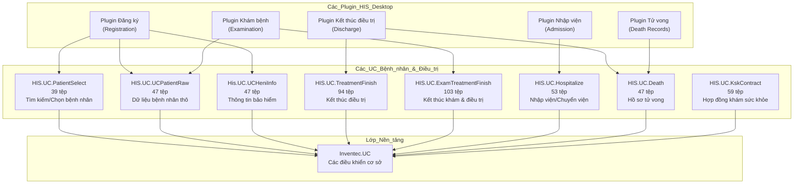
```mermaid
graph TB
    subgraph "Các_Plugin_HIS_Desktop"
        Register["Plugin Đăng ký<br/>(Registration)"]
        Exam["Plugin Khám bệnh<br/>(Examination)"]
        TreatFinish["Plugin Kết thúc điều trị<br/>(Discharge)"]
        Hospitalize_Plugin["Plugin Nhập viện<br/>(Admission)"]
        Death_Plugin["Plugin Tử vong<br/>(Death Records)"]
    end
    
    subgraph "Các_UC_Bệnh_nhân_&_Điều_trị"
        PatientSelect["HIS.UC.PatientSelect<br/>39 tệp<br/>Tìm kiếm/Chọn bệnh nhân"]
        UCPatientRaw["HIS.UC.UCPatientRaw<br/>47 tệp<br/>Dữ liệu bệnh nhân thô"]
        UCHeniInfo["His.UC.UCHeniInfo<br/>47 tệp<br/>Thông tin bảo hiểm"]
        TreatmentFinish["HIS.UC.TreatmentFinish<br/>94 tệp<br/>Kết thúc điều trị"]
        ExamTreatmentFinish["HIS.UC.ExamTreatmentFinish<br/>103 tệp<br/>Kết thúc khám & điều trị"]
        Hospitalize["HIS.UC.Hospitalize<br/>53 tệp<br/>Nhập viện/Chuyển viện"]
        Death["HIS.UC.Death<br/>47 tệp<br/>Hồ sơ tử vong"]
        KskContract["HIS.UC.KskContract<br/>59 tệp<br/>Hợp đồng khám sức khỏe"]
    end
    
    subgraph "Lớp_Nền_tảng"
        InventecUC["Inventec.UC<br/>Các điều khiển cơ sở"]
    end
    
    Register --> PatientSelect
    Register --> UCPatientRaw
    Register --> UCHeniInfo
    
    Exam --> ExamTreatmentFinish
    Exam --> UCPatientRaw
    
    TreatFinish --> TreatmentFinish
    TreatFinish --> Death
    
    Hospitalize_Plugin --> Hospitalize
    
    Death_Plugin --> Death
    
    PatientSelect --> InventecUC
    UCPatientRaw --> InventecUC
    UCHeniInfo --> InventecUC
    TreatmentFinish --> InventecUC
    ExamTreatmentFinish --> InventecUC
    Hospitalize --> InventecUC
    Death --> InventecUC
    KskContract --> InventecUC
```

**Nguồn:** [UC/HIS.UC.PatientSelect](), [UC/HIS.UC.TreatmentFinish](), [UC/HIS.UC.ExamTreatmentFinish](), [UC/HIS.UC.Hospitalize](), [UC/HIS.UC.Death]()

### Mô hình Cấu trúc Thành phần UC

Mỗi UC Bệnh nhân & Điều trị đều tuân theo kiến trúc dựa trên bộ xử lý (processor) nhất quán:

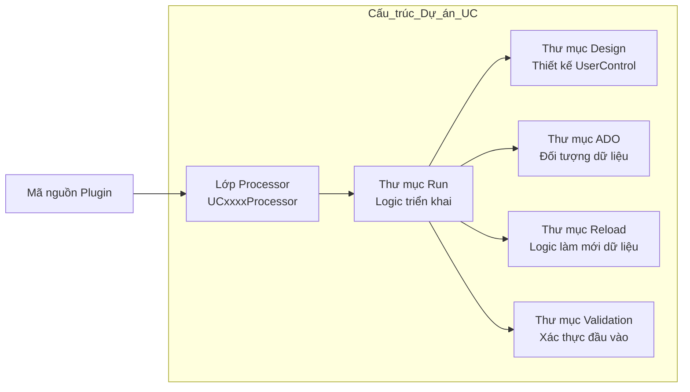
```mermaid
graph LR
    subgraph "Cấu_trúc_Dự_án_UC"
        Processor["Lớp Processor<br/>UCxxxxProcessor"]
        Run["Thư mục Run<br/>Logic triển khai"]
        Design["Thư mục Design<br/>Thiết kế UserControl"]
        ADO["Thư mục ADO<br/>Đối tượng dữ liệu"]
        Reload["Thư mục Reload<br/>Logic làm mới dữ liệu"]
        Validation["Thư mục Validation<br/>Xác thực đầu vào"]
    end
    
    Plugin["Mã nguồn Plugin"] --> Processor
    Processor --> Run
    Run --> Design
    Run --> ADO
    Run --> Reload
    Run --> Validation
```

#### Các Tệp Phổ biến trong Mỗi UC

| Tệp/Thư mục | Mục đích |
|-------------|---------|
| [[UCxxxxProcessor.cs](../../../UCxxxxProcessor.cs)] | Lớp processor chính để khởi tạo và điều khiển UC |
| [[Run/UCxxxx.cs](../../../Run/UCxxxx.cs)] | Triển khai UserControl cốt lõi với logic UI |
| [[Run/UCxxxx.Designer.cs](../../../Run/UCxxxx.Designer.cs)] | Mã thiết kế tự động tạo cho UserControl |
| `ADO/` | Các đối tượng dữ liệu ứng dụng (ADO) đặc thù cho UC này |
| `Reload/` | Các delegate để làm mới và tải lại dữ liệu |
| `Validation/` | Các quy tắc và logic xác thực đầu vào |
| `Set/` | Các phương thức setter để cấu hình hành vi của UC |
| `Get/` | Các phương thức getter để truy xuất trạng thái UC |

**Nguồn:** [UC/HIS.UC.PatientSelect](), [UC/HIS.UC.TreatmentFinish]()

### UC PatientSelect

Thành phần `HIS.UC.PatientSelect` (39 tệp) cung cấp giao diện tìm kiếm và chọn bệnh nhân được sử dụng trong toàn bộ ứng dụng để xác định và chọn bệnh nhân trong các quy trình làm việc khác nhau.

#### Các Thành phần Chính

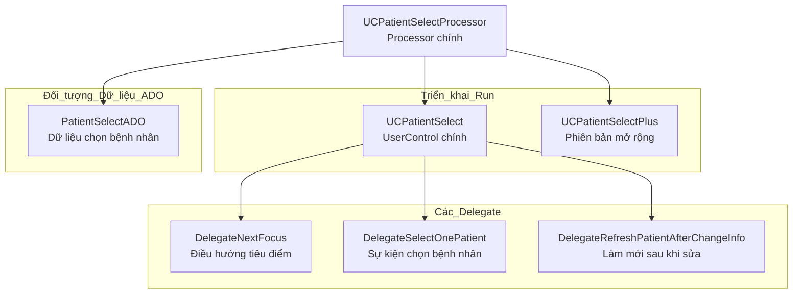
```mermaid
graph TB
    Processor["UCPatientSelectProcessor<br/>Processor chính"]
    
    subgraph "Triển_khai_Run"
        UCPatientSelect["UCPatientSelect<br/>UserControl chính"]
        UCPatientSelectPlus["UCPatientSelectPlus<br/>Phiên bản mở rộng"]
    end
    
    subgraph "Đối_tượng_Dữ_liệu_ADO"
        PatientSelectADO["PatientSelectADO<br/>Dữ liệu chọn bệnh nhân"]
    end
    
    subgraph "Các_Delegate"
        DelegateNextFocus["DelegateNextFocus<br/>Điều hướng tiêu điểm"]
        DelegateSelectOnePatient["DelegateSelectOnePatient<br/>Sự kiện chọn bệnh nhân"]
        DelegateRefreshPatientAfterChangeInfo["DelegateRefreshPatientAfterChangeInfo<br/>Làm mới sau khi sửa"]
    end
    
    Processor --> UCPatientSelect
    Processor --> UCPatientSelectPlus
    Processor --> PatientSelectADO
    
    UCPatientSelect --> DelegateNextFocus
    UCPatientSelect --> DelegateSelectOnePatient
    UCPatientSelect --> DelegateRefreshPatientAfterChangeInfo
```

#### Các Chức năng Cốt lõi

UC PatientSelect cung cấp:

- **Tìm kiếm Bệnh nhân**: Theo mã bệnh nhân, tên, số điện thoại, CMND/CCCD.
- **Chọn nhanh**: Các bệnh nhân được truy cập thường xuyên, bệnh nhân gần đây.
- **Hiển thị Thông tin Bệnh nhân**: Các thông tin nhân khẩu học cơ bản và lịch sử điều trị.
- **Nhập Bệnh nhân mới**: Khả năng đăng ký bệnh nhân trực tiếp.
- **Xác thực**: Định dạng mã bệnh nhân, kiểm tra trùng lặp.

**Nguồn:** [UC/HIS.UC.PatientSelect/UCPatientSelectProcessor.cs](../../../UC/HIS.UC.PatientSelect/UCPatientSelectProcessor.cs), [UC/HIS.UC.PatientSelect/Run/UCPatientSelect.cs](../../../UC/HIS.UC.PatientSelect/Run/UCPatientSelect.cs), [UC/HIS.UC.PatientSelect/ADO/PatientSelectADO.cs](../../../UC/HIS.UC.PatientSelect/ADO/PatientSelectADO.cs)

### UC TreatmentFinish

Thành phần `HIS.UC.TreatmentFinish` (94 tệp) xử lý quy trình kết thúc điều trị, bao gồm kế hoạch xuất viện, tóm tắt điều trị và xác nhận chẩn đoán cuối cùng.

#### Kiến trúc

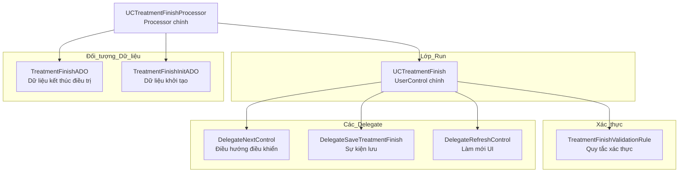
```mermaid
graph TB
    Processor["UCTreatmentFinishProcessor<br/>Processor chính"]
    
    subgraph "Lớp_Run"
        UCTreatmentFinish["UCTreatmentFinish<br/>UserControl chính"]
    end
    
    subgraph "Đối_tượng_Dữ_liệu"
        TreatmentFinishADO["TreatmentFinishADO<br/>Dữ liệu kết thúc điều trị"]
        TreatmentFinishInitADO["TreatmentFinishInitADO<br/>Dữ liệu khởi tạo"]
    end
    
    subgraph "Xác_thực"
        TreatmentFinishValidationRule["TreatmentFinishValidationRule<br/>Quy tắc xác thực"]
    end
    
    subgraph "Các_Delegate"
        DelegateNextControl["DelegateNextControl<br/>Điều hướng điều khiển"]
        DelegateSaveTreatmentFinish["DelegateSaveTreatmentFinish<br/>Sự kiện lưu"]
        DelegateRefreshControl["DelegateRefreshControl<br/>Làm mới UI"]
    end
    
    Processor --> UCTreatmentFinish
    Processor --> TreatmentFinishADO
    Processor --> TreatmentFinishInitADO
    
    UCTreatmentFinish --> TreatmentFinishValidationRule
    UCTreatmentFinish --> DelegateNextControl
    UCTreatmentFinish --> DelegateSaveTreatmentFinish
    UCTreatmentFinish --> DelegateRefreshControl
```

#### Các Tính năng Chính

| Tính năng | Mô tả |
|---------|-------------|
| **Loại Kết thúc Điều trị** | Cấu hình loại xuất viện: ra viện, chuyển viện, tử vong, v.v. |
| **Kết quả Điều trị** | Ghi lại kết quả điều trị: khỏi, đỡ/giảm, không thay đổi, nặng hơn |
| **Hẹn tái khám** | Thiết lập ngày hẹn tái khám và hướng dẫn |
| **Y lệnh Y tế** | Tài liệu hướng dẫn xuất viện và kế hoạch chăm sóc |
| **Tóm tắt Đơn thuốc** | Xem lại các loại thuốc đã kê đơn khi xuất viện |
| **Tóm tắt Điều trị** | Tự động tạo báo cáo tóm tắt điều trị |

#### Các Tùy chọn Cấu hình

UC TreatmentFinish hỗ trợ cấu hình sâu thông qua `TreatmentFinishInitADO`:

- `IsShowAppointment`: Bật/tắt lịch hẹn tái khám.
- `IsShowTreatmentResult`: Hiển thị chọn kết quả điều trị.
- `IsShowTreatmentEndType`: Hiển thị dropdown loại kết thúc điều trị.
- `IsShowEndTimeInDay`: Chỉ hiển thị thời gian kết thúc trong ngày hiện tại.
- `IsShowPrintButton`: Hiển thị nút xem trước khi in.
- `IsAutoCheckEndTime`: Tự động kiểm tra xác thực thời gian kết thúc.

**Nguồn:** [UC/HIS.UC.TreatmentFinish/UCTreatmentFinishProcessor.cs](../../../UC/HIS.UC.TreatmentFinish/UCTreatmentFinishProcessor.cs), [UC/HIS.UC.TreatmentFinish/Run/UCTreatmentFinish.cs](../../../UC/HIS.UC.TreatmentFinish/Run/UCTreatmentFinish.cs), [UC/HIS.UC.TreatmentFinish/ADO/TreatmentFinishADO.cs](../../../UC/HIS.UC.TreatmentFinish/ADO/TreatmentFinishADO.cs), [UC/HIS.UC.TreatmentFinish/ADO/TreatmentFinishInitADO.cs](../../../UC/HIS.UC.TreatmentFinish/ADO/TreatmentFinishInitADO.cs)

### UC ExamTreatmentFinish

Thành phần `HIS.UC.ExamTreatmentFinish` (103 tệp) là giao diện kết thúc điều trị toàn diện nhất, kết hợp kết quả khám bệnh, tóm tắt điều trị và kế hoạch xuất viện trong một quy trình thống nhất.

#### Kiến trúc Thành phần

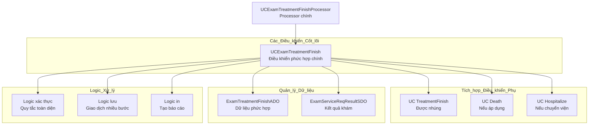
```mermaid
graph TB
    Processor["UCExamTreatmentFinishProcessor<br/>Processor chính"]
    
    subgraph "Các_Điều_khiển_Cốt_lõi"
        UCExamTreatmentFinish["UCExamTreatmentFinish<br/>Điều khiển phức hợp chính"]
    end
    
    subgraph "Tích_hợp_Điều_khiển_Phụ"
        TreatmentFinish["UC TreatmentFinish<br/>Được nhúng"]
        Death["UC Death<br/>Nếu áp dụng"]
        Hospitalize["UC Hospitalize<br/>Nếu chuyển viện"]
    end
    
    subgraph "Quản_lý_Dữ_liệu"
        ExamTreatmentFinishADO["ExamTreatmentFinishADO<br/>Dữ liệu phức hợp"]
        ExamServiceReqResultSDO["ExamServiceReqResultSDO<br/>Kết quả khám"]
    end
    
    subgraph "Logic_Xử_lý"
        Validate["Logic xác thực<br/>Quy tắc toàn diện"]
        Save["Logic lưu<br/>Giao dịch nhiều bước"]
        Print["Logic in<br/>Tạo báo cáo"]
    end
    
    Processor --> UCExamTreatmentFinish
    
    UCExamTreatmentFinish --> TreatmentFinish
    UCExamTreatmentFinish --> Death
    UCExamTreatmentFinish --> Hospitalize
    
    UCExamTreatmentFinish --> ExamTreatmentFinishADO
    UCExamTreatmentFinish --> ExamServiceReqResultSDO
    
    UCExamTreatmentFinish --> Validate
    UCExamTreatmentFinish --> Save
    UCExamTreatmentFinish --> Print
```

#### Tích hợp Quy trình Làm việc

UC ExamTreatmentFinish tích hợp nhiều quy trình phụ:

1. **Nhập Kết quả Khám bệnh**: Các phát hiện lâm sàng, chẩn đoán, kế hoạch điều trị.
2. **Kết thúc Điều trị**: Sử dụng UC `TreatmentFinish` được nhúng.
3. **Các Quy trình có Điều kiện**:
   - Nếu bệnh nhân tử vong: Kích hoạt UC `Death` để làm giấy báo tử.
   - Nếu bệnh nhân chuyển viện: Kích hoạt UC `Hospitalize` để chuyển viện.
   - Nếu bệnh nhân xuất viện: Quy trình xuất viện tiêu chuẩn.
4. **Tạo Tài liệu**: Tự động in các tài liệu y tế liên quan.

#### Các Đối tượng Dữ liệu Chính

| Lớp | Mục đích |
|-------|---------|
| `ExamTreatmentFinishADO` | Dữ liệu hoàn chỉnh về kết quả khám và kết thúc điều trị |
| `ExamServiceReqResultSDO` | Kết quả yêu cầu dịch vụ khám bệnh |
| `HisServiceReqExamResultSDO` | Đối tượng truyền dữ liệu kết quả khám chi tiết |
| `TreatmentFinishSDO` | Đối tượng dữ liệu dịch vụ kết thúc điều trị |

**Nguồn:** [UC/HIS.UC.ExamTreatmentFinish/UCExamTreatmentFinishProcessor.cs](../../../UC/HIS.UC.ExamTreatmentFinish/UCExamTreatmentFinishProcessor.cs), [UC/HIS.UC.ExamTreatmentFinish/Run/UCExamTreatmentFinish.cs](../../../UC/HIS.UC.ExamTreatmentFinish/Run/UCExamTreatmentFinish.cs), [UC/HIS.UC.ExamTreatmentFinish/ADO/]()

### UC Hospitalize

Thành phần `HIS.UC.Hospitalize` (53 tệp) quản lý quy trình nhập viện và chuyển bệnh nhân giữa các khoa hoặc các cơ sở y tế.

#### Các Thành phần Chức năng

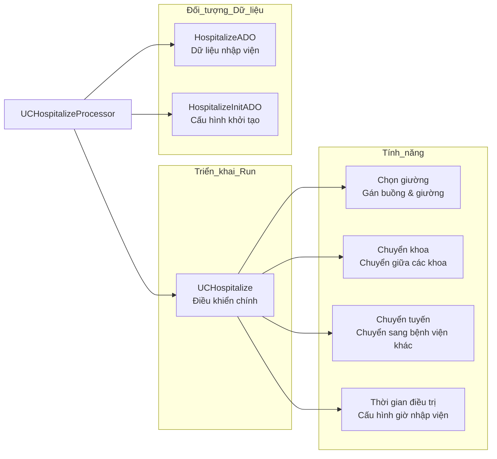
```mermaid
graph LR
    Processor["UCHospitalizeProcessor"]
    
    subgraph "Triển_khai_Run"
        UCHospitalize["UCHospitalize<br/>Điều khiển chính"]
    end
    
    subgraph "Đối_tượng_Dữ_liệu"
        HospitalizeADO["HospitalizeADO<br/>Dữ liệu nhập viện"]
        HospitalizeInitADO["HospitalizeInitADO<br/>Cấu hình khởi tạo"]
    end
    
    subgraph "Tính_năng"
        BedSelection["Chọn giường<br/>Gán buồng & giường"]
        DepartmentTransfer["Chuyển khoa<br/>Chuyển giữa các khoa"]
        ExternalTransfer["Chuyển tuyến<br/>Chuyển sang bệnh viện khác"]
        TreatmentTimeConfig["Thời gian điều trị<br/>Cấu hình giờ nhập viện"]
    end
    
    Processor --> UCHospitalize
    Processor --> HospitalizeADO
    Processor --> HospitalizeInitADO
    
    UCHospitalize --> BedSelection
    UCHospitalize --> DepartmentTransfer
    UCHospitalize --> ExternalTransfer
    UCHospitalize --> TreatmentTimeConfig
```

#### Các Loại Nhập viện

UC Hospitalize xử lý nhiều tình huống nhập viện:

| Loại | Mô tả | Dữ liệu yêu cầu |
|------|-------------|---------------|
| **Nhập viện mới** | Bệnh nhân nhập viện | Khoa, buồng, giường, lý do nhập viện |
| **Chuyển khoa** | Chuyển giữa các khoa | Khoa nguồn, khoa đích, gán giường |
| **Chuyển tuyến** | Chuyển sang cơ sở bên ngoài | Bệnh viện chuyển đến, lý do, tóm tắt bệnh án |
| **Nhập viện Cấp cứu** | Nhập viện nhanh | Khoa cấp cứu, gán giường ưu tiên |

#### Các Tùy chọn Cấu hình

- `IsShowBedRoom`: Hiển thị chọn giường và buồng.
- `IsShowDepartment`: Hiển thị chọn khoa.
- `IsShowTreatmentType`: Hiển thị loại điều trị (nội trú/ngoại trú).
- `IsAutoSelectBed`: Tự động chọn giường còn trống.
- `IsRequireBed`: Bắt buộc phải chọn giường.
- `IsShowTime`: Hiển thị cấu hình thời gian nhập viện.

**Nguồn:** [UC/HIS.UC.Hospitalize/UCHospitalizeProcessor.cs](../../../UC/HIS.UC.Hospitalize/UCHospitalizeProcessor.cs), [UC/HIS.UC.Hospitalize/Run/UCHospitalize.cs](../../../UC/HIS.UC.Hospitalize/Run/UCHospitalize.cs), [UC/HIS.UC.Hospitalize/ADO/HospitalizeADO.cs](../../../UC/HIS.UC.Hospitalize/ADO/HospitalizeADO.cs)

### UC Death

Thành phần `HIS.UC.Death` (47 tệp) xử lý việc lập hồ sơ bệnh nhân tử vong và tài liệu giấy báo tử, đảm bảo các thủ tục y tế và pháp lý đúng quy định.

#### Cấu trúc Thành phần

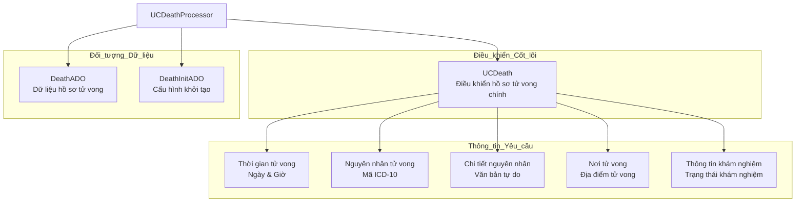
```mermaid
graph TB
    Processor["UCDeathProcessor"]
    
    subgraph "Điều_khiển_Cốt_lõi"
        UCDeath["UCDeath<br/>Điều khiển hồ sơ tử vong chính"]
    end
    
    subgraph "Đối_tượng_Dữ_liệu"
        DeathADO["DeathADO<br/>Dữ liệu hồ sơ tử vong"]
        DeathInitADO["DeathInitADO<br/>Cấu hình khởi tạo"]
    end
    
    subgraph "Thông_tin_Yêu_cầu"
        DeathTime["Thời gian tử vong<br/>Ngày & Giờ"]
        DeathCause["Nguyên nhân tử vong<br/>Mã ICD-10"]
        DeathCauseDetail["Chi tiết nguyên nhân<br/>Văn bản tự do"]
        DeathPlace["Nơi tử vong<br/>Địa điểm tử vong"]
        Autopsy["Thông tin khám nghiệm<br/>Trạng thái khám nghiệm"]
    end
    
    Processor --> UCDeath
    Processor --> DeathADO
    Processor --> DeathInitADO
    
    UCDeath --> DeathTime
    UCDeath --> DeathCause
    UCDeath --> DeathCauseDetail
    UCDeath --> DeathPlace
    UCDeath --> Autopsy
```

#### Các Trường trong Hồ sơ Tử vong

| Trường | Kiểu | Bắt buộc | Mô tả |
|-------|------|----------|-------------|
| `DeathTime` | DateTime | Có | Ngày và giờ tử vong chính xác |
| `DeathCauseId` | ICD-10 | Có | Nguyên nhân tử vong chính (mã ICD) |
| `DeathCause` | String | Không | Mô tả chi tiết nguyên nhân |
| `DeathWithin` | Enum | Không | Tử vong trong vòng 24h/48h sau nhập viện |
| `Surgery` | Boolean | Không | Tử vong liên quan đến phẫu thuật |
| `DeathMainCause` | String | Không | Nguyên nhân sâu xa chính |
| `DeathDocumentTypeId` | Long | Không | Loại giấy báo tử |
| `DeathPlace` | String | Không | Nơi xảy ra tử vong |
| `AutopsyRequest` | Boolean | Không | Có yêu cầu khám nghiệm tử thi hay không |

#### Tích hợp với TreatmentFinish

Khi bệnh nhân tử vong, UC Death thường được nhúng trong quy trình làm việc của `TreatmentFinish` hoặc `ExamTreatmentFinish`. Hồ sơ tử vong sẽ tự động thiết lập loại kết thúc điều trị thành "Tử vong" và tạo ra các tài liệu phù hợp.

**Nguồn:** [UC/HIS.UC.Death/UCDeathProcessor.cs](../../../UC/HIS.UC.Death/UCDeathProcessor.cs), [UC/HIS.UC.Death/Run/UCDeath.cs](../../../UC/HIS.UC.Death/Run/UCDeath.cs), [UC/HIS.UC.Death/ADO/DeathADO.cs](../../../UC/HIS.UC.Death/ADO/DeathADO.cs)

### UC UCPatientRaw

Thành phần `HIS.UC.UCPatientRaw` (47 tệp) cung cấp giao diện hiển thị và chỉnh sửa dữ liệu bệnh nhân toàn diện, hiển thị các thông tin nhân khẩu học và lâm sàng thô của bệnh nhân.

#### Các Phần Hiển thị

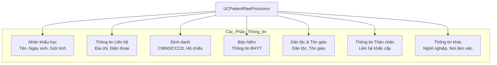
```mermaid
graph TB
    Processor["UCPatientRawProcessor"]
    
    subgraph "Các_Phần_Thông_tin"
        Demographics["Nhân khẩu học<br/>Tên, Ngày sinh, Giới tính"]
        Contact["Thông tin Liên hệ<br/>Địa chỉ, Điện thoại"]
        Identity["Định danh<br/>CMND/CCCD, Hộ chiếu"]
        Insurance["Bảo hiểm<br/>Thông tin BHYT"]
        Ethnic["Dân tộc & Tôn giáo<br/>Dân tộc, Tôn giáo"]
        Relative["Thông tin Thân nhân<br/>Liên hệ khẩn cấp"]
        Other["Thông tin khác<br/>Nghề nghiệp, Nơi làm việc"]
    end
    
    Processor --> Demographics
    Processor --> Contact
    Processor --> Identity
    Processor --> Insurance
    Processor --> Ethnic
    Processor --> Relative
    Processor --> Other
```

#### Các Tính năng Chính

- **Chế độ Chỉ đọc**: Hiển thị thông tin bệnh nhân mà không cho phép chỉnh sửa.
- **Chế độ Chỉnh sửa**: Cho phép chỉnh sửa trực tiếp các trường dữ liệu bệnh nhân.
- **Xác thực Trường bắt buộc**: Áp dụng các trường bắt buộc dựa trên cấu hình.
- **Xác thực Định dạng**: Xác thực số điện thoại, CMND/CCCD, v.v.
- **Theo dõi Lịch sử**: Hiển thị địa chỉ và thông tin liên hệ trước đó.
- **Đồng bộ Dữ liệu**: Tự động đồng bộ hóa với dữ liệu danh mục bệnh nhân ở backend.

**Nguồn:** [UC/HIS.UC.UCPatientRaw/UCPatientRawProcessor.cs](../../../UC/HIS.UC.UCPatientRaw/UCPatientRawProcessor.cs), [UC/HIS.UC.UCPatientRaw/Run/UCPatientRaw.cs](../../../UC/HIS.UC.UCPatientRaw/Run/UCPatientRaw.cs)

### UC UCHeniInfo

Thành phần `His.UC.UCHeniInfo` (47 tệp) hiển thị thông tin Bảo hiểm Y tế (BHYT) Việt Nam và xác thực tính hợp lệ của bảo hiểm.

#### Hiển thị Thông tin Bảo hiểm

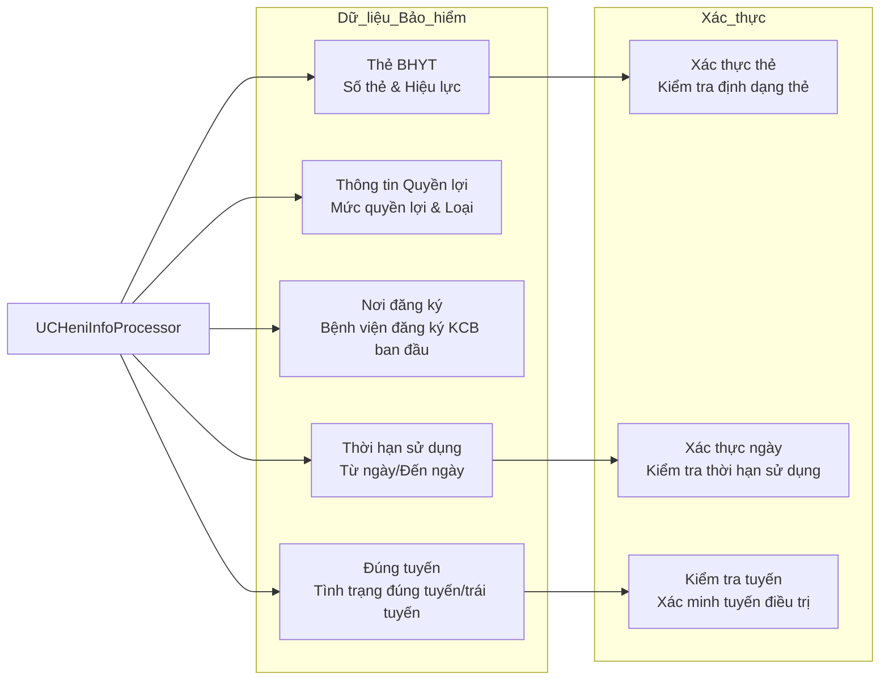
```mermaid
graph LR
    Processor["UCHeniInfoProcessor"]
    
    subgraph "Dữ_liệu_Bảo_hiểm"
        HeinCard["Thẻ BHYT<br/>Số thẻ & Hiệu lực"]
        Coverage["Thông tin Quyền lợi<br/>Mức quyền lợi & Loại"]
        RegisterPlace["Nơi đăng ký<br/>Bệnh viện đăng ký KCB ban đầu"]
        ValidPeriod["Thời hạn sử dụng<br/>Từ ngày/Đến ngày"]
        RightRoute["Đúng tuyến<br/>Tình trạng đúng tuyến/trái tuyến"]
    end
    
    subgraph "Xác_thực"
        CardValidation["Xác thực thẻ<br/>Kiểm tra định dạng thẻ"]
        DateValidation["Xác thực ngày<br/>Kiểm tra thời hạn sử dụng"]
        RouteCheck["Kiểm tra tuyến<br/>Xác minh tuyến điều trị"]
    end
    
    Processor --> HeinCard
    Processor --> Coverage
    Processor --> RegisterPlace
    Processor --> ValidPeriod
    Processor --> RightRoute
    
    HeinCard --> CardValidation
    ValidPeriod --> DateValidation
    RightRoute --> RouteCheck
```

#### Các Quy tắc Xác thực BHYT

Thành phần UCHeniInfo thực hiện xác thực theo thời gian thực:

- **Định dạng thẻ**: Xác thực định dạng số thẻ BHYT (theo cấu trúc 15 ký tự).
- **Thời hạn sử dụng**: Kiểm tra xem ngày điều trị có nằm trong thời hạn hiệu lực của bảo hiểm hay không.
- **Đúng tuyến**: Xác minh bệnh nhân có đang đi đúng tuyến điều trị hay không.
- **Mức hưởng**: Xác định tỷ lệ đồng chi trả dựa trên mức quyền lợi.
- **Bệnh viện Đăng ký**: Kiểm tra xem bệnh nhân có đang ở đúng bệnh viện đã đăng ký KCB ban đầu hay không.

#### Tích hợp với Đăng ký

UC này được nhúng trong quy trình đăng ký bệnh nhân để:
1. Ghi nhận thông tin bảo hiểm trong quá trình tiếp đón.
2. Xác thực tính hợp lệ của bảo hiểm trước khi thực hiện dịch vụ.
3. Tính toán số tiền bệnh nhân phải đồng chi trả.
4. Tạo tài liệu đề nghị thanh toán bảo hiểm.

**Nguồn:** [UC/His.UC.UCHeniInfo/UCHeniInfoProcessor.cs](../../../UC/His.UC.UCHeniInfo/UCHeniInfoProcessor.cs), [UC/His.UC.UCHeniInfo/Run/UCHeniInfo.cs](../../../UC/His.UC.UCHeniInfo/Run/UCHeniInfo.cs)

### UC KskContract

Thành phần `HIS.UC.KskContract` (59 tệp) quản lý các hợp đồng Khám sức khỏe (KSK), thường dành cho các chương trình khám sức khỏe định kỳ của doanh nghiệp.

#### Quản lý Hợp đồng

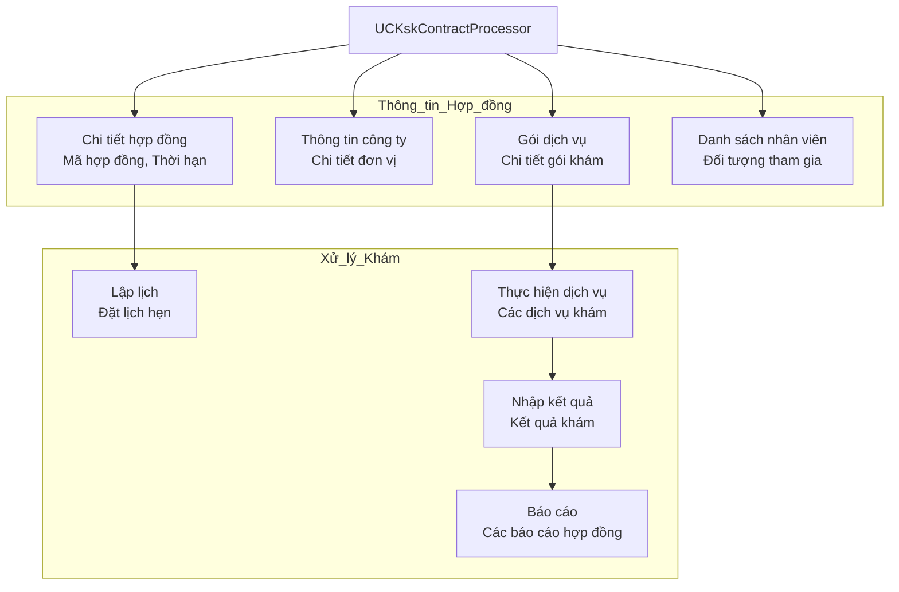
```mermaid
graph TB
    Processor["UCKskContractProcessor"]
    
    subgraph "Thông_tin_Hợp_đồng"
        ContractDetails["Chi tiết hợp đồng<br/>Mã hợp đồng, Thời hạn"]
        CompanyInfo["Thông tin công ty<br/>Chi tiết đơn vị"]
        ServicePackage["Gói dịch vụ<br/>Chi tiết gói khám"]
        EmployeeList["Danh sách nhân viên<br/>Đối tượng tham gia"]
    end
    
    subgraph "Xử_lý_Khám"
        Scheduling["Lập lịch<br/>Đặt lịch hẹn"]
        ServiceExecution["Thực hiện dịch vụ<br/>Các dịch vụ khám"]
        ResultEntry["Nhập kết quả<br/>Kết quả khám"]
        Reporting["Báo cáo<br/>Các báo cáo hợp đồng"]
    end
    
    Processor --> ContractDetails
    Processor --> CompanyInfo
    Processor --> ServicePackage
    Processor --> EmployeeList
    
    ContractDetails --> Scheduling
    ServicePackage --> ServiceExecution
    ServiceExecution --> ResultEntry
    ResultEntry --> Reporting
```

#### Quy trình Hợp đồng

| Bước | Mô tả | Chức năng UC |
|------|-------------|-------------|
| 1. Thiết lập Hợp đồng | Tạo hợp đồng với công ty và gói dịch vụ | Giao diện tạo hợp đồng |
| 2. Đăng ký Nhân viên | Đăng ký danh sách nhân viên theo hợp đồng | Quản lý danh sách nhân viên |
| 3. Đặt lịch hẹn | Lập lịch các ca khám sức khỏe | Tích hợp với hệ thống đặt lịch |
| 4. Thực hiện Khám | Thực hiện các dịch vụ khám theo hợp đồng | Theo dõi thực hiện dịch vụ |
| 5. Quản lý Kết quả | Nhập và xem lại kết quả khám | Giao diện nhập kết quả |
| 6. Tạo Báo cáo | Tạo các báo cáo cá nhân và tổng hợp | Tổng hợp báo cáo |

#### Các Tính năng Chính

- **Đăng ký Hàng loạt**: Đăng ký nhiều nhân viên cùng lúc.
- **Quản lý Gói**: Định nghĩa các gói khám sức khỏe với các nhóm dịch vụ đi kèm.
- **Theo dõi Tiến độ**: Giám sát trạng thái hoàn thành việc khám.
- **Tổng hợp Kết quả**: Biên tập kết quả cho tất cả các đối tượng tham gia hợp đồng.
- **Tạo Hóa đơn**: Tạo hóa đơn dựa trên các điều khoản hợp đồng.

**Nguồn:** [UC/HIS.UC.KskContract/UCKskContractProcessor.cs](../../../UC/HIS.UC.KskContract/UCKskContractProcessor.cs), [UC/HIS.UC.KskContract/Run/UCKskContract.cs](../../../UC/HIS.UC.KskContract/Run/UCKskContract.cs)

### Các Mô hình Sử dụng trong Plugin

Các UC Bệnh nhân & Điều trị được các plugin sử dụng thông qua mô hình processor:

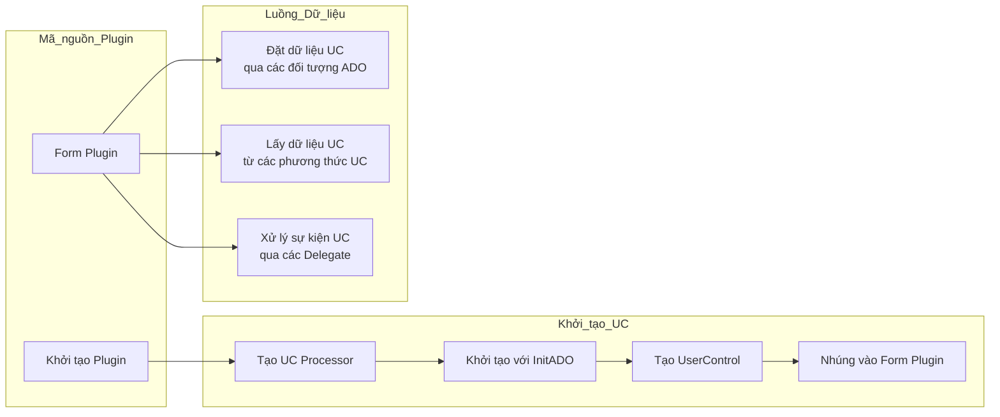
```mermaid
graph LR
    subgraph "Mã_nguồn_Plugin"
        PluginInit["Khởi tạo Plugin"]
        PluginUI["Form Plugin"]
    end
    
    subgraph "Khởi_tạo_UC"
        CreateProcessor["Tạo UC Processor"]
        InitData["Khởi tạo với InitADO"]
        GenerateControl["Tạo UserControl"]
        EmbedControl["Nhúng vào Form Plugin"]
    end
    
    subgraph "Luồng_Dữ_liệu"
        SetData["Đặt dữ liệu UC<br/>qua các đối tượng ADO"]
        GetData["Lấy dữ liệu UC<br/>từ các phương thức UC"]
        HandleEvents["Xử lý sự kiện UC<br/>qua các Delegate"]
    end
    
    PluginInit --> CreateProcessor
    CreateProcessor --> InitData
    InitData --> GenerateControl
    GenerateControl --> EmbedControl
    
    PluginUI --> SetData
    PluginUI --> GetData
    PluginUI --> HandleEvents
```

#### Ví dụ Sử dụng Điển hình

Một plugin sử dụng UC `TreatmentFinish` tuân theo mô hình này:

1. **Khởi tạo**: Tạo instance `UCTreatmentFinishProcessor`.
2. **Cấu hình**: Thiết lập `TreatmentFinishInitADO` với các tùy chọn yêu cầu.
3. **Tạo lập**: Gọi `processor.Run(initADO)` để tạo UserControl.
4. **Nhúng**: Thêm UserControl trả về vào form của plugin.
5. **Liên kết dữ liệu**: Tải dữ liệu điều trị vào UC bằng các phương thức setter.
6. **Xử lý sự kiện**: Đăng ký các sự kiện UC thông qua các delegate.
7. **Truy xuất dữ liệu**: Lấy dữ liệu cuối cùng từ UC khi người dùng hoàn tất quy trình.

**Nguồn:** [HIS/Plugins/HIS.Desktop.Plugins.TreatmentFinish](), [HIS/Plugins/HIS.Desktop.Plugins.Hospitalize]()

### Các Điểm Tích hợp Phổ biến

Tất cả các UC Bệnh nhân & Điều trị đều chia sẻ các mô hình tích hợp chung:

| Điểm Tích hợp | Mục đích | Triển khai |
|-------------------|---------|----------------|
| **HIS.Desktop.ADO** | Đối tượng truyền dữ liệu | Các UC định nghĩa các lớp ADO được các plugin sử dụng |
| **HIS.Desktop.LocalStorage.BackendData** | Đệm dữ liệu backend | Các UC truy cập dữ liệu bệnh nhân, điều trị và danh mục đã đệm |
| **HIS.Desktop.ApiConsumer** | Lời gọi API | Các UC thực hiện các lời gọi API cho các thao tác CRUD |
| **Các Quy tắc Xác thực** | Xác thực đầu vào | Các UC triển khai các lớp `ValidationRule` cho việc xác thực DevExpress |
| **Các Delegate** | Callback sự kiện | Các UC để lộ các delegate để thông báo cho plugin |
| **Tài nguyên (Resources)** | Bản địa hóa | Các UC sử dụng các tệp tài nguyên để hỗ trợ đa ngôn ngữ |

### Các Mô hình Giao tiếp của UC

Các UC Bệnh nhân & Điều trị phối hợp thông qua một số cơ chế:

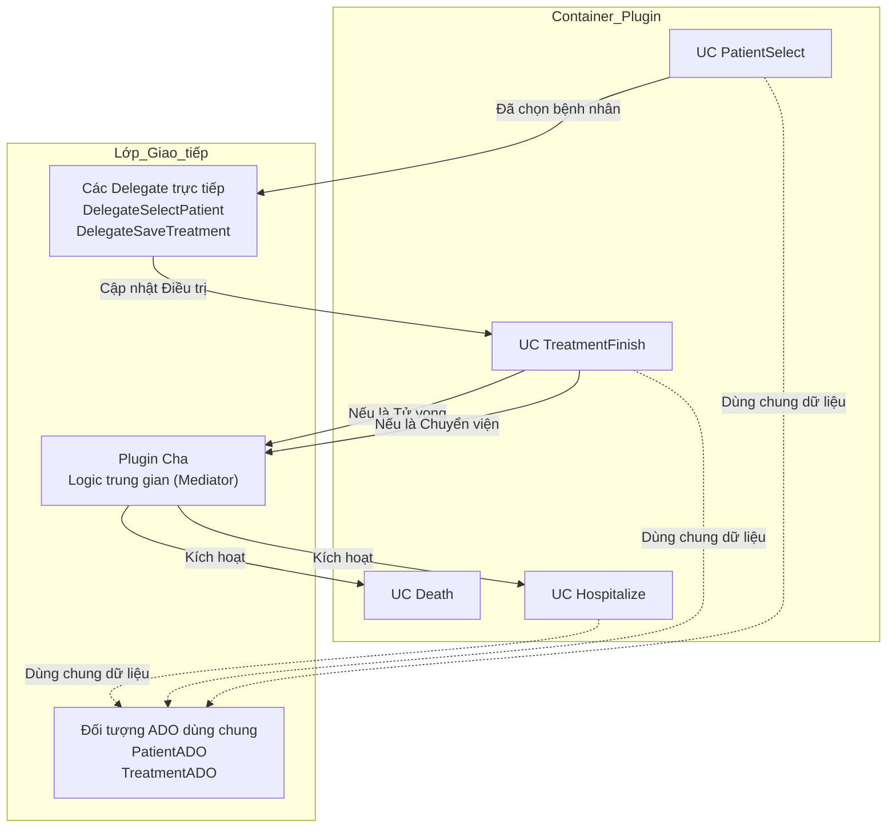
```mermaid
graph TB
    subgraph "Container_Plugin"
        PatientSelectUC["UC PatientSelect"]
        TreatmentFinishUC["UC TreatmentFinish"]
        HospitalizeUC["UC Hospitalize"]
        DeathUC["UC Death"]
    end
    
    subgraph "Lớp_Giao_tiếp"
        DirectDelegate["Các Delegate trực tiếp<br/>DelegateSelectPatient<br/>DelegateSaveTreatment"]
        SharedData["Đối tượng ADO dùng chung<br/>PatientADO<br/>TreatmentADO"]
        ParentPlugin["Plugin Cha<br/>Logic trung gian (Mediator)"]
    end
    
    PatientSelectUC -->|"Đã chọn bệnh nhân"| DirectDelegate
    DirectDelegate -->|"Cập nhật Điều trị"| TreatmentFinishUC
    
    TreatmentFinishUC -->|"Nếu là Tử vong"| ParentPlugin
    ParentPlugin -->|"Kích hoạt"| DeathUC
    
    TreatmentFinishUC -->|"Nếu là Chuyển viện"| ParentPlugin
    ParentPlugin -->|"Kích hoạt"| HospitalizeUC
    
    PatientSelectUC -.->|"Dùng chung dữ liệu"| SharedData
    TreatmentFinishUC -.->|"Dùng chung dữ liệu"| SharedData
    HospitalizeUC -.->|"Dùng chung dữ liệu"| SharedData
```

#### Mô hình Delegate

Mỗi UC để lộ các delegate có kiểu (typed delegates) để giao tiếp giữa các thành phần:

- `DelegateSelectOnePatient`: Kích hoạt khi một bệnh nhân được chọn.
- `DelegateSaveTreatmentFinish`: Kích hoạt khi kết thúc điều trị được lưu.
- `DelegateRefreshControl`: Kích hoạt khi UC cần làm mới.
- `DelegateNextControl`: Kích hoạt khi tiêu điểm cần chuyển sang điều khiển tiếp theo.

**Nguồn:** [UC/HIS.UC.PatientSelect/Delegate/](), [UC/HIS.UC.TreatmentFinish/Delegate/](), [UC/HIS.UC.ExamTreatmentFinish/Delegate/]()

### Kiến trúc Xác thực Dữ liệu

Các UC Bệnh nhân & Điều trị triển khai việc xác thực toàn diện bằng khung công việc xác thực của DevExpress:

| UC | Các quy tắc xác thực chính | Tham chiếu tệp |
|----|---------------------|-----------------|
| `PatientSelect` | Định dạng mã bệnh nhân, bắt buộc tên | [UC/HIS.UC.PatientSelect/Validation/]() |
| `TreatmentFinish` | Thời gian kết thúc >= thời gian bắt đầu, bắt buộc loại kết thúc | [UC/HIS.UC.TreatmentFinish/Validation/]() |
| `Death` | Thời gian tử vong <= thời gian hiện tại, bắt buộc nguyên nhân | [UC/HIS.UC.Death/Validation/]() |
| `Hospitalize` | Bắt buộc buồng/giường, khoa hợp lệ | [UC/HIS.UC.Hospitalize/Validation/]() |

Các quy tắc xác thực được áp dụng ở nhiều cấp độ:
- **Cấp độ trường**: Xác thực từng điều khiển khi người dùng nhập liệu.
- **Cấp độ biểu mẫu**: Xác thực liên trường trước khi gửi dữ liệu.
- **Cấp độ nghiệp vụ**: Xác thực phía server thông qua các lời gọi API.

**Nguồn:** [UC/HIS.UC.TreatmentFinish/Validation/TreatmentFinishValidationRule.cs](../../../UC/HIS.UC.TreatmentFinish/Validation/TreatmentFinishValidationRule.cs), [UC/HIS.UC.Death/Validation/]()

### Tóm tắt

Bộ sưu tập UC Bệnh nhân & Điều trị cung cấp một nền tảng toàn diện và có thể tái sử dụng cho việc quản lý bệnh nhân và các quy trình điều trị trong toàn bộ ứng dụng HIS. 8 thành phần chính này (tổng cộng 530 tệp) gói gọn các quy trình y tế phức tạp trong khi vẫn duy trì sự nhất quán trên hơn 956 plugin. Kiến trúc dựa trên bộ xử lý (processor) cho phép việc nhúng linh hoạt, trong khi mô hình delegate đảm bảo sự lỏng lẻo trong kết nối (loose coupling) giữa các thành phần. Tất cả các UC đều tuân theo các mô hình chuẩn hóa cho việc khởi tạo, liên kết dữ liệu, xác thực và xử lý sự kiện, giúp chúng dễ dự đoán và dễ bảo trì.

**Nguồn:** [UC/HIS.UC.PatientSelect](), [UC/HIS.UC.TreatmentFinish](), [UC/HIS.UC.ExamTreatmentFinish](), [UC/HIS.UC.Hospitalize](), [UC/HIS.UC.Death](), [UC/HIS.UC.UCPatientRaw](), [UC/His.UC.UCHeniInfo](), [UC/HIS.UC.KskContract]()


## Các UC Thuốc & ICD

### Mục đích và Phạm vi

Tài liệu này đề cập đến các thành phần Điều khiển người dùng trong mô-đun `UC/` xử lý chức năng thuốc, vật tư và mã hóa chẩn đoán y tế (ICD). Các UC này cung cấp các thành phần UI có thể tái sử dụng để chọn, hiển thị và quản lý các loại dược phẩm và phân loại bệnh tật trong toàn bộ ứng dụng HIS.

Các UC chính được ghi chép ở đây bao gồm:
- **HIS.UC.MedicineType** (82 tệp) - Điều khiển chọn và quản lý thuốc
- **HIS.UC.MaterialType** (85 tệp) - Điều khiển vật tư/thiết bị y tế
- **HIS.UC.Icd** (65 tệp) - Chọn chẩn đoán chính (ICD-10)
- **HIS.UC.SecondaryIcd** (61 tệp) - Chọn chẩn đoán phụ/bệnh kèm theo
- **Các UC hỗ trợ**: DHST (dấu hiệu sinh tồn), DateEditor, TreeSereServ7V2 (cây dịch vụ)

Để biết thông tin chung về kiến trúc và các mô hình UC, hãy xem [Thư viện Thành phần UC](../../03-technical-specs/uc-controls/form-type-controls.md). Đối với các UC tập trung vào bệnh nhân và điều trị, hãy xem [Các UC Bệnh nhân & Điều trị](#1.3.2). Đối với các điều khiển liên quan đến dịch vụ và buồng phòng, hãy xem [Các UC Dịch vụ & Buồng phòng](#1.3.4).

### Tổng quan Kiến trúc

Các UC Thuốc & ICD tạo thành một tập hợp các điều khiển gắn kết được sử dụng rộng rãi trong các plugin kê đơn, plugin khám bệnh và quy trình quản lý điều trị. Các thành phần này cung cấp các giao diện tiêu chuẩn cho việc nhập dữ liệu dược phẩm và chẩn đoán trên 956 plugin trong hệ thống HIS.

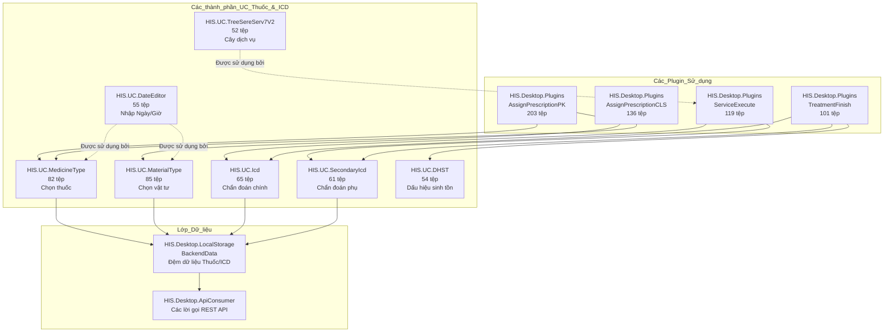
```mermaid
graph TB
    subgraph "Các_thành_phần_UC_Thuốc_&_ICD"
        MedicineType["HIS.UC.MedicineType<br/>82 tệp<br/>Chọn thuốc"]
        MaterialType["HIS.UC.MaterialType<br/>85 tệp<br/>Chọn vật tư"]
        Icd["HIS.UC.Icd<br/>65 tệp<br/>Chẩn đoán chính"]
        SecondaryIcd["HIS.UC.SecondaryIcd<br/>61 tệp<br/>Chẩn đoán phụ"]
        DHST["HIS.UC.DHST<br/>54 tệp<br/>Dấu hiệu sinh tồn"]
        DateEditor["HIS.UC.DateEditor<br/>55 tệp<br/>Nhập Ngày/Giờ"]
        TreeSereServ["HIS.UC.TreeSereServ7V2<br/>52 tệp<br/>Cây dịch vụ"]
    end
    
    subgraph "Các_Plugin_Sử_dụng"
        AssignPrescription["HIS.Desktop.Plugins<br/>AssignPrescriptionPK<br/>203 tệp"]
        AssignPrescriptionCLS["HIS.Desktop.Plugins<br/>AssignPrescriptionCLS<br/>136 tệp"]
        ServiceExecute["HIS.Desktop.Plugins<br/>ServiceExecute<br/>119 tệp"]
        TreatmentFinish["HIS.Desktop.Plugins<br/>TreatmentFinish<br/>101 tệp"]
    end
    
    subgraph "Lớp_Dữ_liệu"
        BackendData["HIS.Desktop.LocalStorage<br/>BackendData<br/>Đệm dữ liệu Thuốc/ICD"]
        ApiConsumer["HIS.Desktop.ApiConsumer<br/>Các lời gọi REST API"]
    end
    
    AssignPrescription --> MedicineType
    AssignPrescription --> MaterialType
    AssignPrescriptionCLS --> MedicineType
    ServiceExecute --> Icd
    ServiceExecute --> SecondaryIcd
    TreatmentFinish --> Icd
    TreatmentFinish --> SecondaryIcd
    TreatmentFinish --> DHST
    
    MedicineType --> BackendData
    MaterialType --> BackendData
    Icd --> BackendData
    SecondaryIcd --> BackendData
    
    BackendData --> ApiConsumer
    
    DateEditor -.->|"Được sử dụng bởi"| MedicineType
    DateEditor -.->|"Được sử dụng bởi"| MaterialType
    TreeSereServ -.->|"Được sử dụng bởi"| ServiceExecute
```

**Nguồn:** [`.devin/wiki.json:225-232`](../../../../.devin/wiki.json#L225-L232), [`.devin/wiki.json:70-77`](../../../../.devin/wiki.json#L70-L77), [`.devin/wiki.json:200-208`](../../../../.devin/wiki.json#L200-L208)

### Thành phần HIS.UC.MedicineType

Thành phần `HIS.UC.MedicineType` (82 tệp) cung cấp một giao diện toàn diện để chọn và quản lý thuốc trong hệ thống. UC này là một trong những thành phần được sử dụng thường xuyên nhất trong các plugin liên quan đến kê đơn.

#### Chức năng Cốt lõi

| Chức năng | Mô tả |
|--------------|-------------|
| Tìm kiếm Thuốc | Tìm kiếm tự động hoàn thành theo tên thuốc, hoạt chất hoặc mã thuốc |
| Hiển thị Tồn kho | Hiển thị mức tồn kho theo thời gian thực từ bộ đệm `BackendData` |
| Chọn Lô | Hỗ trợ chọn các lô thuốc cụ thể với ngày hết hạn |
| Nhập Liều dùng | Tích hợp nhập liều dùng, tần suất và hướng dẫn sử dụng |
| Tính Giá | Tự động tính giá dựa trên số lượng và đơn giá |
| Hỗ trợ Bảo hiểm | Đánh dấu và xác thực thuốc BHYT (bảo hiểm y tế) |

#### Cấu trúc Thành phần

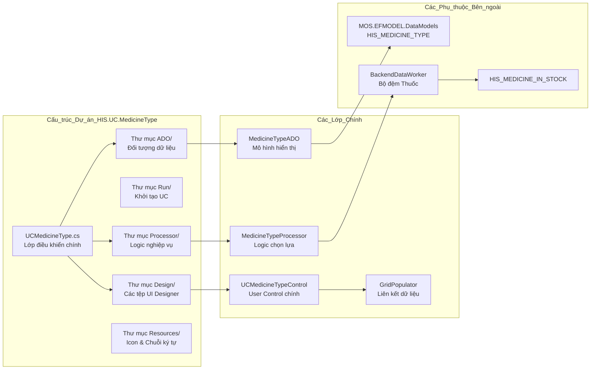
```mermaid
graph LR
    subgraph "Cấu_trúc_Dự_án_HIS.UC.MedicineType"
        UCMedicine["UCMedicineType.cs<br/>Lớp điều khiển chính"]
        Processor["Thư mục Processor/<br/>Logic nghiệp vụ"]
        Run["Thư mục Run/<br/>Khởi tạo UC"]
        ADO["Thư mục ADO/<br/>Đối tượng dữ liệu"]
        Design["Thư mục Design/<br/>Các tệp UI Designer"]
        Resources["Thư mục Resources/<br/>Icon & Chuỗi ký tự"]
    end
    
    subgraph "Các_Lớp_Chính"
        UCMedicineControl["UCMedicineTypeControl<br/>User Control chính"]
        MedicineTypeADO["MedicineTypeADO<br/>Mô hình hiển thị"]
        MedicineProcessor["MedicineTypeProcessor<br/>Logic chọn lựa"]
        GridPopulator["GridPopulator<br/>Liên kết dữ liệu"]
    end
    
    subgraph "Các_Phụ_thuộc_Bên_ngoài"
        HisMedicineType["MOS.EFMODEL.DataModels<br/>HIS_MEDICINE_TYPE"]
        MedicineInStock["HIS_MEDICINE_IN_STOCK"]
        BackendMedicine["BackendDataWorker<br/>Bộ đệm Thuốc"]
    end
    
    UCMedicine --> Processor
    UCMedicine --> ADO
    UCMedicine --> Design
    Processor --> MedicineProcessor
    ADO --> MedicineTypeADO
    Design --> UCMedicineControl
    
    UCMedicineControl --> GridPopulator
    MedicineTypeADO --> HisMedicineType
    MedicineProcessor --> BackendMedicine
    BackendMedicine --> MedicineInStock
```

#### Mô hình Tích hợp

UC `MedicineType` tuân theo một mô hình tích hợp chuẩn hóa được sử dụng trong toàn bộ thư viện UC:

1. **Khởi tạo**: Các plugin gọi `UCMedicineTypeProcessor.Run()` với các tham số cấu hình.
2. **Liên kết Dữ liệu**: UC truy xuất dữ liệu thuốc từ `HIS.Desktop.LocalStorage.BackendData.BackendDataWorker`.
3. **Tương tác Người dùng**: Người dùng tìm kiếm/chọn thuốc thông qua lưới tự động hoàn thành.
4. **Callback Sự kiện**: Dữ liệu thuốc đã chọn được trả về thông qua delegate callback.
5. **Xác thực**: UC thực hiện kiểm tra khả năng cung ứng kho và tính hợp lệ của bảo hiểm.

**Nguồn:** [`.devin/wiki.json:225-232`](../../../../.devin/wiki.json#L225-L232), [`.devin/wiki.json:200-208`](../../../../.devin/wiki.json#L200-L208)

### Thành phần HIS.UC.MaterialType

Thành phần `HIS.UC.MaterialType` (85 tệp) có cấu trúc tương tự như `MedicineType` nhưng xử lý các vật tư y tế và hàng tiêu dùng. Đây là UC lớn nhất trong danh mục thuốc/vật tư.

#### Sự khác biệt giữa Vật tư và Thuốc

| Khía cạnh | Thuốc (HIS_MEDICINE_TYPE) | Vật tư (HIS_MATERIAL_TYPE) |
|--------|------------------------------|------------------------------|
| Bảng Cơ sở dữ liệu | `HIS_MEDICINE_TYPE` | `HIS_MATERIAL_TYPE` |
| Quản lý Nhà nước | Yêu cầu chứng chỉ hành nghề dược | Vật tư y tế thông thường |
| Theo dõi | Số lô + Hạn dùng + Số Serial | Số lô + Hạn dùng (Serial tùy chọn) |
| Bảo hiểm | Yêu cầu mã hóa BHYT | Hạn chế phạm vi BHYT |
| Kê đơn | Yêu cầu bác sĩ kê đơn | Có thể không cần kê đơn |
| Quản lý Kho | Kho dược (`MEDI_STOCK`) | Kho vật tư tổng hợp |

#### Kiến trúc Thành phần

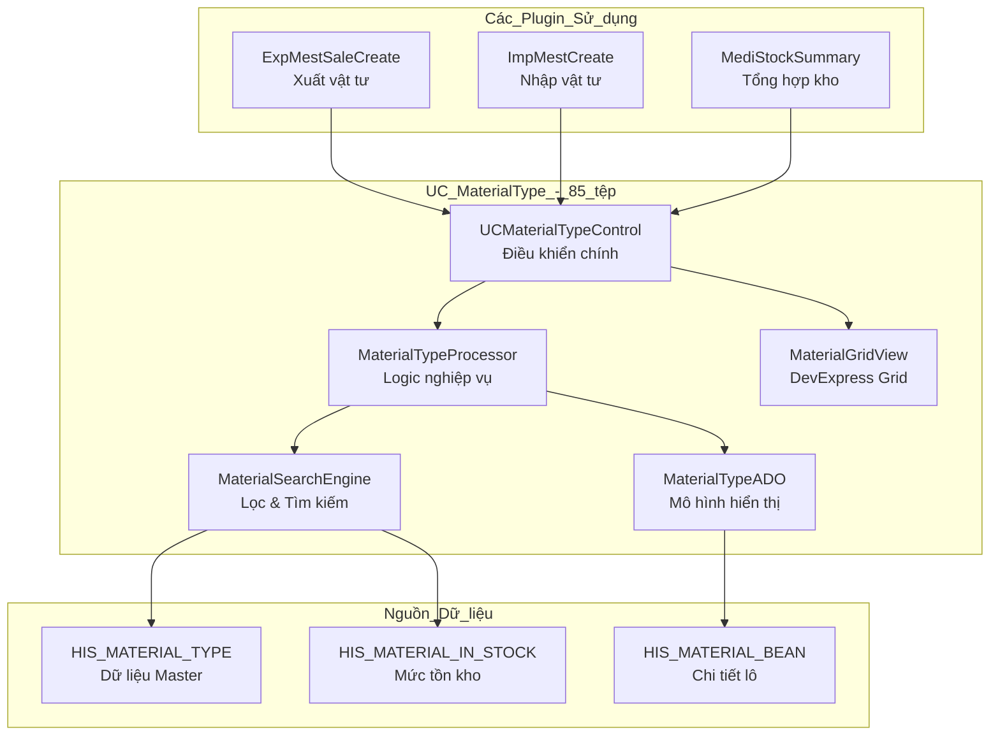
```mermaid
graph TB
    subgraph "UC_MaterialType_-_85_tệp"
        MaterialControl["UCMaterialTypeControl<br/>Điều khiển chính"]
        MaterialADO["MaterialTypeADO<br/>Mô hình hiển thị"]
        MaterialProcessor["MaterialTypeProcessor<br/>Logic nghiệp vụ"]
        MaterialGrid["MaterialGridView<br/>DevExpress Grid"]
        MaterialSearch["MaterialSearchEngine<br/>Lọc & Tìm kiếm"]
    end
    
    subgraph "Nguồn_Dữ_liệu"
        MaterialTypeTable["HIS_MATERIAL_TYPE<br/>Dữ liệu Master"]
        MaterialInStockTable["HIS_MATERIAL_IN_STOCK<br/>Mức tồn kho"]
        MaterialBeanTable["HIS_MATERIAL_BEAN<br/>Chi tiết lô"]
    end
    
    subgraph "Các_Plugin_Sử_dụng"
        ExpMestCreate["ExpMestSaleCreate<br/>Xuất vật tư"]
        ImpMestCreate["ImpMestCreate<br/>Nhập vật tư"]
        MediStockSummary["MediStockSummary<br/>Tổng hợp kho"]
    end
    
    MaterialControl --> MaterialProcessor
    MaterialControl --> MaterialGrid
    MaterialProcessor --> MaterialSearch
    MaterialProcessor --> MaterialADO
    
    MaterialSearch --> MaterialTypeTable
    MaterialSearch --> MaterialInStockTable
    MaterialADO --> MaterialBeanTable
    
    ExpMestCreate --> MaterialControl
    ImpMestCreate --> MaterialControl
    MediStockSummary --> MaterialControl
```

#### Các Tính năng Chính

UC `MaterialType` bao gồm một số tính năng nâng cao:

- **Tìm kiếm Đa cột**: Tìm kiếm theo mã vật tư, tên, nhà sản xuất và quy cách.
- **Lọc theo Kho**: Tùy chọn chỉ hiển thị các mặt hàng còn kho hoặc tất cả các vật tư.
- **Chuyển đổi Đơn vị**: Xử lý nhiều đơn vị đo lường (hộp, lọ, cái, v.v.).
- **Theo dõi Nhà cung cấp**: Hiển thị thông tin nhà cung cấp và giá mua gần nhất.
- **Cảnh báo Hết hạn**: Các chỉ báo trực quan cho các vật tư sắp hết hạn.

**Nguồn:** [`.devin/wiki.json:225-232`](../../../../.devin/wiki.json#L225-L232), [`.devin/wiki.json:90-97`](../../../../.devin/wiki.json#L90-L97)

### Thành phần HIS.UC.Icd

Thành phần `HIS.UC.Icd` (65 tệp) cung cấp việc chọn mã ICD-10 cho các chẩn đoán chính. UC này rất quan trọng đối với việc tuân thủ mã hóa y tế và báo cáo thống kê.

#### Cấu trúc Phân loại ICD-10

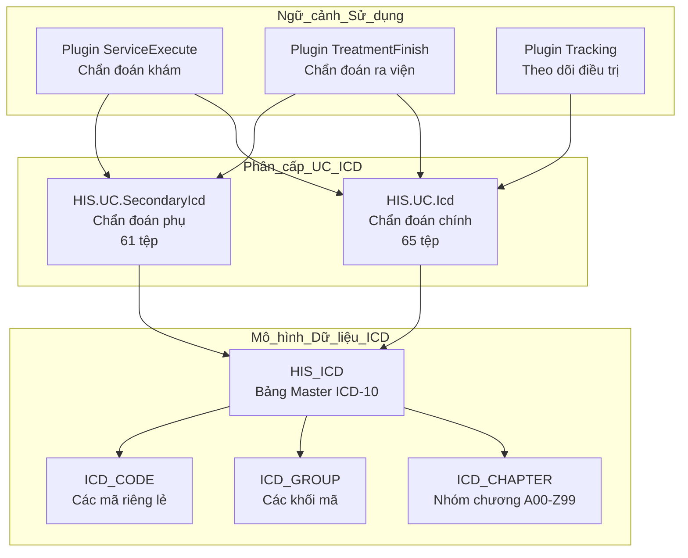
```mermaid
graph TB
    subgraph "Phân_cấp_UC_ICD"
        IcdMain["HIS.UC.Icd<br/>Chẩn đoán chính<br/>65 tệp"]
        SecondaryIcd["HIS.UC.SecondaryIcd<br/>Chẩn đoán phụ<br/>61 tệp"]
    end
    
    subgraph "Mô_hình_Dữ_liệu_ICD"
        IcdTable["HIS_ICD<br/>Bảng Master ICD-10"]
        IcdChapter["ICD_CHAPTER<br/>Nhóm chương A00-Z99"]
        IcdGroup["ICD_GROUP<br/>Các khối mã"]
        IcdCode["ICD_CODE<br/>Các mã riêng lẻ"]
    end
    
    subgraph "Ngữ_cảnh_Sử_dụng"
        ExamPlugin["Plugin ServiceExecute<br/>Chẩn đoán khám"]
        TreatmentPlugin["Plugin TreatmentFinish<br/>Chẩn đoán ra viện"]
        TrackingPlugin["Plugin Tracking<br/>Theo dõi điều trị"]
    end
    
    IcdMain --> IcdTable
    SecondaryIcd --> IcdTable
    IcdTable --> IcdChapter
    IcdTable --> IcdGroup
    IcdTable --> IcdCode
    
    ExamPlugin --> IcdMain
    ExamPlugin --> SecondaryIcd
    TreatmentPlugin --> IcdMain
    TreatmentPlugin --> SecondaryIcd
    TrackingPlugin --> IcdMain
```

#### Các Tính năng của Thành phần

| Tính năng | Triển khai |
|---------|---------------|
| **Phương thức Tìm kiếm** | Theo mã ICD, tên bệnh (tiếng Việt), tên bệnh (tiếng Anh) |
| **Chế độ xem Phân cấp** | Cấu trúc cây hiển thị các chương (A00-B99, C00-D48, v.v.) |
| **Yêu thích** | Truy cập nhanh vào các chẩn đoán thường dùng |
| **Lịch sử** | Các lựa chọn ICD gần đây của mỗi người dùng |
| **Xác thực** | Ngăn chặn các tổ hợp mã không hợp lệ |
| **Đa ngôn ngữ** | Tên bệnh tiếng Việt và tiếng Anh |
| **Các mã Liên quan** | Gợi ý cho các chẩn đoán liên quan/tương tự |

#### Mô hình Liên kết Dữ liệu

UC ICD sử dụng cách tiếp cận dữ liệu được đệm để đạt hiệu năng cao:

1. **Tải ban đầu**: `BackendDataWorker.Get<HIS_ICD>()` tải tất cả các mã ICD vào bộ nhớ.
2. **Đánh chỉ mục**: Tạo các chỉ mục tìm kiếm theo mã và tên để tra cứu nhanh.
3. **Lọc dữ liệu**: Lọc phía client bằng LINQ để có kết quả tức thì.
4. **Điều hướng Chương**: Cấu trúc cây phân cấp để duyệt theo chương.
5. **Lựa chọn Gần đây**: Lưu các lựa chọn ICD gần đây của người dùng trong `LocalStorage`.

**Nguồn:** [`.devin/wiki.json:225-232`](../../../../.devin/wiki.json#L225-L232), [`.devin/wiki.json:70-77`](../../../../.devin/wiki.json#L70-L77)

### Thành phần HIS.UC.SecondaryIcd

Thành phần `HIS.UC.SecondaryIcd` (61 tệp) xử lý các chẩn đoán phụ và bệnh kèm theo. Khác với UC ICD chính chỉ cho phép chọn một, thành phần này hỗ trợ chọn nhiều chẩn đoán.

#### Các tính năng của ICD phụ

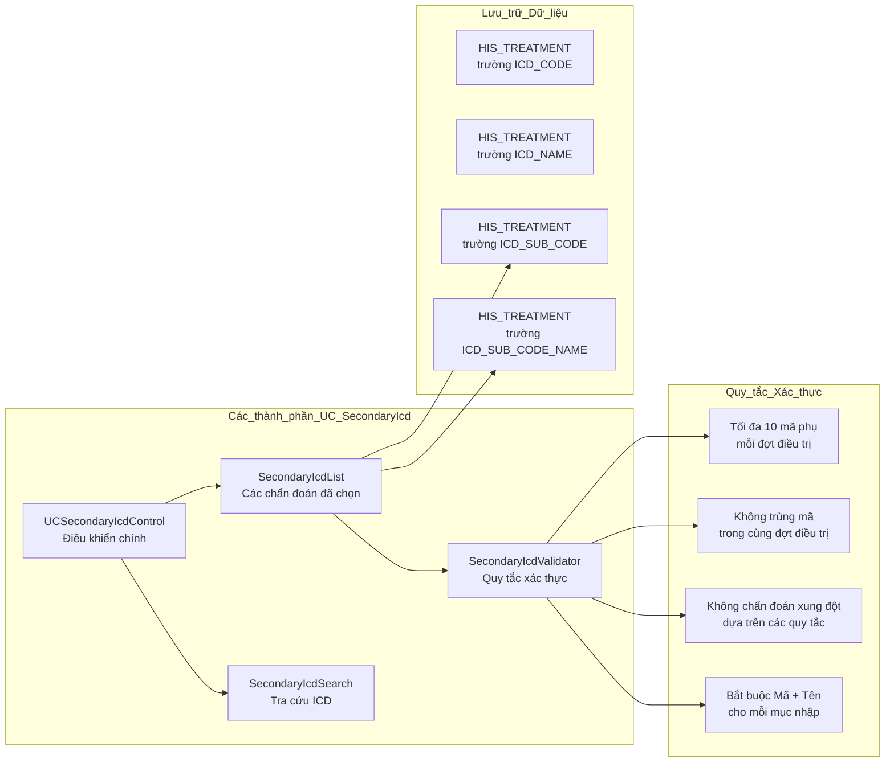
```mermaid
graph LR
    subgraph "Các_thành_phần_UC_SecondaryIcd"
        SecIcdControl["UCSecondaryIcdControl<br/>Điều khiển chính"]
        SecIcdList["SecondaryIcdList<br/>Các chẩn đoán đã chọn"]
        SecIcdSearch["SecondaryIcdSearch<br/>Tra cứu ICD"]
        SecIcdValidator["SecondaryIcdValidator<br/>Quy tắc xác thực"]
    end
    
    subgraph "Quy_tắc_Xác_thực"
        MaxCount["Tối đa 10 mã phụ<br/>mỗi đợt điều trị"]
        NoDuplicate["Không trùng mã<br/>trong cùng đợt điều trị"]
        NoConflict["Không chẩn đoán xung đột<br/>dựa trên các quy tắc"]
        RequiredFields["Bắt buộc Mã + Tên<br/>cho mỗi mục nhập"]
    end
    
    subgraph "Lưu_trữ_Dữ_liệu"
        TreatmentIcd["HIS_TREATMENT<br/>trường ICD_CODE"]
        TreatmentIcdName["HIS_TREATMENT<br/>trường ICD_NAME"]
        TreatmentIcdSub["HIS_TREATMENT<br/>trường ICD_SUB_CODE"]
        TreatmentIcdSubName["HIS_TREATMENT<br/>trường ICD_SUB_CODE_NAME"]
    end
    
    SecIcdControl --> SecIcdList
    SecIcdControl --> SecIcdSearch
    SecIcdList --> SecIcdValidator
    
    SecIcdValidator --> MaxCount
    SecIcdValidator --> NoDuplicate
    SecIcdValidator --> NoConflict
    SecIcdValidator --> RequiredFields
    
    SecIcdList --> TreatmentIcdSub
    SecIcdList --> TreatmentIcdSubName
```

#### Quy trình Chọn nhiều

UC `SecondaryIcd` triển khai một mô hình chọn nhiều (multi-select):

1. **Thêm Chẩn đoán**: Người dùng tìm kiếm và chọn mã ICD.
2. **Nối vào Danh sách**: Mã được thêm vào lưới các chẩn đoán phụ.
3. **Kiểm tra Xác thực**: Hệ thống xác thực dựa trên các quy tắc nghiệp vụ.
4. **Sửa/Xóa**: Người dùng có thể sửa đổi hoặc xóa các mục khỏi danh sách.
5. **Nối Chuỗi**: Khi lưu, nhiều mã được nối với nhau bằng dấu chấm phẩy làm ký tự phân cách.
6. **Lưu trữ**: Được lưu trong các trường `ICD_SUB_CODE` (các mã) và `ICD_SUB_CODE_NAME` (các tên tương ứng).

#### Quy ước Định dạng Chuỗi

Các ICD phụ được lưu trữ dưới dạng các chuỗi phân cách bằng dấu chấm phẩy:

- **Mã**: `"J18.9;I10;E11.9"` (các mã ICD phân cách bằng dấu chấm phẩy)
- **Tên**: `"Viêm phổi;Tăng huyết áp;Đái tháo đường type 2"` (các tên tương ứng)

Điều này giúp lưu trữ hiệu quả trong khi vẫn hỗ trợ nhiều chẩn đoán cho mỗi đợt điều trị.

**Nguồn:** [`.devin/wiki.json:225-232`](../../../../.devin/wiki.json#L225-L232)

### Các UC Hỗ trợ

#### HIS.UC.DHST - Dấu hiệu sinh tồn

Thành phần `HIS.UC.DHST` (54 tệp) cung cấp việc nhập dữ liệu dấu hiệu sinh tồn chuẩn hóa. DHST là viết tắt của "Dấu Hiệu Sinh Tồn" (Vital Signs).

| Dấu hiệu | Trường dữ liệu | Đơn vị | Xác thực |
|------------|-------|------|------------|
| Huyết áp | `BLOOD_PRESSURE` | mmHg | Định dạng: "120/80" |
| Mạch | `PULSE` | nhịp/phút | Khoảng: 40-200 |
| Nhiệt độ | `TEMPERATURE` | °C | Khoảng: 35-42 |
| Nhịp thở | `BREATH_RATE` | lần/phút | Khoảng: 10-40 |
| Chiều cao | `HEIGHT` | cm | Khoảng: 40-250 |
| Cân nặng | `WEIGHT` | kg | Khoảng: 0.5-300 |
| BMI | `BMI` | kg/m² | Tự động tính toán |
| SpO2 | `SPO2` | % | Khoảng: 50-100 |

UC DHST thường được nhúng trong quy trình khám bệnh và kết thúc điều trị, giúp ghi lại nhanh các dấu hiệu sinh tồn của bệnh nhân.

**Nguồn:** [`.devin/wiki.json:225-232`](../../../../.devin/wiki.json#L225-L232)

#### HIS.UC.DateEditor

Thành phần `HIS.UC.DateEditor` (55 tệp) cung cấp các điều khiển nhập ngày/giờ chuyên biệt được sử dụng xuyên suốt trong các UC thuốc và vật tư.

Các tính năng bao gồm:
- **Chế độ Chỉ Ngày**: Cho ngày bắt đầu đơn thuốc, ngày hết hạn vật tư.
- **Chế độ Ngày-Giờ**: Cho các dấu mốc thời gian chính xác của y lệnh thuốc.
- **Khoảng Ngày**: Để lọc các lô vật tư theo ngày hết hạn.
- **Phím tắt Nhanh**: Các nút "Hôm nay", "Ngày mai", "Tuần tới".
- **Lịch Việt**: Hỗ trợ âm lịch cho y học cổ truyền.
- **Xác thực**: Ngăn chặn ngày quá khứ cho đơn thuốc, ngày tương lai cho tiền sử.

#### HIS.UC.TreeSereServ7V2

Thành phần `HIS.UC.TreeSereServ7V2` (52 tệp) cung cấp chế độ xem hình cây phân cấp các dịch vụ cùng với các loại thuốc và vật tư đi kèm. "7V2" chỉ ra rằng đây là phiên bản 7.2 của UC dịch vụ dạng cây.

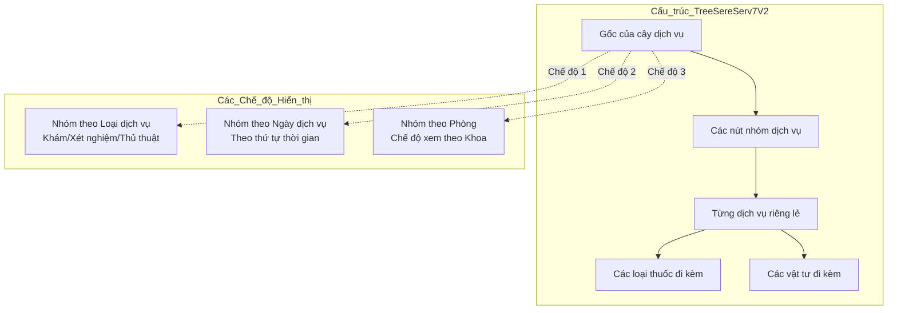
```mermaid
graph TB
    subgraph "Cấu_trúc_TreeSereServ7V2"
        TreeRoot["Gốc của cây dịch vụ"]
        ServiceGroup["Các nút nhóm dịch vụ"]
        ServiceDetail["Từng dịch vụ riêng lẻ"]
        MedicineNode["Các loại thuốc đi kèm"]
        MaterialNode["Các vật tư đi kèm"]
    end
    
    subgraph "Các_Chế_độ_Hiển_thị"
        ByType["Nhóm theo Loại dịch vụ<br/>Khám/Xét nghiệm/Thủ thuật"]
        ByDate["Nhóm theo Ngày dịch vụ<br/>Theo thứ tự thời gian"]
        ByRoom["Nhóm theo Phòng<br/>Chế độ xem theo Khoa"]
    end
    
    TreeRoot --> ServiceGroup
    ServiceGroup --> ServiceDetail
    ServiceDetail --> MedicineNode
    ServiceDetail --> MaterialNode
    
    TreeRoot -.->|"Chế độ 1"| ByType
    TreeRoot -.->|"Chế độ 2"| ByDate
    TreeRoot -.->|"Chế độ 3"| ByRoom
```

UC này đặc biệt quan trọng trong plugin `ServiceExecute` nơi các dịch vụ, thuốc và vật tư cần được hiển thị cùng nhau trong mối quan hệ phân cấp.

**Nguồn:** [`.devin/wiki.json:225-232`](../../../../.devin/wiki.json#L225-L232)

### Các Mô hình Tích hợp UC

#### Luồng Tích hợp Plugin

Các UC Thuốc và ICD tuân theo một mô hình tích hợp chuẩn hóa khi được nhúng vào các plugin:

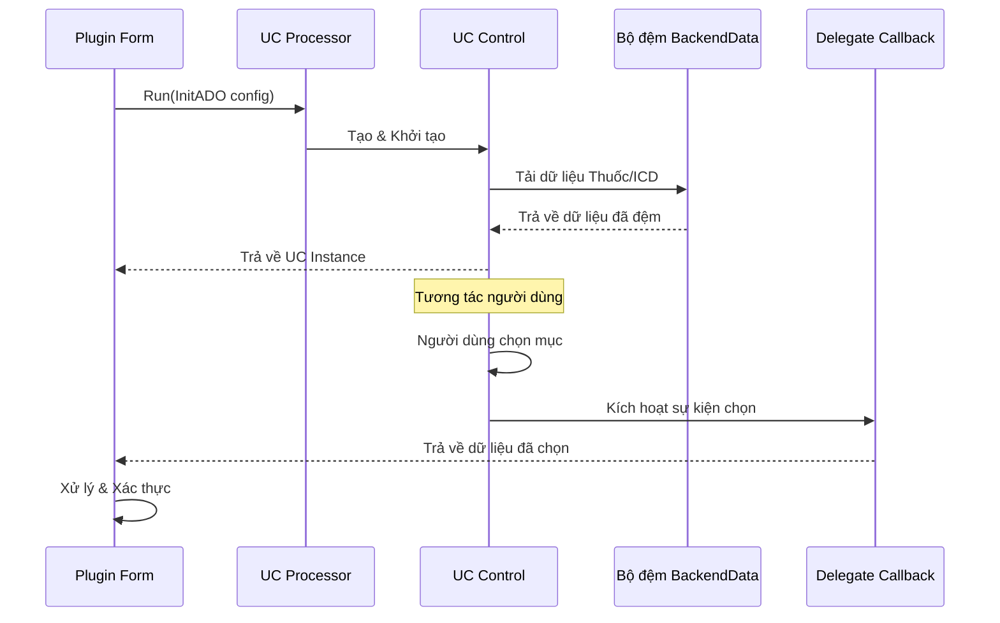
```mermaid
sequenceDiagram
    participant Plugin as Plugin Form
    participant UCProcessor as UC Processor
    participant UCControl as UC Control
    participant BackendData as Bộ đệm BackendData
    participant Delegate as Delegate Callback
    
    Plugin->>UCProcessor: Run(InitADO config)
    UCProcessor->>UCControl: Tạo & Khởi tạo
    UCControl->>BackendData: Tải dữ liệu Thuốc/ICD
    BackendData-->>UCControl: Trả về dữ liệu đã đệm
    UCControl-->>Plugin: Trả về UC Instance
    
    Note over UCControl: Tương tác người dùng
    
    UCControl->>UCControl: Người dùng chọn mục
    UCControl->>Delegate: Kích hoạt sự kiện chọn
    Delegate-->>Plugin: Trả về dữ liệu đã chọn
    Plugin->>Plugin: Xử lý & Xác thực
```

#### Mô hình ADO Chung

Tất cả các UC Thuốc & ICD đều sử dụng các lớp ADO (Active Data Object) để truyền dữ liệu:

| Thành phần UC | Lớp ADO | Các thuộc tính chính |
|--------------|-----------|----------------|
| MedicineType | `MedicineTypeADO` | `MEDICINE_TYPE_ID`, `MEDICINE_TYPE_CODE`, `MEDICINE_TYPE_NAME`, `AMOUNT`, `PRICE` |
| MaterialType | `MaterialTypeADO` | `MATERIAL_TYPE_ID`, `MATERIAL_TYPE_CODE`, `MATERIAL_TYPE_NAME`, `AMOUNT`, `SUPPLIER_ID` |
| Icd | `IcdADO` | `ICD_CODE`, `ICD_NAME`, `ICD_NAME_ENGLISH`, `CHAPTER_CODE` |
| SecondaryIcd | `SecondaryIcdADO` | `ICD_SUB_CODE`, `ICD_SUB_CODE_NAME`, `ICD_LIST` (tập hợp) |

Các lớp ADO mở rộng các mô hình thực thể cơ bản với các thuộc tính hiển thị và xác thực bổ sung cần thiết cho lớp UI.

**Nguồn:** [`.devin/wiki.json:200-208`](../../../../.devin/wiki.json#L200-L208), [`.devin/wiki.json:225-232`](../../../../.devin/wiki.json#L225-L232)

### Cấu hình và Tùy chỉnh UC

#### Các Tham số Khởi tạo

Mỗi UC chấp nhận một ADO khởi tạo với các tùy chọn cấu hình:

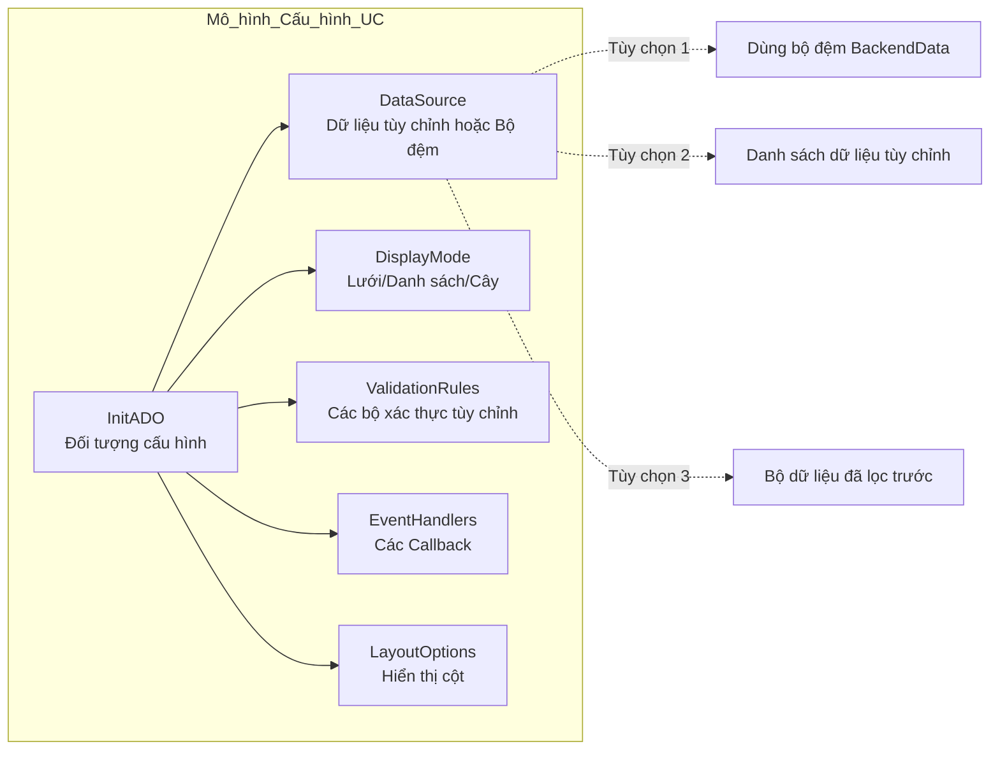
```mermaid
graph LR
    subgraph "Mô_hình_Cấu_hình_UC"
        InitADO["InitADO<br/>Đối tượng cấu hình"]
        DataSource["DataSource<br/>Dữ liệu tùy chỉnh hoặc Bộ đệm"]
        DisplayMode["DisplayMode<br/>Lưới/Danh sách/Cây"]
        ValidationRules["ValidationRules<br/>Các bộ xác thực tùy chỉnh"]
        EventHandlers["EventHandlers<br/>Các Callback"]
        LayoutOptions["LayoutOptions<br/>Hiển thị cột"]
    end
    
    InitADO --> DataSource
    InitADO --> DisplayMode
    InitADO --> ValidationRules
    InitADO --> EventHandlers
    InitADO --> LayoutOptions
    
    DataSource -.->|"Tùy chọn 1"| Cache["Dùng bộ đệm BackendData"]
    DataSource -.->|"Tùy chọn 2"| Custom["Danh sách dữ liệu tùy chỉnh"]
    DataSource -.->|"Tùy chọn 3"| Filtered["Bộ dữ liệu đã lọc trước"]
```

#### Các Điểm Tùy chỉnh

| Tùy chỉnh | MedicineType | MaterialType | Icd | SecondaryIcd |
|---------------|--------------|--------------|-----|--------------|
| Nguồn dữ liệu tùy chỉnh | ✓ | ✓ | ✓ | ✓ |
| Hiển thị cột | ✓ | ✓ | ✓ | ✓ |
| Bộ xác thực tùy chỉnh | ✓ | ✓ | ✓ | ✓ |
| Callback sự kiện | ✓ | ✓ | ✓ | ✓ |
| Bộ lọc tìm kiếm | ✓ | ✓ | ✓ | ✓ |
| Chọn nhiều | Hạn chế | Hạn chế | ✗ | ✓ |
| Chế độ Chỉ đọc | ✓ | ✓ | ✓ | ✓ |

**Nguồn:** [`.devin/wiki.json:200-208`](../../../../.devin/wiki.json#L200-L208)

### Sử dụng trong các Plugin lớn

#### Plugin AssignPrescriptionPK

Plugin `AssignPrescriptionPK` (203 tệp) là nơi sử dụng UC `MedicineType` nhiều nhất:

- Nhúng nhiều instance cho các loại đơn thuốc khác nhau (ngoại trú, nội trú, mua về).
- Sử dụng UC `MedicineType` để chọn thuốc với việc kiểm tra tồn kho theo thời gian thực.
- Tích hợp với UC `DateEditor` cho ngày bắt đầu/kết thúc đơn thuốc.
- Tính tổng chi phí đơn thuốc dựa trên các loại thuốc đã chọn.

Vị trí: `HIS/Plugins/HIS.Desktop.Plugins.AssignPrescriptionPK/`

#### Plugin ServiceExecute

Plugin `ServiceExecute` (119 tệp) sử dụng cả hai UC ICD một cách rộng rãi:

- Nhập chẩn đoán chính bằng UC `Icd` khi kết thúc khám.
- Các chẩn đoán phụ bằng UC `SecondaryIcd` cho các bệnh kèm theo.
- Tích hợp với `TreeSereServ7V2` để hiển thị các dịch vụ cùng với chẩn đoán.
- Liên kết các chẩn đoán với các lần thực hiện dịch vụ cụ thể.

Vị trí: `HIS/Plugins/HIS.Desktop.Plugins.ServiceExecute/`

#### Plugin TreatmentFinish

Plugin `TreatmentFinish` (101 tệp) sử dụng toàn bộ bộ UC Thuốc & ICD:

- Chẩn đoán ra viện bằng các UC `Icd` và `SecondaryIcd`.
- Đơn thuốc cuối cùng bằng UC `MedicineType`.
- Dấu hiệu sinh tồn khi ra viện bằng UC `DHST`.
- Tóm tắt điều trị với tất cả các chẩn đoán và thuốc men.

Vị trí: `HIS/Plugins/HIS.Desktop.Plugins.TreatmentFinish/`

#### Plugin ExpMestSaleCreate

Plugin `ExpMestSaleCreate` (78 tệp) sử dụng UC `MaterialType` cho việc bán lẻ:

- Chọn vật tư cho việc bán hàng trực tiếp.
- Kiểm tra tính sẵn có của hàng tồn kho.
- Tính giá và thanh toán.
- Tạo hóa đơn.

Vị trí: `HIS/Plugins/HIS.Desktop.Plugins.ExpMestSaleCreate/`

**Nguồn:** [`.devin/wiki.json:70-77`](../../../../.devin/wiki.json#L70-L77), [`.devin/wiki.json:90-97`](../../../../.devin/wiki.json#L90-L97)

### Chiến lược đệm dữ liệu

#### Tích hợp BackendData

Tất cả các UC Thuốc & ICD đều dựa trên `HIS.Desktop.LocalStorage.BackendData` (69 tệp) để truy cập dữ liệu đã được đệm:

```mermaid
graph TB
    subgraph "Kiến_trúc_Luồng_Dữ_liệu"
        API["Backend REST API<br/>HIS.Desktop.ApiConsumer"]
        BackendWorker["BackendDataWorker<br/>Bộ quản lý đệm"]
        Cache["Bộ đệm In-Memory<br/>Dictionary&lt;Type, List&gt;"]
    end
    
    subgraph "Các_Thực_thể_được_đệm"
        MedicineCache["HIS_MEDICINE_TYPE<br/>~5.000-20.000 bản ghi"]
        MaterialCache["HIS_MATERIAL_TYPE<br/>~3.000-15.000 bản ghi"]
        IcdCache["HIS_ICD<br/>~14.000 bản ghi"]
        MedicineStockCache["HIS_MEDICINE_IN_STOCK<br/>Tồn kho thời gian thực"]
        MaterialStockCache["HIS_MATERIAL_IN_STOCK<br/>Tồn kho thời gian thực"]
    end
    
    subgraph "Mô_hình_Truy_cập_UC"
        UCMedicine["UC MedicineType"]
        UCMaterial["UC MaterialType"]
        UCIcd["UC Icd"]
        UCSecondaryIcd["UC SecondaryIcd"]
    end
    
    API -->|"Tải ban đầu"| BackendWorker
    BackendWorker --> Cache
    Cache --> MedicineCache
    Cache --> MaterialCache
    Cache --> IcdCache
    Cache --> MedicineStockCache
    Cache --> MaterialStockCache
    
    UCMedicine --> MedicineCache
    UCMedicine --> MedicineStockCache
    UCMaterial --> MaterialCache
    UCMaterial --> MaterialStockCache
    UCIcd --> IcdCache
    UCSecondaryIcd --> IcdCache
```

#### Chiến lược cập nhật bộ đệm

| Sự kiện | Cơ chế cập nhật | Các thành phần bị ảnh hưởng |
|-------|------------------|---------------------|
| Khởi động Ứng dụng | Tải bộ đệm đầy đủ từ API | Tất cả các UC |
| Đã thêm Thuốc | Cập nhật tăng cường (incremental) | UC MedicineType |
| Đã thêm Vật tư | Cập nhật tăng cường | UC MaterialType |
| Thay đổi tồn kho | Cập nhật thời gian thực qua PubSub | Các UC MedicineType, MaterialType |
| ICD được cập nhật | Làm mới thủ công (hiếm) | Các UC Icd, SecondaryIcd |
| Hết hạn phiên làm việc | Tải lại toàn bộ bộ đệm | Tất cả các UC |

Chiến lược đệm ưu tiên hiệu năng hơn là tính chính xác tuyệt đối theo thời gian thực, với các khoảng thời gian làm mới định kỳ có thể cấu hình trong `HIS.Desktop.LocalStorage.ConfigApplication`.

**Nguồn:** [`.devin/wiki.json:45-52`](../../../../.devin/wiki.json#L45-L52), [`.devin/wiki.json:200-208`](../../../../.devin/wiki.json#L200-L208)

### Các cân nhắc về Hiệu năng

#### Xử lý bộ dữ liệu lớn

Các UC Thuốc & ICD xử lý các bộ dữ liệu tiềm năng lớn một cách hiệu quả:

| Bộ dữ liệu | Kích thước điển hình | Chiến lược tải | Hiệu năng tìm kiếm |
|---------|-------------|------------------|-------------------|
| Các loại Thuốc | 5.000-20.000 | Bộ đệm đầy đủ khi bắt đầu | Tìm kiếm đã đánh chỉ mục O(log n) |
| Các loại Vật tư | 3.000-15.000 | Bộ đệm đầy đủ khi bắt đầu | Tìm kiếm đã đánh chỉ mục O(log n) |
| Các mã ICD | ~14.000 | Bộ đệm đầy đủ khi bắt đầu | Tra cứu bảng băm (hash lookup) O(1) |
| Tồn kho Thuốc | 10.000-50.000 | Tải lười theo kho | Truy vấn đã lọc |
| Tồn kho Vật tư | 5.000-30.000 | Tải lười theo kho | Truy vấn đã lọc |

#### Các kỹ thuật Tối ưu hóa

1. **Cuộn ảo (Virtual Scrolling)**: Các thành phần lưới DevExpress sử dụng cuộn ảo cho các bộ dữ liệu lớn.
2. **Tải lười (Lazy Loading)**: Dữ liệu tồn kho chỉ được tải khi yêu cầu chi tiết tồn kho.
3. **Đánh chỉ mục tìm kiếm**: Các chỉ mục đa cột để tìm kiếm văn bản nhanh.
4. **Lọc phía Client**: Lọc dựa trên LINQ tránh các lời gọi API.
5. **Tìm kiếm Debounced**: Độ trễ 300ms đối với đầu vào tìm kiếm để giảm việc xử lý.

**Nguồn:** [`.devin/wiki.json:200-208`](../../../../.devin/wiki.json#L200-208), [`.devin/wiki.json:45-52`](../../../../.devin/wiki.json#L45-L52)

### Các thực hành tốt (Best Practices)

#### Khi nào nên sử dụng mỗi UC

| Tình huống | UC được đề nghị | Lý do |
|----------|----------------|-----------|
| Nhập đơn thuốc | `MedicineType` | Quản lý thuốc đầy đủ với liều dùng |
| Yêu cầu vật tư | `MaterialType` | Vật tư không có các quy tắc kê đơn |
| Chẩn đoán khám | `Icd` | Chọn chẩn đoán chính |
| Tóm tắt ra viện | `Icd` + `SecondaryIcd` | Bức tranh chẩn đoán đầy đủ |
| Ghi lại dấu hiệu sinh tồn | `DHST` | Nhập dấu hiệu sinh tồn chuẩn hóa |
| Liên kết dịch vụ-thuốc | `TreeSereServ7V2` | Hiển thị mối quan hệ phân cấp |

#### Các mô hình tích hợp chung

1. **Chọn một loại thuốc**: Sử dụng UC `MedicineType` với chế độ chọn đơn (single-select).
2. **Kê đơn hàng loạt**: Sử dụng UC `MedicineType` với chế độ lưới cho phép thêm nhiều mục.
3. **Chẩn đoán Chính + Phụ**: Nhúng cả hai UC `Icd` và `SecondaryIcd` cạnh nhau.
4. **Chọn lựa ưu tiên tồn kho**: Cấu hình `MedicineType`/`MaterialType` để lọc theo kho sẵn có.
5. **Hiển thị lịch sử**: Sử dụng chế độ chỉ đọc để hiển thị các đơn thuốc/chẩn đoán trước đó.

#### Hướng dẫn xác thực

Tất cả các UC Thuốc & ICD đều triển khai việc xác thực ở nhiều cấp độ:

1. **Cấp độ UI**: Phản hồi tức thì cho người dùng khi nhập liệu không hợp lệ (phía client).
2. **Cấp độ Nghiệp vụ**: Các quy tắc được thực thi bởi các bộ xử lý UC (ví dụ: khả năng đáp ứng của kho).
3. **Cấp độ Dữ liệu**: Xác thực phía server khi lưu (quyền quyết định cuối cùng).

Các plugin nên xử lý các sự kiện xác thực từ các UC và cung cấp phản hồi thích hợp cho người dùng.

**Nguồn:** [`.devin/wiki.json:200-208`](../../../../.devin/wiki.json#L200-L208), [`.devin/wiki.json:225-232`](../../../../.devin/wiki.json#L225-L232)

