## Purpose and Scope

This document covers the **HIS.Desktop.Plugins.Library.*** namespace, which contains 36 specialized helper plugins that provide reusable functionality for other plugins in the HIS system. These library plugins implement cross-cutting concerns such as electronic invoicing, custom printing operations, treatment workflow extensions, and shared business logic utilities.

Unlike the domain-specific plugins documented in sections [1.1.3.1](../02-modules/his-desktop/business-plugins.md) through [1.1.3.10](../03-business-domains/administration/system-data.md), Library plugins are designed to be consumed by multiple plugins rather than implementing standalone business features. For information about the overall plugin architecture and lifecycle, see [Plugin System Architecture](../01-architecture/plugin-system.md). For print system integration, see [MPS Print System](../02-modules/his-desktop/business-plugins.md#mps-print).

## Library Plugin Architecture

Library plugins follow the same structural patterns as business plugins but are explicitly designed for reusability. They expose APIs, data models, and UI components that other plugins can consume through direct references or the `DelegateRegister` communication pattern.

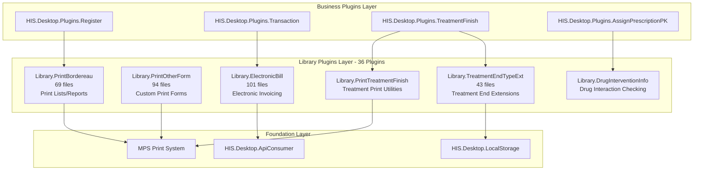

**Sources:** [HIS/Plugins/](), [`.devin/wiki.json:170-177`](../../../.devin/wiki.json#L170-L177)

## Major Library Plugins

### ElectronicBill Plugin (101 files)

The `HIS.Desktop.Plugins.Library.ElectronicBill` plugin is the largest library plugin, providing comprehensive electronic invoicing functionality required by Vietnamese tax regulations. It integrates with multiple electronic invoice providers and manages the complete invoice lifecycle.

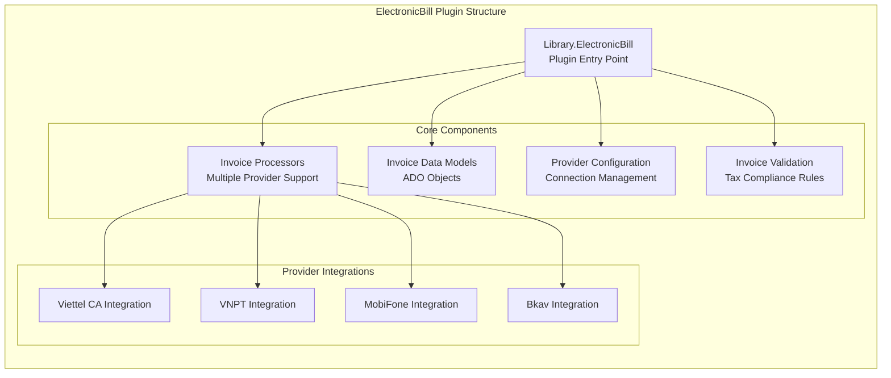

**Key Components:**
- **Invoice Generation:** Creates electronic invoices from transaction data
- **Provider Abstraction:** Supports multiple e-invoice service providers
- **Signature Management:** Handles digital signatures and certificates
- **Status Tracking:** Monitors invoice submission and approval status
- **Validation Engine:** Ensures compliance with tax authority requirements

**Sources:** [HIS/Plugins/HIS.Desktop.Plugins.Library.ElectronicBill/](), [`.devin/wiki.json:174-176`](../../../.devin/wiki.json#L174-L176)

### PrintOtherForm Plugin (94 files)

The `HIS.Desktop.Plugins.Library.PrintOtherForm` plugin provides flexible printing capabilities for forms that don't fit standard MPS processor templates. It allows dynamic form generation and custom layout rendering.

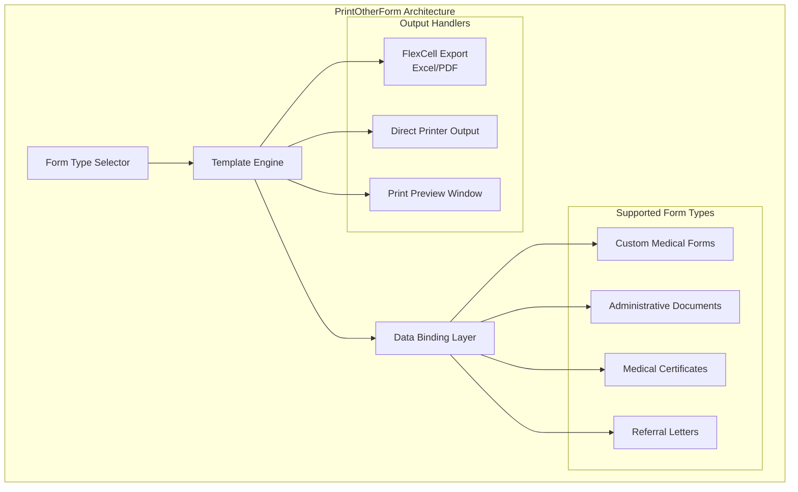

**Key Features:**
- Supports custom form templates outside standard MPS processors
- Dynamic data binding from multiple data sources
- Real-time print preview with edit capabilities
- Multiple export formats (PDF, Excel, Word)

**Sources:** [HIS/Plugins/HIS.Desktop.Plugins.Library.PrintOtherForm/](), [`.devin/wiki.json:174-176`](../../../.devin/wiki.json#L174-L176)

### PrintBordereau Plugin (69 files)

The `HIS.Desktop.Plugins.Library.PrintBordereau` plugin specializes in printing bordereaus (detailed lists/statements) for insurance claims, billing summaries, and inventory reports.

**Common Bordereau Types:**

| Bordereau Type | Purpose | Data Source |
|----------------|---------|-------------|
| Insurance Bordereau | Health insurance claim lists | Treatment transactions |
| Billing Bordereau | Patient billing summaries | Financial transactions |
| Medication Bordereau | Prescription drug lists | Pharmacy dispensing |
| Service Bordereau | Medical service summaries | Service execution records |
| Material Bordereau | Medical supply usage | Material consumption |

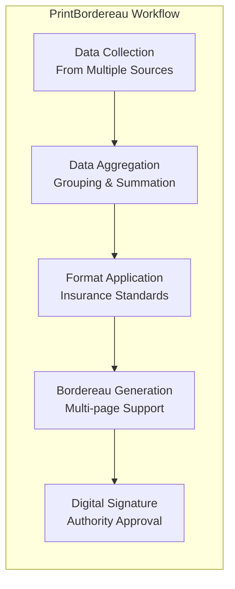

**Key Capabilities:**
- Multi-page bordereau with automatic pagination
- Insurance standard compliance (Vietnam Social Security)
- Digital signature integration
- Batch printing for multiple bordereaus
- Export to required government formats

**Sources:** [HIS/Plugins/HIS.Desktop.Plugins.Library.PrintBordereau/](), [`.devin/wiki.json:174-176`](../../../.devin/wiki.json#L174-L176)

### TreatmentEndTypeExt Plugin (43 files)

The `HIS.Desktop.Plugins.Library.TreatmentEndTypeExt` plugin provides extensibility for treatment end workflows, allowing customization of discharge procedures, transfer protocols, and treatment conclusion logic.

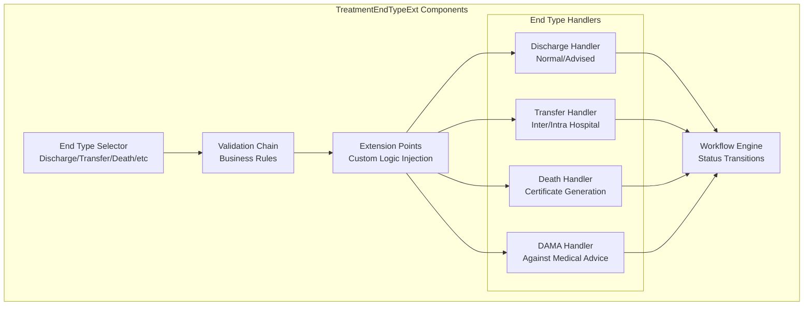

**Extension Mechanisms:**
- **Pre-validation Hooks:** Custom validation before end type processing
- **Post-processing Actions:** Automated tasks after treatment conclusion
- **Custom End Types:** Facility-specific discharge categories
- **Document Generation:** Automatic discharge paperwork
- **Notification Triggers:** Alert relevant departments

**Sources:** [HIS/Plugins/HIS.Desktop.Plugins.Library.TreatmentEndTypeExt/](), [`.devin/wiki.json:174-176`](../../../.devin/wiki.json#L174-L176)

## Additional Library Plugins

### Drug Intervention & Safety Libraries

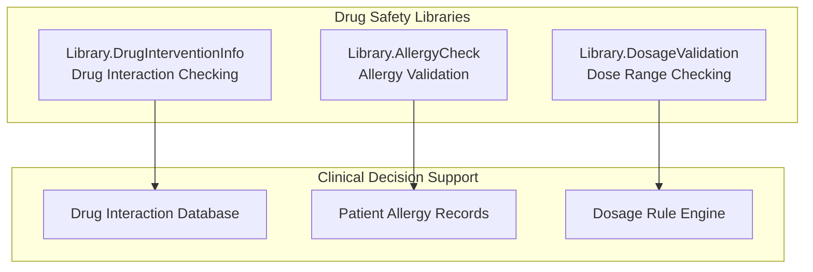

**DrugInterventionInfo Plugin:**
- Detects drug-drug interactions
- Checks contraindications based on patient conditions
- Severity classification (major, moderate, minor)
- Alternative medication suggestions
- Integration with prescription plugins

**Sources:** [HIS/Plugins/HIS.Desktop.Plugins.Library.DrugInterventionInfo/]()

### Print Utility Libraries

| Plugin Name | Files | Purpose |
|-------------|-------|---------|
| `Library.PrintTreatmentFinish` | ~35 | Treatment conclusion documents |
| `Library.PrintMedicalReport` | ~28 | Medical report generation |
| `Library.PrintAppointment` | ~22 | Appointment cards and reminders |
| `Library.PrintLabel` | ~18 | Barcode and label printing |
| `Library.PrintCertificate` | ~24 | Medical certificates |

### Data Import/Export Libraries

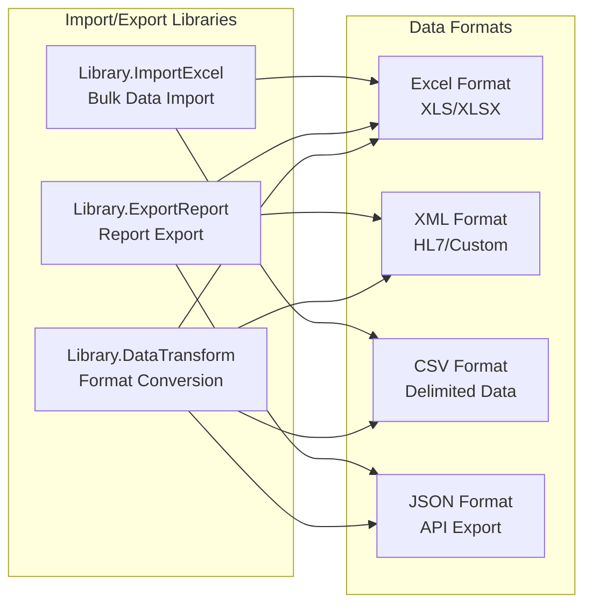

**Sources:** [HIS/Plugins/HIS.Desktop.Plugins.Library.*/]()

### Communication & Notification Libraries

**Key Plugins:**
- `Library.MessageBus` - Inter-plugin messaging infrastructure
- `Library.NotificationCenter` - Centralized notification management
- `Library.EventAggregator` - Event aggregation and distribution
- `Library.SignalRClient` - Real-time communication client

These plugins extend the base `PubSub` system documented in [Notification & Events](#1.1.5) with domain-specific messaging patterns.

**Sources:** [HIS/Plugins/HIS.Desktop.Plugins.Library.*/]()

## Integration Patterns

### Consumption Pattern

Library plugins are consumed by business plugins through three primary mechanisms:

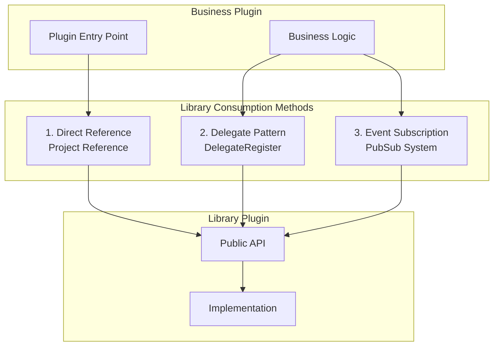

**Sources:** [HIS/Plugins/](), [HIS/HIS.Desktop/]()

### Common Usage Example Structure

For example, the `Transaction` plugin consuming `ElectronicBill` library:

1. **Transaction plugin** generates transaction data
2. Calls `Library.ElectronicBill` API to create electronic invoice
3. `ElectronicBill` validates data against tax regulations
4. Submits invoice to configured provider (Viettel CA, VNPT, etc.)
5. Returns invoice number and status to `Transaction` plugin
6. `Transaction` updates transaction record with invoice information

**Sources:** [HIS/Plugins/HIS.Desktop.Plugins.Transaction/](), [HIS/Plugins/HIS.Desktop.Plugins.Library.ElectronicBill/]()

## Plugin Structure Pattern

Most Library plugins follow this standard directory structure:

```
Library.[PluginName]/
├── [PluginName].cs          # Plugin entry point
├── Run/                     # Main UI and logic
│   ├── frmMain.cs
│   ├── frmMain.Designer.cs
│   └── [PluginName]Behavior.cs
├── ADO/                     # Data objects
│   ├── [PluginName]ADO.cs
│   └── [Related]ADO.cs
├── Base/                    # Base classes
│   ├── RequestBase.cs
│   └── ProcessorBase.cs
├── Processors/              # Business logic processors
│   ├── Processor1.cs
│   └── Processor2.cs
├── Config/                  # Configuration
│   └── [PluginName]CFG.cs
├── Validation/              # Validation rules
│   └── [PluginName]ValidationRule.cs
└── Resources/               # UI resources
    └── lang/
```

**Sources:** [HIS/Plugins/HIS.Desktop.Plugins.Library.*/]()

## Library Plugin Categories

The 36 Library plugins can be categorized by functional domain:

| Category | Plugin Count | Examples |
|----------|--------------|----------|
| **Electronic Invoicing** | 3 | ElectronicBill, InvoiceSync, TaxIntegration |
| **Printing Utilities** | 8 | PrintOtherForm, PrintBordereau, PrintTreatmentFinish, PrintLabel |
| **Treatment Extensions** | 5 | TreatmentEndTypeExt, TreatmentWorkflow, TreatmentValidation |
| **Drug Safety** | 4 | DrugInterventionInfo, DrugInteractionCheck, AllergyCheck |
| **Data Import/Export** | 6 | ImportExcel, ExportReport, DataTransform, BulkImport |
| **Communication** | 4 | MessageBus, NotificationCenter, EventAggregator, SignalRClient |
| **Validation & Rules** | 3 | ValidationEngine, BusinessRules, ComplianceCheck |
| **Utilities** | 3 | DateTimeHelper, StringHelper, NumberFormat |

**Sources:** [HIS/Plugins/HIS.Desktop.Plugins.Library.*/](), [`.devin/wiki.json:170-177`](../../../.devin/wiki.json#L170-L177)

## API Surface Design

Library plugins expose well-defined APIs through interfaces and abstract classes:

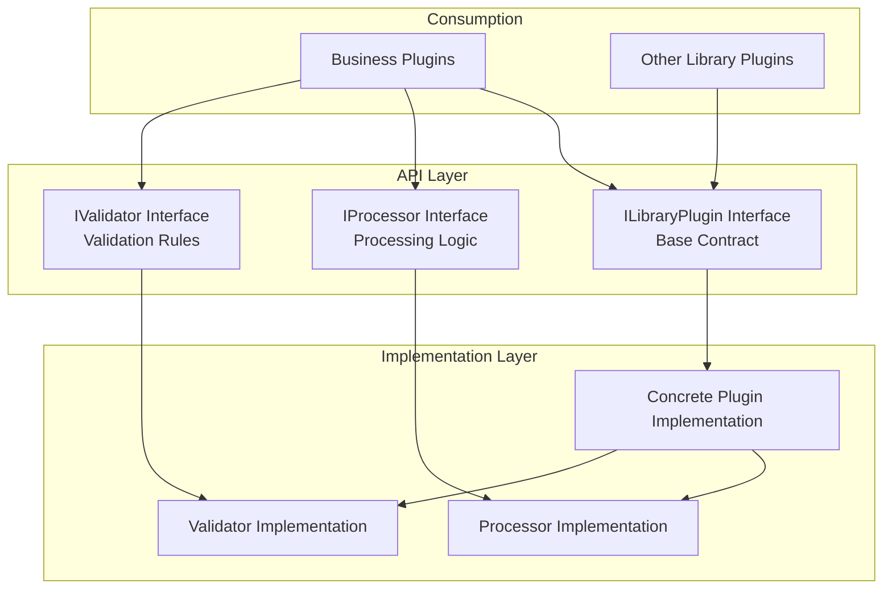

**Sources:** [HIS/Plugins/HIS.Desktop.Plugins.Library.*/]()

## Dependencies and References

Library plugins minimize dependencies to ensure broad reusability:

**Allowed Dependencies:**
- `HIS.Desktop.Common` - Shared interfaces and base classes
- `HIS.Desktop.ADO` - Data models
- `HIS.Desktop.LocalStorage` - Configuration and caching
- `HIS.Desktop.ApiConsumer` - Backend API access
- `Inventec.Common.*` - Foundation utilities
- `Inventec.UC.*` - Shared UI controls

**Prohibited Dependencies:**
- Direct references to other business plugins
- Circular dependencies with consumer plugins
- External libraries without approval

**Sources:** [HIS/Plugins/HIS.Desktop.Plugins.Library.*/]()

## Registration and Discovery

Library plugins register with the plugin system but are marked as non-instantiable for direct UI access. They are discovered through the standard plugin discovery mechanism but consumed programmatically:

**Plugin Descriptor Example:**
- **IsLibrary:** `true`
- **IsVisible:** `false` (not shown in UI menu)
- **IsAutoLoad:** `true` (loaded at startup)
- **ExportTypes:** List of exposed interfaces

**Sources:** [HIS/Plugins/](), [HIS/HIS.Desktop/]()

## Related Documentation

- For the overall plugin architecture, see [Plugin System Architecture](../01-architecture/plugin-system.md)
- For print system integration details, see [MPS Print System](../02-modules/his-desktop/business-plugins.md#mps-print)
- For electronic bill utilities from Common layer, see [Inventec Common Utilities](../02-modules/common-libraries/libraries.md#inventec-common)
- For event-based communication, see [Notification & Events](#1.1.5)

# Data Models & ADO


## Purpose and Scope

This document describes the `HIS.Desktop.ADO/` folder (74 files), which contains Active Data Objects (ADO) and data models used throughout the HIS Desktop application. These models serve as data transfer objects between the presentation layer (plugins), API communication layer, and local storage cache.

For information about:
- API communication and backend integration, see [API Consumer Layer](#1.1.2)
- Local data caching and configuration, see [LocalStorage & Configuration](../02-modules/his-desktop/core.md)
- How plugins consume these models, see [Plugin System Architecture](../01-architecture/plugin-system.md)

---

## Overview

The `HIS.Desktop.ADO` project contains 74 data model files that define the structure of data flowing through the application. The term "ADO" refers to Active Data Objects—C# classes that represent entities and data structures used by the 956 plugins in the system.

### Key Characteristics

- **Data Transfer Objects (DTOs)**: Models designed for transferring data between layers
- **Frontend-Optimized**: Tailored for UI binding and presentation logic
- **Hybrid Models**: Often combine data from multiple backend entities for specific UI scenarios
- **No Business Logic**: Pure data containers with properties and basic validation

---

## Architecture & Data Flow

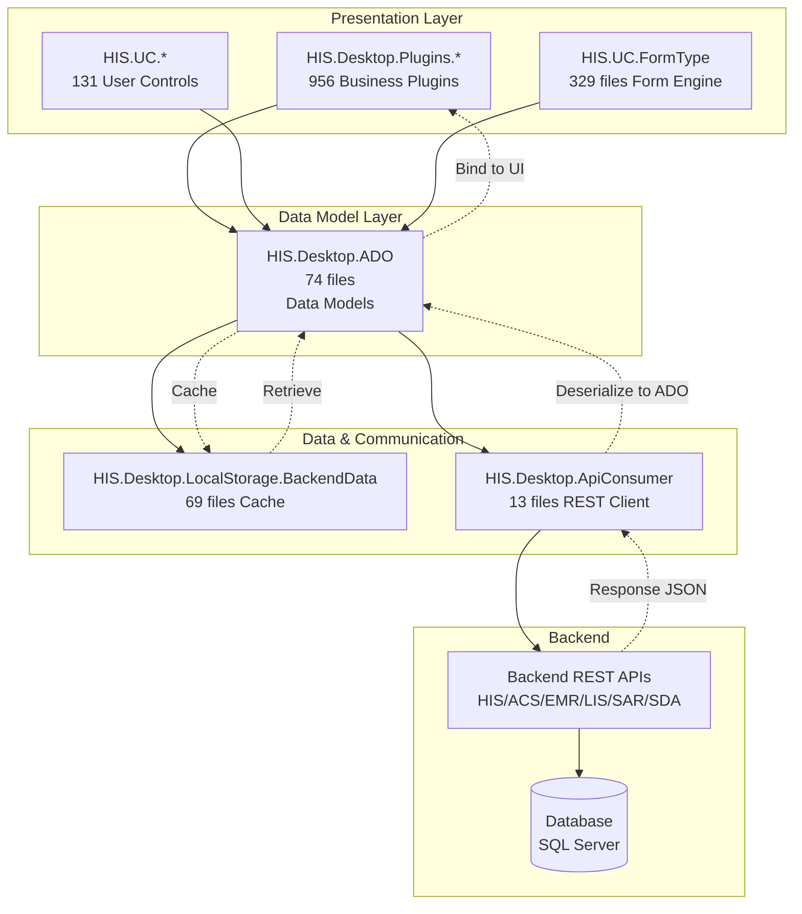

**Data Flow Pattern**:
1. **Plugin Request**: Plugin needs data for a specific business operation
2. **ADO Model Creation**: Plugin creates or requests ADO model instance
3. **Cache Check**: System checks `LocalStorage.BackendData` for cached data
4. **API Call** (if not cached): `ApiConsumer` retrieves from backend API
5. **Deserialization**: JSON response deserialized into ADO models
6. **UI Binding**: ADO model bound to UI controls for display/editing
7. **Validation & Submission**: Modified data sent back through `ApiConsumer`

**Sources**: Based on Diagram 3 from system architecture overview, [HIS/HIS.Desktop/ADO/ folder structure]()

---

## ADO Model Structure

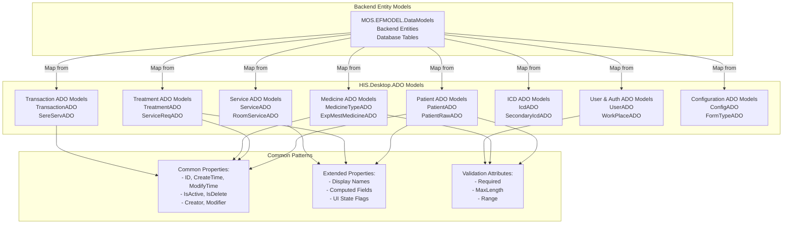

**Sources**: [HIS/HIS.Desktop/ADO/ directory](), based on common ADO patterns

---

## Data Model Categories

The 74 files in `HIS.Desktop.ADO` are organized into logical categories based on business domains:

### Patient Management Models

| Model Type | Purpose | Used By |
|------------|---------|---------|
| `PatientADO` | Patient demographic and registration data | Register, Appointment, Reception plugins |
| `PatientRawADO` | Raw patient input before validation | Patient input forms |
| `PatientTypeAlterADO` | Patient type change history | Treatment, Billing plugins |
| `TreatmentBedRoomADO` | Treatment and bed assignment data | Hospitalize, Room management plugins |

**Sources**: [HIS/Plugins/HIS.Desktop.Plugins.Register/](), [HIS/UC/HIS.UC.PatientSelect:39 files]()

### Treatment & Clinical Models

| Model Type | Purpose | Used By |
|------------|---------|---------|
| `TreatmentADO` | Treatment session and history | Treatment, Exam, Tracking plugins |
| `ServiceReqADO` | Service request (prescription, test, procedure) | AssignPrescription, ServiceExecute plugins |
| `SereServADO` | Service execution records | Exam, Treatment result plugins |
| `TrackingADO` | Patient monitoring and vital signs | Tracking, Exam plugins |

**Sources**: [HIS/Plugins/HIS.Desktop.Plugins.AssignPrescriptionPK:203 files](), [HIS/Plugins/HIS.Desktop.Plugins.ServiceExecute:119 files]()

### Medicine & Material Models

| Model Type | Purpose | Used By |
|------------|---------|---------|
| `MedicineTypeADO` | Medicine catalog with stock info | MedicineType, Prescription plugins |
| `MaterialTypeADO` | Medical material/supply catalog | MaterialType, ExpMest plugins |
| `ExpMestMedicineADO` | Medicine export request details | ExpMest, Pharmacy plugins |
| `ImpMestMedicineADO` | Medicine import records | ImpMest plugins (80 files) |
| `MediStockADO` | Stock/warehouse data | MediStock plugins |

**Sources**: [HIS/Plugins/HIS.Desktop.Plugins.ImpMestCreate:80 files](), [HIS/UC/HIS.UC.MedicineType:82 files](), [HIS/UC/HIS.UC.MaterialType:85 files]()

### Transaction & Billing Models

| Model Type | Purpose | Used By |
|------------|---------|---------|
| `TransactionADO` | Payment transaction records | Transaction, Cashier plugins |
| `DepositADO` | Deposit and advance payment | DepositRequest (30 files), TransactionDeposit |
| `DebtADO` | Outstanding debt records | TransactionDebt, billing plugins |
| `SereServBillADO` | Service billing line items | TransactionBill (48 files), Invoice plugins |

**Sources**: [HIS/Plugins/HIS.Desktop.Plugins.TransactionBill:48 files](), [HIS/Plugins/HIS.Desktop.Plugins.DepositRequest:30 files]()

### ICD & Diagnosis Models

| Model Type | Purpose | Used By |
|------------|---------|---------|
| `IcdADO` | Primary ICD-10 diagnosis code | Icd UC (65 files), Exam plugins |
| `SecondaryIcdADO` | Secondary/comorbidity ICD codes | SecondaryIcd UC (61 files), Exam plugins |
| `TraditionalIcdADO` | Traditional medicine diagnosis | Traditional medicine plugins |

**Sources**: [HIS/UC/HIS.UC.Icd:65 files](), [HIS/UC/HIS.UC.SecondaryIcd:61 files]()

### Service & Room Models

| Model Type | Purpose | Used By |
|------------|---------|---------|
| `ServiceADO` | Medical service catalog | Service selection, assignment plugins |
| `ServiceRoomADO` | Service-room availability mapping | ServiceRoom UC (48 files), scheduling |
| `RoomADO` | Room/department information | Room management, navigation plugins |
| `ExecuteRoomADO` | Execution room assignment | Service execution, call patient plugins |

**Sources**: [HIS/UC/HIS.UC.ServiceRoom:48 files](), [HIS/UC/HIS.UC.RoomExamService:40 files]()

### Configuration & System Models

| Model Type | Purpose | Used By |
|------------|---------|---------|
| `ConfigADO` | Application configuration settings | ConfigApplication, system plugins |
| `FormTypeADO` | Dynamic form configuration | FormType UC (329 files) |
| `WorkPlaceADO` | User workplace/branch context | Session management, access control |
| `ModuleADO` | Plugin module metadata | Plugin loading, navigation |

**Sources**: [HIS/UC/HIS.UC.FormType:329 files](), [HIS/Desktop/LocalStorage/ConfigApplication/]()

---

## Integration with Backend APIs

### API Response Mapping

ADO models are designed to match the structure of backend API responses. The typical flow:

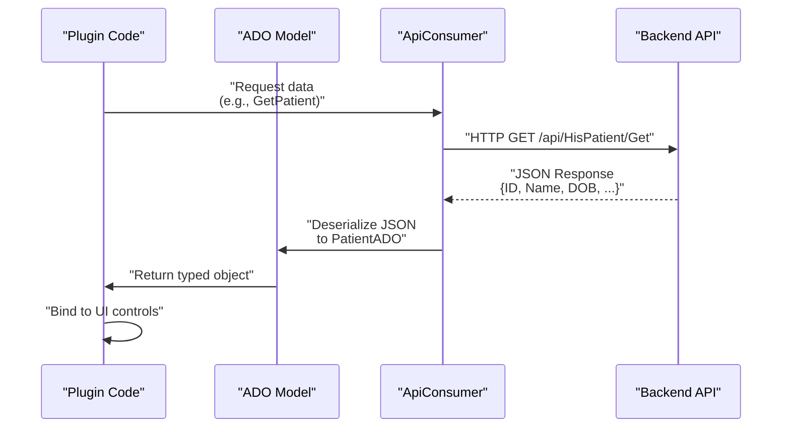

**Sources**: [HIS/HIS.Desktop/ApiConsumer/ 13 files](), [Common/Inventec.Common/WebApiClient/]()

### Common API Integration Pattern

```
1. Plugin calls ApiConsumer method
   Example: ApiConsumerStore.MosConsumer.HisPatient.Get(id)

2. ApiConsumer uses WebApiClient to make HTTP request
   Uses Inventec.Common.WebApiClient for REST calls

3. Response deserialized to MOS backend entity
   Example: MOS.EFMODEL.DataModels.HIS_PATIENT

4. Backend entity converted to ADO model
   Example: PatientADO.FromBackendData(HIS_PATIENT)

5. ADO model returned to plugin
   Plugin uses ADO for UI binding and business logic
```

**Sources**: [HIS/HIS.Desktop/ApiConsumer/](), [Common/Inventec.Common/WebApiClient/]()

---

## Usage in Plugins

### Pattern 1: Direct Instantiation

Plugins create ADO instances directly for data entry scenarios:

```csharp
// Example pattern (not actual code)
var patientADO = new PatientADO
{
    FirstName = txtFirstName.Text,
    LastName = txtLastName.Text,
    DOB = dateEditDOB.DateTime
};
```

Referenced in: [HIS/Plugins/HIS.Desktop.Plugins.Register/ 81-102 files]()

### Pattern 2: API Response Mapping

ApiConsumer returns ADO models populated from backend:

```csharp
// Example pattern
List<TreatmentADO> treatments = ApiConsumer.GetTreatmentList(filter);
gridControl.DataSource = treatments;
```

Referenced in: [HIS/Plugins/HIS.Desktop.Plugins.Treatment/]()

### Pattern 3: UI Control Binding

ADO models bound to DevExpress grid/tree controls:

```csharp
// Example pattern for grid binding
List<MedicineTypeADO> medicines = GetMedicineList();
gridControlMedicine.DataSource = medicines;
gridViewMedicine.BestFitColumns();
```

Referenced in: [HIS/UC/HIS.UC.MedicineType:82 files](), [HIS/Plugins/HIS.Desktop.Plugins.AssignPrescriptionPK:203 files]()

### Pattern 4: Data Conversion for Print

ADO models converted to Print Data Objects (PDO) for MPS:

```csharp
// Example pattern
var printData = new Mps000123.PDO(
    treatmentADO: currentTreatment,
    sereServADOs: serviceList,
    patientADO: currentPatient
);
```

Referenced in: [MPS/MPS.Processor/ 790+ processors](), [MPS/MPS.ProcessorBase/ 30 files]()

**Sources**: [HIS/Plugins/ directory structure](), [MPS/MPS.Processor/]()

---

## LocalStorage Caching

ADO models are frequently cached in `HIS.Desktop.LocalStorage.BackendData` to reduce API calls and improve performance.

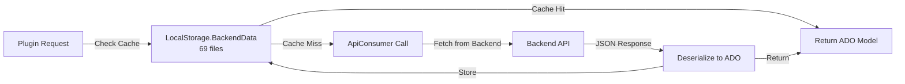

### Cached Data Categories

| Cache Type | ADO Models | Refresh Strategy |
|------------|------------|------------------|
| **Reference Data** | MedicineTypeADO, MaterialTypeADO, IcdADO | On application start, manual refresh |
| **User Context** | WorkPlaceADO, UserADO, BranchADO | On login, session change |
| **Configuration** | ConfigADO, FormTypeADO, HisConfigKeys | On start, config change events |
| **Master Data** | ServiceADO, RoomADO, DepartmentADO | Periodic refresh, event-driven |

**Sources**: [HIS/HIS.Desktop/LocalStorage/BackendData:69 files](), [HIS/HIS.Desktop/LocalStorage/ConfigApplication/]()

---

## Example: Auto-Update System Data Models

While not part of `HIS.Desktop.ADO`, the auto-update system in `Inventec.Aup.Client` demonstrates typical data model patterns used throughout the codebase.

### DownloadFileInfo Class

Represents a file pending download during auto-update:

```
Class: DownloadFileInfo
Purpose: Tracks download metadata for update files
Location: Common/Inventec.Aup.Client/AutoUpdater/AutoUpdateHelper/DownloadFileInfo.cs

Properties:
- DownloadUrl: string (remote file URL)
- FileFullName: string (local file path)
- FileName: string (file name only)
- LastVer: string (previous version)
- Size: int (file size in bytes)
- TryTimes: int (download retry counter)
- Version: string (target version)
```

**Sources**: [[`Common/Inventec.Aup.Client/Inventec.Aup.Client/AutoUpdater/AutoUpdateHelper/DownloadFileInfo.cs:1-71`](../../Common/Inventec.Aup.Client/Inventec.Aup.Client/AutoUpdater/AutoUpdateHelper/DownloadFileInfo.cs#L1-L71)](../../Common/Inventec.Aup.Client/Inventec.Aup.Client/AutoUpdater/AutoUpdateHelper/DownloadFileInfo.cs#L1-L71)

### LocalFile Class

Represents local file state, persisted as XML:

```
Class: LocalFile
Purpose: Tracks installed file versions
Location: Common/Inventec.Aup.Client/AutoUpdater/AutoUpdateHelper/LocalFile.cs

XML Serialization Attributes:
- [XmlAttribute("path")] Path: string
- [XmlAttribute("lastver")] LastVer: string
- [XmlAttribute("size")] Size: int
- [XmlAttribute("version")] Version: string
- [XmlAttribute("tryTimes")] TryTimes: string

Constructor Overloads:
1. LocalFile(path, ver, size, versionid) - full initialization
2. LocalFile() - parameterless for XML deserialization
```

**Sources**: [[`Common/Inventec.Aup.Client/Inventec.Aup.Client/AutoUpdater/AutoUpdateHelper/LocalFile.cs:1-78`](../../Common/Inventec.Aup.Client/Inventec.Aup.Client/AutoUpdater/AutoUpdateHelper/LocalFile.cs#L1-L78)](../../Common/Inventec.Aup.Client/Inventec.Aup.Client/AutoUpdater/AutoUpdateHelper/LocalFile.cs#L1-L78)

### RemoteFile Class

Parses XML manifest from update server:

```
Class: RemoteFile
Purpose: Represents available updates from server
Location: Common/Inventec.Aup.Client/AutoUpdater/AutoUpdateHelper/RemoteFile.cs

XML Parsing (Constructor):
- Reads XmlNode attributes: path, url, lastver, size, needRestart, version, hash
- Supports cfgAupUri parameter for URL prefix configuration
- Converts string attributes to appropriate types (bool, int)

Properties:
- Path, Url, LastVer, Size, NeedRestart (bool), Version, Hash
- Read-only (no setters) - immutable after construction
```

**Sources**: [[`Common/Inventec.Aup.Client/Inventec.Aup.Client/AutoUpdater/AutoUpdateHelper/RemoteFile.cs:1-74`](../../Common/Inventec.Aup.Client/Inventec.Aup.Client/AutoUpdater/AutoUpdateHelper/RemoteFile.cs#L1-L74)](../../Common/Inventec.Aup.Client/Inventec.Aup.Client/AutoUpdater/AutoUpdateHelper/RemoteFile.cs#L1-L74)

### Pattern Analysis

These three classes demonstrate common ADO model patterns:

| Pattern | Example | HIS.Desktop.ADO Equivalent |
|---------|---------|---------------------------|
| **Property Bags** | Simple data holders with public properties | Most ADO models |
| **XML Serialization** | `LocalFile` with `[XmlAttribute]` | ConfigADO, FormTypeADO |
| **Constructor Initialization** | `RemoteFile(XmlNode)` | ADO models with `FromBackendData()` |
| **Type Conversion** | String to int/bool in `RemoteFile` | All ADO models parsing JSON |
| **Immutable vs Mutable** | `RemoteFile` read-only vs `LocalFile` mutable | Varies by ADO type |

---

## ADO Model Design Best Practices

Based on the codebase architecture:

### 1. Separation of Concerns

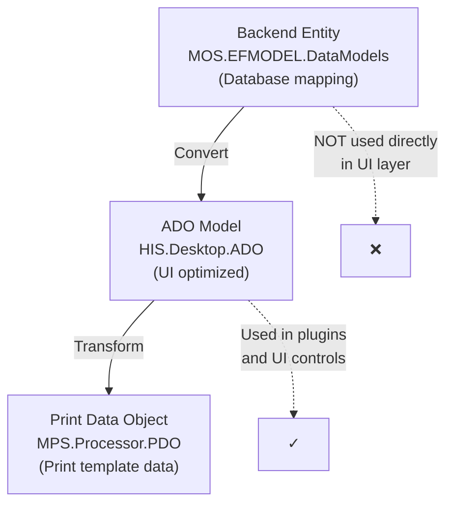

**Rationale**: Backend entities contain ORM attributes and database concerns. ADO models are clean, UI-focused objects.

### 2. Property Naming Conventions

| Convention | Example | Reason |
|------------|---------|--------|
| PascalCase properties | `FirstName`, `BirthDate` | C# standard |
| Suffix "ADO" on class | `PatientADO`, `TreatmentADO` | Clear distinction from backend entities |
| Display properties | `PatientName`, `DisplayCode` | Pre-formatted for UI |
| Flag properties | `IsActive`, `IsLocked`, `IsSelected` | Boolean UI state |

### 3. Computed Properties

ADO models often include computed properties for UI convenience:

```
Example ADO pattern:
- AgeString: string (computed from DOB)
- TotalAmountDisplay: string (formatted currency)
- StatusName: string (enum to display text)
- IsEditable: bool (based on workflow state)
```

### 4. Validation Attributes

Common data annotation attributes used:

- `[Required]` - mandatory fields
- `[MaxLength(n)]` - string length limits
- `[Range(min, max)]` - numeric bounds
- `[RegularExpression]` - format validation

### 5. Collection Properties

For parent-child relationships:

```
Parent ADO:
- TreatmentADO.ServiceReqs: List<ServiceReqADO>
- PatientADO.PatientTypeAlters: List<PatientTypeAlterADO>
- ExpMestADO.ExpMestMedicines: List<ExpMestMedicineADO>
```

---

## Integration with EntityFramework

While the backend uses EntityFramework extensively, the desktop application's ADO models are **not** EF entities. Key differences:

| Backend (Server-side) | Desktop ADO (Client-side) |
|----------------------|---------------------------|
| EF Code-First or Database-First | Plain C# classes (POCOs) |
| DbContext for data access | ApiConsumer for data access |
| Navigation properties tracked by EF | Manual relationship management |
| Database annotations | UI-focused attributes |
| Change tracking enabled | No automatic change tracking |

**Purpose**: Desktop ADO models are designed for disconnected client scenarios with REST API communication.

**Sources**: General architecture pattern, [HIS/HIS.Desktop/ApiConsumer/]()

---

## Summary

The `HIS.Desktop.ADO` folder (74 files) provides:

1. **Data Transfer Objects** for all major business domains (patient, treatment, medicine, billing, etc.)
2. **UI-Optimized Models** with display properties and computed fields
3. **API Integration Layer** between plugins and backend services
4. **Caching Support** through LocalStorage.BackendData
5. **Type Safety** ensuring compile-time checking across 956 plugins
6. **Reusability** shared across plugins, user controls, and print processors

These models form the backbone of data flow in the HIS Desktop application, providing a clean separation between UI concerns and backend API communication.

**Sources**: [HIS/HIS.Desktop/ADO/ directory](), [HIS/Plugins/ structure](), [HIS/UC/ structure](), [HIS/HIS.Desktop/ApiConsumer/](), [HIS/HIS.Desktop/LocalStorage/BackendData/]()