## Mục tiêu và Phạm vi

Tài liệu này trình bày về namespace **HIS.Desktop.Plugins.Library.***, bao gồm 36 plugin hỗ trợ chuyên sâu, cung cấp các chức năng có thể tái sử dụng cho các plugin khác trong hệ thống HIS. Các plugin thư viện (library plugins) này giải quyết các vấn đề mang tính nền tảng như: hóa đơn điện tử, các hoạt động in ấn tùy chỉnh, mở rộng quy trình điều trị và các tiện ích logic nghiệp vụ dùng chung.

Khác với các plugin theo domain nghiệp vụ (được nêu trong các phần từ [1.1.3.1](../03-technical-specs/his-desktop/business-plugins.md) đến [1.1.3.10](../02-business-processes/administration/03-system-data-business.md)), các Plugin Thư viện được thiết kế để nhiều plugin khác nhau cùng khai thác thay vì triển khai một tính năng nghiệp vụ độc lập. Để biết thêm thông tin về kiến trúc tổng thể và vòng đời của plugin, vui lòng xem [Kiến trúc Hệ thống Plugin](../01-architecture/plugin-system/02-discovery-lifecycle.md). Về tích hợp hệ thống in, xem [Hệ thống in MPS](../03-technical-specs/his-desktop/business-plugins.md#mps-print).

## Kiến trúc Plugin Thư viện

Các plugin thư viện tuân theo các mô hình cấu trúc tương tự như plugin nghiệp vụ nhưng được thiết kế chuyên biệt để tái sử dụng. Chúng cung cấp các API, model dữ liệu và các thành phần giao diện (UI components) mà các plugin khác có thể sử dụng thông qua tham chiếu trực tiếp hoặc mô hình giao tiếp `DelegateRegister`.

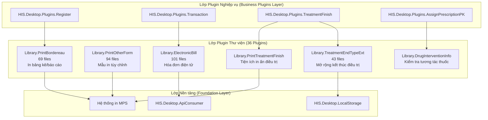

**Nguồn tham khảo:** [HIS/Plugins/](), [`.devin/wiki.json:170-177`](../../../.devin/wiki.json#L170-L177)

## Các Plugin Thư viện chính

### Plugin ElectronicBill (101 files)

`HIS.Desktop.Plugins.Library.ElectronicBill` là plugin thư viện lớn nhất, cung cấp đầy đủ chức năng về hóa đơn điện tử theo quy định của cơ quan thuế Việt Nam. Nó tích hợp với nhiều nhà cung cấp hóa đơn điện tử khác nhau và quản lý toàn bộ vòng đời của một hóa đơn.

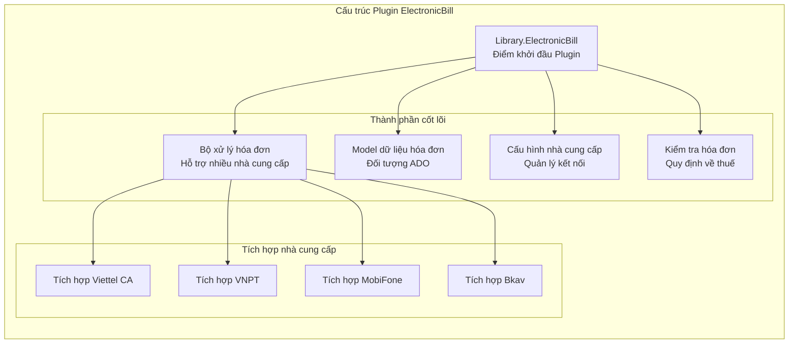

**Các thành phần then chốt:**
- **Tạo hóa đơn (Invoice Generation):** Tạo hóa đơn điện tử từ dữ liệu giao dịch.
- **Trừu tượng hóa nhà cung cấp (Provider Abstraction):** Hỗ trợ đồng thời nhiều nhà cung cấp dịch vụ hóa đơn điện tử.
- **Quản lý chữ ký (Signature Management):** Xử lý chữ ký số và chứng thư số.
- **Theo dõi trạng thái (Status Tracking):** Giám sát quá trình gửi và phê duyệt hóa đơn.
- **Công cụ kiểm tra (Validation Engine):** Đảm bảo tuân thủ các yêu cầu của cơ quan thuế.

**Nguồn tham khảo:** [HIS/Plugins/HIS.Desktop.Plugins.Library.ElectronicBill/](), [`.devin/wiki.json:174-176`](../../../.devin/wiki.json#L174-L176)

### Plugin PrintOtherForm (94 files)

`HIS.Desktop.Plugins.Library.PrintOtherForm` cung cấp khả năng in ấn linh hoạt cho các biểu mẫu không nằm trong các template chuẩn của bộ xử lý MPS. Nó cho phép tạo biểu mẫu động và dàn trang tùy chỉnh.

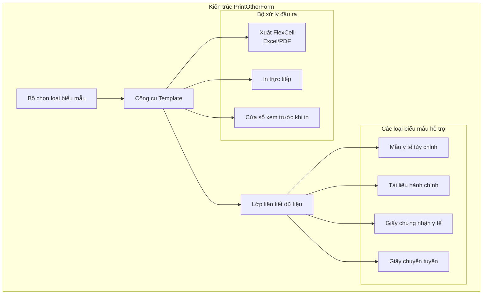

**Các tính năng chính:**
- Hỗ trợ các template biểu mẫu tùy chỉnh nằm ngoài bộ xử lý MPS chuẩn.
- Liên kết dữ liệu động từ nhiều nguồn dữ liệu khác nhau.
- Xem trước khi in (Print preview) thời gian thực với khả năng chỉnh sửa.
- Hỗ trợ nhiều định dạng xuất (PDF, Excel, Word).

**Nguồn tham khảo:** [HIS/Plugins/HIS.Desktop.Plugins.Library.PrintOtherForm/](), [`.devin/wiki.json:174-176`](../../../.devin/wiki.json#L174-L176)

### Plugin PrintBordereau (69 files)

`HIS.Desktop.Plugins.Library.PrintBordereau` chuyên biệt cho việc in các bảng kê chi tiết cho yêu cầu bảo hiểm, tổng hợp hóa đơn và báo cáo tồn kho.

**Các loại bảng kê thông dụng:**

| Loại bảng kê | Mục đích | Nguồn dữ liệu |
|--------------|----------|---------------|
| Bảng kê Bảo hiểm | Danh sách yêu cầu bảo hiểm y tế | Giao dịch điều trị |
| Bảng kê Thanh toán | Tổng hợp thanh toán cho bệnh nhân | Giao dịch tài chính |
| Bảng kê Thuốc | Danh sách thuốc theo đơn | Phát thuốc tại quầy dược |
| Bảng kê Dịch vụ | Tổng hợp các dịch vụ y tế | Bản ghi thực hiện dịch vụ |
| Bảng kê Vật tư | Sử dụng vật tư y tế | Tiêu hao vật tư |

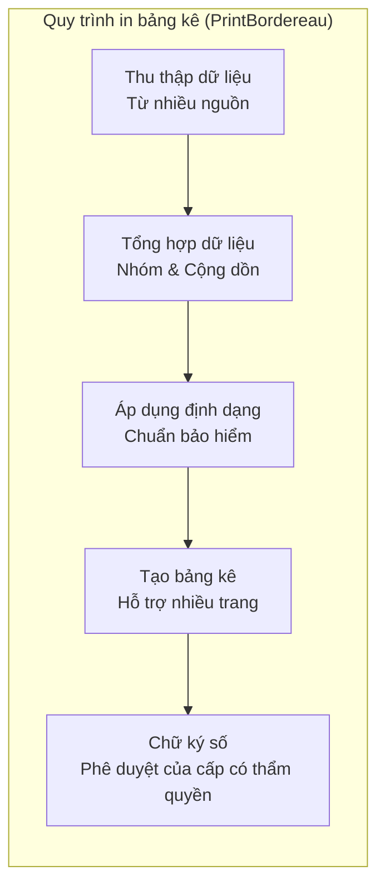

**Khả năng chính:**
- In bảng kê nhiều trang với tính năng phân trang tự động.
- Tuân thủ các tiêu chuẩn bảo hiểm (Bảo hiểm Xã hội Việt Nam).
- Tích hợp chữ ký số.
- In hàng loạt (Batch printing) cho nhiều bảng kê cùng lúc.
- Xuất dữ liệu theo các định dạng yêu cầu của chính phủ.

**Nguồn tham khảo:** [HIS/Plugins/HIS.Desktop.Plugins.Library.PrintBordereau/](), [`.devin/wiki.json:174-176`](../../../.devin/wiki.json#L174-L176)

### Plugin TreatmentEndTypeExt (43 files)

`HIS.Desktop.Plugins.Library.TreatmentEndTypeExt` cung cấp khả năng mở rộng cho các quy trình kết thúc điều trị, cho phép tùy chỉnh các thủ tục xuất viện, giao thức chuyển viện và logic kết thúc điều trị.

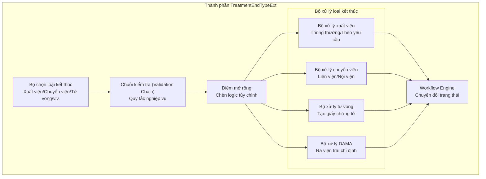

**Cơ chế mở rộng:**
- **Pre-validation Hooks:** Các bước kiểm tra tùy chỉnh trước khi xử lý loại kết thúc.
- **Post-processing Actions:** Các tác vụ tự động sau khi hoàn tất điều trị.
- **Các loại kết thúc tùy chỉnh:** Các danh mục xuất viện đặc thù của từng cơ sở.
- **Tạo tài liệu:** Tự động tạo các giấy tờ xuất viện.
- **Kích hoạt thông báo:** Cảnh báo cho các khoa phòng liên quan.

**Nguồn tham khảo:** [HIS/Plugins/HIS.Desktop.Plugins.Library.TreatmentEndTypeExt/](), [`.devin/wiki.json:174-176`](../../../.devin/wiki.json#L174-L176)

## Các Plugin Thư viện bổ sung

### Thư viện An toàn & Tương tác Thuốc

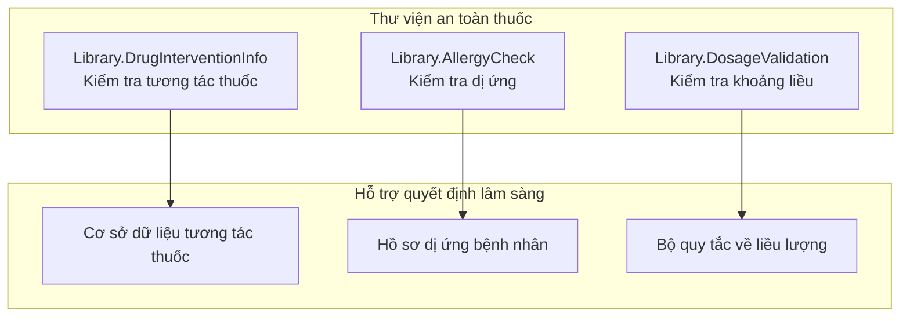

**Plugin DrugInterventionInfo:**
- Phát hiện tương tác thuốc - thuốc.
- Kiểm tra chống chỉ định dựa trên tình trạng bệnh nhân.
- Phân loại mức độ nghiêm trọng (nặng, trung bình, nhẹ).
- Đưa ra gợi ý thuốc thay thế.
- Tích hợp với các plugin kê đơn.

**Nguồn tham khảo:** [HIS/Plugins/HIS.Desktop.Plugins.Library.DrugInterventionInfo/]()

### Thư viện Tiện ích In ấn

| Tên Plugin | Số file | Mục đích |
|-------------|-------|---------|
| `Library.PrintTreatmentFinish` | ~35 | Các tài liệu khi kết thúc điều trị |
| `Library.PrintMedicalReport` | ~28 | Tạo báo cáo y tế |
| `Library.PrintAppointment` | ~22 | Thẻ hẹn và nhắc hẹn |
| `Library.PrintLabel` | ~18 | In mã vạch và nhãn |
| `Library.PrintCertificate` | ~24 | Giấy chứng nhận y tế |

### Thư viện Nhập/Xuất Dữ liệu

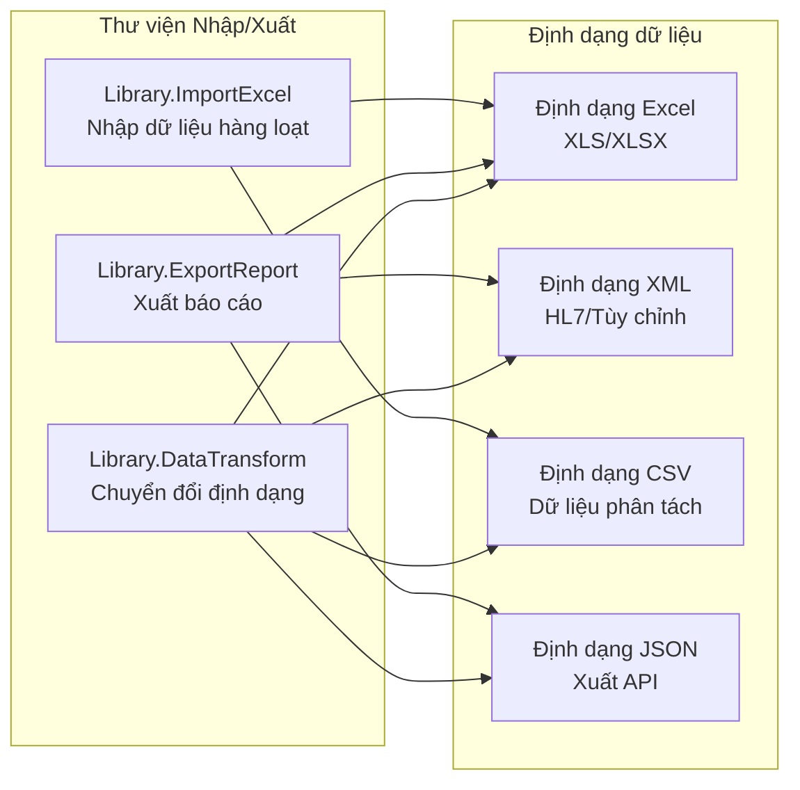

**Nguồn tham khảo:** [HIS/Plugins/HIS.Desktop.Plugins.Library.*/]()

### Thư viện Liên lạc & Thông báo

**Các plugin then chốt:**
- `Library.MessageBus`: Hạ tầng nhắn tin giữa các plugin.
- `Library.NotificationCenter`: Quản lý thông báo tập trung.
- `Library.EventAggregator`: Tổng hợp và phân phối sự kiện.
- `Library.SignalRClient`: Client cho giao tiếp thời gian thực.

Các plugin này mở rộng hệ thống `PubSub` cơ bản (được nêu trong [Thông báo & Sự kiện](#1.1.5)) với các mô hình nhắn tin đặc thù cho từng domain.

**Nguồn tham khảo:** [HIS/Plugins/HIS.Desktop.Plugins.Library.*/]()

## Các mô hình tích hợp

### Mô hình sử dụng (Consumption Pattern)

Các plugin thư viện được các plugin nghiệp vụ khai thác thông qua ba cơ chế chính:

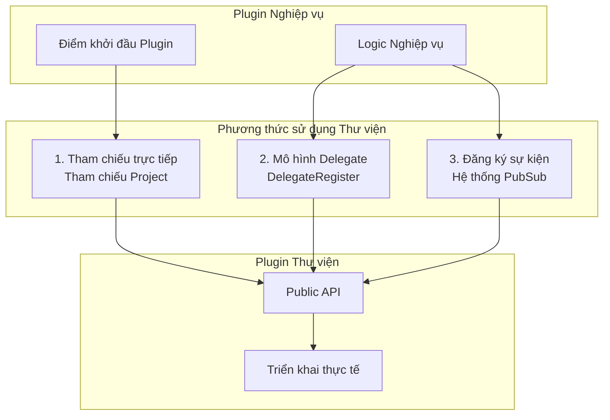

**Nguồn tham khảo:** [HIS/Plugins/](), [HIS/HIS.Desktop/]()

### Ví dụ về cấu trúc sử dụng thông dụng

Ví dụ, plugin `Transaction` sử dụng thư viện `ElectronicBill`:

1. **Plugin Transaction** tạo dữ liệu giao dịch.
2. Gọi API của `Library.ElectronicBill` để tạo hóa đơn điện tử.
3. `ElectronicBill` kiểm tra dữ liệu đối chiếu với các quy định về thuế.
4. Gửi hóa đơn tới nhà cung cấp đã cấu hình (Viettel CA, VNPT, v.v.).
5. Trả về số hóa đơn và trạng thái cho plugin `Transaction`.
6. `Transaction` cập nhật bản ghi giao dịch với thông tin hóa đơn.

**Nguồn tham khảo:** [HIS/Plugins/HIS.Desktop.Plugins.Transaction/](), [HIS/Plugins/HIS.Desktop.Plugins.Library.ElectronicBill/]()

## Mô hình cấu trúc Plugin

Hầu hết các Plugin Thư viện đều tuân theo cấu trúc thư mục tiêu chuẩn sau:

```
Library.[Tên-Plugin]/
├── [Tên-Plugin].cs          # Điểm khởi đầu của Plugin
├── Run/                     # Giao diện chính và logic
│   ├── frmMain.cs
│   ├── frmMain.Designer.cs
│   └── [Tên-Plugin]Behavior.cs
├── ADO/                     # Các đối tượng dữ liệu
│   ├── [Tên-Plugin]ADO.cs
│   └── [Liên-quan]ADO.cs
├── Base/                    # Các lớp nền tảng
│   ├── RequestBase.cs
│   └── ProcessorBase.cs
├── Processors/              # Bộ xử lý logic nghiệp vụ
│   ├── Processor1.cs
│   └── Processor2.cs
├── Config/                  # Cấu hình
│   └── [Tên-Plugin]CFG.cs
├── Validation/              # Các quy tắc kiểm tra
│   └── [Tên-Plugin]ValidationRule.cs
└── Resources/               # Tài nguyên giao diện
    └── lang/
```

**Nguồn tham khảo:** [HIS/Plugins/HIS.Desktop.Plugins.Library.*/]()

## Phân loại Plugin Thư viện

36 Plugin Thư viện có thể được phân loại theo lĩnh vực chức năng:

| Lĩnh vực | Số lượng plugin | Ví dụ |
|----------|--------------|----------|
| **Hóa đơn điện tử** | 3 | ElectronicBill, InvoiceSync, TaxIntegration |
| **Tiện ích In ấn** | 8 | PrintOtherForm, PrintBordereau, PrintTreatmentFinish, PrintLabel |
| **Mở rộng Điều trị** | 5 | TreatmentEndTypeExt, TreatmentWorkflow, TreatmentValidation |
| **An toàn Thuốc** | 4 | DrugInterventionInfo, DrugInteractionCheck, AllergyCheck |
| **Nhập/Xuất Dữ liệu** | 6 | ImportExcel, ExportReport, DataTransform, BulkImport |
| **Liên lạc** | 4 | MessageBus, NotificationCenter, EventAggregator, SignalRClient |
| **Kiểm tra & Quy tắc** | 3 | ValidationEngine, BusinessRules, ComplianceCheck |
| **Tiện ích khác** | 3 | DateTimeHelper, StringHelper, NumberFormat |

**Nguồn tham khảo:** [HIS/Plugins/HIS.Desktop.Plugins.Library.*/](), [`.devin/wiki.json:170-177`](../../../.devin/wiki.json#L170-L177)

## Thiết kế bề mặt API (API Surface Design)

Các plugin thư viện công khai (expose) các API được định nghĩa rõ ràng thông qua interface và abstract class:

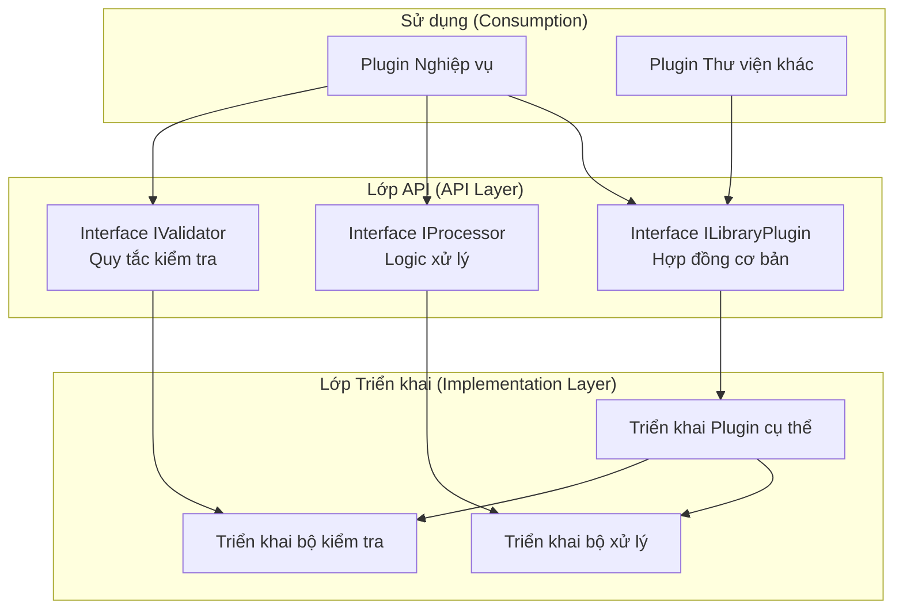

**Nguồn tham khảo:** [HIS/Plugins/HIS.Desktop.Plugins.Library.*/]()

## Phụ thuộc và Tham chiếu

Các plugin thư viện hạn chế tối đa việc phụ thuộc (dependencies) để đảm bảo khả năng tái sử dụng rộng rãi:

**Các phụ thuộc được phép:**
- `HIS.Desktop.Common`: Các interface và class cơ bản dùng chung.
- `HIS.Desktop.ADO`: Các model dữ liệu.
- `HIS.Desktop.LocalStorage`: Cấu hình và bộ nhớ đệm.
- `HIS.Desktop.ApiConsumer`: Truy cập API backend.
- `Inventec.Common.*`: Các tiện ích nền tảng.
- `Inventec.UC.*`: Các control giao diện dùng chung.

**Các phụ thuộc bị cấm:**
- Tham chiếu trực tiếp đến các plugin nghiệp vụ khác.
- Phụ thuộc vòng (circular dependencies) với các plugin sử dụng.
- Các thư viện bên ngoài khi chưa được phê duyệt.

**Nguồn tham khảo:** [HIS/Plugins/HIS.Desktop.Plugins.Library.*/]()

## Đăng ký và Khám phá (Registration and Discovery)

Các plugin thư viện đăng ký với hệ thống plugin nhưng được đánh dấu là không thể khởi tạo trực tiếp từ giao diện. Chúng được tìm thấy thông qua cơ chế khám phá plugin chuẩn nhưng được sử dụng thông qua lập trình:

**Ví dụ về Plugin Descriptor:**
- **IsLibrary:** `true`
- **IsVisible:** `false` (không hiển thị trên menu UI)
- **IsAutoLoad:** `true` (được tải khi khởi động)
- **ExportTypes:** Danh sách các interface được công khai.

**Nguồn tham khảo:** [HIS/Plugins/](), [HIS/HIS.Desktop/]()

## Tài liệu liên quan

- Về kiến trúc plugin tổng thể, xem [Kiến trúc Hệ thống Plugin](../01-architecture/plugin-system/01-overview.md).
- Về chi tiết tích hợp hệ thống in, xem [Hệ thống in MPS](../03-technical-specs/his-desktop/business-plugins.md#mps-print).
- Về các tiện ích hóa đơn điện tử từ lớp Common, xem [Tiện ích Inventec Common](../03-technical-specs/common-libraries/libraries.md#inventec-common).
- Về giao tiếp dựa trên sự kiện, xem [Thông báo & Sự kiện](#1.1.5).

# Model## Mục tiêu và Phạm vi

Tài liệu này mô tả về thư mục `HIS.Desktop.ADO/` (74 files), nơi chứa các Đối tượng Dữ liệu Hoạt động (Active Data Objects - ADO) và các model dữ liệu được sử dụng trong ứng dụng HIS Desktop. Các model này đóng vai trò là các đối tượng chuyển đổi dữ liệu (Data Transfer Objects - DTO) giữa lớp hiển thị (plugin), lớp giao tiếp API và bộ nhớ đệm (cache) cục bộ.

Để biết thêm thông tin về:
- Giao tiếp API và tích hợp backend, xem [Lớp API Consumer](#1.1.2).
- Bộ nhớ đệm dữ liệu cục bộ và cấu hình, xem [LocalStorage & Cấu hình](../03-technical-specs/his-desktop/core.md).
- Cách các plugin sử dụng các model này, xem [Kiến trúc Hệ thống Plugin](../01-architecture/plugin-system/01-overview.md).

---

## Tổng quan

Dự án `HIS.Desktop.ADO` bao gồm 74 file model dữ liệu định nghĩa cấu trúc dữ liệu lu chuyển trong ứng dụng. Thuật ngữ "ADO" ở đây ám chỉ các Active Data Objects — các class C# đại diện cho các thực thể và cấu trúc dữ liệu được sử dụng bởi 956 plugin trong hệ thống.

### Các đặc điểm chính

- **Đối tượng Chuyển đổi Dữ liệu (DTOs):** Các model được thiết kế để truyền tải dữ liệu giữa các lớp.
- **Tối ưu cho Frontend:** Được tinh chỉnh để phù hợp với việc liên kết giao diện (UI binding) và logic hiển thị.
- **Model hỗn hợp (Hybrid Models):** Thường kết hợp dữ liệu từ nhiều thực thể backend cho các kịch bản UI cụ thể.
- **Không chứa Logic nghiệp vụ:** Đơn thuần là các bộ chứa dữ liệu với các thuộc tính và các quy tắc kiểm tra (validation) cơ bản.

---

## Kiến trúc & Luồng dữ liệu

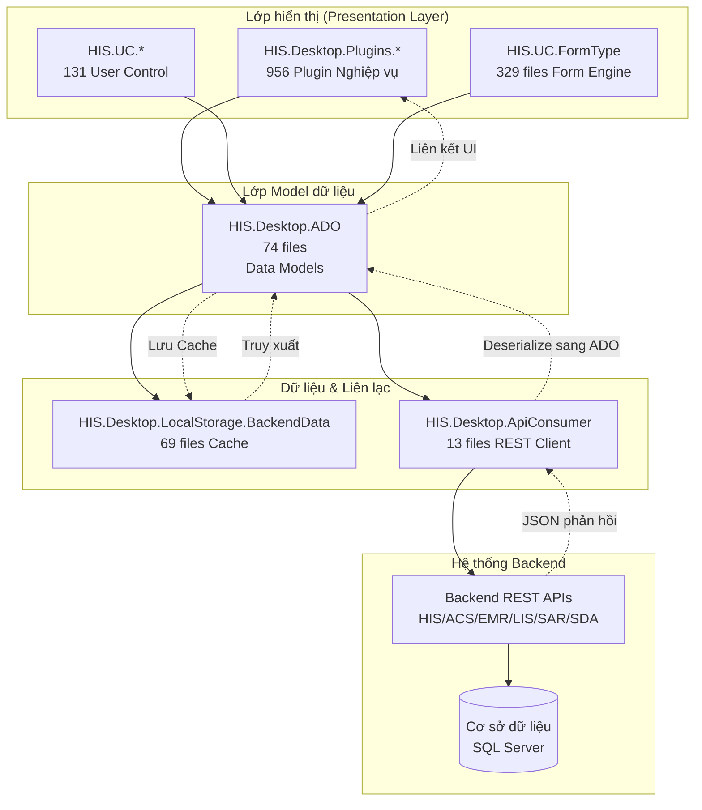

**Mô hình Luồng dữ liệu:**
1. **Yêu cầu từ Plugin:** Plugin cần dữ liệu cho một hoạt động nghiệp vụ cụ thể.
2. **Khởi tạo ADO Model:** Plugin tạo mới hoặc yêu cầu một thực thể ADO model.
3. **Kiểm tra Cache:** Hệ thống kiểm tra dữ liệu trong `LocalStorage.BackendData`.
4. **Gọi API** (nếu không có trong cache): `ApiConsumer` truy xuất từ API backend.
5. **Deserialization:** Chuyển đổi JSON phản hồi thành các ADO model.
6. **Liên kết UI:** ADO model được liên kết với các UI control để hiển thị hoặc chỉnh sửa.
7. **Kiểm tra & Gửi dữ liệu:** Dữ liệu đã thay đổi được gửi ngược lại thông qua `ApiConsumer`.

**Nguồn tham khảo:** Dựa trên Sơ đồ 3 từ tổng quan kiến trúc hệ thống, [cấu trúc thư mục HIS/HIS.Desktop/ADO/]()

---

## Cấu trúc ADO Model

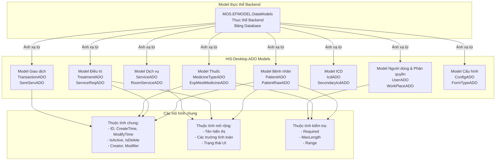

**Nguồn tham khảo:** [Thư mục HIS/HIS.Desktop/ADO/](), dựa trên các mô hình ADO phổ biến.

---

## Các danh mục Model dữ liệu

74 file trong `HIS.Desktop.ADO` được tổ chức thành các danh mục logic dựa trên domain nghiệp vụ:

### Model Quản lý Bệnh nhân

| Loại Model | Mục đích | Sử dụng bởi |
|------------|---------|---------|
| `PatientADO` | Dữ liệu hành chính và đăng ký bệnh nhân | Các plugin Đăng ký, Hẹn khám, Tiếp đón |
| `PatientRawADO` | Dữ liệu thô trước khi kiểm tra | Các biểu mẫu nhập liệu bệnh nhân |
| `PatientTypeAlterADO` | Lịch sử thay đổi đối tượng bệnh nhân | Các plugin Điều trị, Thanh toán |
| `TreatmentBedRoomADO` | Dữ liệu điều trị và phân giường | Các plugin Nhập viện, Quản lý buồng giường |

**Nguồn tham khảo:** [HIS/Plugins/HIS.Desktop.Plugins.Register/](), [HIS/UC/HIS.UC.PatientSelect: 39 files]()

### Model Điều trị & Lâm sàng

| Loại Model | Mục đích | Sử dụng bởi |
|------------|---------|---------|
| `TreatmentADO` | Phiên điều trị và lịch sử | Các plugin Điều trị, Khám bệnh, Theo dõi |
| `ServiceReqADO` | Yêu cầu dịch vụ (đơn thuốc, xét nghiệm, thủ thuật) | Các plugin Chỉ định đơn thuốc, Thực hiện dịch vụ |
| `SereServADO` | Bản ghi thực hiện dịch vụ | Các plugin Khám bệnh, Kết quả điều trị |
| `TrackingADO` | Theo dõi bệnh nhân và dấu hiệu sinh tồn | Các plugin Theo dõi, Khám bệnh |

**Nguồn tham khảo:** [HIS/Plugins/HIS.Desktop.Plugins.AssignPrescriptionPK: 203 files](), [HIS/Plugins/HIS.Desktop.Plugins.ServiceExecute: 119 files]()

### Model Thuốc & Vật tư

| Loại Model | Mục đích | Sử dụng bởi |
|------------|---------|---------|
| `MedicineTypeADO` | Danh mục thuốc kèm thông tin tồn kho | Các plugin Loại thuốc, Đơn thuốc |
| `MaterialTypeADO` | Danh mục vật tư y tế | Các plugin Loại vật tư, Xuất kho |
| `ExpMestMedicineADO` | Chi tiết yêu cầu xuất thuốc | Các plugin Xuất kho, Dược |
| `ImpMestMedicineADO` | Bản ghi nhập thuốc | Các plugin Nhập kho (80 files) |
| `MediStockADO` | Dữ liệu kho/tồn kho | Các plugin Kho dược |

**Nguồn tham khảo:** [HIS/Plugins/HIS.Desktop.Plugins.ImpMestCreate: 80 files](), [HIS/UC/HIS.UC.MedicineType: 82 files](), [HIS/UC/HIS.UC.MaterialType: 85 files]()

### Model Giao dịch & Thanh toán

| Loại Model | Mục đích | Sử dụng bởi |
|------------|---------|---------|
| `TransactionADO` | Bản ghi giao dịch thanh toán | Các plugin Giao dịch, Thu ngân |
| `DepositADO` | Tạm ứng và hoàn ứng | Yêu cầu tạm ứng (30 files), Giao dịch tạm ứng |
| `DebtADO` | Bản ghi nợ chưa thanh toán | Giao dịch nợ, các plugin thanh toán |
| `SereServBillADO` | Các dòng chi tiết hóa đơn dịch vụ | Thanh toán hóa đơn (48 files), các plugin Hóa đơn |

**Nguồn tham khảo:** [HIS/Plugins/HIS.Desktop.Plugins.TransactionBill: 48 files](), [HIS/Plugins/HIS.Desktop.Plugins.DepositRequest: 30 files]()

### Model ICD & Chẩn đoán

| Loại Model | Mục đích | Sử dụng bởi |
|------------|---------|---------|
| `IcdADO` | Mã chẩn đoán ICD-10 chính | ICD UC (65 files), các plugin Khám bệnh |
| `SecondaryIcdADO` | Các mã ICD phụ/bệnh kèm theo | SecondaryIcd UC (61 files), các plugin Khám bệnh |
| `TraditionalIcdADO` | Chẩn đoán y học cổ truyền | Các plugin Y học cổ truyền |

**Nguồn tham khảo:** [HIS/UC/HIS.UC.Icd: 65 files](), [HIS/UC/HIS.UC.SecondaryIcd: 61 files]()

### Model Dịch vụ & Buồng phòng

| Loại Model | Mục đích | Sử dụng bởi |
|------------|---------|---------|
| `ServiceADO` | Danh mục dịch vụ y tế | Các plugin chọn dịch vụ, chỉ định |
| `ServiceRoomADO` | Ánh xạ khả năng cung cấp dịch vụ - phòng | ServiceRoom UC (48 files), lập lịch |
| `RoomADO` | Thông tin phòng/khoa | Quản lý phòng, các plugin điều hướng |
| `ExecuteRoomADO` | Chỉ định phòng thực hiện | Thực hiện dịch vụ, gọi bệnh nhân |

**Nguồn tham khảo:** [HIS/UC/HIS.UC.ServiceRoom: 48 files](), [HIS/UC/HIS.UC.RoomExamService: 40 files]()

### Model Cấu hình & Hệ thống

| Loại Model | Mục đích | Sử dụng bởi |
|------------|---------|---------|
| `ConfigADO` | Các thiết lập cấu hình ứng dụng | ConfigApplication, các plugin hệ thống |
| `FormTypeADO` | Cấu hình biểu mẫu động | FormType UC (329 files) |
| `WorkPlaceADO` | Ngữ cảnh nơi làm việc/chi nhánh người dùng | Quản lý phiên làm việc, phân quyền |
| `ModuleADO` | Metadata của plugin module | Tải plugin, điều hướng |

**Nguồn tham khảo:** [HIS/UC/HIS.UC.FormType: 329 files](), [HIS/Desktop/LocalStorage/ConfigApplication/]()

---

## Tích hợp với Backend API

### Ánh xạ phản hồi API

Các ADO model được thiết kế để khớp với cấu trúc của các phản hồi (response) từ Backend API. Quy trình điển hình:

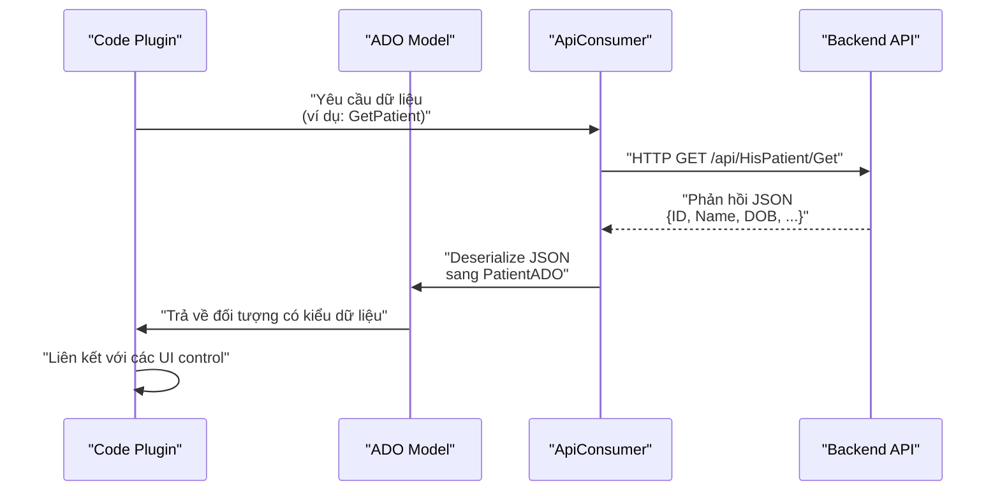

**Nguồn tham khảo:** [HIS/HIS.Desktop/ApiConsumer/ (13 files)](), [Common/Inventec.Common/WebApiClient/]()

### Mô hình tích hợp API phổ biến

```
1. Plugin gọi phương thức của ApiConsumer
   Ví dụ: ApiConsumerStore.MosConsumer.HisPatient.Get(id)

2. ApiConsumer sử dụng WebApiClient để thực hiện yêu cầu HTTP
   Sử dụng Inventec.Common.WebApiClient cho các lời gọi REST

3. Phản hồi được deserialize thành thực thể backend MOS
   Ví dụ: MOS.EFMODEL.DataModels.HIS_PATIENT

4. Thực thể backend được chuyển đổi sang ADO model
   Ví dụ: PatientADO.FromBackendData(HIS_PATIENT)

5. ADO model được trả về cho plugin
   Plugin sử dụng ADO cho liên kết UI và logic nghiệp vụ
```

**Nguồn tham khảo:** [HIS/HIS.Desktop/ApiConsumer/](), [Common/Inventec.Common/WebApiClient/]()

---

## Cách sử dụng trong Plugin

### Mô hình 1: Khởi tạo trực tiếp

Plugin khởi tạo trực tiếp các thực thể ADO cho các kịch bản nhập liệu:

```csharp
// Mô hình ví dụ (không phải code thực tế)
var patientADO = new PatientADO
{
    FirstName = txtFirstName.Text,
    LastName = txtLastName.Text,
    DOB = dateEditDOB.DateTime
};
```

Tham chiếu tại: [HIS/Plugins/HIS.Desktop.Plugins.Register/ (81-102 files)]()

### Mô hình 2: Ánh xạ phản hồi API

ApiConsumer trả về các ADO model đã được nạp dữ liệu từ backend:

```csharp
// Mô hình ví dụ
List<TreatmentADO> treatments = ApiConsumer.GetTreatmentList(filter);
gridControl.DataSource = treatments;
```

Tham chiếu tại: [HIS/Plugins/HIS.Desktop.Plugins.Treatment/]()

### Mô hình 3: Liên kết UI Control

Các ADO model được liên kết với các control grid/tree của DevExpress:

```csharp
// Mô hình ví dụ cho liên kết grid
List<MedicineTypeADO> medicines = GetMedicineList();
gridControlMedicine.DataSource = medicines;
gridViewMedicine.BestFitColumns();
```

Tham chiếu tại: [HIS/UC/HIS.UC.MedicineType: 82 files](), [HIS/Plugins/HIS.Desktop.Plugins.AssignPrescriptionPK: 203 files]()

### Mô hình 4: Chuyển đổi dữ liệu để In ấn

Các ADO model được chuyển đổi thành các Đối tượng Dữ liệu In (Print Data Objects - PDO) cho hệ thống MPS:

```csharp
// Mô hình ví dụ
var printData = new Mps000123.PDO(
    treatmentADO: currentTreatment,
    sereServADOs: serviceList,
    patientADO: currentPatient
);
```

Tham chiếu tại: [MPS/MPS.Processor/ (790+ processors)](), [MPS/MPS.ProcessorBase/ (30 files)]()

**Nguồn tham khảo:** [Cấu trúc thư mục HIS/Plugins/](), [MPS/MPS.Processor/]()

---

## Bộ nhớ đệm LocalStorage

Các ADO model thường xuyên được lưu trữ trong bộ nhớ đệm `HIS.Desktop.LocalStorage.BackendData` để giảm thiểu các bước gọi API và cải thiện hiệu năng.

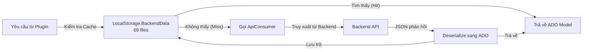

### Các danh mục dữ liệu được Cache

| Loại Cache | ADO Models | Chiến lược làm mới |
|------------|------------|------------------|
| **Dữ liệu danh mục** | MedicineTypeADO, MaterialTypeADO, IcdADO | Khi ứng dụng khởi động, hoặc làm mới thủ công |
| **Ngữ cảnh người dùng** | WorkPlaceADO, UserADO, BranchADO | Khi đăng nhập, hoặc thay đổi phiên làm việc |
| **Cấu hình** | ConfigADO, FormTypeADO, HisConfigKeys | Khi khởi động, hoặc khi có sự kiện thay đổi cấu hình |
| **Dữ liệu gốc (Master)** | ServiceADO, RoomADO, DepartmentADO | Làm mới định kỳ, hoặc theo sự kiện |

**Nguồn tham khảo:** [HIS/HIS.Desktop/LocalStorage/BackendData: 69 files](), [HIS/HIS.Desktop/LocalStorage/ConfigApplication/]()

---

## Ví dụ: Model dữ liệu hệ thống Tự động Cập nhật

Mặc dù không thuộc `HIS.Desktop.ADO`, hệ thống tự động cập nhật trong `Inventec.Aup.Client` minh họa cho các mô hình dữ liệu điển hình được sử dụng trong mã nguồn.

### Class DownloadFileInfo

Đại diện cho một file đang chờ tải xuống trong quá trình cập nhật tự động:

```
Class: DownloadFileInfo
Mục đích: Theo dõi metadata tải xuống cho các file cập nhật
Vị trí: Common/Inventec.Aup.Client/AutoUpdater/AutoUpdateHelper/DownloadFileInfo.cs

Thuộc tính:
- DownloadUrl: string (URL file từ xa)
- FileFullName: string (đường dẫn file cục bộ)
- FileName: string (chỉ tên file)
- LastVer: string (phiên bản trước đó)
- Size: int (kích thước file tính bằng byte)
- TryTimes: int (số lần thử tải lại)
- Version: string (phiên bản đích)
```

**Nguồn tham khảo:** [[`Common/Inventec.Aup.Client/Inventec.Aup.Client/AutoUpdater/AutoUpdateHelper/DownloadFileInfo.cs:1-71`](../../Common/Inventec.Aup.Client/Inventec.Aup.Client/AutoUpdater/AutoUpdateHelper/DownloadFileInfo.cs#L1-L71)](../../Common/Inventec.Aup.Client/Inventec.Aup.Client/AutoUpdater/AutoUpdateHelper/DownloadFileInfo.cs#L1-L71)

### Class LocalFile

Đại diện cho trạng thái file cục bộ, được lưu dưới dạng XML:

```
Class: LocalFile
Mục đích: Theo dõi các phiên bản file đã cài đặt
Vị trí: Common/Inventec.Aup.Client/AutoUpdater/AutoUpdateHelper/LocalFile.cs

Các thuộc tính Serialization XML:
- [XmlAttribute("path")] Path: string
- [XmlAttribute("lastver")] LastVer: string
- [XmlAttribute("size")] Size: int
- [XmlAttribute("version")] Version: string
- [XmlAttribute("tryTimes")] TryTimes: string

Các nạp chồng Constructor (Overloads):
1. LocalFile(path, ver, size, versionid) - khởi tạo đầy đủ
2. LocalFile() - constructor không tham số cho việc XML deserialization
```

**Nguồn tham khảo:** [[`Common/Inventec.Aup.Client/Inventec.Aup.Client/AutoUpdater/AutoUpdateHelper/LocalFile.cs:1-78`](../../Common/Inventec.Aup.Client/Inventec.Aup.Client/AutoUpdater/AutoUpdateHelper/LocalFile.cs#L1-L78)](../../Common/Inventec.Aup.Client/Inventec.Aup.Client/AutoUpdater/AutoUpdateHelper/LocalFile.cs#L1-L78)

### Class RemoteFile

Phân tích XML manifest từ máy chủ cập nhật:

```
Class: RemoteFile
Mục đích: Đại diện cho các bản cập nhật khả dụng từ máy chủ
Vị trí: Common/Inventec.Aup.Client/AutoUpdater/AutoUpdateHelper/RemoteFile.cs

Phân tích XML (Constructor):
- Đọc các thuộc tính XmlNode: path, url, lastver, size, needRestart, version, hash
- Hỗ trợ tham số cfgAupUri để cấu hình tiền tố URL
- Chuyển đổi các thuộc tính dạng chuỗi sang các kiểu dữ liệu phù hợp (bool, int)

Thuộc tính:
- Path, Url, LastVer, Size, NeedRestart (bool), Version, Hash
- Chỉ đọc (read-only) - không thể thay đổi sau khi khởi tạo (immutable)
```

**Nguồn tham khảo:** [[`Common/Inventec.Aup.Client/Inventec.Aup.Client/AutoUpdater/AutoUpdateHelper/RemoteFile.cs:1-74`](../../Common/Inventec.Aup.Client/Inventec.Aup.Client/AutoUpdater/AutoUpdateHelper/RemoteFile.cs#L1-L74)](../../Common/Inventec.Aup.Client/Inventec.Aup.Client/AutoUpdater/AutoUpdateHelper/RemoteFile.cs#L1-L74)

### Phân tích Mô hình

Ba class này minh họa cho các mô hình ADO model phổ biến:

| Mô hình | Ví dụ | Tương đương trong HIS.Desktop.ADO |
|---------|---------|---------------------------|
| **Property Bags** | Đơn thuần chứa các thuộc tính public | Hầu hết các ADO model |
| **XML Serialization** | `LocalFile` với `[XmlAttribute]` | ConfigADO, FormTypeADO |
| **Khởi tạo qua Constructor** | `RemoteFile(XmlNode)` | Các ADO model với phương thức `FromBackendData()` |
| **Chuyển đổi kiểu dữ liệu** | Chuyển chuỗi sang int/bool trong `RemoteFile` | Tất cả các ADO model khi phân tích JSON |
| **Immutable và Mutable** | `RemoteFile` (chỉ đọc) so với `LocalFile` (có thể thay đổi) | Tùy vào từng loại ADO cụ thể |

---

## Best Practices thiết kế ADO Model

Dựa trên kiến trúc mã nguồn hiện tại:

### 1. Phân tách các mối quan tâm (Separation of Concerns)

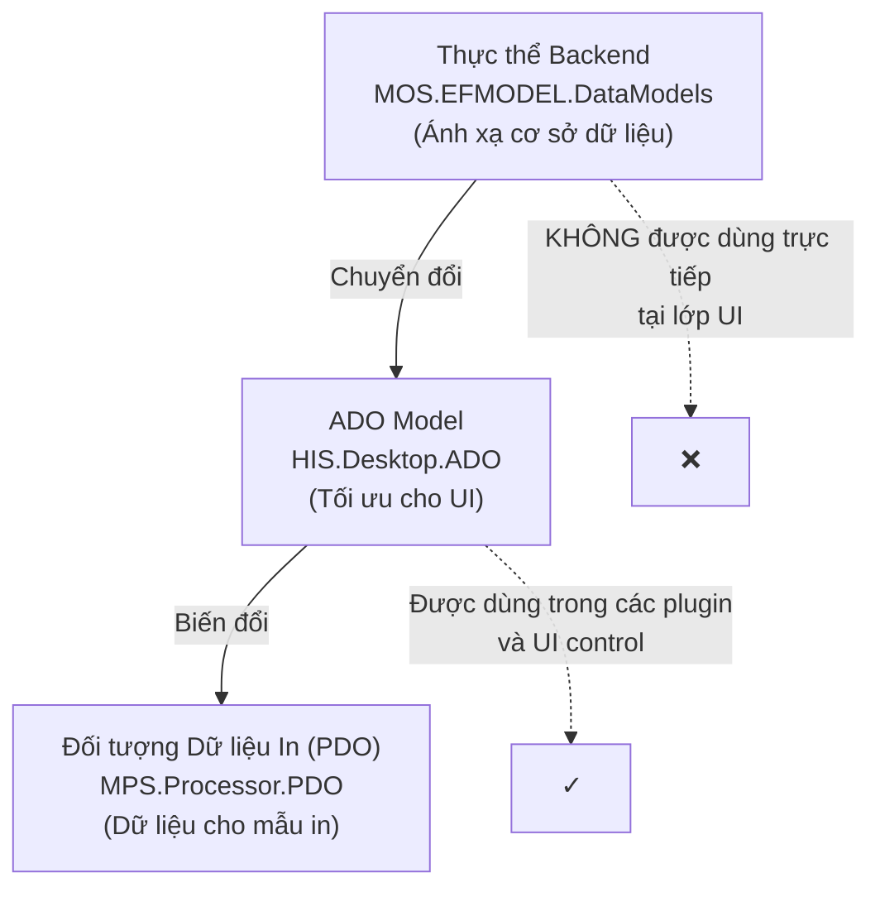

**Lý do:** Các thực thể backend chứa các thuộc tính ORM và các vấn đề liên quan đến database. ADO model là các đối tượng "sạch", tập trung vào giao diện.

### 2. Quy ước đặt tên thuộc tính

| Quy ước | Ví dụ | Lý do |
|------------|---------|--------|
| Thuộc tính PascalCase | `FirstName`, `BirthDate` | Tiêu chuẩn C# |
| Hậu tố "ADO" cho class | `PatientADO`, `TreatmentADO` | Phân biệt rõ ràng với thực thể backend |
| Các thuộc tính hiển thị | `PatientName`, `DisplayCode` | Đã được định dạng sẵn cho UI |
| Các thuộc tính dạng Flag | `IsActive`, `IsLocked`, `IsSelected` | Các trạng thái UI kiểu boolean |

### 3. Các thuộc tính tính toán (Computed Properties)

Các ADO model thường bao gồm các thuộc tính tính toán để thuận tiện cho việc hiển thị:

```
Ví dụ mô hình ADO:
- AgeString: chuỗi (tính toán từ ngày sinh)
- TotalAmountDisplay: chuỗi (định dạng tiền tệ)
- StatusName: chuỗi (chuyển enum sang văn bản hiển thị)
- IsEditable: bool (dựa trên trạng thái quy trình)
```

### 4. Các thuộc tính kiểm tra (Validation Attributes)

Các thuộc tính chú thích dữ liệu (data annotation) thường dùng:

- `[Required]` - Các trường bắt buộc.
- `[MaxLength(n)]` - Giới hạn độ dài chuỗi.
- `[Range(min, max)]` - Ranh giới giá trị số.
- `[RegularExpression]` - Kiểm tra định dạng.

### 5. Các thuộc tính tập hợp (Collection Properties)

Cho các mối quan hệ cha-con:

```
ADO Cha:
- TreatmentADO.ServiceReqs: List<ServiceReqADO>
- PatientADO.PatientTypeAlters: List<PatientTypeAlterADO>
- ExpMestADO.ExpMestMedicines: List<ExpMestMedicineADO>
```

---

## Tích hợp với EntityFramework

Mặc dù backend sử dụng EntityFramework (EF) rất nhiều, nhưng các ADO model của ứng dụng Desktop **không phải** là thực thể EF. Các khác biệt chính:

| Backend (Server-side) | Desktop ADO (Client-side) |
|----------------------|---------------------------|
| EF Code-First hoặc Database-First | Các class C# thuần (POCOs) |
| DbContext để truy cập dữ liệu | ApiConsumer để truy cập dữ liệu |
| Thuộc tính điều hướng được EF theo dõi | Quản lý quan hệ thủ công |
| Chú thích cho Database | Thuộc tính tập trung vào UI |
| Bật tính năng theo dõi thay đổi | Không có tính năng tự động theo dõi thay đổi |

**Mục đích:** Các Desktop ADO model được thiết kế cho các kịch bản client không kết nối trực tiếp, giao tiếp qua REST API.

**Nguồn tham khảo:** Mô hình kiến trúc chung, [HIS/HIS.Desktop/ApiConsumer/]()

---

## Tổng kết

Thư mục `HIS.Desktop.ADO` (74 files) cung cấp:

1. **Các Đối tượng Chuyển đổi Dữ liệu (DTO)** cho tất cả các domain nghiệp vụ chính (bệnh nhân, điều trị, thuốc, thanh toán, v.v.).
2. **Các Model Tối ưu cho UI** với các thuộc tính hiển thị và các trường tính toán.
3. **Lớp Tích hợp API** kết nối giữa các plugin và dịch vụ backend.
4. **Hỗ trợ Caching** thông qua LocalStorage.BackendData.
5. **An toàn về kiểu dữ liệu (Type Safety)** đảm bảo việc kiểm tra tại thời điểm biên dịch trên khắp 956 plugin.
6. **Khả năng Tái sử dụng** được chia sẻ giữa các plugin, user control và bộ xử lý in ấn.

Các model này tạo thành khung xương cho luồng dữ liệu trong ứng dụng HIS Desktop, mang lại sự phân tách sạch sẽ giữa các vấn đề giao diện và việc giao tiếp API backend.

**Nguồn tham khảo:** [Thư mục HIS/HIS.Desktop/ADO/](), [cấu trúc HIS/Plugins/](), [cấu trúc HIS/UC/](), [HIS/HIS.Desktop/ApiConsumer/](), [HIS/HIS.Desktop/LocalStorage/BackendData/]()