## Purpose and Scope

This document covers the notification and event handling infrastructure in the HIS Desktop application, specifically:
- **HIS.Desktop.LocalStorage.PubSub/** (9 files) - The publish-subscribe event bus for inter-module communication
- **HIS.Desktop.Notify/** (25 files) - User notification system and UI notifications
- Integration with **Inventec.Common.WSPubSub** for real-time WebSocket-based messaging

The event system enables loose coupling between plugins and modules by allowing them to communicate without direct dependencies. For information about direct plugin-to-plugin communication patterns, see [Plugin System Architecture](../01-architecture/plugin-system.md). For local data caching and configuration, see [LocalStorage & Configuration](../02-modules/his-desktop/core.md).

---

## System Architecture Overview

The HIS Desktop application implements two complementary communication patterns:

| Pattern | Location | Coupling | Use Case |
|---------|----------|----------|----------|
| **PubSub Event Bus** | HIS.Desktop.LocalStorage.PubSub/ | Loose | Broadcast notifications, data changes, system events |
| **DelegateRegister** | HIS.Desktop.DelegateRegister | Tight | Direct plugin invocation, request-response patterns |
| **WSPubSub** | Inventec.Common.WSPubSub | Loose | Real-time server push, multi-client synchronization |

The notification system operates at three layers:
1. **Application Events** - Internal plugin communication via PubSub
2. **User Notifications** - UI notifications managed by HIS.Desktop.Notify/
3. **Real-time Events** - Server-initiated events via WebSocket connections

**Sources:** 
- HIS.Desktop.LocalStorage.PubSub/
- HIS.Desktop.Notify/
- Common/Inventec.Common/Inventec.Common.WSPubSub/

---

## PubSub Event Bus Architecture

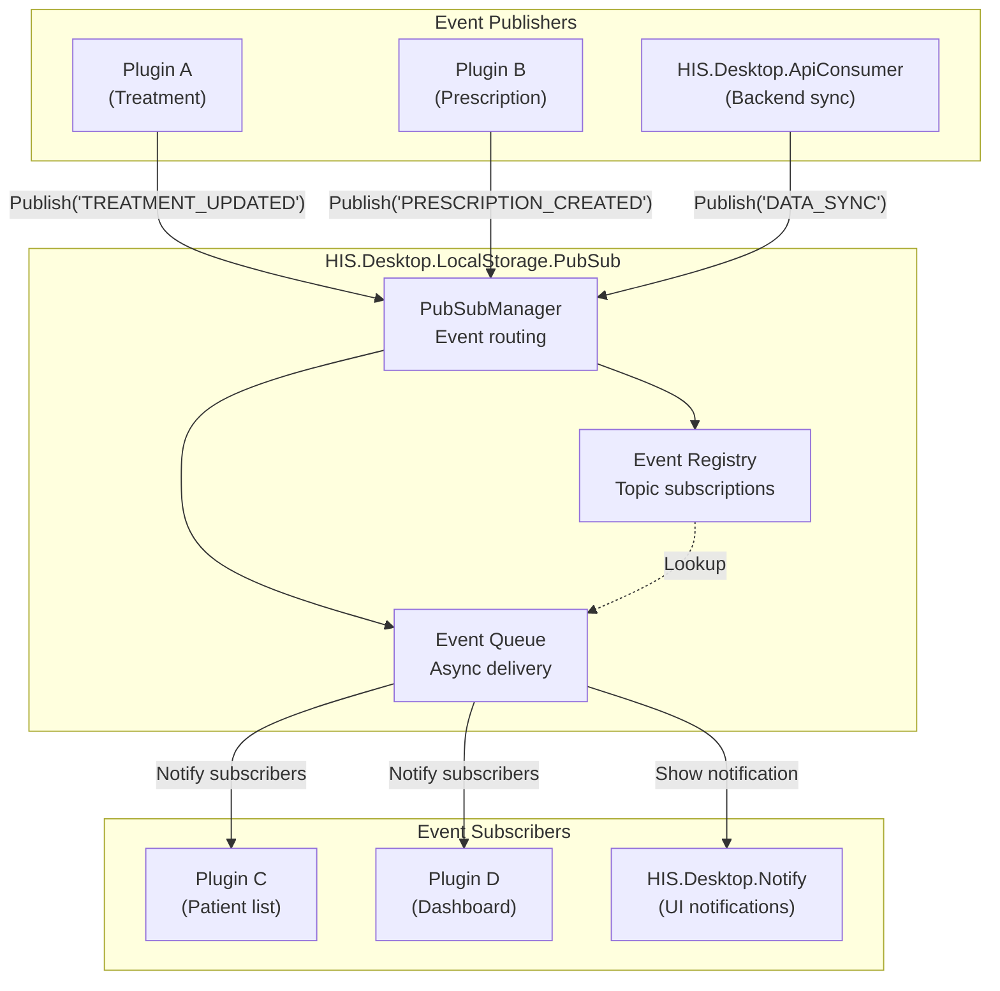
```mermaid
graph TB
    subgraph "Event Publishers"
        PluginA["Plugin A<br/>(Treatment)"]
        PluginB["Plugin B<br/>(Prescription)"]
        ApiConsumer["HIS.Desktop.ApiConsumer<br/>(Backend sync)"]
    end
    
    subgraph "HIS.Desktop.LocalStorage.PubSub"
        PubSubManager["PubSubManager<br/>Event routing"]
        EventRegistry["Event Registry<br/>Topic subscriptions"]
        EventQueue["Event Queue<br/>Async delivery"]
    end
    
    subgraph "Event Subscribers"
        PluginC["Plugin C<br/>(Patient list)"]
        PluginD["Plugin D<br/>(Dashboard)"]
        NotifyUI["HIS.Desktop.Notify<br/>(UI notifications)"]
    end
    
    PluginA -->|"Publish('TREATMENT_UPDATED')"| PubSubManager
    PluginB -->|"Publish('PRESCRIPTION_CREATED')"| PubSubManager
    ApiConsumer -->|"Publish('DATA_SYNC')"| PubSubManager
    
    PubSubManager --> EventRegistry
    PubSubManager --> EventQueue
    
    EventQueue -->|"Notify subscribers"| PluginC
    EventQueue -->|"Notify subscribers"| PluginD
    EventQueue -->|"Show notification"| NotifyUI
    
    EventRegistry -.->|"Lookup"| EventQueue
```

**Event Flow Pattern:**

1. **Publisher** calls `Publish(eventName, eventData)` on the PubSub manager
2. **Event Registry** looks up all subscribers for the event topic
3. **Event Queue** delivers the event asynchronously to each subscriber
4. **Subscribers** receive the event via registered callback delegates

**Sources:**
- HIS.Desktop.LocalStorage.PubSub/
- HIS.Desktop.LocalStorage.BackendData/

---

## PubSub Implementation Components

### Core Classes and Interfaces

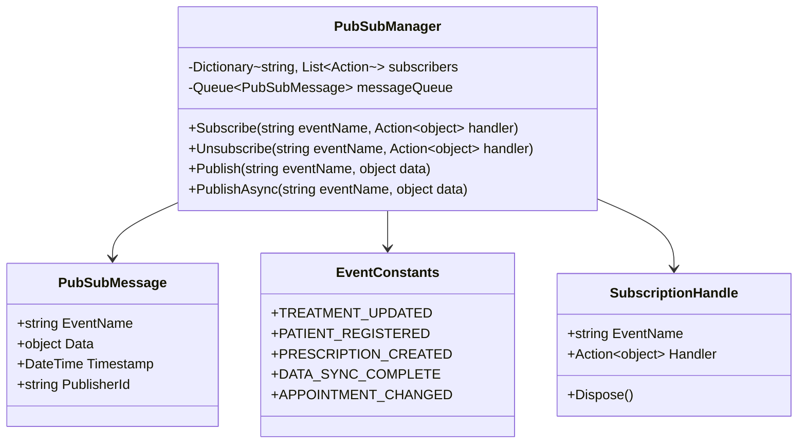
```mermaid
classDiagram
    class PubSubManager {
        +Subscribe(string eventName, Action~object~ handler)
        +Unsubscribe(string eventName, Action~object~ handler)
        +Publish(string eventName, object data)
        +PublishAsync(string eventName, object data)
        -Dictionary~string, List~Action~~ subscribers
        -Queue~PubSubMessage~ messageQueue
    }
    
    class PubSubMessage {
        +string EventName
        +object Data
        +DateTime Timestamp
        +string PublisherId
    }
    
    class EventConstants {
        +TREATMENT_UPDATED
        +PATIENT_REGISTERED
        +PRESCRIPTION_CREATED
        +DATA_SYNC_COMPLETE
        +APPOINTMENT_CHANGED
    }
    
    class SubscriptionHandle {
        +string EventName
        +Action~object~ Handler
        +Dispose()
    }
    
    PubSubManager --> PubSubMessage
    PubSubManager --> EventConstants
    PubSubManager --> SubscriptionHandle
```

### Key Event Topics

The system uses string-based event topics defined in constants classes. Common event topics include:

| Event Topic | Purpose | Typical Publishers | Typical Subscribers |
|-------------|---------|-------------------|---------------------|
| `TREATMENT_UPDATED` | Treatment record changed | Treatment plugins | Patient list, Dashboard |
| `PATIENT_REGISTERED` | New patient created | Registration plugins | Reception queue, Call system |
| `PRESCRIPTION_CREATED` | Prescription issued | Prescription plugins | Pharmacy, Print system |
| `SERVICE_EXECUTED` | Service performed | Service plugins | Billing, Statistics |
| `TRANSACTION_COMPLETED` | Payment processed | Transaction plugins | Receipt print, Debt tracking |
| `DATA_SYNC_COMPLETE` | Backend data refreshed | ApiConsumer | All plugins with cached data |
| `CONFIG_CHANGED` | Configuration updated | Config plugins | All plugins reading config |
| `USER_LOGOUT` | User logged out | Session manager | All plugins (cleanup) |

**Sources:**
- HIS.Desktop.LocalStorage.PubSub/
- HIS.Desktop.LocalStorage.ConfigApplication/
- HIS.Desktop.LocalStorage.BackendData/

---

## Notification System (HIS.Desktop.Notify)

### Notification Types and UI Components

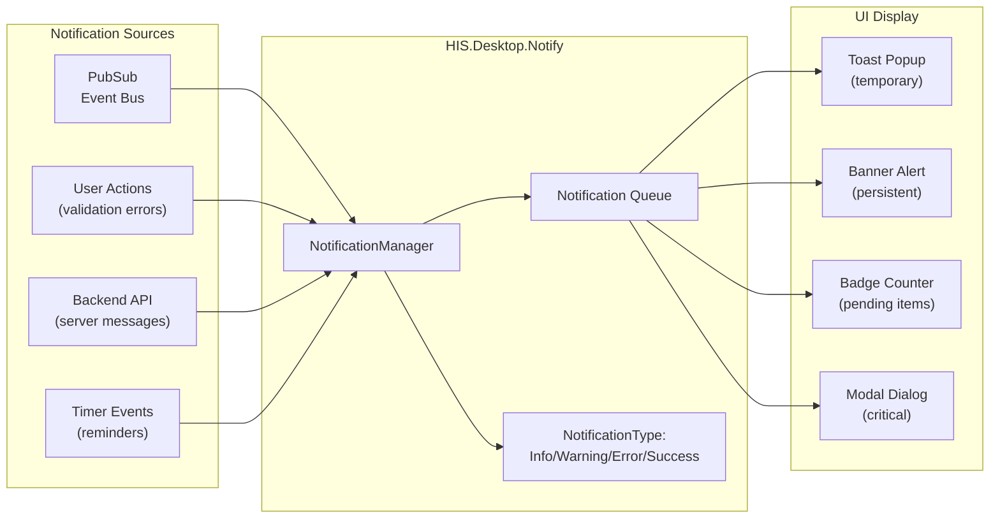
```mermaid
graph LR
    subgraph "Notification Sources"
        EventBus["PubSub<br/>Event Bus"]
        UserAction["User Actions<br/>(validation errors)"]
        BackendAPI["Backend API<br/>(server messages)"]
        Timer["Timer Events<br/>(reminders)"]
    end
    
    subgraph "HIS.Desktop.Notify"
        NotifyManager["NotificationManager"]
        NotifyQueue["Notification Queue"]
        NotifyTypes["NotificationType:<br/>Info/Warning/Error/Success"]
    end
    
    subgraph "UI Display"
        Toast["Toast Popup<br/>(temporary)"]
        Banner["Banner Alert<br/>(persistent)"]
        Badge["Badge Counter<br/>(pending items)"]
        Modal["Modal Dialog<br/>(critical)"]
    end
    
    EventBus --> NotifyManager
    UserAction --> NotifyManager
    BackendAPI --> NotifyManager
    Timer --> NotifyManager
    
    NotifyManager --> NotifyQueue
    NotifyManager --> NotifyTypes
    
    NotifyQueue --> Toast
    NotifyQueue --> Banner
    NotifyQueue --> Badge
    NotifyQueue --> Modal
```

### Notification Severity Levels

| Level | UI Display | Duration | Sound Alert | Examples |
|-------|-----------|----------|-------------|----------|
| **Info** | Blue toast | 3 seconds | None | "Patient registered successfully" |
| **Success** | Green toast | 3 seconds | Optional | "Prescription saved" |
| **Warning** | Yellow banner | 5 seconds | Beep | "Low stock alert" |
| **Error** | Red banner | Persistent | Alert sound | "Payment failed" |
| **Critical** | Modal dialog | User dismiss | Alarm | "Database connection lost" |

**Sources:**
- HIS.Desktop.Notify/
- HIS.Desktop.Utility/

---

## Event Subscription Patterns

### Basic Subscription

Plugins subscribe to events during initialization and unsubscribe during disposal:

**Subscription Location:** Plugin constructor or `OnLoad()` method
**Unsubscription Location:** Plugin `Dispose()` method

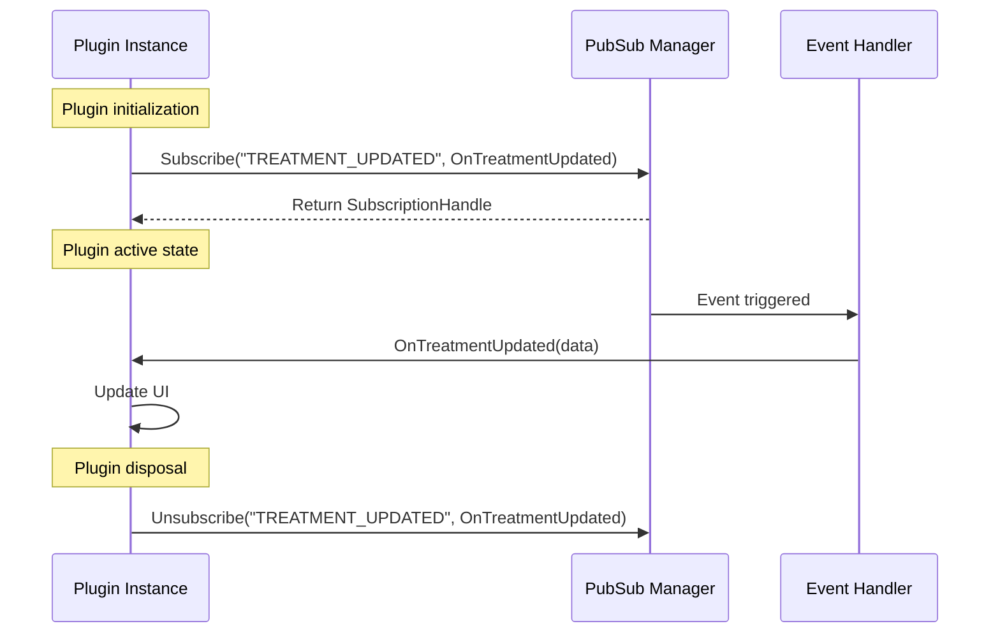
```mermaid
sequenceDiagram
    participant Plugin as Plugin Instance
    participant PubSub as PubSub Manager
    participant Handler as Event Handler
    
    Note over Plugin: Plugin initialization
    Plugin->>PubSub: Subscribe("TREATMENT_UPDATED", OnTreatmentUpdated)
    PubSub-->>Plugin: Return SubscriptionHandle
    
    Note over Plugin: Plugin active state
    
    PubSub->>Handler: Event triggered
    Handler->>Plugin: OnTreatmentUpdated(data)
    Plugin->>Plugin: Update UI
    
    Note over Plugin: Plugin disposal
    Plugin->>PubSub: Unsubscribe("TREATMENT_UPDATED", OnTreatmentUpdated)
```

### Common Subscription Pattern

Referenced in plugin base classes throughout [HIS/Plugins/HIS.Desktop.Plugins.*/:1-50]():

```
// Typical pattern in plugin initialization
private void SubscribeEvents()
{
    // Subscribe to patient data changes
    PubSubManager.Subscribe(EventConstants.PATIENT_UPDATED, OnPatientUpdated);
    
    // Subscribe to treatment changes
    PubSubManager.Subscribe(EventConstants.TREATMENT_UPDATED, OnTreatmentUpdated);
    
    // Subscribe to configuration changes
    PubSubManager.Subscribe(EventConstants.CONFIG_CHANGED, OnConfigChanged);
}

// Event handler callback
private void OnPatientUpdated(object data)
{
    // Cast data to expected type
    var patientData = data as PatientUpdateEventData;
    
    // Update UI on main thread
    this.InvokeIfRequired(() => {
        RefreshPatientData(patientData);
    });
}
```

**Sources:**
- HIS.Desktop.LocalStorage.PubSub/
- HIS/Plugins/HIS.Desktop.Plugins.*/

---

## WebSocket PubSub Integration

### Real-Time Server Communication

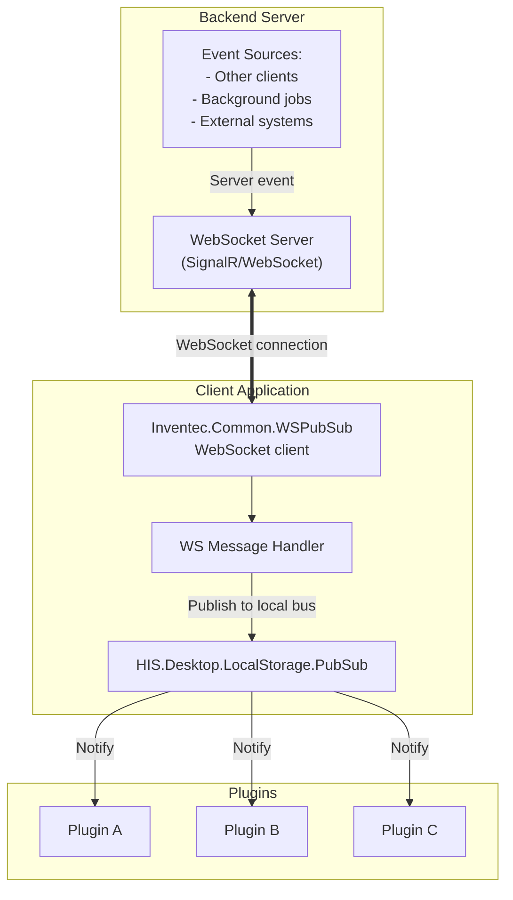
```mermaid
graph TB
    subgraph "Backend Server"
        WSServer["WebSocket Server<br/>(SignalR/WebSocket)"]
        EventSource["Event Sources:<br/>- Other clients<br/>- Background jobs<br/>- External systems"]
    end
    
    subgraph "Client Application"
        WSPubSub["Inventec.Common.WSPubSub<br/>WebSocket client"]
        WSHandler["WS Message Handler"]
        LocalPubSub["HIS.Desktop.LocalStorage.PubSub"]
    end
    
    subgraph "Plugins"
        PluginA["Plugin A"]
        PluginB["Plugin B"]
        PluginC["Plugin C"]
    end
    
    EventSource -->|"Server event"| WSServer
    WSServer <==>|"WebSocket connection"| WSPubSub
    WSPubSub --> WSHandler
    WSHandler -->|"Publish to local bus"| LocalPubSub
    
    LocalPubSub -->|"Notify"| PluginA
    LocalPubSub -->|"Notify"| PluginB
    LocalPubSub -->|"Notify"| PluginC
```

### Real-Time Event Use Cases

| Event Type | Server Trigger | Client Action |
|------------|---------------|---------------|
| **PATIENT_CALLED** | Reception calls patient | Update call display screens |
| **TREATMENT_LOCKED** | Another user locked record | Disable editing in all clients |
| **CONFIG_UPDATED** | Admin changed system config | Reload configuration |
| **STOCK_CHANGED** | Pharmacy dispensed medicine | Refresh stock levels |
| **APPOINTMENT_CANCELLED** | Patient cancelled appointment | Update appointment list |
| **EMERGENCY_ALERT** | Emergency button pressed | Show alert on all stations |

**WebSocket Connection Management:**

The `Inventec.Common.WSPubSub` component handles:
- Automatic reconnection on connection loss
- Heartbeat/keep-alive messages
- Message queuing during disconnection
- Subscription state synchronization

**Sources:**
- Common/Inventec.Common/Inventec.Common.WSPubSub/
- HIS.Desktop.LocalStorage.PubSub/
- HIS.Desktop.ApiConsumer/

---

## Event Data Models

### Standard Event Data Structure

Events typically carry structured data objects that implement a common pattern:

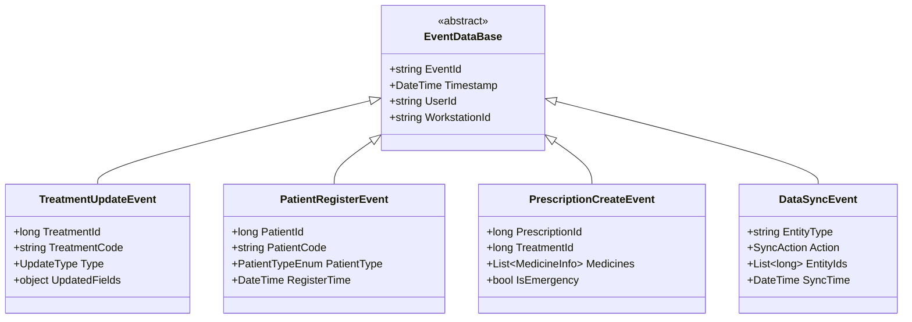
```mermaid
classDiagram
    class EventDataBase {
        <<abstract>>
        +string EventId
        +DateTime Timestamp
        +string UserId
        +string WorkstationId
    }
    
    class TreatmentUpdateEvent {
        +long TreatmentId
        +string TreatmentCode
        +UpdateType Type
        +object UpdatedFields
    }
    
    class PatientRegisterEvent {
        +long PatientId
        +string PatientCode
        +PatientTypeEnum PatientType
        +DateTime RegisterTime
    }
    
    class PrescriptionCreateEvent {
        +long PrescriptionId
        +long TreatmentId
        +List~MedicineInfo~ Medicines
        +bool IsEmergency
    }
    
    class DataSyncEvent {
        +string EntityType
        +SyncAction Action
        +List~long~ EntityIds
        +DateTime SyncTime
    }
    
    EventDataBase <|-- TreatmentUpdateEvent
    EventDataBase <|-- PatientRegisterEvent
    EventDataBase <|-- PrescriptionCreateEvent
    EventDataBase <|-- DataSyncEvent
```

### Event Data Serialization

Events are serialized when:
- Crossing plugin boundaries (in-memory objects)
- Transmitted via WebSocket (JSON serialization)
- Logged for debugging (string representation)

**Sources:**
- HIS.Desktop.ADO/
- HIS.Desktop.LocalStorage.PubSub/

---

## Thread Safety and Async Handling

### Event Delivery Guarantees

| Aspect | Implementation | Notes |
|--------|---------------|-------|
| **Order** | FIFO per topic | Events on same topic delivered in order |
| **Delivery** | At-least-once | Subscribers may receive duplicates |
| **Thread** | Callback thread | Handlers must marshal to UI thread if needed |
| **Error** | Isolated | Exception in one handler doesn't affect others |
| **Async** | Optional | `PublishAsync()` returns immediately |

### UI Thread Marshalling Pattern

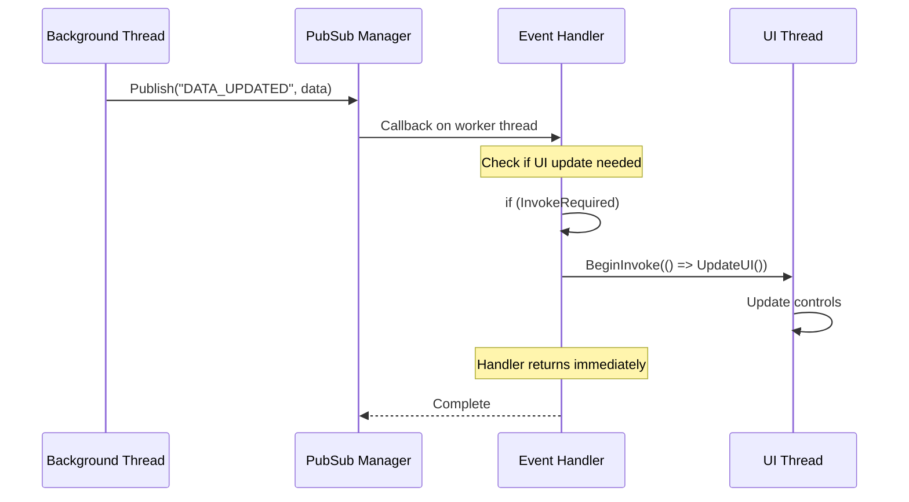
```mermaid
sequenceDiagram
    participant Worker as Background Thread
    participant PubSub as PubSub Manager
    participant Handler as Event Handler
    participant UI as UI Thread
    
    Worker->>PubSub: Publish("DATA_UPDATED", data)
    PubSub->>Handler: Callback on worker thread
    
    Note over Handler: Check if UI update needed
    Handler->>Handler: if (InvokeRequired)
    
    Handler->>UI: BeginInvoke(() => UpdateUI())
    UI->>UI: Update controls
    
    Note over Handler: Handler returns immediately
    Handler-->>PubSub: Complete
```

**Common Pattern in Event Handlers:**

Referenced in [HIS/Plugins/HIS.Desktop.Plugins.*/:1-100]():

```
private void OnDataUpdated(object data)
{
    if (this.InvokeRequired)
    {
        this.BeginInvoke(new Action<object>(OnDataUpdated), data);
        return;
    }
    
    // Safe to update UI here
    UpdateDataGrid(data);
}
```

**Sources:**
- HIS.Desktop.LocalStorage.PubSub/
- HIS.Desktop.Utility/

---

## Notification Configuration

### System-Wide Notification Settings

Configuration keys in [HIS.Desktop.LocalStorage.ConfigApplication/]():

| Configuration Key | Type | Default | Purpose |
|------------------|------|---------|---------|
| `NOTIFY_ENABLE` | Boolean | true | Enable/disable notifications |
| `NOTIFY_SOUND_ENABLE` | Boolean | true | Enable notification sounds |
| `NOTIFY_DURATION` | Integer | 3000 | Toast display duration (ms) |
| `NOTIFY_POSITION` | Enum | TopRight | Notification position on screen |
| `NOTIFY_MAX_CONCURRENT` | Integer | 3 | Max simultaneous notifications |
| `NOTIFY_PRIORITY_FILTER` | String | "INFO,WARNING,ERROR" | Which levels to show |

### Plugin-Specific Event Configuration

Plugins can configure which events they want to receive through [HIS.Desktop.LocalStorage.SdaConfigKey/]():

- `PLUGIN_[NAME]_EVENTS` - Comma-separated list of event topics
- `PLUGIN_[NAME]_NOTIFY_MODE` - How to handle incoming notifications (immediate, batch, suppress)

**Sources:**
- HIS.Desktop.LocalStorage.ConfigApplication/
- HIS.Desktop.LocalStorage.SdaConfigKey/
- HIS.Desktop.LocalStorage.HisConfig/

---

## Integration with Backend Data Cache

### Cache Invalidation Events

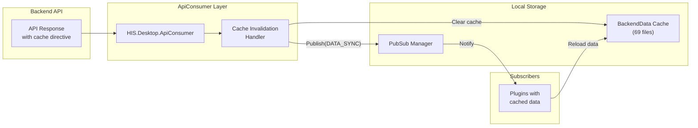
```mermaid
graph LR
    subgraph "Backend API"
        APIResponse["API Response<br/>with cache directive"]
    end
    
    subgraph "ApiConsumer Layer"
        ApiClient["HIS.Desktop.ApiConsumer"]
        CacheInvalidator["Cache Invalidation<br/>Handler"]
    end
    
    subgraph "Local Storage"
        BackendData["BackendData Cache<br/>(69 files)"]
        PubSub["PubSub Manager"]
    end
    
    subgraph "Subscribers"
        Plugins["Plugins with<br/>cached data"]
    end
    
    APIResponse --> ApiClient
    ApiClient --> CacheInvalidator
    CacheInvalidator -->|"Clear cache"| BackendData
    CacheInvalidator -->|"Publish(DATA_SYNC)"| PubSub
    PubSub -->|"Notify"| Plugins
    Plugins -->|"Reload data"| BackendData
```

### Cache Update Event Flow

1. **API Response** indicates data has changed on server
2. **ApiConsumer** detects cache invalidation directive
3. **BackendData Cache** clears relevant cached entries
4. **PubSub Event** published with affected entity types
5. **Subscribed Plugins** receive notification and reload data

**Common Cache Events:**

| Event | Triggered When | Affected Cache |
|-------|---------------|----------------|
| `MEDICINE_TYPE_UPDATED` | Medicine catalog changed | MedicineType cache |
| `PATIENT_TYPE_UPDATED` | Patient types modified | PatientType cache |
| `ROOM_UPDATED` | Room configuration changed | Room/Department cache |
| `SERVICE_UPDATED` | Service catalog changed | Service cache |
| `EMPLOYEE_UPDATED` | Staff data changed | Employee cache |

**Sources:**
- HIS.Desktop.LocalStorage.BackendData/
- HIS.Desktop.ApiConsumer/
- HIS.Desktop.LocalStorage.PubSub/

---

## Event Debugging and Monitoring

### Event Logging

Event activity is logged through the standard logging infrastructure:

**Log Levels:**
- **DEBUG:** All event publish/subscribe operations
- **INFO:** Important business events (treatment updated, patient registered)
- **WARNING:** Event handler exceptions
- **ERROR:** Event delivery failures

**Log Location:** Application log directory, typically `Logs/EventBus/`

### Event Tracing Tools

| Tool | Location | Purpose |
|------|----------|---------|
| **Event Monitor Plugin** | HIS.Desktop.Plugins.Deverloper | Live view of events in development |
| **Event Log Viewer** | HIS.Desktop.Plugins.EventLog | Historical event log browser |
| **PubSub Statistics** | HIS.Desktop.LocalStorage.PubSub | Subscription count, message rate |

**Sources:**
- HIS.Desktop.Notify/
- Common/Inventec.Common/Inventec.Common.Logging/
- Common/Inventec.Desktop/Inventec.Desktop.Plugins.EventLog/

---

## Performance Considerations

### Event System Performance Characteristics

| Metric | Value | Notes |
|--------|-------|-------|
| **Publish latency** | < 1ms | Synchronous publish to queue |
| **Delivery latency** | < 10ms | Queue to handler callback |
| **Max throughput** | ~10,000 events/sec | Per application instance |
| **Memory overhead** | ~100 bytes/subscription | Delegate storage |
| **Queue depth** | 1000 events | Configurable, prevents memory bloat |

### Best Practices

**✓ Do:**
- Subscribe in plugin initialization, unsubscribe in disposal
- Keep event handlers lightweight and fast
- Marshal to UI thread when updating controls
- Use specific event topics rather than broadcasting
- Publish events asynchronously when performance critical

**✗ Don't:**
- Block event handlers with long-running operations
- Publish events from UI thread if avoidable
- Subscribe to events you don't need
- Hold references to event data longer than necessary
- Use events for request-response patterns (use DelegateRegister instead)

**Sources:**
- HIS.Desktop.LocalStorage.PubSub/
- HIS.Desktop.Utility/

---

## Common Event Patterns by Module

### Plugin Categories and Their Event Usage

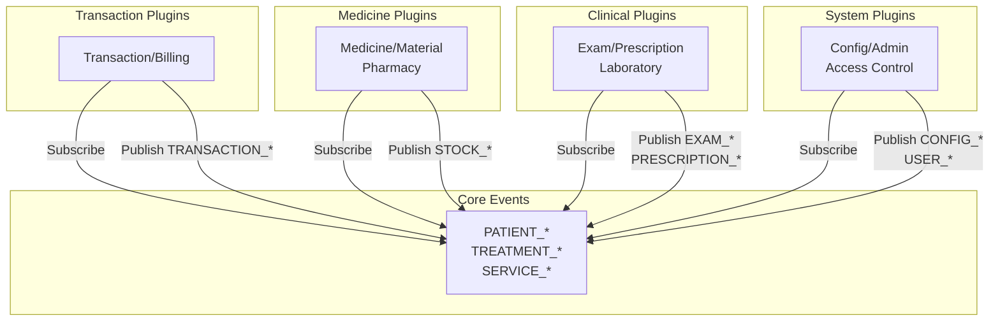
```mermaid
graph TB
    subgraph "Core Events"
        CE["PATIENT_*<br/>TREATMENT_*<br/>SERVICE_*"]
    end
    
    subgraph "Transaction Plugins"
        Trans["Transaction/Billing"]
    end
    
    subgraph "Medicine Plugins"
        Med["Medicine/Material<br/>Pharmacy"]
    end
    
    subgraph "Clinical Plugins"
        Clin["Exam/Prescription<br/>Laboratory"]
    end
    
    subgraph "System Plugins"
        Sys["Config/Admin<br/>Access Control"]
    end
    
    Trans -->|"Subscribe"| CE
    Trans -->|"Publish TRANSACTION_*"| CE
    
    Med -->|"Subscribe"| CE
    Med -->|"Publish STOCK_*"| CE
    
    Clin -->|"Subscribe"| CE
    Clin -->|"Publish EXAM_*<br/>PRESCRIPTION_*"| CE
    
    Sys -->|"Subscribe"| CE
    Sys -->|"Publish CONFIG_*<br/>USER_*"| CE
```

### Event Pattern Examples by Business Flow

| Business Flow | Events Published | Events Consumed |
|--------------|------------------|-----------------|
| **Patient Registration** | `PATIENT_REGISTERED`, `APPOINTMENT_CREATED` | `PATIENT_TYPE_UPDATED`, `ROOM_UPDATED` |
| **Examination** | `EXAM_STARTED`, `EXAM_COMPLETED`, `PRESCRIPTION_CREATED` | `PATIENT_REGISTERED`, `SERVICE_EXECUTED` |
| **Dispensing** | `MEDICINE_DISPENSED`, `STOCK_CHANGED` | `PRESCRIPTION_CREATED`, `PAYMENT_COMPLETED` |
| **Payment** | `TRANSACTION_COMPLETED`, `INVOICE_CREATED` | `SERVICE_EXECUTED`, `PRESCRIPTION_CREATED` |
| **Report Generation** | `REPORT_GENERATED` | `TREATMENT_UPDATED`, `TRANSACTION_COMPLETED` |

**Sources:**
- HIS/Plugins/HIS.Desktop.Plugins.*/
- HIS.Desktop.LocalStorage.PubSub/

---

## Summary

The HIS Desktop notification and event system provides:

1. **Loose Coupling:** Plugins communicate without direct dependencies via PubSub pattern
2. **Real-Time Sync:** WebSocket integration keeps multiple clients synchronized  
3. **User Notifications:** Consistent UI notification framework across all plugins
4. **Cache Coordination:** Events drive cache invalidation and data refresh
5. **Extensibility:** New plugins easily integrate by subscribing to existing events

The system handles thousands of events per second while maintaining responsiveness and ensuring plugins remain decoupled from each other's implementation details.

**Key Components:**
- [HIS.Desktop.LocalStorage.PubSub/]() - Core event bus (9 files)
- [HIS.Desktop.Notify/]() - Notification UI system (25 files)  
- [Common/Inventec.Common/Inventec.Common.WSPubSub/]() - WebSocket pub/sub
- [HIS.Desktop.LocalStorage.BackendData/]() - Cache coordination (69 files)

# MPS Print System


## Purpose and Scope

The MPS (Medical Print System) is a specialized subsystem responsible for generating, formatting, and outputting medical documents in the HisNguonMo hospital information system. MPS provides a template-based architecture with 790+ print processors that handle diverse medical forms including prescriptions, laboratory reports, invoices, transfer forms, medical certificates, and administrative documents. The system integrates with FlexCell for Excel/PDF generation and BarTender for barcode printing.

This document covers the MPS module architecture, processor pattern, template management, and print workflow. For information about how HIS plugins invoke print operations, see [Plugin System Architecture](../01-architecture/plugin-system.md). For the development guide on creating new print processors, see [Print Processor Development](#1.2.1).

**Sources:** [[`.devin/wiki.json`](../../../.devin/wiki.json)](../../../.devin/wiki.json)

## System Architecture Overview

The MPS module operates as a semi-independent subsystem invoked by HIS plugins when document generation is required. The architecture consists of three primary layers: the core engine, processor layer, and export layer.

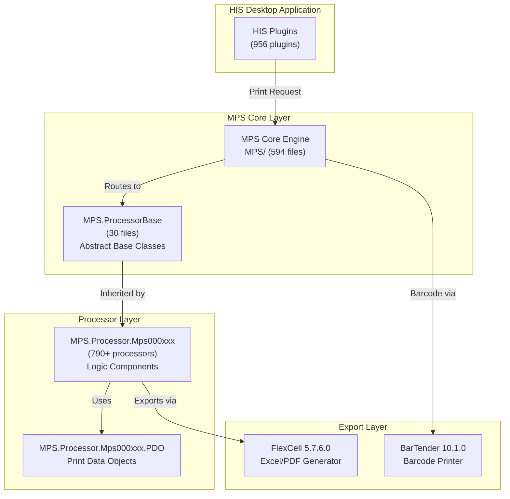
```mermaid
graph TB
    subgraph "HIS Desktop Application"
        Plugins["HIS Plugins<br/>(956 plugins)"]
    end
    
    subgraph "MPS Core Layer"
        MPSCore["MPS Core Engine<br/>MPS/ (594 files)"]
        ProcessorBase["MPS.ProcessorBase<br/>(30 files)<br/>Abstract Base Classes"]
    end
    
    subgraph "Processor Layer"
        Processors["MPS.Processor.Mps000xxx<br/>(790+ processors)<br/>Logic Components"]
        PDOs["MPS.Processor.Mps000xxx.PDO<br/>Print Data Objects"]
    end
    
    subgraph "Export Layer"
        FlexCell["FlexCell 5.7.6.0<br/>Excel/PDF Generator"]
        BarTender["BarTender 10.1.0<br/>Barcode Printer"]
    end
    
    Plugins -->|"Print Request"| MPSCore
    MPSCore -->|"Routes to"| ProcessorBase
    ProcessorBase -->|"Inherited by"| Processors
    Processors -->|"Uses"| PDOs
    Processors -->|"Exports via"| FlexCell
    MPSCore -->|"Barcode via"| BarTender
```

**Sources:** [[`.devin/wiki.json`](../../../.devin/wiki.json)](../../../.devin/wiki.json), MPS/ (directory structure)

## Core Components

### MPS.ProcessorBase

The `MPS.ProcessorBase` directory contains 30 files that define abstract base classes and interfaces for all print processors. These base classes implement common functionality including template loading, data binding, and export orchestration.

| Component Type | Purpose |
|----------------|---------|
| Abstract Processor Classes | Define lifecycle methods: Initialize(), Load(), Export() |
| Template Manager | Handle .xml and .xls template file loading |
| Data Binding Engine | Map PDO properties to template placeholders |
| Export Coordinator | Interface with FlexCell and BarTender |
| Validation Framework | Validate PDO data before rendering |

**Key Base Classes Pattern:**
- Processors inherit from base classes in `MPS.ProcessorBase/`
- Implement template-specific rendering logic
- Override virtual methods for custom behavior
- Utilize shared utility methods for common operations

**Sources:** MPS.ProcessorBase/ (30 files), [[`.devin/wiki.json`](../../../.devin/wiki.json)](../../../.devin/wiki.json)

### MPS.Processor Structure

The processor layer follows a strict naming and organizational convention. Each processor is identified by a unique numeric ID (Mps000xxx) and consists of two parallel folder structures:

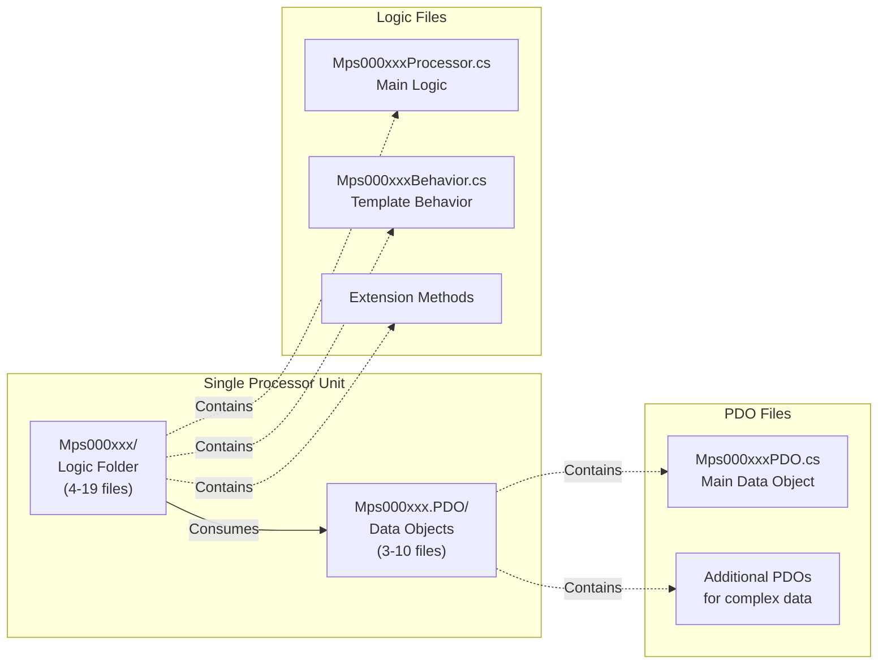
```mermaid
graph LR
    subgraph "Single Processor Unit"
        Logic["Mps000xxx/<br/>Logic Folder<br/>(4-19 files)"]
        PDO["Mps000xxx.PDO/<br/>Data Objects<br/>(3-10 files)"]
    end
    
    Logic -->|"Consumes"| PDO
    
    subgraph "Logic Files"
        Processor["Mps000xxxProcessor.cs<br/>Main Logic"]
        Behavior["Mps000xxxBehavior.cs<br/>Template Behavior"]
        ExtensionMethod["Extension Methods"]
    end
    
    subgraph "PDO Files"
        MainPDO["Mps000xxxPDO.cs<br/>Main Data Object"]
        AdditionalPDO["Additional PDOs<br/>for complex data"]
    end
    
    Logic -.->|"Contains"| Processor
    Logic -.->|"Contains"| Behavior
    Logic -.->|"Contains"| ExtensionMethod
    
    PDO -.->|"Contains"| MainPDO
    PDO -.->|"Contains"| AdditionalPDO
```

**Processor Folder Contents:**

**Logic Folder (Mps000xxx/):**
- [[`Mps000xxxProcessor.cs`](../../Mps000xxxProcessor.cs)](../../Mps000xxxProcessor.cs) - Main processor implementation
- [[`Mps000xxxBehavior.cs`](../../Mps000xxxBehavior.cs)](../../Mps000xxxBehavior.cs) - Template-specific rendering behavior
- Helper classes for data transformation
- Resource files (.resx) for localization
- Designer files (.Designer.cs) for UI components

**PDO Folder (Mps000xxx.PDO/):**
- [[`Mps000xxxPDO.cs`](../../Mps000xxxPDO.cs)](../../Mps000xxxPDO.cs) - Primary data transfer object
- Additional data classes for nested structures
- DTO mappings for backend entities

**Sources:** MPS.Processor/ (790+ folders), [[`.devin/wiki.json`](../../../.devin/wiki.json)](../../../.devin/wiki.json)

### Print Data Objects (PDO)

PDOs serve as strongly-typed containers that encapsulate all data required for document generation. They act as an abstraction layer between backend data models and template placeholders.

**PDO Design Pattern:**

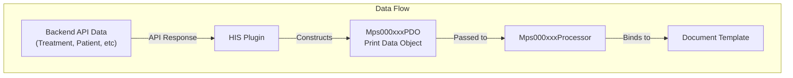
```mermaid
graph TB
    subgraph "Data Flow"
        Backend["Backend API Data<br/>(Treatment, Patient, etc)"]
        Plugin["HIS Plugin"]
        PDO["Mps000xxxPDO<br/>Print Data Object"]
        Processor["Mps000xxxProcessor"]
        Template["Document Template"]
    end
    
    Backend -->|"API Response"| Plugin
    Plugin -->|"Constructs"| PDO
    PDO -->|"Passed to"| Processor
    Processor -->|"Binds to"| Template
```

**Common PDO Properties Pattern:**
- Patient information (PatientCode, PatientName, DOB, Gender)
- Treatment data (TreatmentCode, InTime, OutTime, Department)
- Medical data (Diagnosis, Prescriptions, Lab Results)
- Administrative data (Doctor, Room, Invoice Details)
- Custom fields specific to document type

**Sources:** MPS.Processor/Mps000xxx.PDO/ (multiple folders), [[`.devin/wiki.json`](../../../.devin/wiki.json)](../../../.devin/wiki.json)

## Print Processor Architecture

### Processor Numbering Scheme

The 790+ processors are organized using a sequential numbering system (Mps000001 through Mps000600+), with ranges allocated to different document categories:

| Processor Range | Document Category | Examples |
|----------------|-------------------|----------|
| Mps000001-000050 | Prescriptions | Outpatient prescription, inpatient prescription |
| Mps000051-000100 | Laboratory Reports | Blood test, urine test, microbiology |
| Mps000101-000150 | Invoices | Payment receipt, deposit receipt |
| Mps000151-000200 | Transfer Forms | Hospital transfer, department transfer |
| Mps000201-000250 | Medical Certificates | Sick leave, fitness certificate |
| Mps000251-000300 | Administrative | Appointment card, patient card |
| Mps000301-000600 | Specialized Forms | Surgery records, imaging reports, treatment summaries |

**Large Processors (by file count):**
- Mps000304: 19 files - Complex treatment summary
- Mps000321: 17 files - Detailed prescription form
- Mps000463: 15 files - Comprehensive lab report

**Sources:** [[`.devin/wiki.json`](../../../.devin/wiki.json)](../../../.devin/wiki.json), MPS.Processor/ (directory structure)

### Processor Lifecycle

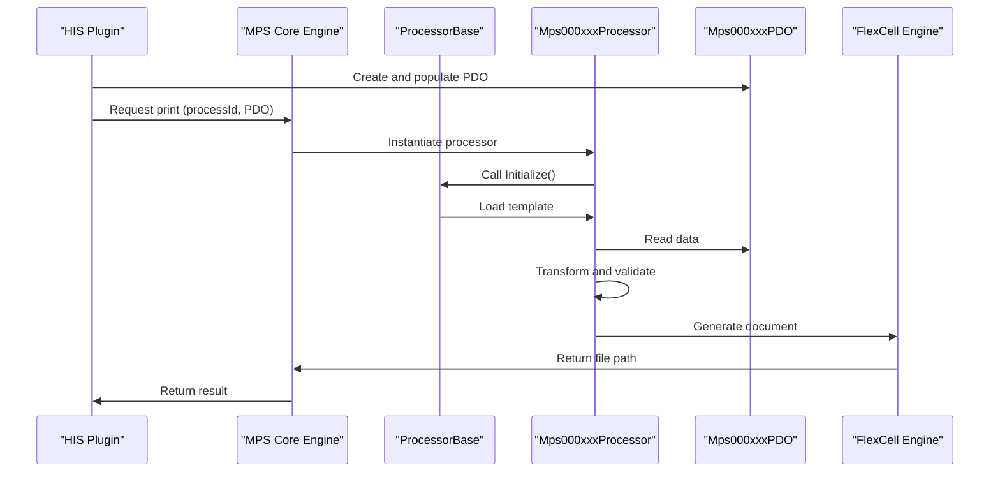
```mermaid
sequenceDiagram
    participant Plugin as "HIS Plugin"
    participant MPSCore as "MPS Core Engine"
    participant ProcessorBase as "ProcessorBase"
    participant Processor as "Mps000xxxProcessor"
    participant PDO as "Mps000xxxPDO"
    participant FlexCell as "FlexCell Engine"
    
    Plugin->>PDO: Create and populate PDO
    Plugin->>MPSCore: Request print (processId, PDO)
    MPSCore->>Processor: Instantiate processor
    Processor->>ProcessorBase: Call Initialize()
    ProcessorBase->>Processor: Load template
    Processor->>PDO: Read data
    Processor->>Processor: Transform and validate
    Processor->>FlexCell: Generate document
    FlexCell->>MPSCore: Return file path
    MPSCore->>Plugin: Return result
```

**Lifecycle Stages:**

1. **Initialization**: Processor instantiation and template loading
2. **Data Binding**: PDO properties mapped to template placeholders
3. **Transformation**: Data formatting and calculation
4. **Validation**: Data completeness and integrity checks
5. **Generation**: FlexCell renders the document
6. **Post-processing**: Barcode generation, digital signatures
7. **Output**: File save or direct print

**Sources:** MPS.ProcessorBase/ (30 files), MPS/ (594 files)

## Template Management

### Template Types and Storage

MPS utilizes two primary template formats:

**Excel Templates (.xls, .xlsx):**
- Stored in template directories
- Contain placeholder syntax: `{PROPERTY_NAME}`
- Support complex formatting, formulas, and charts
- Used by FlexCell for rendering

**XML Configuration (.xml):**
- Define template metadata and structure
- Specify data source mappings
- Configure print settings (page size, margins, orientation)

**Template Resolution Flow:**

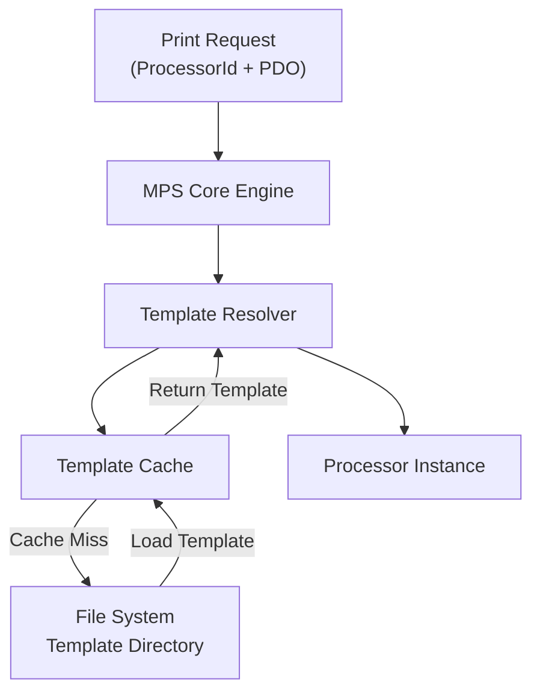
```mermaid
graph TD
    PrintRequest["Print Request<br/>(ProcessorId + PDO)"]
    CoreEngine["MPS Core Engine"]
    TemplateResolver["Template Resolver"]
    TemplateCache["Template Cache"]
    FileSystem["File System<br/>Template Directory"]
    Processor["Processor Instance"]
    
    PrintRequest --> CoreEngine
    CoreEngine --> TemplateResolver
    TemplateResolver --> TemplateCache
    TemplateCache -->|"Cache Miss"| FileSystem
    FileSystem -->|"Load Template"| TemplateCache
    TemplateCache -->|"Return Template"| TemplateResolver
    TemplateResolver --> Processor
```

**Template Naming Convention:**
- Primary template: `Mps000xxx.xls`
- Alternate templates: `Mps000xxx_Alt1.xls`, `Mps000xxx_Alt2.xls`
- Configuration: [[`Mps000xxx.xml`](../../Mps000xxx.xml)](../../Mps000xxx.xml)

**Sources:** MPS/ (594 files core system)

## Print Workflow

### End-to-End Print Flow

The complete print workflow involves coordination between HIS plugins, MPS core, processors, and external libraries:

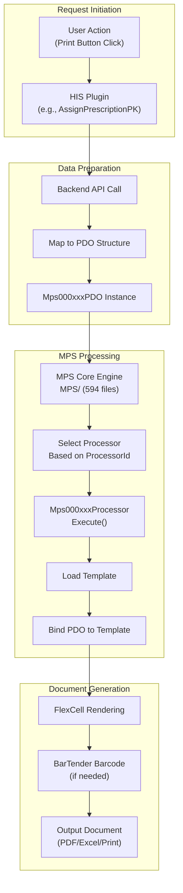
```mermaid
graph TB
    subgraph "Request Initiation"
        UserAction["User Action<br/>(Print Button Click)"]
        Plugin["HIS Plugin<br/>(e.g., AssignPrescriptionPK)"]
    end
    
    subgraph "Data Preparation"
        APICall["Backend API Call"]
        DataMapping["Map to PDO Structure"]
        PDOInstance["Mps000xxxPDO Instance"]
    end
    
    subgraph "MPS Processing"
        MPSCore["MPS Core Engine<br/>MPS/ (594 files)"]
        ProcessorSelection["Select Processor<br/>Based on ProcessorId"]
        ProcessorExec["Mps000xxxProcessor<br/>Execute()"]
        TemplateLoad["Load Template"]
        DataBind["Bind PDO to Template"]
    end
    
    subgraph "Document Generation"
        FlexCellRender["FlexCell Rendering"]
        BarcodeGen["BarTender Barcode<br/>(if needed)"]
        DocumentOutput["Output Document<br/>(PDF/Excel/Print)"]
    end
    
    UserAction --> Plugin
    Plugin --> APICall
    APICall --> DataMapping
    DataMapping --> PDOInstance
    PDOInstance --> MPSCore
    MPSCore --> ProcessorSelection
    ProcessorSelection --> ProcessorExec
    ProcessorExec --> TemplateLoad
    TemplateLoad --> DataBind
    DataBind --> FlexCellRender
    FlexCellRender --> BarcodeGen
    BarcodeGen --> DocumentOutput
```

**Invocation Pattern from HIS Plugins:**

Plugins typically invoke MPS through a standardized interface:

1. Retrieve data from backend via API consumer
2. Construct appropriate PDO instance
3. Call MPS core with processor ID and PDO
4. Handle result (display, save, or send to printer)
5. Log operation for audit trail

**Sources:** HIS/Plugins/ (956 plugins), MPS/ (594 files)

## External Integrations

### FlexCell Integration

FlexCell 5.7.6.0 is the primary document generation engine for MPS, handling Excel and PDF export functionality.

**FlexCell Capabilities in MPS:**
- Load .xls/.xlsx templates with complex formatting
- Bind PDO properties to cell ranges
- Evaluate Excel formulas dynamically
- Merge cells and apply conditional formatting
- Export to multiple formats (Excel, PDF, HTML)
- Support for charts, images, and embedded objects

**Integration Points:**
- `MPS.ProcessorBase/` contains FlexCell wrapper classes
- Common library: `Inventec.Common.FlexCelPrint/` (38 files)
- Export utilities: `Inventec.Common.FlexCelExport/` (23 files)

**Sources:** [[`.devin/wiki.json`](../../../.devin/wiki.json)](../../../.devin/wiki.json), Common/Inventec.Common/FlexCelPrint/ (38 files)

### BarTender Integration

BarTender 10.1.0 is integrated for specialized barcode and label printing requirements.

**BarTender Use Cases:**
- Patient wristbands with barcodes
- Specimen labels for laboratory
- Medication labels with dosage barcodes
- Inventory tracking labels
- Asset management tags

**Integration Pattern:**
- BarTender templates (.btw files) stored separately
- MPS core invokes BarTender SDK
- PDO data passed to BarTender print engine
- Direct output to label printers

**Sources:** [[`.devin/wiki.json`](../../../.devin/wiki.json)](../../../.devin/wiki.json)

## Common Processor Categories

### Prescription Processors

Prescription-related processors handle various medication order forms:

**Example Processors:**
- **Mps000001**: Outpatient prescription - standard medication order form
- **Mps000002**: Inpatient prescription - ward medication list
- **Mps000003**: Controlled substance prescription - special requirements
- **Mps000044**: Prescription with detailed usage instructions
- **Mps000045**: Prescription summary for discharge

**Common PDO Elements:**
- Patient demographics
- List of medications with dosages
- Administration instructions
- Prescriber information and signature
- Pharmacy dispensing details

### Laboratory Report Processors

Laboratory processors generate various test result documents:

**Example Processors:**
- **Mps000050**: General laboratory report
- **Mps000051**: Blood chemistry panel
- **Mps000052**: Microbiology culture results
- **Mps000053**: Pathology report
- **Mps000054**: Imaging study report

**Common PDO Elements:**
- Test requisition details
- Result values with reference ranges
- Critical value indicators
- Technician and pathologist information
- Quality control data

### Invoice and Billing Processors

Financial document processors for transactions:

**Example Processors:**
- **Mps000100**: Payment receipt
- **Mps000101**: Invoice with itemized charges
- **Mps000102**: Deposit receipt
- **Mps000103**: Refund document
- **Mps000104**: Insurance claim form

**Common PDO Elements:**
- Patient billing information
- Service/item details with costs
- Payment method and amounts
- Insurance coverage details
- Balance and outstanding amounts

### Transfer and Referral Processors

Patient transfer and referral documentation:

**Example Processors:**
- **Mps000150**: Hospital transfer form
- **Mps000151**: Department transfer note
- **Mps000152**: External referral letter
- **Mps000153**: Emergency transfer document

**Common PDO Elements:**
- Transfer reason and diagnosis
- Patient condition summary
- Treatment provided
- Receiving facility/department information
- Transporting personnel details

**Sources:** MPS.Processor/ (790+ processor folders), [[`.devin/wiki.json`](../../../.devin/wiki.json)](../../../.devin/wiki.json)

## Processor Development Pattern

### Standard Processor Structure

Each processor follows a consistent implementation pattern inherited from `MPS.ProcessorBase`:

**Typical File Structure:**

**Mps000xxx/ (Logic Folder):**
```
Mps000xxxProcessor.cs          // Main processor class
Mps000xxxBehavior.cs           // Template behavior logic
Mps000xxxExtension.cs          // Extension methods (optional)
Mps000xxx.Designer.cs          // UI designer files (if applicable)
Resources.resx                  // Localization resources
```

**Mps000xxx.PDO/ (Data Object Folder):**
```
Mps000xxxPDO.cs                // Primary PDO class
Mps000xxxADO.cs                // Additional data objects (optional)
PatientDataPDO.cs              // Nested data structures (optional)
```

**Class Relationship:**

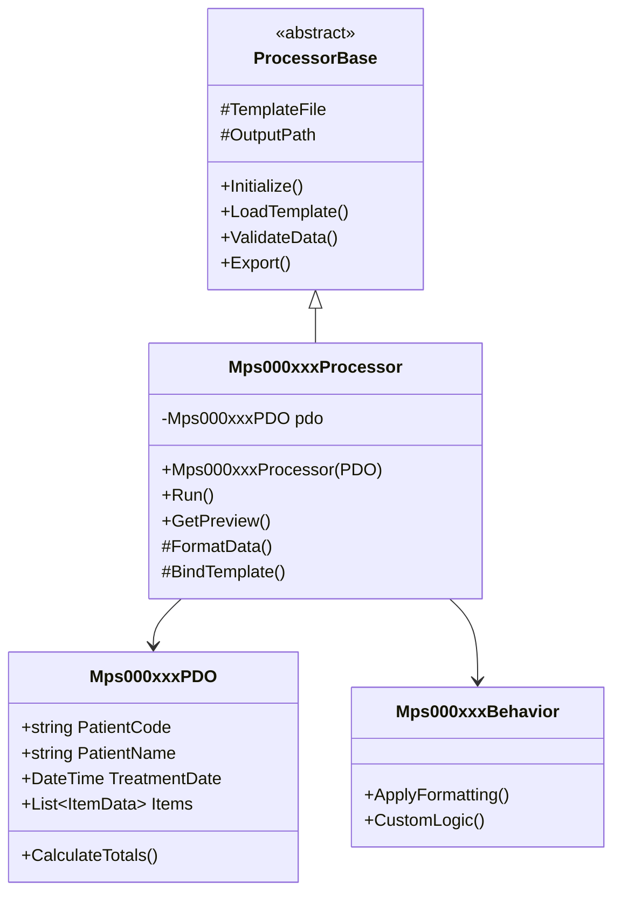
```mermaid
classDiagram
    class ProcessorBase {
        <<abstract>>
        +Initialize()
        +LoadTemplate()
        +ValidateData()
        +Export()
        #TemplateFile
        #OutputPath
    }
    
    class Mps000xxxProcessor {
        -Mps000xxxPDO pdo
        +Mps000xxxProcessor(PDO)
        +Run()
        +GetPreview()
        #FormatData()
        #BindTemplate()
    }
    
    class Mps000xxxPDO {
        +string PatientCode
        +string PatientName
        +DateTime TreatmentDate
        +List~ItemData~ Items
        +CalculateTotals()
    }
    
    class Mps000xxxBehavior {
        +ApplyFormatting()
        +CustomLogic()
    }
    
    ProcessorBase <|-- Mps000xxxProcessor
    Mps000xxxProcessor --> Mps000xxxPDO
    Mps000xxxProcessor --> Mps000xxxBehavior
```

**Sources:** MPS.ProcessorBase/ (30 files), MPS.Processor/ (multiple Mps000xxx folders)

## Configuration and Extension Points

### Processor Registration

Processors are registered in the MPS core engine through configuration files or dynamic discovery:

**Registration Mechanisms:**
- Static registration in `MPS/` core configuration
- Attribute-based discovery using reflection
- Plugin manifest files for each processor
- Runtime registration via API

### Customization Points

The MPS architecture provides several extension points:

**Extension Capabilities:**

| Extension Point | Purpose | Implementation |
|----------------|---------|----------------|
| Custom PDO Properties | Add document-specific data fields | Extend base PDO classes |
| Template Overrides | Hospital-specific form variations | Alternate template files |
| Post-processing Hooks | Custom operations after generation | Override virtual methods |
| Export Format Extensions | Additional output formats | Implement export interfaces |
| Validation Rules | Custom data validation logic | Extend validation framework |

**Sources:** MPS/ (594 files), MPS.ProcessorBase/ (30 files)

## Performance and Caching

### Template Caching Strategy

MPS implements template caching to optimize repeated print operations:

**Cache Layers:**
1. **Memory Cache**: Frequently used templates stored in RAM
2. **Disk Cache**: Compiled template objects cached locally
3. **Template Preloading**: Common templates loaded at startup

### Processor Instance Pooling

For high-volume printing scenarios, processor instances may be pooled:

**Pooling Benefits:**
- Reduced instantiation overhead
- Template reuse across requests
- Memory efficiency for bulk operations
- Improved throughput for batch printing

**Sources:** MPS/ (594 files core engine)

## Integration with HIS Plugins

### Print Request Flow from Plugins

HIS plugins integrate with MPS following a standardized pattern:

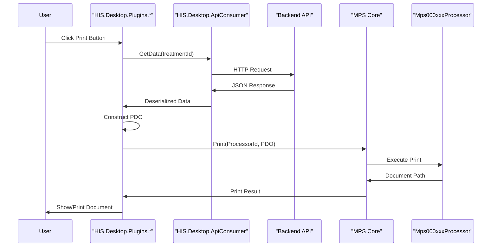
```mermaid
sequenceDiagram
    participant User
    participant Plugin as "HIS.Desktop.Plugins.*"
    participant ApiConsumer as "HIS.Desktop.ApiConsumer"
    participant Backend as "Backend API"
    participant MPS as "MPS Core"
    participant Processor as "Mps000xxxProcessor"
    
    User->>Plugin: Click Print Button
    Plugin->>ApiConsumer: GetData(treatmentId)
    ApiConsumer->>Backend: HTTP Request
    Backend->>ApiConsumer: JSON Response
    ApiConsumer->>Plugin: Deserialized Data
    Plugin->>Plugin: Construct PDO
    Plugin->>MPS: Print(ProcessorId, PDO)
    MPS->>Processor: Execute Print
    Processor->>MPS: Document Path
    MPS->>Plugin: Print Result
    Plugin->>User: Show/Print Document
```

**Common Plugin Integration Points:**
- `HIS.Desktop.Plugins.AssignPrescriptionPK` (203 files) - Prescription printing
- `HIS.Desktop.Plugins.ServiceExecute` (119 files) - Service result reports
- `HIS.Desktop.Plugins.TransactionBill` (48 files) - Invoice printing
- `HIS.Desktop.Plugins.PrintBordereau` (69 files) - Summary reports
- `HIS.Desktop.Plugins.PrintOtherForm` (94 files) - Miscellaneous forms

**Sources:** HIS/Plugins/ (956 plugins), [[`.devin/wiki.json`](../../../.devin/wiki.json)](../../../.devin/wiki.json)

## Summary

The MPS Print System provides a robust, extensible architecture for medical document generation with 790+ processors covering diverse healthcare documentation needs. The processor-PDO pattern ensures separation of concerns between data and presentation, while integrations with FlexCell and BarTender enable professional document output. The system's template-based approach allows for customization per hospital requirements while maintaining consistent code structure across all processors.

For detailed information on creating new print processors, refer to [Print Processor Development](#1.2.1).

**Sources:** [[`.devin/wiki.json`](../../../.devin/wiki.json)](../../../.devin/wiki.json), MPS/ (all components)

# Print Processor Development


## Purpose and Scope

This document provides technical guidance for developing new print processors in the MPS (Medical Print System) module. It covers the processor architecture, two-component design pattern (logic + data objects), base class inheritance, template management, and data binding patterns. This page focuses on the implementation details of individual processors.

For the overall MPS architecture and integration, see [MPS Print System](../02-modules/his-desktop/business-plugins.md#mps-print). For information about how plugins invoke print processors, see [Plugin System Architecture](../01-architecture/plugin-system.md).

---

## Print Processor Architecture

The MPS system implements a template-based pattern where each processor is responsible for generating one or more types of medical forms (prescriptions, lab reports, invoices, transfer documents, etc.). The system contains 790+ processors, numbered sequentially as Mps000001 through Mps000600+.

### Two-Component Design Pattern

Each print processor follows a strict two-folder structure:

| Component | Folder Name | Typical File Count | Purpose |
|-----------|-------------|-------------------|---------|
| Logic | `Mps000xxx` | 4-15 files | Processing logic, template handling, data transformation |
| Data Object | `Mps000xxx.PDO` | 3-10 files | Data transfer objects, input parameters, data models |

Large processors may have 15-19 files in the logic folder and additional PDO files for complex data structures.

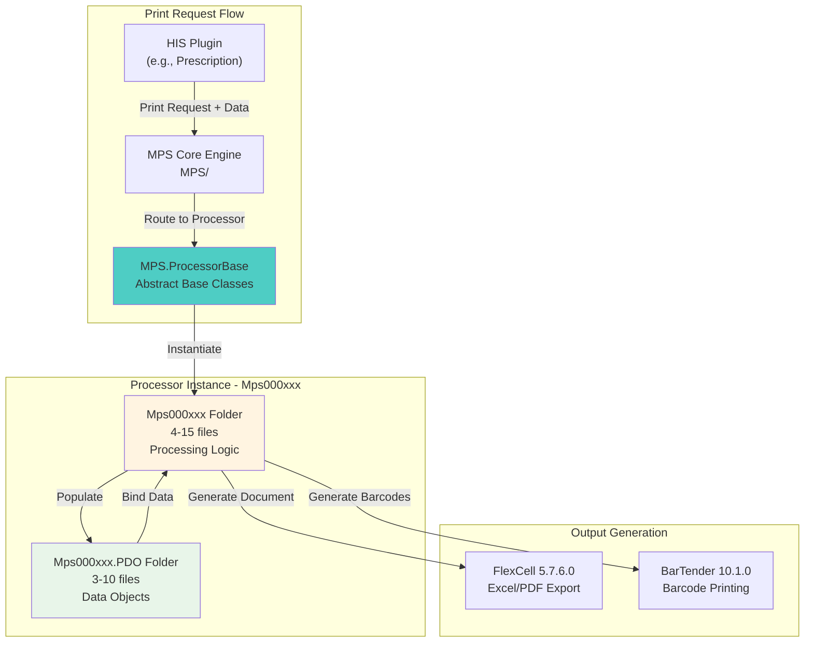
```mermaid
graph TB
    subgraph "Print Request Flow"
        Plugin["HIS Plugin<br/>(e.g., Prescription)"]
        MPSCore["MPS Core Engine<br/>MPS/"]
        ProcessorBase["MPS.ProcessorBase<br/>Abstract Base Classes"]
    end
    
    subgraph "Processor Instance - Mps000xxx"
        Logic["Mps000xxx Folder<br/>4-15 files<br/>Processing Logic"]
        PDO["Mps000xxx.PDO Folder<br/>3-10 files<br/>Data Objects"]
    end
    
    subgraph "Output Generation"
        FlexCell["FlexCell 5.7.6.0<br/>Excel/PDF Export"]
        BarTender["BarTender 10.1.0<br/>Barcode Printing"]
    end
    
    Plugin -->|"Print Request + Data"| MPSCore
    MPSCore -->|"Route to Processor"| ProcessorBase
    ProcessorBase -->|"Instantiate"| Logic
    Logic -->|"Populate"| PDO
    PDO -->|"Bind Data"| Logic
    Logic -->|"Generate Document"| FlexCell
    Logic -->|"Generate Barcodes"| BarTender
    
    style Logic fill:#fff4e1
    style PDO fill:#e8f5e9
    style ProcessorBase fill:#4ecdc4
```

**Sources:** MPS/, MPS.ProcessorBase/, MPS.Processor/

---

## Processor Base Classes

All print processors inherit from abstract base classes defined in the `MPS.ProcessorBase` folder (30 files). These base classes provide common infrastructure for template management, data binding, and document generation.

### Base Class Hierarchy

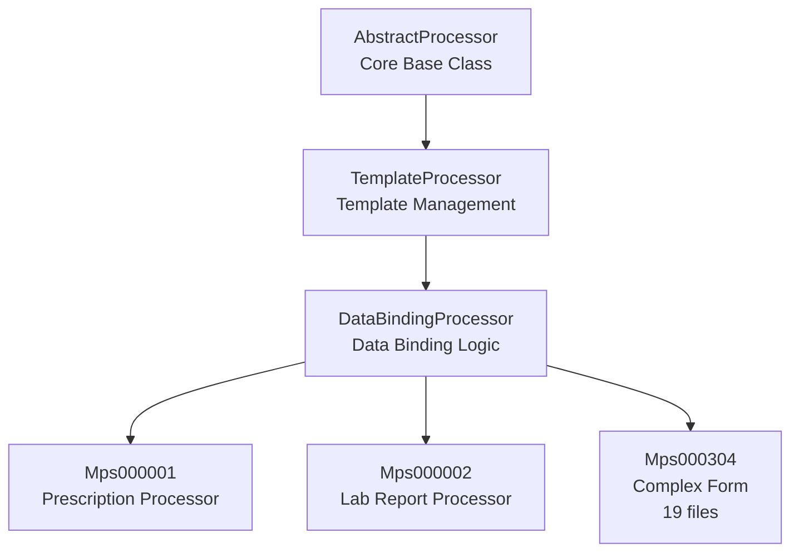
```mermaid
graph TB
    AbstractProcessor["AbstractProcessor<br/>Core Base Class"]
    TemplateProcessor["TemplateProcessor<br/>Template Management"]
    DataBindingProcessor["DataBindingProcessor<br/>Data Binding Logic"]
    
    Mps000001["Mps000001<br/>Prescription Processor"]
    Mps000002["Mps000002<br/>Lab Report Processor"]
    Mps000304["Mps000304<br/>Complex Form<br/>19 files"]
    
    AbstractProcessor --> TemplateProcessor
    TemplateProcessor --> DataBindingProcessor
    DataBindingProcessor --> Mps000001
    DataBindingProcessor --> Mps000002
    DataBindingProcessor --> Mps000304
```

### Key Base Class Responsibilities

| Base Class | Responsibility | Key Methods |
|------------|---------------|-------------|
| `AbstractProcessor` | Core lifecycle management | `Initialize()`, `Process()`, `Cleanup()` |
| `TemplateProcessor` | Template loading and caching | `LoadTemplate()`, `GetTemplateFile()` |
| `DataBindingProcessor` | Data binding to template | `BindData()`, `PopulateFields()` |

**Sources:** MPS.ProcessorBase/

---

## PDO (Print Data Object) Structure

Each processor's PDO folder contains data transfer objects that encapsulate all input parameters and data models needed for document generation. PDOs follow a standardized naming convention and structure.

### PDO Components

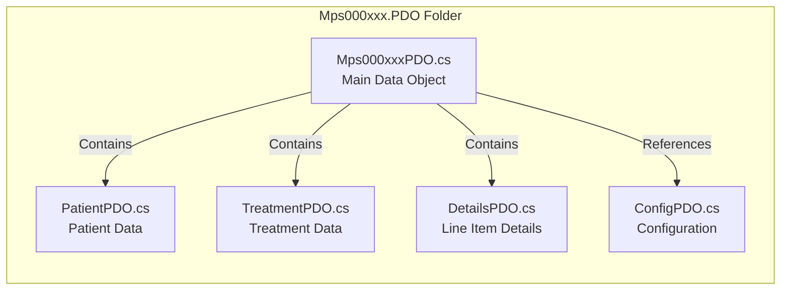
```mermaid
graph LR
    subgraph "Mps000xxx.PDO Folder"
        MainPDO["Mps000xxxPDO.cs<br/>Main Data Object"]
        PatientPDO["PatientPDO.cs<br/>Patient Data"]
        TreatmentPDO["TreatmentPDO.cs<br/>Treatment Data"]
        DetailsPDO["DetailsPDO.cs<br/>Line Item Details"]
        ConfigPDO["ConfigPDO.cs<br/>Configuration"]
    end
    
    MainPDO -->|"Contains"| PatientPDO
    MainPDO -->|"Contains"| TreatmentPDO
    MainPDO -->|"Contains"| DetailsPDO
    MainPDO -->|"References"| ConfigPDO
```

### Common PDO Properties

| Property Type | Purpose | Example |
|--------------|---------|---------|
| Patient Info | Patient identification and demographics | `PatientCode`, `PatientName`, `DOB`, `Gender` |
| Treatment Info | Treatment context | `TreatmentCode`, `InTime`, `OutTime`, `Department` |
| Service Details | Service/medicine line items | `List<ServiceDetail>`, `List<MedicineDetail>` |
| Configuration | Print settings and formatting | `IsBarcodeEnabled`, `NumCopies`, `PaperSize` |
| Metadata | Tracking and audit | `CreateTime`, `Creator`, `PrintTime` |

**Sources:** MPS.Processor/Mps000xxx.PDO/

---

## Creating a New Print Processor

### Step 1: Folder Structure

Create two folders following the naming convention:

```
MPS.Processor/
├── Mps000xxx/              # Logic folder (where xxx is next available number)
│   ├── Mps000xxx.cs        # Main processor class
│   ├── Mps000xxxProcessor.cs  # Processing implementation
│   ├── TemplateHandler.cs  # Template management
│   └── DataBinder.cs       # Data binding logic
└── Mps000xxx.PDO/          # Data objects folder
    ├── Mps000xxxPDO.cs     # Main PDO
    ├── PatientPDO.cs       # Patient data
    └── DetailPDO.cs        # Detail data
```

### Step 2: Implement Main Processor Class

The main processor class inherits from base classes in `MPS.ProcessorBase` and implements the processing logic:

**File Structure:**
- [[`MPS.Processor/Mps000xxx/Mps000xxx.cs`](../../MPS.Processor/Mps000xxx/Mps000xxx.cs)](../../MPS.Processor/Mps000xxx/Mps000xxx.cs) - Main entry point
- [[`MPS.Processor/Mps000xxx/Mps000xxxProcessor.cs`](../../MPS.Processor/Mps000xxx/Mps000xxxProcessor.cs)](../../MPS.Processor/Mps000xxx/Mps000xxxProcessor.cs) - Core processing logic
- [[`MPS.Processor/Mps000xxx/TemplateHandler.cs`](../../MPS.Processor/Mps000xxx/TemplateHandler.cs)](../../MPS.Processor/Mps000xxx/TemplateHandler.cs) - Template operations
- [[`MPS.Processor/Mps000xxx/DataBinder.cs`](../../MPS.Processor/Mps000xxx/DataBinder.cs)](../../MPS.Processor/Mps000xxx/DataBinder.cs) - Data binding operations

### Step 3: Define PDO Classes

```mermaid
graph TB
    subgraph "PDO Class Diagram"
        MainPDO["Mps000xxxPDO<br/>+ PatientInfo: PatientPDO<br/>+ Treatment: TreatmentPDO<br/>+ Details: List&lt;DetailPDO&gt;<br/>+ Config: ConfigPDO"]
        
        PatientPDO["PatientPDO<br/>+ PatientCode: string<br/>+ PatientName: string<br/>+ DOB: DateTime<br/>+ Gender: string<br/>+ Address: string"]
        
        TreatmentPDO["TreatmentPDO<br/>+ TreatmentCode: string<br/>+ InTime: DateTime<br/>+ DepartmentName: string<br/>+ RoomName: string"]
        
        DetailPDO["DetailPDO<br/>+ ServiceName: string<br/>+ Amount: decimal<br/>+ Price: decimal<br/>+ Unit: string"]
        
        ConfigPDO["ConfigPDO<br/>+ ShowBarcode: bool<br/>+ ShowLogo: bool<br/>+ NumCopies: int"]
        
        MainPDO --> PatientPDO
        MainPDO --> TreatmentPDO
        MainPDO --> DetailPDO
        MainPDO --> ConfigPDO
    end
```

**Sources:** MPS.Processor/Mps000xxx.PDO/

---

## Data Binding and Template Integration

### Template Management

Print processors use template files (typically Excel-based for FlexCell integration) that define the layout and formatting of output documents.

```mermaid
graph LR
    subgraph "Template Processing Flow"
        LoadTemplate["Load Template<br/>from Resources"]
        BindData["Bind PDO Data<br/>to Template Fields"]
        ApplyFormatting["Apply Conditional<br/>Formatting"]
        GenerateOutput["Generate Output<br/>(Excel/PDF)"]
        
        LoadTemplate --> BindData
        BindData --> ApplyFormatting
        ApplyFormatting --> GenerateOutput
    end
    
    subgraph "Data Sources"
        PDO["Mps000xxxPDO<br/>Data Object"]
        BackendData["BackendData<br/>Cached Reference Data"]
        Config["Config<br/>System Configuration"]
    end
    
    PDO --> BindData
    BackendData --> BindData
    Config --> ApplyFormatting
```

### Field Binding Patterns

| Binding Type | Template Syntax | PDO Property | Purpose |
|--------------|----------------|--------------|---------|
| Simple Field | `{PatientName}` | `PDO.PatientInfo.PatientName` | Direct value binding |
| Formatted Date | `{InTime:dd/MM/yyyy}` | `PDO.Treatment.InTime` | Date formatting |
| Conditional | `{IF ShowLogo}...{ENDIF}` | `PDO.Config.ShowLogo` | Conditional content |
| Loop | `{FOREACH Details}...{ENDFOR}` | `PDO.Details` | Repeating rows |
| Calculation | `{SUM Details.Amount}` | Computed | Aggregate functions |
| Barcode | `{BARCODE TreatmentCode}` | `PDO.Treatment.TreatmentCode` | Barcode generation |

**Sources:** MPS.ProcessorBase/, MPS.Processor/

---

## Large Processor Examples

### Mps000304 (19 Files)

One of the largest processors, likely handling complex multi-page medical reports with extensive data requirements.

**Typical File Organization:**
- [[`MPS.Processor/Mps000304/Mps000304.cs`](../../MPS.Processor/Mps000304/Mps000304.cs)](../../MPS.Processor/Mps000304/Mps000304.cs) - Main class
- [[`MPS.Processor/Mps000304/Mps000304Processor.cs`](../../MPS.Processor/Mps000304/Mps000304Processor.cs)](../../MPS.Processor/Mps000304/Mps000304Processor.cs) - Core processor
- [[`MPS.Processor/Mps000304/PageHandler.cs`](../../MPS.Processor/Mps000304/PageHandler.cs)](../../MPS.Processor/Mps000304/PageHandler.cs) - Multi-page logic
- [[`MPS.Processor/Mps000304/SectionProcessor.cs`](../../MPS.Processor/Mps000304/SectionProcessor.cs)](../../MPS.Processor/Mps000304/SectionProcessor.cs) - Section handling
- [[`MPS.Processor/Mps000304/DataAggregator.cs`](../../MPS.Processor/Mps000304/DataAggregator.cs)](../../MPS.Processor/Mps000304/DataAggregator.cs) - Data aggregation
- [[`MPS.Processor/Mps000304/TemplateManager.cs`](../../MPS.Processor/Mps000304/TemplateManager.cs)](../../MPS.Processor/Mps000304/TemplateManager.cs) - Template management
- [[`MPS.Processor/Mps000304/ValidationHelper.cs`](../../MPS.Processor/Mps000304/ValidationHelper.cs)](../../MPS.Processor/Mps000304/ValidationHelper.cs) - Data validation
- Additional helper classes (12 more files)

**PDO Structure:**
- [MPS.Processor/Mps000304.PDO/]() - Complex nested data objects

### Mps000321 (17 Files)

Another large processor demonstrating advanced features.

### Mps000463 (15 Files)

Complex form processor with extensive customization.

**Sources:** MPS.Processor/Mps000304/, MPS.Processor/Mps000321/, MPS.Processor/Mps000463/

---

## Processor Registration and Invocation

### Registration Pattern

```mermaid
graph TB
    subgraph "Processor Discovery"
        MPSCore["MPS Core Engine<br/>MPS/"]
        Registry["Processor Registry<br/>ProcessorMap"]
        ProcessorFactory["Processor Factory<br/>Create Instances"]
    end
    
    subgraph "Processor Registration"
        Mps000001["Mps000001<br/>Register(001)"]
        Mps000002["Mps000002<br/>Register(002)"]
        Mps000304["Mps000304<br/>Register(304)"]
    end
    
    subgraph "Plugin Invocation"
        PrescriptionPlugin["Prescription Plugin"]
        LabPlugin["Lab Plugin"]
        InvoicePlugin["Invoice Plugin"]
    end
    
    Mps000001 -->|"Self-Register"| Registry
    Mps000002 -->|"Self-Register"| Registry
    Mps000304 -->|"Self-Register"| Registry
    
    PrescriptionPlugin -->|"Request Print(001)"| MPSCore
    LabPlugin -->|"Request Print(002)"| MPSCore
    InvoicePlugin -->|"Request Print(304)"| MPSCore
    
    MPSCore -->|"Lookup"| Registry
    Registry -->|"Create Instance"| ProcessorFactory
```

### Invocation Flow

| Step | Component | Action |
|------|-----------|--------|
| 1 | Plugin | Creates PDO with data, specifies processor ID |
| 2 | MPS Core | Routes request to processor registry |
| 3 | Registry | Looks up processor class by ID |
| 4 | Factory | Instantiates processor with PDO |
| 5 | Processor | Executes processing logic |
| 6 | FlexCell/BarTender | Generates final output |
| 7 | MPS Core | Returns result to plugin |

**Sources:** MPS/, MPS.ProcessorBase/

---

## FlexCell Integration

The MPS system uses FlexCell 5.7.6.0 for Excel template processing and PDF generation.

### FlexCell Processing Pattern

```mermaid
graph LR
    subgraph "FlexCell Workflow"
        LoadWorkbook["Load Excel<br/>Template"]
        CreateSheet["Access<br/>Worksheet"]
        BindCells["Bind Cell<br/>Values"]
        ApplyStyles["Apply Cell<br/>Styles"]
        Export["Export to<br/>Excel/PDF"]
    end
    
    Processor["Print Processor"] --> LoadWorkbook
    LoadWorkbook --> CreateSheet
    CreateSheet --> BindCells
    PDO["PDO Data"] --> BindCells
    BindCells --> ApplyStyles
    Config["Format Config"] --> ApplyStyles
    ApplyStyles --> Export
```

### Common FlexCell Operations

| Operation | Purpose | Implementation |
|-----------|---------|----------------|
| Cell Binding | Set cell values from PDO | `worksheet.Cell[row, col].Value = pdo.Field` |
| Range Binding | Fill data ranges | `worksheet.SetRange(startRow, startCol, dataArray)` |
| Formula | Calculate values | `worksheet.Cell[row, col].Formula = "=SUM(A1:A10)"` |
| Styling | Apply formatting | `worksheet.Cell[row, col].Style = styleObject` |
| Merge Cells | Combine cells | `worksheet.MergeRange(range)` |
| Export PDF | Generate PDF output | `workbook.ExportPDF(fileName)` |

**Sources:** MPS/, Common/Inventec.Common/FlexCelPrint/, Common/Inventec.Common/FlexCelExport/

---

## BarTender Integration

BarTender 10.1.0 is used for barcode and label printing.

### Barcode Generation Pattern

```mermaid
graph TB
    subgraph "BarTender Workflow"
        LoadFormat["Load BarTender<br/>Format File"]
        SetData["Set Data<br/>Sources"]
        GenerateBarcode["Generate<br/>Barcode"]
        Print["Print to<br/>Device/File"]
    end
    
    Processor["Print Processor"] --> LoadFormat
    LoadFormat --> SetData
    PDO["PDO with<br/>Barcode Data"] --> SetData
    SetData --> GenerateBarcode
    GenerateBarcode --> Print
```

### Barcode Types Supported

| Type | Use Case | PDO Field Example |
|------|----------|-------------------|
| Code 39 | Patient ID, Treatment ID | `PatientCode`, `TreatmentCode` |
| Code 128 | Medicine codes | `MedicineCode` |
| QR Code | Multi-field encoding | `JSON.Serialize(ComplexData)` |
| EAN-13 | Product identification | `ProductBarcode` |

**Sources:** MPS/

---

## Common Development Patterns

### Pattern 1: Simple Form Processor (4-6 Files)

Basic single-page form with minimal complexity:
- Main processor class
- Template handler
- PDO class
- 1-2 helper classes

**Example Range:** Mps000001-Mps000100

### Pattern 2: Multi-Section Report (7-10 Files)

Form with multiple sections requiring different data sources:
- Main processor
- Section processors (one per section)
- Data aggregator
- PDO classes (one per section)
- Helper utilities

**Example Range:** Mps000101-Mps000200

### Pattern 3: Complex Multi-Page Document (15-19 Files)

Sophisticated document with dynamic pagination, calculations, and extensive formatting:
- Main processor and coordinator
- Page handlers
- Section processors
- Data aggregators and calculators
- Multiple PDO classes
- Validation helpers
- Template managers
- Formatting utilities

**Example Range:** Mps000304, Mps000321, Mps000463

**Sources:** MPS.Processor/

---

## Best Practices

### Code Organization

| Practice | Rationale |
|----------|-----------|
| Separate logic from data | PDO folder contains only data objects with no business logic |
| Single responsibility | Each file handles one specific aspect (template, binding, formatting) |
| Reuse base classes | Leverage `MPS.ProcessorBase` for common functionality |
| Standardize naming | Follow Mps000xxx / Mps000xxxPDO convention |

### Performance Optimization

| Technique | Benefit |
|-----------|---------|
| Template caching | Avoid reloading templates for each print request |
| Lazy loading | Load reference data only when needed |
| Bulk operations | Use range operations instead of cell-by-cell in FlexCell |
| Resource disposal | Properly dispose FlexCell objects to prevent memory leaks |

### Error Handling

| Scenario | Handling Strategy |
|----------|-------------------|
| Missing template | Log error, use fallback template |
| Invalid PDO data | Validate input, return meaningful error |
| FlexCell errors | Catch exceptions, log details, retry if transient |
| BarTender connection | Handle disconnection gracefully, queue for retry |

**Sources:** MPS.ProcessorBase/, MPS/

---

## Testing New Processors

### Test Checklist

```mermaid
graph TB
    subgraph "Testing Process"
        UnitTest["Unit Tests<br/>PDO Validation"]
        IntegrationTest["Integration Tests<br/>Template Binding"]
        RenderTest["Render Tests<br/>Output Generation"]
        PrintTest["Print Tests<br/>Physical Output"]
        
        UnitTest --> IntegrationTest
        IntegrationTest --> RenderTest
        RenderTest --> PrintTest
    end
    
    subgraph "Test Data"
        SamplePDO["Sample PDO<br/>Valid Data"]
        EdgeCases["Edge Cases<br/>Boundary Values"]
        ErrorCases["Error Cases<br/>Invalid Data"]
    end
    
    SamplePDO --> UnitTest
    EdgeCases --> UnitTest
    ErrorCases --> UnitTest
```

### Test Cases to Verify

- PDO validation with valid data
- PDO validation with missing required fields
- Template loading and caching
- Data binding to all template fields
- Conditional formatting rules
- Multi-page pagination
- Barcode generation (if applicable)
- PDF export quality
- Print preview functionality
- Performance with large datasets (100+ detail rows)

**Sources:** MPS.Processor/

---

## Integration with HIS Plugins

Plugins invoke print processors through the MPS Core Engine:

```mermaid
graph LR
    subgraph "Plugin Layer - HIS/Plugins/"
        PrescriptionPlugin["AssignPrescriptionPK<br/>203 files"]
        ServicePlugin["ServiceExecute<br/>119 files"]
        FinishPlugin["TreatmentFinish<br/>101 files"]
    end
    
    subgraph "MPS Layer"
        MPSCore["MPS Core Engine<br/>MPS/"]
        Processor001["Mps000001<br/>Prescription"]
        Processor002["Mps000002<br/>Service Report"]
        Processor003["Mps000003<br/>Treatment Summary"]
    end
    
    PrescriptionPlugin -->|"Print Request + PDO"| MPSCore
    ServicePlugin -->|"Print Request + PDO"| MPSCore
    FinishPlugin -->|"Print Request + PDO"| MPSCore
    
    MPSCore --> Processor001
    MPSCore --> Processor002
    MPSCore --> Processor003
```

**Sources:** HIS/Plugins/, MPS/

---

## Processor Numbering Convention

| Range | Category | Examples |
|-------|----------|----------|
| 000001-000050 | Prescriptions | Drug prescriptions, medicine orders |
| 000051-000100 | Lab Reports | Test results, analysis reports |
| 000101-000150 | Invoices | Payment receipts, billing statements |
| 000151-000200 | Transfer Forms | Patient transfers, referrals |
| 000201-000250 | Treatment Records | Treatment summaries, discharge notes |
| 000251-000300 | Administrative | Registration forms, certificates |
| 000301-000500 | Complex Forms | Multi-page reports, specialized documents |
| 000501-000600+ | Custom Forms | Hospital-specific templates |

**Sources:** MPS.Processor/

---

## Summary

Print processor development in the MPS system follows a well-defined two-component architecture:

1. **Logic Folder (Mps000xxx)**: Contains processing logic, template handling, and data binding code (4-19 files)
2. **PDO Folder (Mps000xxx.PDO)**: Contains data transfer objects and input parameters (3-10 files)

Key integration points:
- Inherit from `MPS.ProcessorBase` abstract classes
- Use FlexCell for Excel/PDF generation ([Common/Inventec.Common/FlexCelPrint/](), [Common/Inventec.Common/FlexCelExport/]())
- Use BarTender for barcode printing
- Register with MPS Core Engine for plugin invocation
- Follow standardized naming conventions (Mps000xxx)

For information about the overall MPS architecture, see [MPS Print System](../02-modules/his-desktop/business-plugins.md#mps-print). For details on how plugins use the print system, see [Plugin System Architecture](../01-architecture/plugin-system.md).

**Sources:** MPS/, MPS.ProcessorBase/, MPS.Processor/, Common/Inventec.Common/

# UC Components Library


## Purpose and Scope

This document covers the UC (User Controls) library, a collection of 131 reusable UI components located in the `UC/` directory. These components provide standardized, domain-specific controls used throughout the HIS system's 956 plugins. The UC library implements a two-tier architecture built on the `Inventec.UC` foundation layer and provides specialized medical domain controls.

For information about the foundation layer utilities, see [Inventec UC Shared Controls](../02-modules/common-libraries/libraries.md#inventec-uc). For plugin-level UI implementation, see [Plugin System Architecture](../01-architecture/plugin-system.md).

## Overview

The UC library serves as the primary UI component repository for the HIS system, enabling consistent user interfaces across all plugins. Each UC project is a self-contained, reusable control that can be embedded into any plugin requiring that functionality.

The library contains components ranging from simple input controls to complex workflow forms, with the largest components containing over 300 files.

```mermaid
graph TB
    subgraph "HIS Application Layer"
        Plugins["956 HIS Plugins<br/>Business Logic"]
    end
    
    subgraph "UC Components Layer - 131 Projects"
        FormType["HIS.UC.FormType<br/>329 files"]
        CreateReport["His.UC.CreateReport<br/>165 files"]
        UCHein["His.UC.UCHein<br/>153 files"]
        PlusInfo["HIS.UC.PlusInfo<br/>147 files"]
        ExamFinish["HIS.UC.ExamTreatmentFinish<br/>103 files"]
        TreatmentFinish["HIS.UC.TreatmentFinish<br/>94 files"]
        OtherUCs["125 other UC projects"]
    end
    
    subgraph "Foundation Layer"
        InventecUC["Inventec.UC<br/>1060 files<br/>Base Controls"]
    end
    
    Plugins --> FormType
    Plugins --> CreateReport
    Plugins --> UCHein
    Plugins --> PlusInfo
    Plugins --> ExamFinish
    Plugins --> TreatmentFinish
    Plugins --> OtherUCs
    
    FormType --> InventecUC
    CreateReport --> InventecUC
    UCHein --> InventecUC
    PlusInfo --> InventecUC
    ExamFinish --> InventecUC
    TreatmentFinish --> InventecUC
    OtherUCs --> InventecUC
```

**Sources:** [UC/](#), [Common/Inventec.UC/](#), [`.devin/wiki.json:1-295`](../../../.devin/wiki.json#L1-L295)

## Architecture

### Two-Tier Component Hierarchy

The UC library implements a layered architecture where domain-specific components build upon a foundation of generic controls:

| Layer | Component | Purpose | File Count |
|-------|-----------|---------|------------|
| Foundation | `Inventec.UC` | Base controls, grid behaviors, common UI patterns | 1060 files |
| Domain | `HIS.UC.*` | Medical domain-specific controls | 131 projects |
| Domain | `His.UC.*` | Healthcare workflow controls | Part of 131 projects |

The foundation layer (`Inventec.UC`) provides generic UI behaviors such as:
- Grid controls with sorting and filtering
- Date/time pickers
- Search boxes
- Validation frameworks
- Common dialogs

Domain-specific UC projects extend these base controls with medical context, business rules, and workflow logic.

**Sources:** [Common/Inventec.UC/](#), [UC/](#)

### UC Categories

The 131 UC components are organized by functional domain:

```mermaid
graph LR
    subgraph "Core Data Entry"
        FormType["HIS.UC.FormType<br/>329 files<br/>Form Engine"]
        PlusInfo["HIS.UC.PlusInfo<br/>147 files<br/>Additional Info"]
    end
    
    subgraph "Clinical Workflows"
        ExamFinish["HIS.UC.ExamTreatmentFinish<br/>103 files"]
        TreatmentFinish["HIS.UC.TreatmentFinish<br/>94 files"]
        Hospitalize["HIS.UC.Hospitalize<br/>53 files"]
        Death["HIS.UC.Death<br/>47 files"]
    end
    
    subgraph "Reporting"
        CreateReport["His.UC.CreateReport<br/>165 files"]
    end
    
    subgraph "Insurance"
        UCHein["His.UC.UCHein<br/>153 files"]
        UCHeniInfo["HIS.UC.UCHeniInfo<br/>47 files"]
    end
    
    subgraph "Medical Data"
        MedicineType["HIS.UC.MedicineType<br/>82 files"]
        MaterialType["HIS.UC.MaterialType<br/>85 files"]
        Icd["HIS.UC.Icd<br/>65 files"]
        SecondaryIcd["HIS.UC.SecondaryIcd<br/>61 files"]
    end
    
    subgraph "Patient Management"
        PatientSelect["HIS.UC.PatientSelect<br/>39 files"]
        UCPatientRaw["HIS.UC.UCPatientRaw<br/>47 files"]
    end
```

**Sources:** [`.devin/wiki.json:200-237`](../../../.devin/wiki.json#L200-L237)

### Top 15 UC Components by Size

| UC Project | File Count | Primary Purpose |
|------------|------------|-----------------|
| `HIS.UC.FormType` | 329 | Core form rendering engine for all data entry |
| `His.UC.CreateReport` | 165 | Report builder and template management |
| `His.UC.UCHein` | 153 | Health insurance workflows and validation |
| `HIS.UC.PlusInfo` | 147 | Additional patient/treatment information entry |
| `HIS.UC.ExamTreatmentFinish` | 103 | Exam completion workflows |
| `HIS.UC.TreatmentFinish` | 94 | Treatment termination and discharge |
| `HIS.UC.MaterialType` | 85 | Material/supply selection and management |
| `HIS.UC.MedicineType` | 82 | Medicine selection and management |
| `HIS.UC.Icd` | 65 | Primary diagnosis (ICD-10 code) selection |
| `HIS.UC.SecondaryIcd` | 61 | Secondary diagnosis and comorbidities |
| `HIS.UC.KskContract` | 59 | Health examination contract management |
| `HIS.UC.DateEditor` | 55 | Date/time input with medical context |
| `HIS.UC.DHST` | 54 | Vital signs entry (height, weight, BP, etc.) |
| `HIS.UC.Hospitalize` | 53 | Patient admission workflows |
| `HIS.UC.TreeSereServ7V2` | 52 | Service tree navigation and selection |

**Sources:** [`.devin/wiki.json:204-231`](../../../.devin/wiki.json#L204-L231)

## Integration with HIS Plugins

UC components are consumed by plugins through a standard pattern of initialization, data binding, and event handling. The following diagram illustrates the data flow between plugins and UCs:

```mermaid
sequenceDiagram
    participant Plugin as "HIS.Desktop.Plugins.*"
    participant UC as "HIS.UC.* Control"
    participant InventecUC as "Inventec.UC Base"
    participant API as "HIS.Desktop.ApiConsumer"
    participant LocalStorage as "LocalStorage.BackendData"
    
    Plugin->>UC: Initialize(config)
    UC->>InventecUC: SetupBaseControls()
    InventecUC-->>UC: Controls Ready
    
    Plugin->>LocalStorage: GetCachedData()
    LocalStorage-->>Plugin: CachedData
    Plugin->>UC: BindData(data)
    
    UC->>Plugin: RaiseValidationEvent()
    Plugin->>API: SaveData(model)
    API-->>Plugin: SaveResult
    Plugin->>UC: UpdateDisplay(result)
    
    UC->>Plugin: UserActionEvent()
    Plugin->>UC: RefreshData()
```

**Sources:** [HIS/HIS.Desktop/](#), [UC/](#), [HIS/HIS.Desktop.ApiConsumer/](#)

### Common Integration Pattern

Most plugins follow this pattern when using UC components:

```
1. Plugin creates UC instance
2. Plugin initializes UC with configuration parameters
3. Plugin binds data from LocalStorage or API
4. UC raises events for user actions
5. Plugin handles events and performs business logic
6. Plugin updates UC display based on results
```

The UC component itself handles:
- UI layout and rendering
- Input validation
- Grid operations (sort, filter, search)
- Data formatting
- User interaction events

**Sources:** [HIS/Plugins/](#)

## UC Project Structure

Each UC project typically follows this internal structure:

```mermaid
graph TB
    subgraph "HIS.UC.ExampleControl Project"
        UCControl["UCExampleControl.cs<br/>Main UserControl Class"]
        Processor["Processor/<br/>Business Logic"]
        ADO["ADO/<br/>Data Objects"]
        Design["Design/<br/>UI Layouts"]
        Resources["Resources/<br/>Icons, Strings"]
        Run["Run/<br/>Initialization Logic"]
        Base["Base/<br/>Interfaces, Base Classes"]
    end
    
    UCControl --> Processor
    UCControl --> Design
    Processor --> ADO
    Processor --> Base
    Run --> UCControl
```

### Standard Folders in UC Projects

| Folder | Purpose | Typical Contents |
|--------|---------|------------------|
| `/` (root) | Main control class | [`UC[Name].cs`](../../UC[Name].cs), [`UC[Name].Designer.cs`](../../UC[Name].Designer.cs) |
| `ADO/` | Data transfer objects | Models specific to the UC |
| `Processor/` | Business logic | Validation, calculations, data transformations |
| `Design/` | UI resources | Layout XML, designer files |
| `Resources/` | Assets | Icons, localized strings |
| `Run/` | Factory/initialization | UC instantiation logic |
| `Base/` | Interfaces | Contracts for plugin integration |

**Sources:** [UC/](#)

## Key UC Components

### HIS.UC.FormType - Form Rendering Engine

`HIS.UC.FormType` is the largest and most critical UC component with 329 files. It serves as the core form rendering engine for all data entry operations in the HIS system.

**Functionality:**
- Dynamic form generation based on templates
- Field-level validation rules
- Data binding for complex medical forms
- Support for multiple form types (patient registration, exam, prescription, etc.)

For detailed information, see [Form Type Controls](#1.3.1).

**Sources:** [UC/HIS.UC.FormType/](#)

### His.UC.CreateReport - Report Builder

`His.UC.CreateReport` (165 files) provides report creation and template management capabilities.

**Key Features:**
- Custom report template design
- Parameter input forms
- Data source selection
- Export to multiple formats (PDF, Excel, Word)
- Integration with MPS print system

**Sources:** [UC/His.UC.CreateReport/](#)

### His.UC.UCHein - Insurance Management

`His.UC.UCHein` (153 files) handles health insurance validation and workflows.

**Key Features:**
- Insurance card validation
- Coverage verification
- Co-payment calculation
- Insurance rules enforcement
- Integration with government insurance systems

**Sources:** [UC/His.UC.UCHein/](#)

### HIS.UC.PlusInfo - Additional Information

`HIS.UC.PlusInfo` (147 files) provides extensible fields for additional patient and treatment data.

**Key Features:**
- Custom field definitions
- Dynamic field rendering
- Multi-type data entry (text, numeric, date, dropdown)
- Field grouping and categorization

**Sources:** [UC/HIS.UC.PlusInfo/](#)

## Medical Domain UCs

### Patient and Treatment Controls

These UCs handle core patient management and treatment workflows. For detailed documentation, see [Patient & Treatment UCs](#1.3.2).

| UC Component | Files | Purpose |
|--------------|-------|---------|
| `HIS.UC.ExamTreatmentFinish` | 103 | Complete examination and finalize treatment plan |
| `HIS.UC.TreatmentFinish` | 94 | Discharge and treatment termination workflows |
| `HIS.UC.Hospitalize` | 53 | Patient admission and bed assignment |
| `HIS.UC.Death` | 47 | Death certificate and related procedures |
| `HIS.UC.UCPatientRaw` | 47 | Raw patient data entry |
| `HIS.UC.UCHeniInfo` | 47 | Detailed insurance information |
| `HIS.UC.PatientSelect` | 39 | Patient search and selection |

**Sources:** [`.devin/wiki.json:215-222`](../../../.devin/wiki.json#L215-L222)

### Medicine and Diagnosis Controls

These UCs manage medication selection and diagnostic coding. For detailed documentation, see [Medicine & ICD UCs](#1.3.3).

| UC Component | Files | Purpose |
|--------------|-------|---------|
| `HIS.UC.MaterialType` | 85 | Medical material/supply selection |
| `HIS.UC.MedicineType` | 82 | Medication search and selection |
| `HIS.UC.Icd` | 65 | Primary ICD-10 diagnosis code entry |
| `HIS.UC.SecondaryIcd` | 61 | Secondary diagnoses and comorbidities |
| `HIS.UC.DHST` | 54 | Vital signs (height, weight, BP, temperature) |
| `HIS.UC.TreeSereServ7V2` | 52 | Service hierarchy navigation |

**Sources:** [`.devin/wiki.json:225-232`](../../../.devin/wiki.json#L225-L232)

### Service and Room Controls

These UCs handle service management and room operations. For detailed documentation, see [Service & Room UCs](#1.3.4).

| UC Component | Files | Purpose |
|--------------|-------|---------|
| `HIS.UC.ServiceRoom` | 48 | Service-to-room assignment |
| `HIS.UC.ServiceUnit` | 48 | Service unit management |
| `HIS.UC.Sick` | 43 | Sick leave documentation |
| `HIS.UC.ServiceRoomInfo` | 43 | Detailed service room information |
| `HIS.UC.National` | 41 | Nationality/ethnicity selection |
| `HIS.UC.RoomExamService` | 40 | Examination room service configuration |

**Sources:** [`.devin/wiki.json:235-238`](../../../.devin/wiki.json#L235-L238)

## UC Communication Patterns

### Event-Driven Architecture

UC components use events to communicate state changes and user actions to consuming plugins:

```mermaid
graph TB
    subgraph "UC Component Events"
        DataChanged["Data Changed Event"]
        ValidationFailed["Validation Failed Event"]
        SelectionChanged["Selection Changed Event"]
        ActionRequired["Action Required Event"]
    end
    
    subgraph "Plugin Handlers"
        SaveHandler["Save Data Handler"]
        ValidationHandler["Validation Handler"]
        RefreshHandler["Refresh Display Handler"]
        WorkflowHandler["Workflow Progression Handler"]
    end
    
    DataChanged --> SaveHandler
    ValidationFailed --> ValidationHandler
    SelectionChanged --> RefreshHandler
    ActionRequired --> WorkflowHandler
    
    SaveHandler --> API["HIS.Desktop.ApiConsumer"]
    ValidationHandler --> LocalStorage["LocalStorage.BackendData"]
    RefreshHandler --> UC["Update UC Display"]
    WorkflowHandler --> NextStep["Navigate to Next Step"]
```

### Standard UC Events

Most UC components expose these standard event types:

| Event Type | Purpose | Data Passed |
|------------|---------|-------------|
| `OnDataChanged` | Data modification by user | Modified data object |
| `OnValidationFailed` | Validation rule violation | Validation error list |
| `OnSelectionChanged` | Item selected from list | Selected item ID/object |
| `OnActionRequired` | User initiated action | Action type identifier |
| `OnSaveRequired` | Data ready to persist | Complete data model |

**Sources:** [UC/](#), [HIS/HIS.Desktop/](#)

### Data Binding Pattern

UC components support bidirectional data binding:

```mermaid
sequenceDiagram
    participant Plugin
    participant UC
    participant ADO as "UC ADO Model"
    participant LocalStorage
    
    Plugin->>LocalStorage: LoadData()
    LocalStorage-->>Plugin: DataList
    Plugin->>ADO: MapToADO(DataList)
    Plugin->>UC: SetData(ADO)
    UC->>UC: RenderUI()
    
    Note over UC: User modifies data
    
    UC->>ADO: UpdateModel()
    UC->>Plugin: OnDataChanged(ADO)
    Plugin->>ADO: MapFromADO()
    Plugin->>API: SaveData()
```

**Sources:** [UC/](#), [HIS/HIS.Desktop.ADO/](#)

## UC Development Patterns

### Creating a New UC Component

When developing a new UC component, follow these steps:

1. **Create project structure:**
   - Create new Class Library project in `UC/` folder
   - Follow naming convention: `HIS.UC.[ComponentName]` or `His.UC.[ComponentName]`
   - Add folders: `ADO/`, `Processor/`, `Design/`, `Run/`, `Base/`

2. **Define interfaces:**
   - Create interface in `Base/` folder defining UC contract
   - Include initialization, data binding, and event methods

3. **Implement UserControl:**
   - Create main `.cs` and [[`.Designer.cs`](../../.Designer.cs)](../../.Designer.cs) files
   - Inherit from appropriate Inventec.UC base control
   - Implement UI layout in designer

4. **Add ADO models:**
   - Define data transfer objects in `ADO/` folder
   - Map to backend entity structures

5. **Implement processors:**
   - Add business logic in `Processor/` folder
   - Separate concerns (validation, calculation, formatting)

6. **Create factory:**
   - Add initialization logic in `Run/` folder
   - Provide clean instantiation API for plugins

**Sources:** [UC/](#)

### UC Dependencies

UC components depend on these common libraries:

```mermaid
graph TB
    UC["HIS.UC.* Component"]
    
    UC --> InventecUC["Inventec.UC<br/>Base Controls"]
    UC --> InventecCommon["Inventec.Common<br/>Utilities"]
    UC --> DevExpress["DevExpress 15.2.9<br/>UI Controls"]
    UC --> ADO["HIS.Desktop.ADO<br/>Data Models"]
    UC --> LocalStorage["HIS.Desktop.LocalStorage<br/>Configuration"]
    
    InventecUC --> DevExpress
    InventecCommon --> Logging["Inventec.Common.Logging"]
    InventecCommon --> DateTime["Inventec.Common.DateTime"]
```

**Sources:** [UC/](#), [Common/Inventec.UC/](#), [Common/Inventec.Common/](#)

## Summary

The UC Components Library provides 131 reusable medical domain controls that enable consistent UI/UX across the HIS system's 956 plugins. Key characteristics:

- **Two-tier architecture:** Domain UCs build on `Inventec.UC` foundation (1060 files)
- **Largest component:** `HIS.UC.FormType` (329 files) serves as the core form engine
- **Specialized domains:** Patient management, clinical workflows, insurance, reporting, medical data
- **Event-driven integration:** Standard event patterns for plugin communication
- **Standardized structure:** Consistent folder layout (ADO, Processor, Design, Run, Base)

The library reduces code duplication, ensures UI consistency, and accelerates plugin development by providing pre-built, tested controls for common medical workflows.

**Sources:** [UC/](#), [`.devin/wiki.json:200-238`](../../../.devin/wiki.json#L200-L238, [Common/Inventec.UC/](#)