## Mục tiêu và Phạm vi

Tài liệu này trình bày về hạ tầng xử lý thông báo và sự kiện trong ứng dụng HIS Desktop, cụ thể bao gồm:
- **HIS.Desktop.LocalStorage.PubSub/** (9 files): Hệ thống event bus theo mô hình Publish-Subscribe để giao tiếp giữa các module.
- **HIS.Desktop.Notify/** (25 files): Hệ thống thông báo người dùng và thông báo trên giao diện (UI notifications).
- Tích hợp với **Inventec.Common.WSPubSub** để xử lý tin nhắn thời gian thực dựa trên WebSocket.

Hệ thống sự kiện cho phép giảm thiểu sự phụ thuộc trực tiếp (loose coupling) giữa các plugin và module, cho phép chúng giao tiếp với nhau mà không cần tham chiếu trực tiếp. Để biết thêm thông tin về các mô hình giao tiếp trực tiếp giữa cácXem `HIS.Desktop.Modules.Plugin` trong [Tài liệu Hệ thống Plugin](../01-architecture/plugin-system/04-communication.md) để biết chi tiết triển khai.ớ đệm dữ liệu cục bộ, xem [LocalStorage & Cấu hình](../03-technical-specs/his-desktop/core.md).

---

## Tổng quan Kiến trúc Hệ thống

Ứng dụng HIS Desktop triển khai hai mô hình giao tiếp bổ trợ cho nhau:

| Mô hình | Vị trí | Mức độ phụ thuộc | Trường hợp sử dụng |
|---------|----------|----------|----------|
| **PubSub Event Bus** | HIS.Desktop.LocalStorage.PubSub/ | Lỏng lẻo (Loose) | Phát thông báo, thay đổi dữ liệu, sự kiện hệ thống |
| **DelegateRegister** | HIS.Desktop.DelegateRegister | Chặt chẽ (Tight) | Gọi trực tiếp plugin, mô hình yêu cầu-phản hồi (request-response) |
| **WSPubSub** | Inventec.Common.WSPubSub | Lỏng lẻo (Loose) | Đẩy dữ liệu từ server thời gian thực, đồng bộ hóa đa client |

Hệ thống thông báo hoạt động ở ba lớp:
1. **Sự kiện Ứng dụng (Application Events):** Giao tiếp nội bộ giữa các plugin thông qua PubSub.
2. **Thông báo Người dùng (User Notifications):** Các thông báo giao diện được quản lý bởi HIS.Desktop.Notify/.
3. **Sự kiện Thời gian thực (Real-time Events):** Các sự kiện khởi tạo từ phía máy chủ thông qua kết nối WebSocket.

**Nguồn tham khảo:** 
- HIS.Desktop.LocalStorage.PubSub/
- HIS.Desktop.Notify/
- Common/Inventec.Common/Inventec.Common.WSPubSub/

---

## Kiến trúc PubSub Event Bus

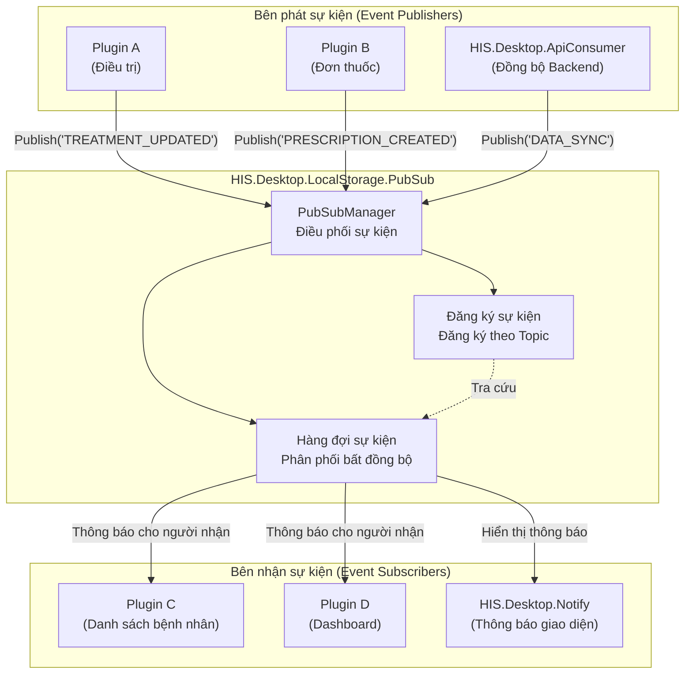
```mermaid
graph TB
    subgraph "Bên phát sự kiện (Event Publishers)"
        PluginA["Plugin A<br/>(Điều trị)"]
        PluginB["Plugin B<br/>(Đơn thuốc)"]
        ApiConsumer["HIS.Desktop.ApiConsumer<br/>(Đồng bộ Backend)"]
    end
    
    subgraph "HIS.Desktop.LocalStorage.PubSub"
        PubSubManager["PubSubManager<br/>Điều phối sự kiện"]
        EventRegistry["Đăng ký sự kiện<br/>Đăng ký theo Topic"]
        EventQueue["Hàng đợi sự kiện<br/>Phân phối bất đồng bộ"]
    end
    
    subgraph "Bên nhận sự kiện (Event Subscribers)"
        PluginC["Plugin C<br/>(Danh sách bệnh nhân)"]
        PluginD["Plugin D<br/>(Dashboard)"]
        NotifyUI["HIS.Desktop.Notify<br/>(Thông báo giao diện)"]
    end
    
    PluginA -->|"Publish('TREATMENT_UPDATED')"| PubSubManager
    PluginB -->|"Publish('PRESCRIPTION_CREATED')"| PubSubManager
    ApiConsumer -->|"Publish('DATA_SYNC')"| PubSubManager
    
    PubSubManager --> EventRegistry
    PubSubManager --> EventQueue
    
    EventQueue -->|"Thông báo cho người nhận"| PluginC
    EventQueue -->|"Thông báo cho người nhận"| PluginD
    EventQueue -->|"Hiển thị thông báo"| NotifyUI
    
    EventRegistry -.->|"Tra cứu"| EventQueue
```

**Mô hình Luồng sự kiện:**

1. **Bên phát (Publisher)** gọi phương thức `Publish(eventName, eventData)` trên bộ phận quản lý PubSub.
2. **Hệ thống đăng ký sự kiện (Event Registry)** tra cứu tất cả những bên đăng ký nhận (subscribers) cho topic sự kiện đó.
3. **Hàng đợi sự kiện (Event Queue)** phân phối sự kiện một cách bất đồng bộ tới từng bên nhận.
4. **Bên nhận (Subscribers)** nhận được sự kiện thông qua các hàm callback delegate đã đăng ký.

**Nguồn tham khảo:**
- HIS.Desktop.LocalStorage.PubSub/
- HIS.Desktop.LocalStorage.BackendData/

---

## Các thành phần triển khai PubSub

### Các Class và Interface cốt lõi

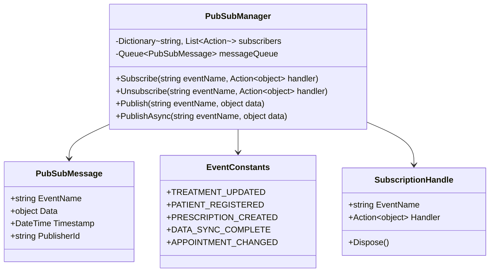
```mermaid
classDiagram
    class PubSubManager {
        +Subscribe(string eventName, Action~object~ handler)
        +Unsubscribe(string eventName, Action~object~ handler)
        +Publish(string eventName, object data)
        +PublishAsync(string eventName, object data)
        -Dictionary~string, List~Action~~ subscribers
        -Queue~PubSubMessage~ messageQueue
    }
    
    class PubSubMessage {
        +string EventName
        +object Data
        +DateTime Timestamp
        +string PublisherId
    }
    
    class EventConstants {
        +TREATMENT_UPDATED
        +PATIENT_REGISTERED
        +PRESCRIPTION_CREATED
        +DATA_SYNC_COMPLETE
        +APPOINTMENT_CHANGED
    }
    
    class SubscriptionHandle {
        +string EventName
        +Action~object~ Handler
        +Dispose()
    }
    
    PubSubManager --> PubSubMessage
    PubSubManager --> EventConstants
    PubSubManager --> SubscriptionHandle
```

### Các Topic sự kiện chính

Hệ thống sử dụng các topic sự kiện kiểu chuỗi (string) được định nghĩa trong các class hằng số (constants). Các topic sự kiện thông dụng bao gồm:

| Topic sự kiện | Mục đích | Bên phát phổ biến | Bên nhận phổ biến |
|-------------|---------|-------------------|---------------------|
| `TREATMENT_UPDATED` | Bản ghi điều trị thay đổi | Các plugin Điều trị | Danh sách bệnh nhân, Dashboard |
| `PATIENT_REGISTERED` | Bệnh nhân mới được tạo | Các plugin Đăng ký | Quầy tiếp đón, Hệ thống gọi |
| `PRESCRIPTION_CREATED` | Đơn thuốc mới được cấp | Các plugin Đơn thuốc | Nhà thuốc, Hệ thống in |
| `SERVICE_EXECUTED` | Dịch vụ đã được thực hiện | Các plugin Dịch vụ | Thanh toán, Thống kê |
| `TRANSACTION_COMPLETED` | Thanh toán đã hoàn tất | Các plugin Giao dịch | In biên lai, Theo dõi nợ |
| `DATA_SYNC_COMPLETE` | Dữ liệu backend đã làm mới | ApiConsumer | Tất cả plugin dùng cache |
| `CONFIG_CHANGED` | Cấu hình được cập nhật | Các plugin Cấu hình | Tất cả plugin đọc cấu hình |
| `USER_LOGOUT` | Người dùng đăng xuất | Bộ quản lý phiên làm việc | Tất cả plugin (dọn dẹp) |

**Nguồn tham khảo:**
- HIS.Desktop.LocalStorage.PubSub/
- HIS.Desktop.LocalStorage.ConfigApplication/
- HIS.Desktop.LocalStorage.BackendData/

---

## Hệ thống Thông báo (HIS.Desktop.Notify)

### Các loại thông báo và Thành phần UI

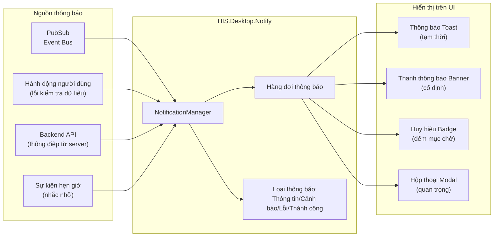
```mermaid
graph LR
    subgraph "Nguồn thông báo"
        EventBus["PubSub<br/>Event Bus"]
        UserAction["Hành động người dùng<br/>(lỗi kiểm tra dữ liệu)"]
        BackendAPI["Backend API<br/>(thông điệp từ server)"]
        Timer["Sự kiện hẹn giờ<br/>(nhắc nhở)"]
    end
    
    subgraph "HIS.Desktop.Notify"
        NotifyManager["NotificationManager"]
        NotifyQueue["Hàng đợi thông báo"]
        NotifyTypes["Loại thông báo:<br/>Thông tin/Cảnh báo/Lỗi/Thành công"]
    end
    
    subgraph "Hiển thị trên UI"
        Toast["Thông báo Toast<br/>(tạm thời)"]
        Banner["Thanh thông báo Banner<br/>(cố định)"]
        Badge["Huy hiệu Badge<br/>(đếm mục chờ)"]
        Modal["Hộp thoại Modal<br/>(quan trọng)"]
    end
    
    EventBus --> NotifyManager
    UserAction --> NotifyManager
    BackendAPI --> NotifyManager
    Timer --> NotifyManager
    
    NotifyManager --> NotifyQueue
    NotifyManager --> NotifyTypes
    
    NotifyQueue --> Toast
    NotifyQueue --> Banner
    NotifyQueue --> Badge
    NotifyQueue --> Modal
```

### Các mức độ nghiêm trọng của thông báo

| Mức độ | Hiển thị UI | Thời gian | Cảnh báo âm thanh | Ví dụ |
|-------|-----------|----------|-------------|----------|
| **Thông tin (Info)** | Toast xanh dương | 3 giây | Không | "Đã đăng ký bệnh nhân thành công" |
| **Thành công (Success)** | Toast xanh lá | 3 giây | Tùy chọn | "Đã lưu đơn thuốc" |
| **Cảnh báo (Warning)** | Banner vàng | 5 giây | Tiếng Beep | "Cảnh báo thuốc sắp hết hạn" |
| **Lỗi (Error)** | Banner đỏ | Cố định | Âm thanh cảnh báo | "Thanh toán thất bại" |
| **Nghiêm trọng (Critical)** | Hộp thoại Modal | Người dùng đóng | Âm thanh báo động | "Mất kết nối cơ sở dữ liệu" |

**Nguồn tham khảo:**
- HIS.Desktop.Notify/
- HIS.Desktop.Utility/

---

## Các mô hình Đăng ký sự kiện

### Đăng ký cơ bản

Các plugin đăng ký nhận sự kiện trong quá trình khởi tạo và hủy đăng ký khi giải phóng (disposal):

**Vị trí Đăng ký:** Constructor của plugin hoặc phương thức `OnLoad()`.
**Vị trí Hủy đăng ký:** Phương thức `Dispose()` của plugin.

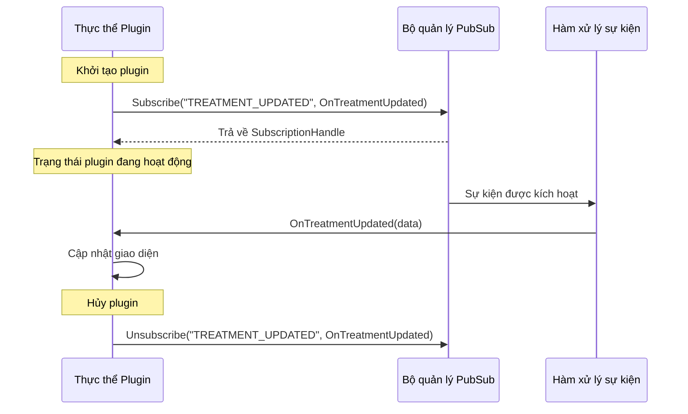
```mermaid
sequenceDiagram
    participant Plugin as Thực thể Plugin
    participant PubSub as Bộ quản lý PubSub
    participant Handler as Hàm xử lý sự kiện
    
    Note over Plugin: Khởi tạo plugin
    Plugin->>PubSub: Subscribe("TREATMENT_UPDATED", OnTreatmentUpdated)
    PubSub-->>Plugin: Trả về SubscriptionHandle
    
    Note over Plugin: Trạng thái plugin đang hoạt động
    
    PubSub->>Handler: Sự kiện được kích hoạt
    Handler->>Plugin: OnTreatmentUpdated(data)
    Plugin->>Plugin: Cập nhật giao diện
    
    Note over Plugin: Hủy plugin
    Plugin->>PubSub: Unsubscribe("TREATMENT_UPDATED", OnTreatmentUpdated)
```

### Mô hình đăng ký thông dụng

Được tham chiếu trong các class cơ sở của plugin trên toàn hệ thống [HIS/Plugins/HIS.Desktop.Plugins.*/: 1-50]():

```csharp
// Mô hình điển hình khi khởi tạo plugin
private void SubscribeEvents()
{
    // Đăng ký nhận thay đổi dữ liệu bệnh nhân
    PubSubManager.Subscribe(EventConstants.PATIENT_UPDATED, OnPatientUpdated);
    
    // Đăng ký nhận thay đổi điều trị
    PubSubManager.Subscribe(EventConstants.TREATMENT_UPDATED, OnTreatmentUpdated);
    
    // Đăng ký nhận thay đổi cấu hình
    PubSubManager.Subscribe(EventConstants.CONFIG_CHANGED, OnConfigChanged);
}

// Hàm callback xử lý sự kiện
private void OnPatientUpdated(object data)
{
    // Ép kiểu dữ liệu về kiểu mong đợi
    var patientData = data as PatientUpdateEventData;
    
    // Cập nhật UI trên thread chính (Main thread)
    this.InvokeIfRequired(() => {
        RefreshPatientData(patientData);
    });
}
```

**Nguồn tham khảo:**
- HIS.Desktop.LocalStorage.PubSub/
- HIS/Plugins/HIS.Desktop.Plugins.*/

---

## Tích hợp WebSocket PubSub

### Giao tiếp thời gian thực với Máy chủ

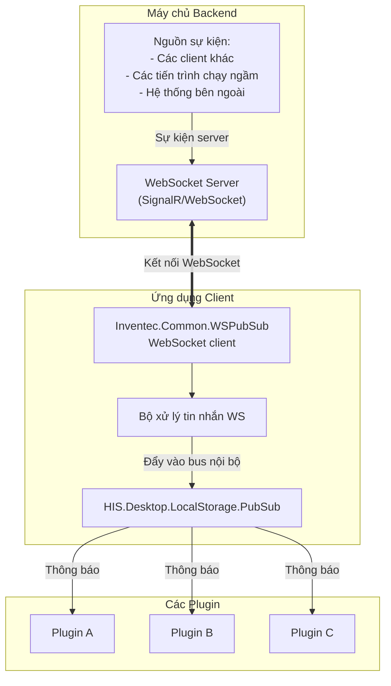
```mermaid
graph TB
    subgraph "Máy chủ Backend"
        WSServer["WebSocket Server<br/>(SignalR/WebSocket)"]
        EventSource["Nguồn sự kiện:<br/>- Các client khác<br/>- Các tiến trình chạy ngầm<br/>- Hệ thống bên ngoài"]
    end
    
    subgraph "Ứng dụng Client"
        WSPubSub["Inventec.Common.WSPubSub<br/>WebSocket client"]
        WSHandler["Bộ xử lý tin nhắn WS"]
        LocalPubSub["HIS.Desktop.LocalStorage.PubSub"]
    end
    
    subgraph "Các Plugin"
        PluginA["Plugin A"]
        PluginB["Plugin B"]
        PluginC["Plugin C"]
    end
    
    EventSource -->|"Sự kiện server"| WSServer
    WSServer <==>|"Kết nối WebSocket"| WSPubSub
    WSPubSub --> WSHandler
    WSHandler -->|"Đẩy vào bus nội bộ"| LocalPubSub
    
    LocalPubSub -->|"Thông báo"| PluginA
    LocalPubSub -->|"Thông báo"| PluginB
    LocalPubSub -->|"Thông báo"| PluginC
```

### Các trường hợp sử dụng sự kiện thời gian thực

| Loại sự kiện | Tác nhân từ Server | Hành động phía Client |
|------------|---------------|---------------|
| **PATIENT_CALLED** | Tiếp đón gọi bệnh nhân | Cập nhật màn hình hiển thị gọi số |
| **TREATMENT_LOCKED** | Người dùng khác đang khóa bản ghi | Khóa chức năng chỉnh sửa trên tất cả client |
| **CONFIG_UPDATED** | Quản trị viên thay đổi cấu hình | Tải lại cấu hình hệ thống |
| **STOCK_CHANGED** | Kho dược vừa xuất thuốc | Cập nhật số lượng tồn kho |
| **APPOINTMENT_CANCELLED** | Bệnh nhân hủy lịch hẹn | Cập nhật danh sách hẹn khám |
| **EMERGENCY_ALERT** | Nhấn nút báo động khẩn cấp | Hiển thị cảnh báo trên tất cả các trạm |

**Quản lý kết nối WebSocket:**

Thành phần `Inventec.Common.WSPubSub` đảm nhiệm:
- Tự động kết nối lại khi mất kết nối.
- Các tin nhắn Heartbeat/keep-alive để duy trì kết nối.
- Hàng đợi tin nhắn khi mất kết nối.
- Đồng bộ hóa trạng thái đăng ký.

**Nguồn tham khảo:**
- Common/Inventec.Common/Inventec.Common.WSPubSub/
- HIS.Desktop.LocalStorage.PubSub/
- HIS.Desktop.ApiConsumer/

---

## Các Model dữ liệu sự kiện

### Cấu trúc dữ liệu sự kiện chuẩn

Các sự kiện thường mang theo các đối tượng dữ liệu có cấu trúc tuân theo một mô hình chung:

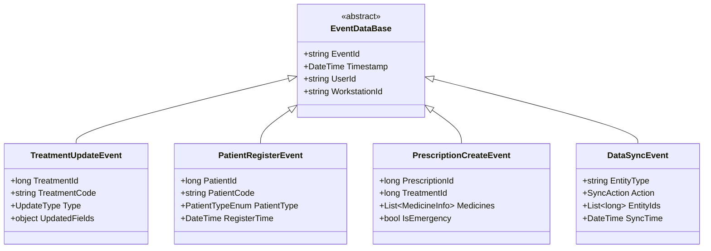
```mermaid
classDiagram
    class EventDataBase {
        <<abstract>>
        +string EventId
        +DateTime Timestamp
        +string UserId
        +string WorkstationId
    }
    
    class TreatmentUpdateEvent {
        +long TreatmentId
        +string TreatmentCode
        +UpdateType Type
        +object UpdatedFields
    }
    
    class PatientRegisterEvent {
        +long PatientId
        +string PatientCode
        +PatientTypeEnum PatientType
        +DateTime RegisterTime
    }
    
    class PrescriptionCreateEvent {
        +long PrescriptionId
        +long TreatmentId
        +List~MedicineInfo~ Medicines
        +bool IsEmergency
    }
    
    class DataSyncEvent {
        +string EntityType
        +SyncAction Action
        +List~long~ EntityIds
        +DateTime SyncTime
    }
    
    EventDataBase <|-- TreatmentUpdateEvent
    EventDataBase <|-- PatientRegisterEvent
    EventDataBase <|-- PrescriptionCreateEvent
    EventDataBase <|-- DataSyncEvent
```

### Serialization dữ liệu sự kiện

Các sự kiện được tuần tự hóa (serialized) khi:
- Vượt qua ranh giới giữa các plugin (đối tượng trong bộ nhớ).
- Truyền tải qua WebSocket (tuần tự hóa JSON).
- Ghi log để phục vụ debug (dưới dạng chuỗi văn bản).

**Nguồn tham khảo:**
- HIS.Desktop.ADO/
- HIS.Desktop.LocalStorage.PubSub/

---

## An toàn luồng (Thread Safety) và Xử lý bất đồng bộ

### Đảm bảo phân phối sự kiện

| Khía cạnh | Triển khai | Ghi chú |
|--------|---------------|-------|
| **Thứ tự** | FIFO theo từng topic | Các sự kiện cùng topic được phân phối theo thứ tự |
| **Phân phối** | At-least-once (Ít nhất một lần) | Bên nhận có thể nhận tin nhắn trùng lặp |
| **Luồng (Thread)** | Luồng callback | Hàm xử lý phải tự chuyển về UI thread nếu cần |
| **Lỗi** | Cách ly (Isolated) | Lỗi trong một hàm xử lý không ảnh hưởng tới các hàm khác |
| **Bất đồng bộ** | Tùy chọn | `PublishAsync()` sẽ trả về kết quả ngay lập tức |

### Mô hình chuyển tiếp sang UI Thread

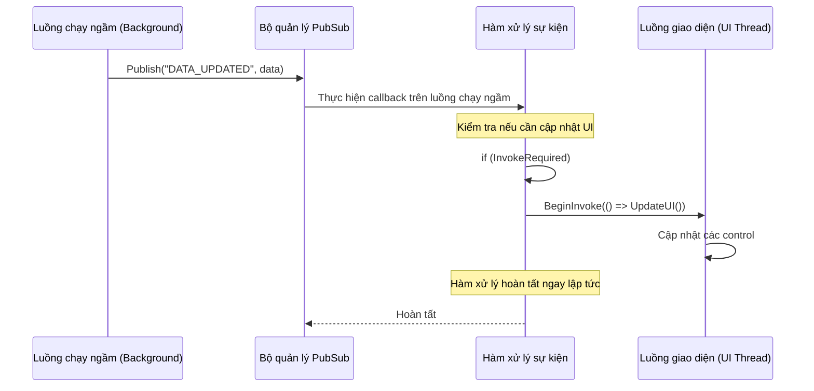
```mermaid
sequenceDiagram
    participant Worker as Luồng chạy ngầm (Background)
    participant PubSub as Bộ quản lý PubSub
    participant Handler as Hàm xử lý sự kiện
    participant UI as Luồng giao diện (UI Thread)
    
    Worker->>PubSub: Publish("DATA_UPDATED", data)
    PubSub->>Handler: Thực hiện callback trên luồng chạy ngầm
    
    Note over Handler: Kiểm tra nếu cần cập nhật UI
    Handler->>Handler: if (InvokeRequired)
    
    Handler->>UI: BeginInvoke(() => UpdateUI())
    UI->>UI: Cập nhật các control
    
    Note over Handler: Hàm xử lý hoàn tất ngay lập tức
    Handler-->>PubSub: Hoàn tất
```

**Mô hình chung trong các hàm xử lý sự kiện:**

Được tham chiếu trong hệ thống [HIS/Plugins/HIS.Desktop.Plugins.*/: 1-100]():

```csharp
private void OnDataUpdated(object data)
{
    if (this.InvokeRequired)
    {
        this.BeginInvoke(new Action<object>(OnDataUpdated), data);
        return;
    }
    
    // Tại đây đã an toàn để cập nhật UI
    UpdateDataGrid(data);
}
```

**Nguồn tham khảo:**
- HIS.Desktop.LocalStorage.PubSub/
- HIS.Desktop.Utility/

---

## Cấu hình Thông báo

### Các thiết lập thông báo toàn hệ thống

Các key cấu hình trong [HIS.Desktop.LocalStorage.ConfigApplication/]() bao gồm:

| Key cấu hình | Kiểu dữ liệu | Mặc định | Mục đích |
|------------------|------|---------|---------|
| `NOTIFY_ENABLE` | Boolean | true | Bật/tắt các thông báo |
| `NOTIFY_SOUND_ENABLE` | Boolean | true | Bật/tắt âm thanh thông báo |
| `NOTIFY_DURATION` | Integer | 3000 | Thời gian hiển thị toast (ms) |
| `NOTIFY_POSITION` | Enum | TopRight | Vị trí hiển thị trên màn hình |
| `NOTIFY_MAX_CONCURRENT` | Integer | 3 | Số lượng thông báo tối đa hiển thị cùng lúc |
| `NOTIFY_PRIORITY_FILTER` | String | "INFO,WARNING,ERROR" | Lọc các mức độ thông báo được hiển thị |

### Cấu hình sự kiện riêng cho từng Plugin

Các plugin có thể cấu hình các sự kiện muốn nhận thông qua [HIS.Desktop.LocalStorage.SdaConfigKey/]() :

- `PLUGIN_[TÊN]_EVENTS`: Danh sách các topic sự kiện cách nhau bởi dấu phẩy.
- `PLUGIN_[TÊN]_NOTIFY_MODE`: Cách xử lý các thông báo đến (ngay lập tức, theo lô, hoặc tắt).

**Nguồn tham khảo:**
- HIS.Desktop.LocalStorage.ConfigApplication/
- HIS.Desktop.LocalStorage.SdaConfigKey/
- HIS.Desktop.LocalStorage.HisConfig/

---

## Tích hợp với Bộ nhớ đệm dữ liệu Backend

### Các sự kiện hủy hiệu lực Cache (Cache Invalidation)

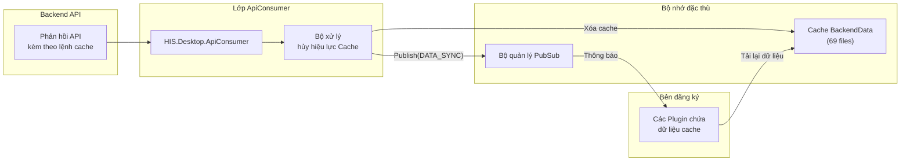
```mermaid
graph LR
    subgraph "Backend API"
        APIResponse["Phản hồi API<br/>kèm theo lệnh cache"]
    end
    
    subgraph "Lớp ApiConsumer"
        ApiClient["HIS.Desktop.ApiConsumer"]
        CacheInvalidator["Bộ xử lý<br/>hủy hiệu lực Cache"]
    end
    
    subgraph "Bộ nhớ đặc thù"
        BackendData["Cache BackendData<br/>(69 files)"]
        PubSub["Bộ quản lý PubSub"]
    end
    
    subgraph "Bên đăng ký"
        Plugins["Các Plugin chứa<br/>dữ liệu cache"]
    end
    
    APIResponse --> ApiClient
    ApiClient --> CacheInvalidator
    CacheInvalidator -->|"Xóa cache"| BackendData
    CacheInvalidator -->|"Publish(DATA_SYNC)"| PubSub
    PubSub -->|"Thông báo"| Plugins
    Plugins -->|"Tải lại dữ liệu"| BackendData
```

### Luồng sự kiện cập nhật Cache

1. **Phản hồi từ API** cho biết dữ liệu đã thay đổi trên máy chủ.
2. **ApiConsumer** phát hiện lệnh hủy hiệu lực cache.
3. **Bộ nhớ đệm BackendData** xóa bỏ các bản ghi liên quan đã lưu.
4. **Sự kiện PubSub** được phát cho các loại thực thể bị ảnh hưởng.
5. **Các Plugin đã đăng ký** nhận thông báo và tiến hành tải lại dữ liệu.

**Các sự kiện Cache phổ biến:**

| Sự kiện | Được kích hoạt khi | Cache bị ảnh hưởng |
|-------|---------------|----------------|
| `MEDICINE_TYPE_UPDATED` | Danh mục thuốc thay đổi | Cache Loại thuốc |
| `PATIENT_TYPE_UPDATED` | Đối tượng bệnh nhân thay đổi | Cache Loại bệnh nhân |
| `ROOM_UPDATED` | Cấu hình phòng thay đổi | Cache Phòng/Khoa |
| `SERVICE_UPDATED` | Danh mục dịch vụ y tế thay đổi | Cache Dịch vụ |
| `EMPLOYEE_UPDATED` | Dữ liệu nhân viên thay đổi | Cache Nhân viên |

**Nguồn tham khảo:**
- HIS.Desktop.LocalStorage.BackendData/
- HIS.Desktop.ApiConsumer/
- HIS.Desktop.LocalStorage.PubSub/

---

## Giám sát và Debug sự kiện

### Ghi Log sự kiện

Các hoạt động của hệ thống sự kiện được ghi lại thông qua hạ tầng log tiêu chuẩn:

**Các mức độ Log:**
- **DEBUG:** Tất cả các hoạt động phát/đăng ký sự kiện.
- **INFO:** Các sự kiện nghiệp vụ quan trọng (cập nhật điều trị, đăng ký bệnh nhân).
- **WARNING:** Các lỗi xảy ra trong hàm xử lý sự kiện.
- **ERROR:** Các lỗi khi phân phối sự kiện.

**Vị trí file Log:** Thư mục log ứng dụng, thường là `Logs/EventBus/`.

### Các công cụ theo dõi sự kiện

| Công cụ | Vị trí | Mục đích |
|------|----------|---------|
| **Event Monitor Plugin** | HIS.Desktop.Plugins.Deverloper | Xem trực tiếp các sự kiện trong quá trình phát triển |
| **Event Log Viewer** | HIS.Desktop.Plugins.EventLog | Trình duyệt xem lịch sử log sự kiện |
| **PubSub Statistics** | HIS.Desktop.LocalStorage.PubSub | Thống kê số lượng đăng ký, tốc độ tin nhắn |

**Nguồn tham khảo:**
- HIS.Desktop.Notify/
- Common/Inventec.Common/Inventec.Common.Logging/
- Common/Inventec.Desktop/Inventec.Desktop.Plugins.EventLog/

---

## Cân nhắc về hiệu năng

### Đặc tính hiệu năng của Hệ thống Sự kiện

| Chỉ số | Giá trị | Ghi chú |
|--------|-------|-------|
| **Độ trễ khi phát (Publish)** | < 1ms | Phát đồng bộ vào hàng đợi |
| **Độ trễ phân phối (Delivery)** | < 10ms | Từ hàng đợi tới hàm callback |
| **Thông lượng tối đa** | ~10.000 sự kiện/giây | Trên mỗi thực thể ứng dụng |
| **Chi phí bộ nhớ** | ~100 bytes/đăng ký | Lưu trữ delegate |
| **Độ sâu hàng đợi** | 1000 sự kiện | Có thể cấu hình, giúp ngăn chặn tràn bộ nhớ |

### Các quy tắc thực hiện tốt nhất (Best Practices)

**Nên thực hiện (✓):**
- Đăng ký sự kiện khi khởi tạo plugin và hủy đăng ký khi giải phóng.
- Giữ cho các hàm xử lý sự kiện nhẹ nhàng và nhanh chóng.
- Chuyển sang UI thread khi cần cập nhật các control giao diện.
- Sử dụng các topic sự kiện cụ thể thay vì phát tán rộng rãi.
- Sử dụng phát sự kiện bất đồng bộ cho các kịch bản ưu tiên hiệu năng.

**Không nên thực hiện (✗):**
- Chặn các hàm xử lý sự kiện bằng các hoạt động chạy lâu.
- Phát sự kiện từ UI thread nếu có thể tránh được.
- Đăng ký nhận các sự kiện mà bạn không thực sự cần.
- Giữ tham chiếu tới dữ liệu sự kiện lâu hơn mức cần thiết.
- Sử dụng sự kiện cho các mô hình yêu cầu-phản hồi (nên dùng DelegateRegister).

**Nguồn tham khảo:**
- HIS.Desktop.LocalStorage.PubSub/
- HIS.Desktop.Utility/

---

## Các mô hình sự kiện chung theo Module

### Các loại Plugin và cách sử dụng sự kiện

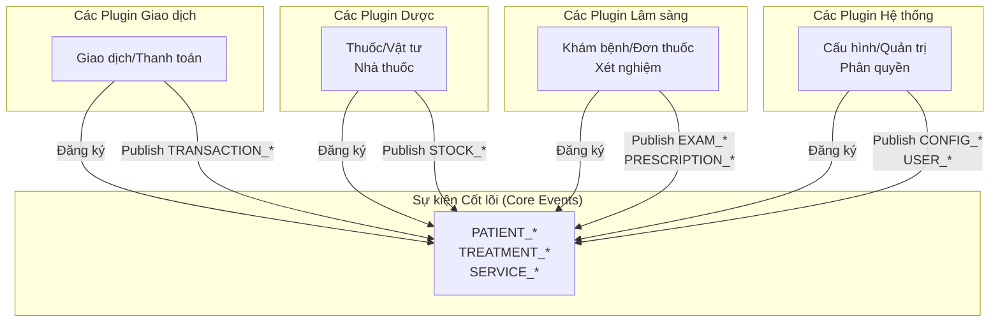
```mermaid
graph TB
    subgraph "Sự kiện Cốt lõi (Core Events)"
        CE["PATIENT_*<br/>TREATMENT_*<br/>SERVICE_*"]
    end
    
    subgraph "Các Plugin Giao dịch"
        Trans["Giao dịch/Thanh toán"]
    end
    
    subgraph "Các Plugin Dược"
        Med["Thuốc/Vật tư<br/>Nhà thuốc"]
    end
    
    subgraph "Các Plugin Lâm sàng"
        Clin["Khám bệnh/Đơn thuốc<br/>Xét nghiệm"]
    end
    
    subgraph "Các Plugin Hệ thống"
        Sys["Cấu hình/Quản trị<br/>Phân quyền"]
    end
    
    Trans -->|"Đăng ký"| CE
    Trans -->|"Publish TRANSACTION_*"| CE
    
    Med -->|"Đăng ký"| CE
    Med -->|"Publish STOCK_*"| CE
    
    Clin -->|"Đăng ký"| CE
    Clin -->|"Publish EXAM_*<br/>PRESCRIPTION_*"| CE
    
    Sys -->|"Đăng ký"| CE
    Sys -->|"Publish CONFIG_*<br/>USER_*"| CE
```

### Ví dụ về mô hình sự kiện theo Luồng nghiệp vụ

| Luồng nghiệp vụ | Sự kiện được Phát | Sự kiện được Nhận |
|--------------|------------------|-----------------|
| **Đăng ký bệnh nhân** | `PATIENT_REGISTERED`, `APPOINTMENT_CREATED` | `PATIENT_TYPE_UPDATED`, `ROOM_UPDATED` |
| **Khám bệnh** | `EXAM_STARTED`, `EXAM_COMPLETED`, `PRESCRIPTION_CREATED` | `PATIENT_REGISTERED`, `SERVICE_EXECUTED` |
| **Phát thuốc** | `MEDICINE_DISPENSED`, `STOCK_CHANGED` | `PRESCRIPTION_CREATED`, `PAYMENT_COMPLETED` |
| **Thanh toán** | `TRANSACTION_COMPLETED`, `INVOICE_CREATED` | `SERVICE_EXECUTED`, `PRESCRIPTION_CREATED` |
| **Tạo báo cáo** | `REPORT_GENERATED` | `TREATMENT_UPDATED`, `TRANSACTION_COMPLETED` |

**Nguồn tham khảo:**
- HIS/Plugins/HIS.Desktop.Plugins.*/
- HIS.Desktop.LocalStorage.PubSub/

---

## Tổng kết

Hệ thống thông báo và sự kiện của HIS Desktop mang lại:

1. **Giảm thiểu phụ thuộc (Loose Coupling):** Các plugin giao tiếp thông qua mô hình PubSub mà không cần tham chiếu trực tiếp.
2. **Đồng bộ thời gian thực:** Tích hợp WebSocket giúp đồng bộ hóa dữ liệu giữa nhiều client khác nhau.
3. **Thông báo người dùng:** Giải pháp thông báo giao diện nhất quán cho tất cả các plugin.
4. **Phối hợp Cache:** Các sự kiện đóng vai trò điều hướng việc hủy cache và nạp lại dữ liệu.
5. **Khả năng mở rộng:** Các plugin mới dễ dàng tích hợp bằng cách đăng ký các sự kiện có sẵn.

Hệ thống có khả năng xử lý hàng ngàn sự kiện mỗi giây trong khi vẫn duy trì sự phản hồi nhanh của giao diện và đảm bảo tính độc lập giữa các thành phần.

**Các thành phần chính:**
- [HIS.Desktop.LocalStorage.PubSub/]() - Bộ điều phối sự kiện cốt lõi (9 files).
- [HIS.Desktop.Notify/]() - Hệ thống thông báo giao diện (25 files).
- [Common/Inventec.Common/Inventec.Common.WSPubSub/]() - WebSocket pub/sub.
- [HIS.Desktop.LocalStorage.BackendData/]() - Điều phối Cache (69 files).

# Hệ thống In ấn MPS

## Mục tiêu và Phạm vi

MPS (Medical Print System - Hệ thống In ấn Y tế) là một phân hệ chuyên biệt chịu trách nhiệm tạo, định dạng và kết xuất các tài liệu y tế trong hệ thống thông tin bệnh viện HisNguonMo. MPS cung cấp một kiến trúc dựa trên mẫu (template) với hơn 790 bộ xử lý in (print processors) đảm nhiệm các biểu mẫu y tế đa dạng bao gồm đơn thuốc, phiếu kết quả xét nghiệm, hóa đơn, phiếu chuyển viện, giấy chứng nhận y tế và các tài liệu hành chính. Hệ thống tích hợp với FlexCell để tạo file Excel/PDF và BarTender để in mã vạch.

Tài liệu này trình bày về kiến trúc module MPS, mô hình bộ xử lý (processor pattern), quản lý mẫu (template management) và quy trình in ấn. Để biết thông tin về cách các plugin HIS kích hoạt các hoạt động in, xem [Kiến trúc Hệ thống Plugin](../01-architecture/plugin-system/01-overview.md). Để xem hướng dẫn phát triển về việc tạo các bộ xử lý in mới, xem [Phát triển Bộ xử lý In ấn](#1.2.1).

**Nguồn tham khảo:** [[`.devin/wiki.json`](../../../.devin/wiki.json)](../../../.devin/wiki.json)

## Tổng quan Kiến trúc Hệ thống

Module MPS hoạt động như một phân hệ bán độc lập được các plugin HIS gọi khi cần tạo tài liệu. Kiến trúc bao gồm ba lớp chính: lớp nhân cốt lõi (core engine), lớp bộ xử lý (processor layer) và lớp kết xuất (export layer).

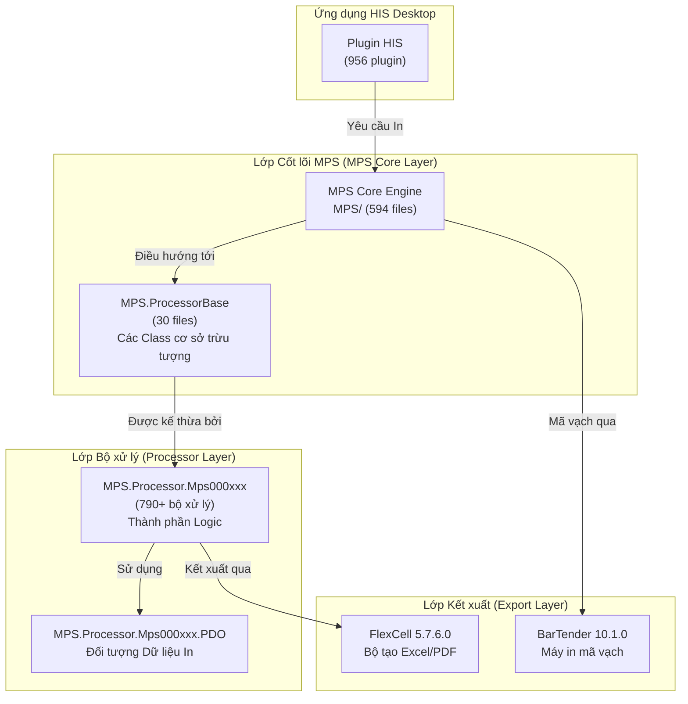
```mermaid
graph TB
    subgraph "Ứng dụng HIS Desktop"
        Plugins["Plugin HIS<br/>(956 plugin)"]
    end
    
    subgraph "Lớp Cốt lõi MPS (MPS Core Layer)"
        MPSCore["MPS Core Engine<br/>MPS/ (594 files)"]
        ProcessorBase["MPS.ProcessorBase<br/>(30 files)<br/>Các Class cơ sở trừu tượng"]
    end
    
    subgraph "Lớp Bộ xử lý (Processor Layer)"
        Processors["MPS.Processor.Mps000xxx<br/>(790+ bộ xử lý)<br/>Thành phần Logic"]
        PDOs["MPS.Processor.Mps000xxx.PDO<br/>Đối tượng Dữ liệu In"]
    end
    
    subgraph "Lớp Kết xuất (Export Layer)"
        FlexCell["FlexCell 5.7.6.0<br/>Bộ tạo Excel/PDF"]
        BarTender["BarTender 10.1.0<br/>Máy in mã vạch"]
    end
    
    Plugins -->|"Yêu cầu In"| MPSCore
    MPSCore -->|"Điều hướng tới"| ProcessorBase
    ProcessorBase -->|"Được kế thừa bởi"| Processors
    Processors -->|"Sử dụng"| PDOs
    Processors -->|"Kết xuất qua"| FlexCell
    MPSCore -->|"Mã vạch qua"| BarTender
```

**Nguồn tham khảo:** [[`.devin/wiki.json`](../../../.devin/wiki.json)](../../../.devin/wiki.json), Cấu trúc thư mục MPS/

## Các Thành phần cốt lõi

### MPS.ProcessorBase

Thư mục `MPS.ProcessorBase` chứa 30 file định nghĩa các lớp cơ sở trừu tượng (abstract base classes) và các interface cho tất cả các bộ xử lý in. Các lớp cơ sở này triển khai các chức năng chung bao gồm nạp mẫu, liên kết dữ liệu và điều phối kết xuất.

| Loại thành phần | Mục đích |
|----------------|---------|
| Các Class Processor trừu tượng | Định nghĩa các phương thức vòng đời: Initialize(), Load(), Export() |
| Bộ quản lý Mẫu (Template Manager) | Xử lý việc nạp các file mẫu .xml và .xls |
| Công cụ Liên kết dữ liệu (Data Binding Engine) | Ánh xạ các thuộc tính PDO vào các vị trí chờ (placeholders) trong mẫu |
| Điều phối Kết xuất (Export Coordinator) | Giao tiếp với FlexCell và BarTender |
| Khung Kiểm tra (Validation Framework) | Kiểm tra dữ liệu PDO trước khi dựng (rendering) |

**Mô hình các Class cơ sở chính:**
- Các bộ xử lý kế thừa từ các lớp cơ sở trong `MPS.ProcessorBase/`
- Triển khai logic kết xuất dành riêng cho mẫu
- Ghi đè các phương thức ảo cho hành vi tùy chỉnh
- Sử dụng các phương thức tiện ích dùng chung cho các hoạt động phổ biến

**Nguồn tham khảo:** MPS.ProcessorBase/ (30 files), [[`.devin/wiki.json`](../../../.devin/wiki.json)](../../../.devin/wiki.json)

### Cấu trúc MPS.Processor

Lớp bộ xử lý tuân thủ quy ước đặt tên và tổ chức nghiêm ngặt. Mỗi bộ xử lý được xác định bằng một ID số duy nhất (Mps000xxx) và bao gồm hai cấu trúc thư mục song song:

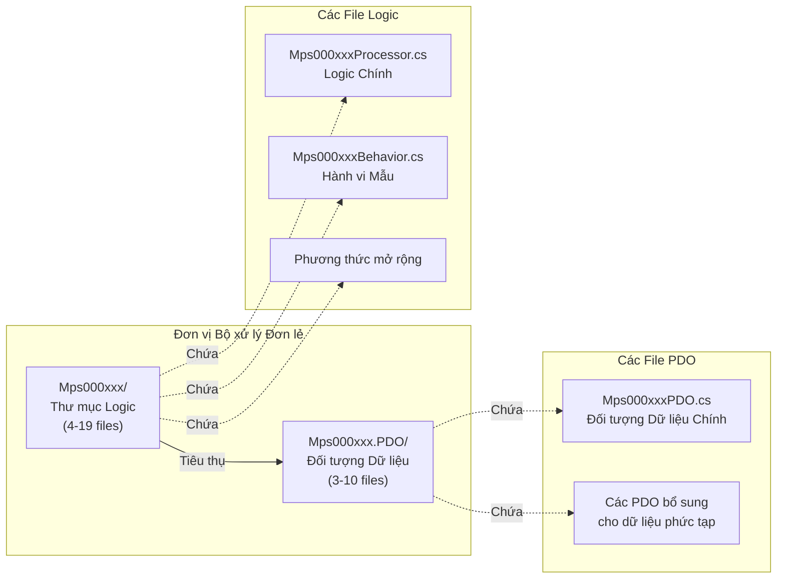
```mermaid
graph LR
    subgraph "Đơn vị Bộ xử lý Đơn lẻ"
        Logic["Mps000xxx/<br/>Thư mục Logic<br/>(4-19 files)"]
        PDO["Mps000xxx.PDO/<br/>Đối tượng Dữ liệu<br/>(3-10 files)"]
    end
    
    Logic -->|"Tiêu thụ"| PDO
    
    subgraph "Các File Logic"
        Processor["Mps000xxxProcessor.cs<br/>Logic Chính"]
        Behavior["Mps000xxxBehavior.cs<br/>Hành vi Mẫu"]
        ExtensionMethod["Phương thức mở rộng"]
    end
    
    subgraph "Các File PDO"
        MainPDO["Mps000xxxPDO.cs<br/>Đối tượng Dữ liệu Chính"]
        AdditionalPDO["Các PDO bổ sung<br/>cho dữ liệu phức tạp"]
    end
    
    Logic -.->|"Chứa"| Processor
    Logic -.->|"Chứa"| Behavior
    Logic -.->|"Chứa"| ExtensionMethod
    
    PDO -.->|"Chứa"| MainPDO
    PDO -.->|"Chứa"| AdditionalPDO
```

**Nội dung Thư mục Bộ xử lý:**

**Thư mục Logic (Mps000xxx/):**
- [[`Mps000xxxProcessor.cs`](../../Mps000xxxProcessor.cs)](../../Mps000xxxProcessor.cs) - Triển khai bộ xử lý chính
- [[`Mps000xxxBehavior.cs`](../../Mps000xxxBehavior.cs)](../../Mps000xxxBehavior.cs) - Hành vi kết xuất dành riêng cho mẫu
- Các lớp trợ giúp để chuyển đổi dữ liệu
- Các file tài nguyên (.resx) cho bản địa hóa
- Các file Designer (.Designer.cs) cho các thành phần UI

**Thư mục PDO (Mps000xxx.PDO/):**
- [[`Mps000xxxPDO.cs`](../../Mps000xxxPDO.cs)](../../Mps000xxxPDO.cs) - Đối tượng truyền dữ liệu chính
- Các lớp dữ liệu bổ sung cho cấu trúc lồng nhau
- Ánh xạ DTO cho các thực thể backend

**Nguồn tham khảo:** MPS.Processor/ (hơn 790 thư mục), [[`.devin/wiki.json`](../../../.devin/wiki.json)](../../../.devin/wiki.json)

### Đối tượng Dữ liệu In (PDO)

PDO đóng vai trò là các container được định kiểu mạnh mẽ, gói gọn tất cả dữ liệu cần thiết để tạo tài liệu. Chúng hoạt động như một lớp trừu tượng giữa các mô hình dữ liệu backend và các vị trí chờ trong mẫu.

**Mô hình Thiết kế PDO:**

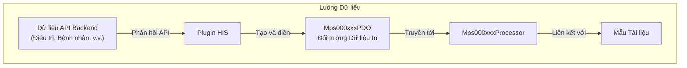
```mermaid
graph TB
    subgraph "Luồng Dữ liệu"
        Backend["Dữ liệu API Backend<br/>(Điều trị, Bệnh nhân, v.v.)"]
        Plugin["Plugin HIS"]
        PDO["Mps000xxxPDO<br/>Đối tượng Dữ liệu In"]
        Processor["Mps000xxxProcessor"]
        Template["Mẫu Tài liệu"]
    end
    
    Backend -->|"Phản hồi API"| Plugin
    Plugin -->|"Tạo và điền"| PDO
    PDO -->|"Truyền tới"| Processor
    Processor -->|"Liên kết với"| Template
```

**Mô hình Thuộc tính PDO phổ biến:**
- Thông tin bệnh nhân (Mã bệnh nhân, Tên bệnh nhân, Ngày sinh, Giới tính)
- Dữ liệu điều trị (Mã điều trị, Thời gian vào, Thời gian ra, Khoa)
- Dữ liệu y tế (Chẩn đoán, Đơn thuốc, Kết quả xét nghiệm)
- Dữ liệu hành chính (Bác sĩ, Phòng, Chi tiết hóa đơn)
- Các trường tùy chỉnh dành riêng cho loại tài liệu

**Nguồn tham khảo:** MPS.Processor/Mps000xxx.PDO/ (nhiều thư mục), [[`.devin/wiki.json`](../../../.devin/wiki.json)](../../../.devin/wiki.json)

## Kiến trúc Bộ xử lý In ấn

### Sơ đồ Đánh số Bộ xử lý

Hơn 790 bộ xử lý được tổ chức bằng một hệ thống đánh số tuần tự (Mps000001 đến Mps000600+), với các phạm vi được phân bổ cho các danh mục tài liệu khác nhau:

| Phạm vi Bộ xử lý | Danh mục Tài liệu | Ví dụ |
|----------------|-------------------|----------|
| Mps000001-000050 | Đơn thuốc | Đơn thuốc ngoại trú, đơn thuốc nội trú |
| Mps000051-000100 | Phiếu kết quả xét nghiệm | Xét nghiệm máu, xét nghiệm nước tiểu, vi sinh |
| Mps000101-000150 | Hóa đơn | Biên lai thanh toán, biên lai tạm ứng |
| Mps000151-000200 | Phiếu chuyển viện | Chuyển viện, chuyển khoa |
| Mps000201-000250 | Giấy chứng nhận y tế | Giấy nghỉ ốm, giấy chứng nhận sức khỏe |
| Mps000251-000300 | Hành chính | Thẻ hẹn, thẻ bệnh nhân |
| Mps000301-000600 | Các biểu mẫu chuyên biệt | Hồ sơ phẫu thuật, báo cáo hình ảnh, tóm tắt điều trị |

**Các Bộ xử lý lớn (theo số lượng file):**
- Mps000304: 19 file - Tóm tắt điều trị phức tạp
- Mps000321: 17 file - Biểu mẫu đơn thuốc chi tiết
- Mps000463: 15 file - Phiếu kết quả xét nghiệm toàn diện

**Nguồn tham khảo:** [[`.devin/wiki.json`](../../../.devin/wiki.json)](../../../.devin/wiki.json), MPS.Processor/ (cấu trúc thư mục)

### Vòng đời Bộ xử lý

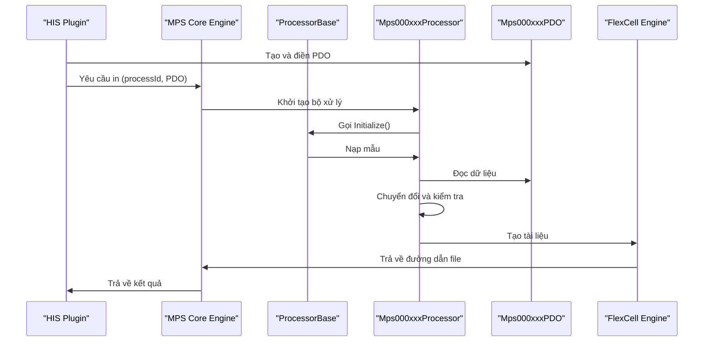
```mermaid
sequenceDiagram
    participant Plugin as "HIS Plugin"
    participant MPSCore as "MPS Core Engine"
    participant ProcessorBase as "ProcessorBase"
    participant Processor as "Mps000xxxProcessor"
    participant PDO as "Mps000xxxPDO"
    participant FlexCell as "FlexCell Engine"
    
    Plugin->>PDO: Tạo và điền PDO
    Plugin->>MPSCore: Yêu cầu in (processId, PDO)
    MPSCore->>Processor: Khởi tạo bộ xử lý
    Processor->>ProcessorBase: Gọi Initialize()
    ProcessorBase->>Processor: Nạp mẫu
    Processor->>PDO: Đọc dữ liệu
    Processor->>Processor: Chuyển đổi và kiểm tra
    Processor->>FlexCell: Tạo tài liệu
    FlexCell->>MPSCore: Trả về đường dẫn file
    MPSCore->>Plugin: Trả về kết quả
```
**Các thuộc tính PDO phổ biến:**
- Thông tin hành chính bệnh nhân (Tên, Mã, Tuổi, v.v.).
- Chi tiết phiên điều trị (Khoa, Phòng, Bác sĩ, v.v.).
- Các mục dịch vụ/thuốc.
- Thông tin bệnh viện và biểu trưng (logo).
- Mã vạch và mã định danh tài liệu.

**Nguồn tham khảo:** MPS.Processor/ (thư mục PDO)

## Quy trình In ấn

Hệ thống MPS hỗ trợ một quy trình in ấn linh hoạt từ việc nạp dữ liệu đến đầu ra vật lý:

1. **Chuẩn bị dữ liệu:** Plugin thu thập dữ liệu từ API và nạp vào thực thể PDO tương ứng.
2. **Khởi tạo Bộ xử lý:** Hệ thống khởi tạo bộ xử lý Mps000xxx thích hợp với dữ liệu PDO.
3. **Nạp Mẫu:** Bộ xử lý nạp file mẫu (thường là Excel) từ kho tài nguyên hoặc bộ nhớ đệm.
4. **Liên kết dữ liệu:** Logic bộ xử lý ánh xạ dữ liệu PDO vào các ô hoặc trường trong mẫu.
5. **Định dạng & Logic:** Thực hiện các hành vi tùy chỉnh (như ẩn/hiện các dòng, tính tổng, đổi màu nền).
6. **Kết xuất:** Tài liệu được tạo ra dưới dạng Excel hoặc PDF qua FlexCell.
7. **In ấn:** Tài liệu đã dựng được gửi đến hàng đợi in của Windows hoặc máy in mã vạch.

---

## Tích hợp FlexCell & BarTender

### Công cụ FlexCell
- Được sử dụng cho 95% các biểu mẫu y tế.
- Hỗ trợ định dạng Excel phức tạp.
- Xuất PDF chất lượng cao cho các tài liệu chính thức.
- Tích hợp xem trước (preview) trong ứng dụng HIS Desktop.

### In ấn BarTender
- Được sử dụng cho nhãn thuốc, vòng đeo tay bệnh nhân và mã vạch xét nghiệm.
- Dữ liệu PDO được truyền vào công cụ in BarTender.
- Đầu ra trực tiếp đến các máy in nhãn chuyên dụng.

**Nguồn tham khảo:** [[`.devin/wiki.json`](../../../.devin/wiki.json)](../../../.devin/wiki.json)

## Các danh mục Bộ xử lý phổ biến

### Bộ xử lý Đơn thuốc

Các bộ xử lý liên quan đến đơn thuốc xử lý nhiều loại phiếu chỉ định thuốc:

**Các bộ xử lý ví dụ:**
- **Mps000001**: Đơn thuốc ngoại trú - biểu mẫu chỉ định thuốc chuẩn.
- **Mps000002**: Đơn thuốc nội trú - danh sách thuốc tại khoa.
- **Mps000003**: Đơn thuốc gây nghiện/hướng tâm thần - các yêu cầu đặc biệt.
- **Mps000044**: Đơn thuốc kèm hướng dẫn sử dụng chi tiết.
- **Mps000045**: Tóm tắt đơn thuốc khi ra viện.

**Các thành phần PDO chung:**
- Thông tin hành chính bệnh nhân.
- Danh sách thuốc kèm liều lượng.
- Hướng dẫn sử dụng.
- Thông tin người kê đơn và chữ ký.
- Chi tiết cấp phát tại nhà thuốc.

### Bộ xử lý Kết quả Xét nghiệm

Các bộ xử lý xét nghiệm tạo ra các tài liệu kết quả kiểm tra khác nhau:

**Các bộ xử lý ví dụ:**
- **Mps000050**: Phiếu kết quả xét nghiệm chung.
- **Mps000051**: Bảng kết quả hóa sinh máu.
- **Mps000052**: Kết quả nuôi cấy vi sinh.
- **Mps000053**: Phiếu kết quả giải phẫu bệnh.
- **Mps000054**: Phiếu kết quả chẩn đoán hình ảnh.

**Các thành phần PDO chung:**
- Chi tiết yêu cầu xét nghiệm.
- Giá trị kết quả cùng khoảng tham chiếu.
- Các chỉ số cảnh báo giá trị bất thường.
- Thông tin kỹ thuật viên và bác sĩ đọc kết quả.
- Dữ liệu kiểm chuẩn chất lượng (QC).

### Bộ xử lý Hóa đơn & Thanh toán

Các bộ xử lý tài liệu tài chính cho các giao dịch:

**Các bộ xử lý ví dụ:**
- **Mps000100**: Biên lai thu tiền.
- **Mps000101**: Hóa đơn kèm chi tiết các khoản thu.
- **Mps000102**: Phiếu thu tạm ứng.
- **Mps000103**: Phiếu hoàn tạm ứng.
- **Mps000104**: Biểu mẫu yêu cầu thanh toán bảo hiểm.

**Các thành phần PDO chung:**
- Thông tin thanh toán của bệnh nhân.
- Chi tiết dịch vụ/mục thanh toán kèm chi phí.
- Hình thức thanh toán và số tiền.
- Chi tiết về mức hưởng bảo hiểm.
- Số dư và các khoản nợ còn lại.

### Bộ xử lý Chuyển viện & Hội chẩn

Tài liệu chuyển viện và giới thiệu bệnh nhân:

**Các bộ xử lý ví dụ:**
- **Mps000150**: Giấy chuyển tuyến/chuyển viện.
- **Mps000151**: Phiếu chuyển khoa.
- **Mps000152**: Giấy giới thiệu chuyên gia bên ngoài.
- **Mps000153**: Hồ sơ chuyển viện cấp cứu.

**Các thành phần PDO chung:**
- Lý do chuyển viện và chẩn đoán.
- Tóm tắt tình trạng bệnh nhân.
- Các phương pháp điều trị đã thực hiện.
- Thông tin đơn vị/khoa tiếp nhận.
- Chi tiết nhân viên hộ tống.

**Nguồn tham khảo:** MPS.Processor/ (hơn 790 thư mục bộ xử lý), [[`.devin/wiki.json`](../../../.devin/wiki.json)](../../../.devin/wiki.json)

## Mô hình phát triển Bộ xử lý

### Cấu trúc Bộ xử lý Chuẩn

Mỗi bộ xử lý tuân theo một mô hình triển khai thống nhất kế thừa từ `MPS.ProcessorBase`:

**Cấu trúc file điển hình:**

**Mps000xxx/ (Thư mục Logic):**
```
Mps000xxxProcessor.cs          // Class bộ xử lý chính
Mps000xxxBehavior.cs           // Logic hành vi của mẫu
Mps000xxxExtension.cs          // Các phương thức mở rộng (tùy chọn)
Mps000xxx.Designer.cs          // Các file UI designer (nếu có)
Resources.resx                  // Tài nguyên đa ngôn ngữ
```

**Mps000xxx.PDO/ (Thư mục Đối tượng Dữ liệu):**
```
Mps000xxxPDO.cs                // Class PDO chính
Mps000xxxADO.cs                // Các đối tượng dữ liệu bổ sung (tùy chọn)
PatientDataPDO.cs              // Cấu trúc dữ liệu lồng nhau (tùy chọn)
```

**Mối quan hệ các Class:**

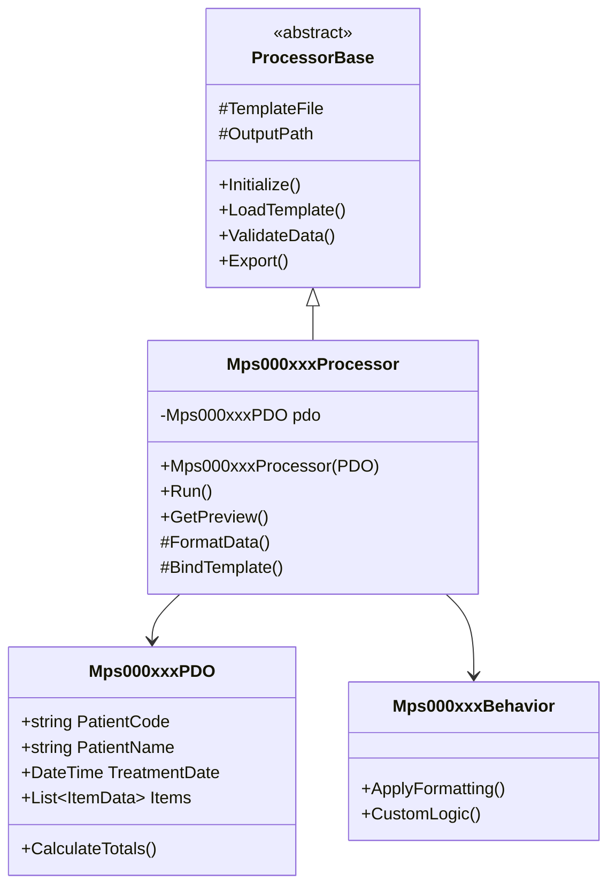
```mermaid
classDiagram
    class ProcessorBase {
        <<abstract>>
        +Initialize()
        +LoadTemplate()
        +ValidateData()
        +Export()
        #TemplateFile
        #OutputPath
    }
    
    class Mps000xxxProcessor {
        -Mps000xxxPDO pdo
        +Mps000xxxProcessor(PDO)
        +Run()
        +GetPreview()
        #FormatData()
        #BindTemplate()
    }
    
    class Mps000xxxPDO {
        +string PatientCode
        +string PatientName
        +DateTime TreatmentDate
        +List~ItemData~ Items
        +CalculateTotals()
    }
    
    class Mps000xxxBehavior {
        +ApplyFormatting()
        +CustomLogic()
    }
    
    ProcessorBase <|-- Mps000xxxProcessor
    Mps000xxxProcessor --> Mps000xxxPDO
    Mps000xxxProcessor --> Mps000xxxBehavior
```

**Nguồn tham khảo:** MPS.ProcessorBase/ (30 files), MPS.Processor/ (nhiều thư mục Mps000xxx)

## Cấu hình và Điểm Mở rộng

### Đăng ký Bộ xử lý

Các bộ xử lý được đăng ký trong nhân cốt lõi của MPS thông qua các file cấu hình hoặc khám phá động (dynamic discovery):

**Các cơ chế đăng ký:**
- Đăng ký tĩnh trong cấu hình cốt lõi của `MPS/`.
- Khám phá dựa trên thuộc tính (Attribute) sử dụng reflection.
- Các file manifest plugin cho từng bộ xử lý.
- Đăng ký tại thời điểm thực thi (runtime) qua API.

### Các điểm tùy chỉnh

Kiến trúc MPS cung cấp nhiều điểm mở rộng:

**Khả năng mở rộng:**

| Điểm mở rộng | Mục đích | Cách triển khai |
|----------------|---------|----------------|
| Thuộc tính PDO tùy chỉnh | Thêm các trường dữ liệu đặc thù cho tài liệu | Mở rộng các lớp cơ sở PDO |
| Ghi đè mẫu (Template Overrides) | Các biến thể biểu mẫu đặc thù cho từng bệnh viện | Các file mẫu thay thế |
| Các Hook xử lý hậu kỳ | Thực hiện các thao tác tùy chỉnh sau khi tạo tài liệu | Ghi đè các phương thức ảo |
| Mở rộng định dạng kết xuất | Thêm các định dạng đầu ra bổ sung | Triển khai các interface export |
| Các quy tắc kiểm tra | Logic kiểm tra dữ liệu tùy chỉnh | Mở rộng khung kiểm tra (validation framework) |

**Nguồn tham khảo:** MPS/ (594 files), MPS.ProcessorBase/ (30 files)

## Hiệu năng và Bộ nhớ đệm

### Chiến lược Cache Mẫu in

MPS triển khai việc lưu trữ mẫu vào bộ nhớ đệm để tối ưu hóa các thao tác in lặp lại:

**Các lớp Cache:**
1. **Memory Cache**: Các mẫu hay dùng được lưu trong RAM.
2. **Disk Cache**: Các đối tượng mẫu đã biên dịch được lưu cục bộ.
3. **Template Preloading**: Các mẫu phổ biến được nạp ngay khi khởi động.

### Quản lý Pool thực thể Bộ xử lý

Đối với các kịch bản in số lượng lớn, các thực thể bộ xử lý có thể được đưa vào pool quản lý:

**Lợi ích của việc dùng Pool:**
- Giảm chi phí khởi tạo thực thể.
- Tái sử dụng mẫu giữa các yêu cầu.
- Hiệu quả bộ nhớ cho các hoạt động in ấn hàng loạt.
- Cải thiện thông lượng cho việc in theo lô (batch printing).

**Nguồn tham khảo:** MPS/ (594 files core engine)

## Tích hợp với Plugin HIS

### Luồng yêu cầu In từ Plugin

Các plugin HIS tích hợp với MPS theo một mô hình chuẩn hóa:

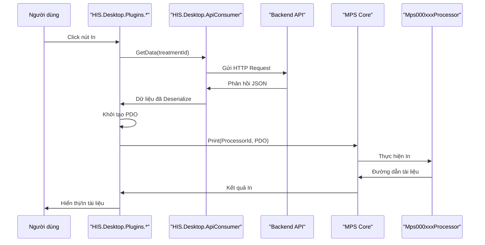
```mermaid
sequenceDiagram
    participant User as Người dùng
    participant Plugin as "HIS.Desktop.Plugins.*"
    participant ApiConsumer as "HIS.Desktop.ApiConsumer"
    participant Backend as "Backend API"
    participant MPS as "MPS Core"
    participant Processor as "Mps000xxxProcessor"
    
    User->>Plugin: Click nút In
    Plugin->>ApiConsumer: GetData(treatmentId)
    ApiConsumer->>Backend: Gửi HTTP Request
    Backend->>ApiConsumer: Phản hồi JSON
    ApiConsumer->>Plugin: Dữ liệu đã Deserialize
    Plugin->>Plugin: Khởi tạo PDO
    Plugin->>MPS: Print(ProcessorId, PDO)
    MPS->>Processor: Thực hiện In
    Processor->>MPS: Đường dẫn tài liệu
    MPS->>Plugin: Kết quả In
    Plugin->>User: Hiển thị/In tài liệu
```

**Các điểm tích hợp Plugin phổ biến:**
- `HIS.Desktop.Plugins.AssignPrescriptionPK` (203 files) - In đơn thuốc.
- `HIS.Desktop.Plugins.ServiceExecute` (119 files) - Phiếu kết quả dịch vụ xét nghiệm/CDHA.
- `HIS.Desktop.Plugins.TransactionBill` (48 files) - In hóa đơn/biên lai.
- `HIS.Desktop.Plugins.PrintBordereau` (69 files) - Các báo cáo tổng hợp.
- `HIS.Desktop.Plugins.PrintOtherForm` (94 files) - Các biểu mẫu hỗn hợp khác.

**Nguồn tham khảo:** HIS/Plugins/ (956 plugins), [[`.devin/wiki.json`](../../../.devin/wiki.json)](../../../.devin/wiki.json)

## Tổng kết

Hệ thống In ấn MPS cung cấp một kiến trúc mạnh mẽ, có khả năng mở rộng để tạo tài liệu y tế với hơn 790 bộ xử lý đáp ứng nhu cầu tài liệu y tế đa dạng. Mô hình Processor-PDO đảm bảo sự phân tách các mối quan tâm giữa dữ liệu và hiển thị, trong khi việc tích hợp với FlexCell và BarTender cho phép xuất tài liệu chuyên nghiệp. Cách tiếp cận dựa trên mẫu của hệ thống giúp tùy chỉnh theo yêu cầu của từng bệnh viện trong khi vẫn duy trì cấu trúc mã nguồn nhất quán trên tất cả các bộ xử lý.

Để biết thông tin chi tiết về việc tạo các bộ xử lý in mới, hãy tham khảo [Phát triển Bộ xử lý In ấn](#1.2.1).

**Nguồn tham khảo:** [[`.devin/wiki.json`](../../../.devin/wiki.json)](../../../.devin/wiki.json), MPS/ (tất cả các thành phần)

# Phát triển Bộ xử lý In ấn

## Mục tiêu và Phạm vi

Tài liệu này cung cấp hướng dẫn kỹ thuật để phát triển các bộ xử lý in (print processors) mới trong module MPS (Medical Print System). Tài liệu bao gồm kiến trúc bộ xử lý, mô hình thiết kế hai thành phần (logic + đối tượng dữ liệu), kế thừa class cơ sở, quản lý mẫu và các mô hình liên kết dữ liệu. Trang này tập trung vào các chi tiết triển khai của từng bộ xử lý riêng lẻ.

Để biết thông tin về kiến trúc tổng thể và tích hợp của MPS, xem [Hệ thống In ấn MPS](../03-technical-specs/his-desktop/business-plugins.md#mps-print). Để biết thông tin về cách các plugin kích hoạt bộ xử lý in, xem [Kiến trúc Hệ thống Plugin](../01-architecture/plugin-system/01-overview.md).

---

## Kiến trúc Bộ xử lý In ấn

Hệ thống MPS triển khai mô hình dựa trên mẫu (template), trong đó mỗi bộ xử lý chịu trách nhiệm tạo ra một hoặc nhiều loại biểu mẫu y tế (đơn thuốc, phiếu xét nghiệm, hóa đơn, tài liệu chuyển viện, v.v.). Hệ thống bao gồm hơn 790 bộ xử lý, được đánh số tuần tự từ Mps000001 đến Mps000600+.

### Mô hình Thiết kế Hai thành phần

Mỗi bộ xử lý in tuân thủ cấu trúc hai thư mục nghiêm ngặt:

| Thành phần | Tên thư mục | Số lượng file điển hình | Mục đích |
|-----------|-------------|-------------------|---------|
| Logic | `Mps000xxx` | 4-15 files | Logic xử lý, quản lý mẫu, chuyển đổi dữ liệu |
| Đối tượng Dữ liệu (Data Object) | `Mps000xxx.PDO` | 3-10 files | Đối tượng truyền dữ liệu, tham số đầu vào, mô hình dữ liệu |

Các bộ xử lý lớn có thể có từ 15-19 file trong thư mục logic và các file PDO bổ sung cho các cấu trúc dữ liệu phức tạp.

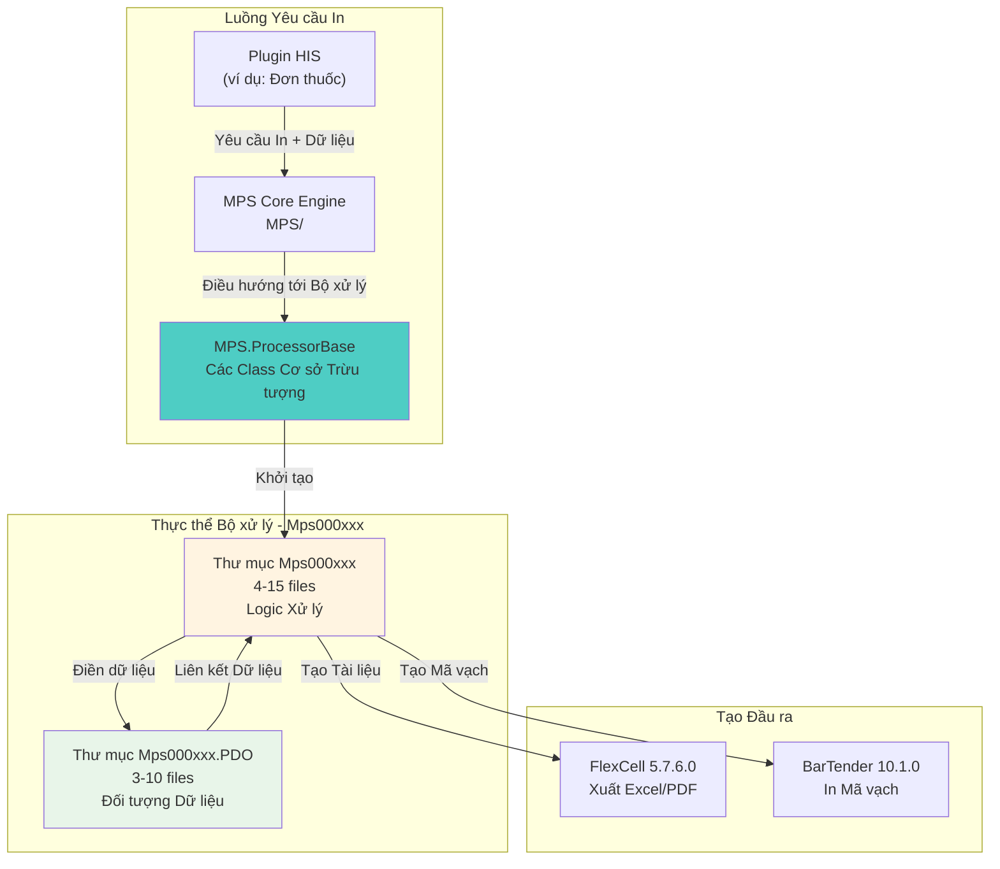
```mermaid
graph TB
    subgraph "Luồng Yêu cầu In"
        Plugin["Plugin HIS<br/>(ví dụ: Đơn thuốc)"]
        MPSCore["MPS Core Engine<br/>MPS/"]
        ProcessorBase["MPS.ProcessorBase<br/>Các Class Cơ sở Trừu tượng"]
    end
    
    subgraph "Thực thể Bộ xử lý - Mps000xxx"
        Logic["Thư mục Mps000xxx<br/>4-15 files<br/>Logic Xử lý"]
        PDO["Thư mục Mps000xxx.PDO<br/>3-10 files<br/>Đối tượng Dữ liệu"]
    end
    
    subgraph "Tạo Đầu ra"
        FlexCell["FlexCell 5.7.6.0<br/>Xuất Excel/PDF"]
        BarTender["BarTender 10.1.0<br/>In Mã vạch"]
    end
    
    Plugin -->|"Yêu cầu In + Dữ liệu"| MPSCore
    MPSCore -->|"Điều hướng tới Bộ xử lý"| ProcessorBase
    ProcessorBase -->|"Khởi tạo"| Logic
    Logic -->|"Điền dữ liệu"| PDO
    PDO -->|"Liên kết Dữ liệu"| Logic
    Logic -->|"Tạo Tài liệu"| FlexCell
    Logic -->|"Tạo Mã vạch"| BarTender
    
    style Logic fill:#fff4e1
    style PDO fill:#e8f5e9
    style ProcessorBase fill:#4ecdc4
```

**Nguồn tham khảo:** MPS/, MPS.ProcessorBase/, MPS.Processor/

---

## Các Class cơ sở của Bộ xử lý

Tất cả các bộ xử lý in đều kế thừa từ các class cơ sở trừu tượng (abstract base classes) được định nghĩa trong thư mục `MPS.ProcessorBase` (30 file). Các class cơ sở này cung cấp hạ tầng chung cho quản lý mẫu, liên kết dữ liệu và tạo tài liệu.

### Hệ thống Phân cấp Class cơ sở

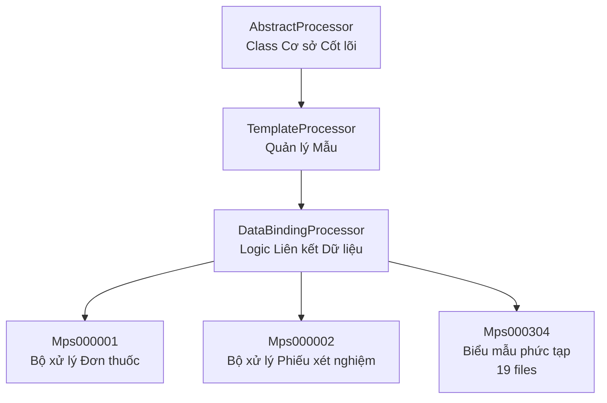
```mermaid
graph TB
    AbstractProcessor["AbstractProcessor<br/>Class Cơ sở Cốt lõi"]
    TemplateProcessor["TemplateProcessor<br/>Quản lý Mẫu"]
    DataBindingProcessor["DataBindingProcessor<br/>Logic Liên kết Dữ liệu"]
    
    Mps000001["Mps000001<br/>Bộ xử lý Đơn thuốc"]
    Mps000002["Mps000002<br/>Bộ xử lý Phiếu xét nghiệm"]
    Mps000304["Mps000304<br/>Biểu mẫu phức tạp<br/>19 files"]
    
    AbstractProcessor --> TemplateProcessor
    TemplateProcessor --> DataBindingProcessor
    DataBindingProcessor --> Mps000001
    DataBindingProcessor --> Mps000002
    DataBindingProcessor --> Mps000304
```

### Trách nhiệm của các Class Cơ sở Chính

| Class Cơ sở | Trách nhiệm | Các phương thức chính |
|------------|---------------|-------------|
| `AbstractProcessor` | Quản lý vòng đời cốt lõi | `Initialize()`, `Process()`, `Cleanup()` |
| `TemplateProcessor` | nạp và lưu trữ mẫu | `LoadTemplate()`, `GetTemplateFile()` |
| `DataBindingProcessor` | Liên kết dữ liệu vào mẫu | `BindData()`, `PopulateFields()` |

**Nguồn tham khảo:** MPS.ProcessorBase/

---

## Cấu trúc PDO (Đối tượng Dữ liệu In)

Thư mục PDO của mỗi bộ xử lý chứa các đối tượng truyền dữ liệu (DTO) đóng gói tất cả các tham số đầu vào và mô hình dữ liệu cần thiết để tạo tài liệu. Các PDO tuân theo quy ước đặt tên và cấu trúc chuẩn hóa.

### Các thành phần PDO

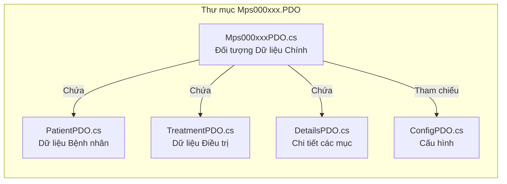
```mermaid
graph LR
    subgraph "Thư mục Mps000xxx.PDO"
        MainPDO["Mps000xxxPDO.cs<br/>Đối tượng Dữ liệu Chính"]
        PatientPDO["PatientPDO.cs<br/>Dữ liệu Bệnh nhân"]
        TreatmentPDO["TreatmentPDO.cs<br/>Dữ liệu Điều trị"]
        DetailsPDO["DetailsPDO.cs<br/>Chi tiết các mục"]
        ConfigPDO["ConfigPDO.cs<br/>Cấu hình"]
    end
    
    MainPDO -->|"Chứa"| PatientPDO
    MainPDO -->|"Chứa"| TreatmentPDO
    MainPDO -->|"Chứa"| DetailsPDO
    MainPDO -->|"Tham chiếu"| ConfigPDO
```

### Các thuộc tính PDO phổ biến

| Loại thuộc tính | Mục đích | Ví dụ |
|--------------|---------|---------|
| Thông tin Bệnh nhân | Định danh và nhân khẩu học bệnh nhân | `PatientCode`, `PatientName`, `DOB`, `Gender` |
| Thông tin Điều trị | Ngữ cảnh điều trị | `TreatmentCode`, `InTime`, `OutTime`, `Department` |
| Chi tiết Dịch vụ | Các mục dịch vụ/thuốc | `List<ServiceDetail>`, `List<MedicineDetail>` |
| Cấu hình | Cài đặt in và định dạng | `IsBarcodeEnabled`, `NumCopies`, `PaperSize` |
| Siêu dữ liệu (Metadata) | Theo dõi và kiểm tra | `CreateTime`, `Creator`, `PrintTime` |

**Nguồn tham khảo:** MPS.Processor/Mps000xxx.PDO/

---

## Tạo Bộ xử lý In ấn mới

### Bước 1: Cấu trúc Thư mục

Tạo hai thư mục theo quy ước đặt tên:

```
MPS.Processor/
├── Mps000xxx/              # Thư mục Logic (xxx là số thứ tự tiếp theo)
│   ├── Mps000xxx.cs        # Class bộ xử lý chính
│   ├── Mps000xxxProcessor.cs  # Triển khai xử lý
│   ├── TemplateHandler.cs  # Quản lý mẫu
│   └── DataBinder.cs       # Logic liên kết dữ liệu
└── Mps000xxx.PDO/          # Thư mục đối tượng dữ liệu
    ├── Mps000xxxPDO.cs     # PDO chính
    ├── PatientPDO.cs       # PDO bệnh nhân
    └── DetailPDO.cs        # PDO chi tiết
```

### Bước 2: Triển khai Class Bộ xử lý chính

Class bộ xử lý chính kế thừa từ các class cơ sở trong `MPS.ProcessorBase` và triển khai logic xử lý:

**Cấu trúc file:**
- [[`MPS.Processor/Mps000xxx/Mps000xxx.cs`](../../MPS.Processor/Mps000xxx/Mps000xxx.cs)](../../MPS.Processor/Mps000xxx/Mps000xxx.cs) - Điểm vào chính (Main entry point)
- [[`MPS.Processor/Mps000xxx/Mps000xxxProcessor.cs`](../../MPS.Processor/Mps000xxx/Mps000xxxProcessor.cs)](../../MPS.Processor/Mps000xxx/Mps000xxxProcessor.cs) - Logic xử lý cốt lõi
- [[`MPS.Processor/Mps000xxx/TemplateHandler.cs`](../../MPS.Processor/Mps000xxx/TemplateHandler.cs)](../../MPS.Processor/Mps000xxx/TemplateHandler.cs) - Các thao tác với mẫu (Template operations)
- [[`MPS.Processor/Mps000xxx/DataBinder.cs`](../../MPS.Processor/Mps000xxx/DataBinder.cs)](../../MPS.Processor/Mps000xxx/DataBinder.cs) - Các thao tác liên kết dữ liệu

### Bước 3: Định nghĩa các Class PDO

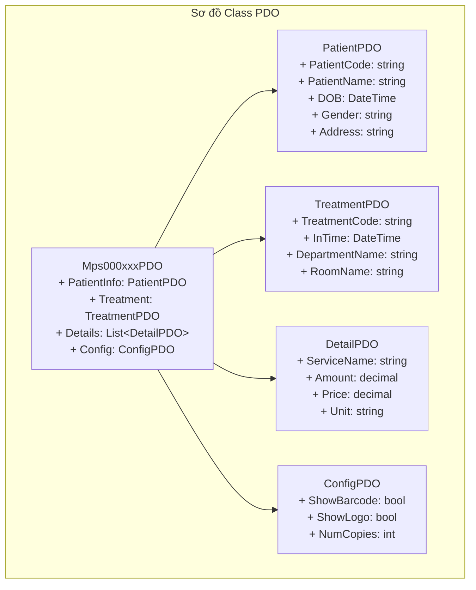
```mermaid
graph TB
    subgraph "Sơ đồ Class PDO"
        MainPDO["Mps000xxxPDO<br/>+ PatientInfo: PatientPDO<br/>+ Treatment: TreatmentPDO<br/>+ Details: List&lt;DetailPDO&gt;<br/>+ Config: ConfigPDO"]
        
        PatientPDO["PatientPDO<br/>+ PatientCode: string<br/>+ PatientName: string<br/>+ DOB: DateTime<br/>+ Gender: string<br/>+ Address: string"]
        
        TreatmentPDO["TreatmentPDO<br/>+ TreatmentCode: string<br/>+ InTime: DateTime<br/>+ DepartmentName: string<br/>+ RoomName: string"]
        
        DetailPDO["DetailPDO<br/>+ ServiceName: string<br/>+ Amount: decimal<br/>+ Price: decimal<br/>+ Unit: string"]
        
        ConfigPDO["ConfigPDO<br/>+ ShowBarcode: bool<br/>+ ShowLogo: bool<br/>+ NumCopies: int"]
        
        MainPDO --> PatientPDO
        MainPDO --> TreatmentPDO
        MainPDO --> DetailPDO
        MainPDO --> ConfigPDO
    end
```

**Nguồn tham khảo:** MPS.Processor/Mps000xxx.PDO/

---

## Liên kết Dữ liệu và Tích hợp Mẫu

### Quản lý Mẫu

Các bộ xử lý in sử dụng các file mẫu (thường dựa trên Excel để tích hợp FlexCell) định nghĩa bố cục và định dạng của tài liệu đầu ra.

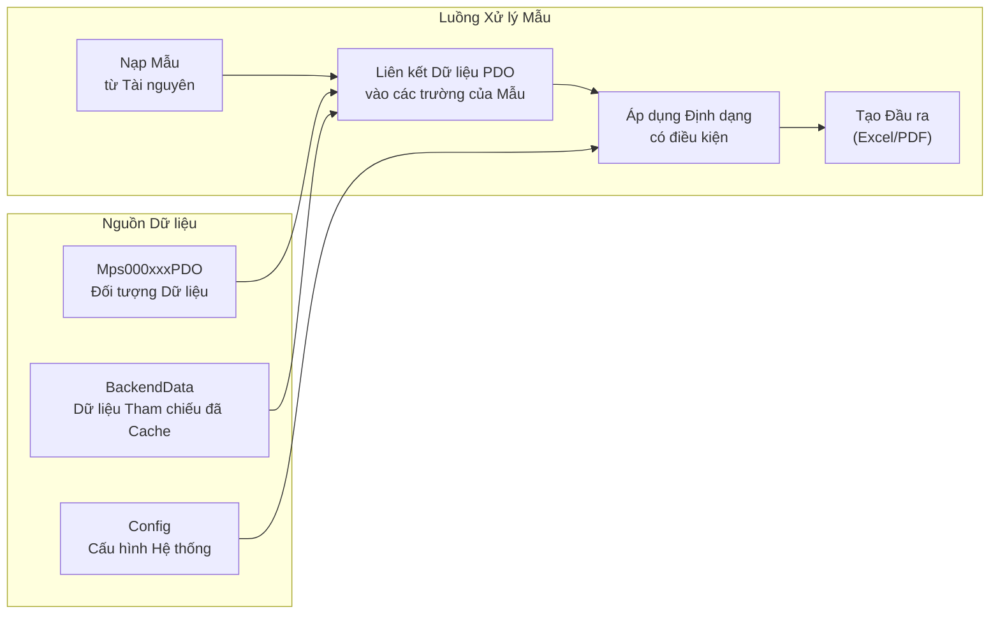
```mermaid
graph LR
    subgraph "Luồng Xử lý Mẫu"
        LoadTemplate["Nạp Mẫu<br/>từ Tài nguyên"]
        BindData["Liên kết Dữ liệu PDO<br/>vào các trường của Mẫu"]
        ApplyFormatting["Áp dụng Định dạng<br/>có điều kiện"]
        GenerateOutput["Tạo Đầu ra<br/>(Excel/PDF)"]
        
        LoadTemplate --> BindData
        BindData --> ApplyFormatting
        ApplyFormatting --> GenerateOutput
    end
    
    subgraph "Nguồn Dữ liệu"
        PDO["Mps000xxxPDO<br/>Đối tượng Dữ liệu"]
        BackendData["BackendData<br/>Dữ liệu Tham chiếu đã Cache"]
        Config["Config<br/>Cấu hình Hệ thống"]
    end
    
    PDO --> BindData
    BackendData --> BindData
    Config --> ApplyFormatting
```

### Các mô hình Liên kết Trường

| Loại liên kết | Cú pháp Mẫu | Thuộc tính PDO | Mục đích |
|--------------|----------------|--------------|---------|
| Trường đơn giản | `{PatientName}` | `PDO.PatientInfo.PatientName` | Liên kết giá trị trực tiếp |
| Định dạng ngày | `{InTime:dd/MM/yyyy}` | `PDO.Treatment.InTime` | Định dạng ngày tháng |
| Có điều kiện | `{IF ShowLogo}...{ENDIF}` | `PDO.Config.ShowLogo` | Nội dung có điều kiện |
| Vòng lặp | `{FOREACH Details}...{ENDFOR}` | `PDO.Details` | Lặp lại các dòng |
| Tính toán | `{SUM Details.Amount}` | Được tính toán | Các hàm tổng hợp |
| Mã vạch (Barcode) | `{BARCODE TreatmentCode}` | `PDO.Treatment.TreatmentCode` | Tạo mã vạch |

**Nguồn tham khảo:** MPS.ProcessorBase/, MPS.Processor/

---

## Các ví dụ về Bộ xử lý lớn

### Mps000304 (19 Files)

Một trong những bộ xử lý lớn nhất, chuyên xử lý các báo cáo y tế đa trang phức tạp với yêu cầu dữ liệu sâu rộng.

**Tổ chức file điển hình:**
- [[`MPS.Processor/Mps000304/Mps000304.cs`](../../MPS.Processor/Mps000304/Mps000304.cs)](../../MPS.Processor/Mps000304/Mps000304.cs) - Class chính
- [[`MPS.Processor/Mps000304/Mps000304Processor.cs`](../../MPS.Processor/Mps000304/Mps000304Processor.cs)](../../MPS.Processor/Mps000304/Mps000304Processor.cs) - Bộ xử lý cốt lõi
- [[`MPS.Processor/Mps000304/PageHandler.cs`](../../MPS.Processor/Mps000304/PageHandler.cs)](../../MPS.Processor/Mps000304/PageHandler.cs) - Logic xử lý đa trang
- [[`MPS.Processor/Mps000304/SectionProcessor.cs`](../../MPS.Processor/Mps000304/SectionProcessor.cs)](../../MPS.Processor/Mps000304/SectionProcessor.cs) - Xử lý từng phần (Section handling)
- [[`MPS.Processor/Mps000304/DataAggregator.cs`](../../MPS.Processor/Mps000304/DataAggregator.cs)](../../MPS.Processor/Mps000304/DataAggregator.cs) - Tổng hợp dữ liệu
- [[`MPS.Processor/Mps000304/TemplateManager.cs`](../../MPS.Processor/Mps000304/TemplateManager.cs)](../../MPS.Processor/Mps000304/TemplateManager.cs) - Quản lý mẫu
- [[`MPS.Processor/Mps000304/ValidationHelper.cs`](../../MPS.Processor/Mps000304/ValidationHelper.cs)](../../MPS.Processor/Mps000304/ValidationHelper.cs) - Kiểm tra tính hợp lệ của dữ liệu
- Các class helper bổ sung (thêm 12 file nữa)

**Cấu trúc PDO:**
- [MPS.Processor/Mps000304.PDO/]() - Các đối tượng dữ liệu lồng nhau phức tạp

### Mps000321 (17 Files)

Một bộ xử lý lớn khác thể hiện các tính năng nâng cao.

### Mps000463 (15 Files)

Bộ xử lý biểu mẫu phức tạp với khả năng tùy chỉnh sâu rộng.

**Nguồn tham khảo:** MPS.Processor/Mps000304/, MPS.Processor/Mps000321/, MPS.Processor/Mps000463/

---

## Đăng ký và Kích hoạt Bộ xử lý

### Mô hình Đăng ký

```mermaid
graph TB
    subgraph "Khám phá Bộ xử lý"
        MPSCore["MPS Core Engine<br/>MPS/"]
        Registry["Kho Đăng ký Bộ xử lý<br/>ProcessorMap"]
        ProcessorFactory["Processor Factory<br/>Tạo Thực thể"]
    end
    
    subgraph "Đăng ký Bộ xử lý"
        Mps000001["Mps000001<br/>Register(001)"]
        Mps000002["Mps000002<br/>Register(002)"]
        Mps000304["Mps000304<br/>Register(304)"]
    end
    
    subgraph "Kích hoạt từ Plugin"
        PrescriptionPlugin["Plugin Đơn thuốc"]
        LabPlugin["Plugin Xét nghiệm"]
        InvoicePlugin["Plugin Hóa đơn"]
    end
    
    Mps000001 -->|"Tự Đăng ký"| Registry
    Mps000002 -->|"Tự Đăng ký"| Registry
    Mps000304 -->|"Tự Đăng ký"| Registry
    
    PrescriptionPlugin -->|"Yêu cầu In(001)"| MPSCore
    LabPlugin -->|"Yêu cầu In(002)"| MPSCore
    InvoicePlugin -->|"Yêu cầu In(304)"| MPSCore
    
    MPSCore -->|"Tra số"| Registry
    Registry -->|"Tạo Thực thể"| ProcessorFactory
```

### Luồng Kích hoạt (Invocation Flow)

| Bước | Thành phần | Hành động |
|------|-----------|--------|
| 1 | Plugin | Tạo PDO với dữ liệu, chỉ định ID bộ xử lý |
| 2 | MPS Core | Điều hướng yêu cầu tới kho đăng ký bộ xử lý |
| 3 | Kho Đăng ký | Tra cứu class bộ xử lý theo ID |
| 4 | Factory | Khởi tạo bộ xử lý với dữ liệu PDO |
| 5 | Bộ xử lý | Thực thi logic xử lý |
| 6 | FlexCell/BarTender | Tạo đầu ra cuối cùng |
| 7 | MPS Core | Trả kết quả về cho plugin |

**Nguồn tham khảo:** MPS/, MPS.ProcessorBase/

**Sources:** MPS/, MPS.ProcessorBase/

---

## Tích hợp FlexCell

Hệ thống MPS sử dụng FlexCell 5.7.6.0 để xử lý mẫu Excel và tạo PDF.

### Mô hình Xử lý FlexCell

```mermaid
graph LR
    subgraph "Luồng công việc FlexCell"
        LoadWorkbook["Nạp File<br/>Excel Mẫu"]
        CreateSheet["Truy cập<br/>Worksheet"]
        BindCells["Liên kết Giá trị<br/>vào Ô"]
        ApplyStyles["Áp dụng Định dạng<br/>(Styles)"]
        Export["Kết xuất ra<br/>Excel/PDF"]
    end
    
    Processor["Bộ xử lý In"] --> LoadWorkbook
    LoadWorkbook --> CreateSheet
    CreateSheet --> BindCells
    PDO["Dữ liệu PDO"] --> BindCells
    BindCells --> ApplyStyles
    Config["Cấu hình Định dạng"] --> ApplyStyles
    ApplyStyles --> Export
```

### Các thao tác FlexCell phổ biến

| Thao tác | Mục đích | Cách triển khai |
|-----------|---------|----------------|
| Liên kết Ô | Gán giá trị từ PDO vào ô | `worksheet.Cell[row, col].Value = pdo.Field` |
| Liên kết Vùng | Điền dữ liệu vào một vùng (range) | `worksheet.SetRange(startRow, startCol, dataArray)` |
| Công thức | Tính toán các giá trị | `worksheet.Cell[row, col].Formula = "=SUM(A1:A10)"` |
| Định dạng | Áp dụng style cho ô | `worksheet.Cell[row, col].Style = styleObject` |
| Trộn ô (Merge) | Gộp các ô lại với nhau | `worksheet.MergeRange(range)` |
| Kết xuất PDF | Tạo đầu ra định dạng PDF | `workbook.ExportPDF(fileName)` |

**Nguồn tham khảo:** MPS/, Common/Inventec.Common/FlexCelPrint/, Common/Inventec.Common/FlexCelExport/

---

## Tích hợp BarTender

BarTender 10.1.0 được sử dụng để in mã vạch và nhãn.

### Mô hình Tạo Mã vạch

```mermaid
graph TB
    subgraph "Luồng công việc BarTender"
        LoadFormat["Nạp File<br/>Định dạng BarTender"]
        SetData["Thiết lập<br/>Nguồn Dữ liệu"]
        GenerateBarcode["Tạo<br/>Mã vạch"]
        Print["In ra<br/>Thiết bị/File"]
    end
    
    Processor["Bộ xử lý In"] --> LoadFormat
    LoadFormat --> SetData
    PDO["PDO chứa<br/>Dữ liệu Mã vạch"] --> SetData
    SetData --> GenerateBarcode
    GenerateBarcode --> Print
```

### Các loại Mã vạch được hỗ trợ

| Loại | Trường hợp sử dụng | Ví dụ Trường PDO |
|------|----------|-------------------|
| Code 39 | Mã BN, Mã Điều trị | `PatientCode`, `TreatmentCode` |
| Code 128 | Mã thuốc | `MedicineCode` |
| QR Code | Mã hóa đa trường dữ liệu | `JSON.Serialize(ComplexData)` |
| EAN-13 | Định danh sản phẩm | `ProductBarcode` |

**Nguồn tham khảo:** MPS/

---

## Các mô hình Phát triển Phổ biến

### Mô hình 1: Bộ xử lý Biểu mẫu Đơn giản (4-6 File)

Biểu mẫu trang đơn cơ bản với độ phức tạp thấp:
- Class bộ xử lý chính
- Bộ quản lý mẫu (Template handler)
- Class PDO
- 1-2 class trợ giúp (helper)

**Phạm vi ví dụ:** Mps000001-Mps000100

### Mô hình 2: Báo cáo Đa phần (7-10 File)

Biểu mẫu có nhiều phần (section) yêu cầu các nguồn dữ liệu khác nhau:
- Bộ xử lý chính
- Các bộ xử lý phần (mỗi phần một bộ)
- Bộ tổng hợp dữ liệu (Data aggregator)
- Các class PDO (mỗi phần một PDO)
- Các tiện ích trợ giúp

**Phạm vi ví dụ:** Mps000101-Mps000200

### Mô hình 3: Tài liệu Đa trang Phức tạp (15-19 File)

Tài liệu tinh vi với tính năng phân trang động, tính toán và định dạng sâu rộng:
- Bộ xử lý chính và bộ điều phối
- Các bộ xử lý trang (Page handlers)
- Các bộ xử lý phần (Section processors)
- Các bộ tổng hợp và tính toán dữ liệu
- Nhiều class PDO
- Các trợ giúp kiểm tra (Validation helpers)
- Các bộ quản lý mẫu
- Các tiện ích định dạng

**Phạm vi ví dụ:** Mps000304, Mps000321, Mps000463

**Nguồn tham khảo:** MPS.Processor/

---

## Các thực hành tốt nhất (Best Practices)

### Tổ chức Mã nguồn

| Thực hành | Lý do |
|----------|-----------|
| Tách biệt logic và dữ liệu | Thư mục PDO chỉ chứa các đối tượng dữ liệu, không có logic nghiệp vụ |
| Trách nhiệm đơn nhất (Single responsibility) | Mỗi file xử lý một khía cạnh cụ thể (mẫu, liên kết, định dạng) |
| Tái sử dụng class cơ sở | Tận dụng `MPS.ProcessorBase` cho các chức năng chung |
| Chuẩn hóa đặt tên | Tuân thủ quy ước Mps000xxx / Mps000xxxPDO |

### Tối ưu hóa Hiệu năng

| Kỹ thuật | Lợi ích |
|-----------|---------|
| Cache mẫu | Tránh việc nạp lại mẫu cho mỗi yêu cầu in |
| Nạp chậm (Lazy loading) | Chỉ nạp dữ liệu tham chiếu khi cần thiết |
| Thao tác hàng loạt | Sử dụng các thao tác vùng (range) thay vì từng ô trong FlexCell |
| Giải phóng tài nguyên | Giải phóng các đối tượng FlexCell đúng cách để tránh rò rỉ bộ nhớ |

### Xử lý Lỗi

| Tình huống | Chiến lược xử lý |
|----------|-------------------|
| Thiếu mẫu | Ghi log lỗi, sử dụng mẫu dự phòng (fallback) |
| Dữ liệu PDO không hợp lệ | Kiểm tra đầu vào, trả về lỗi có ý nghĩa |
| Lỗi FlexCell | Bắt ngoại lệ, ghi lại chi tiết, thử lại nếu lỗi tạm thời |
| Kết nối BarTender | Xử lý mất kết nối khéo léo, đưa vào hàng đợi để thử lại |

**Nguồn tham khảo:** MPS.ProcessorBase/, MPS/

---

## Kiểm thử Bộ xử lý mới

### Danh mục Kiểm thử (Checklist)

```mermaid
graph TB
    subgraph "Quy trình Kiểm thử"
        UnitTest["Kiểm thử Đơn vị<br/>Kiểm tra PDO"]
        IntegrationTest["Kiểm thử Tích hợp<br/>Liên kết Mẫu"]
        RenderTest["Kiểm thử Dựng hình<br/>Tạo Đầu ra"]
        PrintTest["Kiểm thử In ấn<br/>Đầu ra Vật lý"]
        
        UnitTest --> IntegrationTest
        IntegrationTest --> RenderTest
        RenderTest --> PrintTest
    end
    
    subgraph "Dữ liệu Kiểm thử"
        SamplePDO["PDO Mẫu<br/>Dữ liệu Hợp lệ"]
        EdgeCases["Trường hợp Biên<br/>Giá trị Giới hạn"]
        ErrorCases["Trường hợp Lỗi<br/>Dữ liệu Không hợp lệ"]
    end
    
    SamplePDO --> UnitTest
    EdgeCases --> UnitTest
    ErrorCases --> UnitTest
```

### Các trường hợp cần Xác minh

- Kiểm tra PDO với dữ liệu hợp lệ.
- Kiểm tra PDO khi thiếu các trường bắt buộc.
- Nạp mẫu và lưu trữ mẫu vào cache.
- Liên kết dữ liệu vào tất cả các trường trong mẫu.
- Các quy tắc định dạng có điều kiện.
- Phân trang cho tài liệu nhiều trang.
- Tạo mã vạch (nếu có).
- Chất lượng kết xuất PDF.
- Chức năng xem trước khi in (print preview).
- Hiệu năng với tập dữ liệu lớn (hơn 100 dòng chi tiết).

**Nguồn tham khảo:** MPS.Processor/

---

## Tích hợp với Plugin HIS

Các plugin kích hoạt bộ xử lý in thông qua MPS Core Engine:

```mermaid
graph LR
    subgraph "Lớp Plugin - HIS/Plugins/"
        PrescriptionPlugin["AssignPrescriptionPK<br/>203 files"]
        ServicePlugin["ServiceExecute<br/>119 files"]
        FinishPlugin["TreatmentFinish<br/>101 files"]
    end
    
    subgraph "Lớp MPS"
        MPSCore["MPS Core Engine<br/>MPS/"]
        Processor001["Mps000001<br/>Đơn thuốc"]
        Processor002["Mps000002<br/>Kết quả Dịch vụ"]
        Processor003["Mps000003<br/>Tóm tắt Điều trị"]
    end
    
    PrescriptionPlugin -->|"Yêu cầu In + PDO"| MPSCore
    ServicePlugin -->|"Yêu cầu In + PDO"| MPSCore
    FinishPlugin -->|"Yêu cầu In + PDO"| MPSCore
    
    MPSCore --> Processor001
    MPSCore --> Processor002
    MPSCore --> Processor003
```

**Nguồn tham khảo:** HIS/Plugins/, MPS/

---

## Quy ước Đánh số Bộ xử lý

| Phạm vi | Danh mục | Ví dụ |
|-------|----------|----------|
| 000001-000050 | Đơn thuốc | Kê đơn thuốc, y lệnh thuốc |
| 000051-000100 | Phiếu Xét nghiệm | Kết quả xét nghiệm, báo cáo phân tích |
| 000101-000150 | Hóa đơn | Biên lai thanh toán, bảng kê chi phí |
| 000151-000200 | Phiếu Chuyển viện | Chuyển tuyến, giới thiệu chuyên gia |
| 000201-000250 | Hồ sơ Điều trị | Tóm tắt bệnh án, phiếu ra viện |
| 000251-000300 | Hành chính | Phiếu đăng ký, giấy chứng nhận |
| 000301-000500 | Biểu mẫu Phức tạp | Báo cáo đa trang, tài liệu chuyên biệt |
| 000501-000600+ | Biểu mẫu Tùy chỉnh | Các mẫu đặc thù của bệnh viện |

**Nguồn tham khảo:** MPS.Processor/

---

## Tổng kết

Phát triển bộ xử lý in trong hệ thống MPS tuân theo kiến trúc hai thành phần được định nghĩa rõ ràng:

1.  **Thư mục Logic (Mps000xxx)**: Chứa logic xử lý, quản lý mẫu và mã liên kết dữ liệu (4-19 file).
2.  **Thư mục PDO (Mps000xxx.PDO)**: Chứa các đối tượng truyền dữ liệu và tham số đầu vào (3-10 file).

Các điểm tích hợp chính:
- Kế thừa từ các class trừu tượng của `MPS.ProcessorBase`.
- Sử dụng FlexCell để tạo file Excel/PDF.
- Sử dụng BarTender để in mã vạch.
- Đăng ký với MPS Core Engine để các plugin có thể kích hoạt.
- Tuân thủ quy ước đặt tên chuẩn hóa (Mps000xxx).

Để biết thông tin về kiến trúc tổng thể của MPS, xem [Hệ thống In ấn MPS](../03-technical-specs/his-desktop/business-plugins.md#mps-print). Để biết chi tiết về cách các plugin sử dụng hệ thống in, xem [Kiến trúc Hệ thống Plugin](../01-architecture/plugin-system/01-overview.md).

**Nguồn tham khảo:** MPS/, MPS.ProcessorBase/, MPS.Processor/, Common/Inventec.Common/

# Thư viện Thành phần UC

## Mục tiêu và Phạm vi

Tài liệu này bao gồm thư viện UC (User Controls), một tập hợp gồm 131 thành phần UI có thể tái sử dụng nằm trong thư mục `UC/`. Các thành phần này cung cấp các trình điều khiển chuẩn hóa, chuyên biệt theo nghiệp vụ được sử dụng trong 956 plugin của hệ thống HIS. Thư viện UC triển khai kiến trúc hai tầng được xây dựng trên nền tảng `Inventec.UC` và cung cấp các trình điều khiển chuyên biệt cho lĩnh vực y tế.

Để biết thông tin về các tiện ích của lớp nền tảng, xem [Các trình điều khiển dùng chung Inventec UC](../03-technical-specs/common-libraries/libraries.md#inventec-uc). Đối với việc triển khai UI ở cấp độ plugin, xem [Kiến trúc Hệ thống Plugin](../01-architecture/plugin-system/03-structure-organization.md).

## Tổng quan

Thư viện UC đóng vai trò là kho lưu trữ thành phần UI chính cho hệ thống HIS, cho phép giao diện người dùng nhất quán trên tất cả các plugin. Mỗi dự án UC là một trình điều khiển độc lập, có thể tái sử dụng, có thể được nhúng vào bất kỳ plugin nào yêu cầu chức năng đó.

Thư viện chứa các thành phần từ trình điều khiển nhập liệu đơn giản đến các biểu mẫu quy trình công việc phức tạp, với các thành phần lớn nhất chứa hơn 300 file.

```mermaid
graph TB
    subgraph "Lớp Ứng dụng HIS"
        Plugins["956 Plugin HIS<br/>Logic nghiệp vụ"]
    end
    
    subgraph "Lớp Thành phần UC - 131 Dự án"
        FormType["HIS.UC.FormType<br/>329 files"]
        CreateReport["His.UC.CreateReport<br/>165 files"]
        UCHein["His.UC.UCHein<br/>153 files"]
        PlusInfo["HIS.UC.PlusInfo<br/>147 files"]
        ExamFinish["HIS.UC.ExamTreatmentFinish<br/>103 files"]
        TreatmentFinish["HIS.UC.TreatmentFinish<br/>94 files"]
        OtherUCs["125 dự án UC khác"]
    end
    
    subgraph "Lớp Nền tảng (Foundation Layer)"
        InventecUC["Inventec.UC<br/>1060 files<br/>Các trình điều khiển cơ sở"]
    end
    
    Plugins --> FormType
    Plugins --> CreateReport
    Plugins --> UCHein
    Plugins --> PlusInfo
    Plugins --> ExamFinish
    Plugins --> TreatmentFinish
    Plugins --> OtherUCs
    
    FormType --> InventecUC
    CreateReport --> InventecUC
    UCHein --> InventecUC
    PlusInfo --> InventecUC
    ExamFinish --> InventecUC
    TreatmentFinish --> InventecUC
    OtherUCs --> InventecUC
```

**Nguồn tham khảo:** [UC/](#), [Common/Inventec.UC/](#), [`.devin/wiki.json`](../../../.devin/wiki.json)

---

## Kiến trúc

### Hệ thống Phân cấp Thành phần Hai tầng

Thư viện UC triển khai kiến trúc phân tầng trong đó các thành phần chuyên biệt theo nghiệp vụ được xây dựng dựa trên nền tảng của các trình điều khiển chung:

| Tầng | Thành phần | Mục đích | Số lượng file |
|-------|-----------|---------|------------|
| Nền tảng | `Inventec.UC` | Các trình điều khiển cơ sở, hành vi lưới (grid), các mô hình UI chung | 1060 file |
| Nghiệp vụ | `HIS.UC.*` | Các trình điều khiển chuyên biệt cho lĩnh vực y tế | 131 dự án |
| Nghiệp vụ | `His.UC.*` | Các trình điều khiển quy trình chăm sóc sức khỏe | Một phần của 131 dự án |

Lớp nền tảng (`Inventec.UC`) cung cấp các hành vi UI chung như:
- Các trình điều khiển lưới (grid) với tính năng sắp xếp và lọc.
- Bộ chọn ngày/giờ.
- Các ô tìm kiếm.
- Khung kiểm tra (validation frameworks).
- Các hộp thoại chung.

Các dự án UC chuyên biệt theo nghiệp vụ mở rộng các trình điều khiển cơ sở này với các ngữ cảnh y tế, quy tắc nghiệp vụ và logic quy trình công việc.

**Nguồn tham khảo:** [Common/Inventec.UC/](#), [UC/](#)

### Các Danh mục UC

131 thành phần UC được tổ chức theo miền chức năng:

```mermaid
graph LR
    subgraph "Nhập liệu cốt lõi"
        FormType["HIS.UC.FormType<br/>329 files<br/>Bộ máy Biểu mẫu"]
        PlusInfo["HIS.UC.PlusInfo<br/>147 files<br/>Thông tin bổ sung"]
    end
    
    subgraph "Quy trình Lâm sàng"
        ExamFinish["HIS.UC.ExamTreatmentFinish<br/>103 files"]
        TreatmentFinish["HIS.UC.TreatmentFinish<br/>94 files"]
        Hospitalize["HIS.UC.Hospitalize<br/>53 files"]
        Death["HIS.UC.Death<br/>47 files"]
    end
    
    subgraph "Báo cáo"
        CreateReport["His.UC.CreateReport<br/>165 files"]
    end
    
subgraph "Bảo hiểm"
        UCHein["His.UC.UCHein<br/>153 files"]
        UCHeniInfo["HIS.UC.UCHeniInfo<br/>47 files"]
    end
    
    subgraph "Dữ liệu Y tế"
        MedicineType["HIS.UC.MedicineType<br/>82 files"]
        MaterialType["HIS.UC.MaterialType<br/>85 files"]
        Icd["HIS.UC.Icd<br/>65 files"]
        SecondaryIcd["HIS.UC.SecondaryIcd<br/>61 files"]
    end
    
    subgraph "Quản lý Bệnh nhân"
        PatientSelect["HIS.UC.PatientSelect<br/>39 files"]
        UCPatientRaw["HIS.UC.UCPatientRaw<br/>47 files"]
    end
```

**Nguồn tham khảo:** [`.devin/wiki.json`](../../../.devin/wiki.json)

---

### Top 15 Thành phần UC theo Kích thước

| Dự án UC | Số lượng file | Mục đích chính |
|------------|------------|-----------------|
| `HIS.UC.FormType` | 329 | Bộ máy dựng biểu mẫu cốt lõi cho tất cả nhập liệu |
| `His.UC.CreateReport` | 165 | Trình tạo báo cáo và quản lý mẫu |
| `His.UC.UCHein` | 153 | Quy trình và kiểm tra bảo hiểm y tế |
| `HIS.UC.PlusInfo` | 147 | Nhập thông tin bổ sung cho bệnh nhân/điều trị |
| `HIS.UC.ExamTreatmentFinish` | 103 | Quy trình hoàn tất khám bệnh |
| `HIS.UC.TreatmentFinish` | 94 | Quy trình kết thúc điều trị và xuất viện |
| `HIS.UC.MaterialType` | 85 | Lựa chọn và quản lý vật tư/công cụ |
| `HIS.UC.MedicineType` | 82 | Lựa chọn và quản lý thuốc |
| `HIS.UC.Icd` | 65 | Lựa chọn chẩn đoán chính (mã ICD-10) |
| `HIS.UC.SecondaryIcd` | 61 | Chẩn đoán phụ và các bệnh kèm theo |
| `HIS.UC.KskContract` | 59 | Quản lý hợp đồng khám sức khỏe |
| `HIS.UC.DateEditor` | 55 | Nhập ngày/giờ với ngữ cảnh y tế |
| `HIS.UC.DHST` | 54 | Nhập dấu hiệu sinh tồn (chiều cao, cân nặng, HA, v.v.) |
| `HIS.UC.Hospitalize` | 53 | Quy trình nhập viện |
| `HIS.UC.TreeSereServ7V2` | 52 | Điều hướng và lựa chọn cây dịch vụ |

**Nguồn tham khảo:** [`.devin/wiki.json`](../../../.devin/wiki.json)

---

## Tích hợp với Plugin HIS

Các thành phần UC được các plugin tiêu thụ thông qua một mô hình chuẩn về khởi tạo, liên kết dữ liệu và xử lý sự kiện. Biểu đồ dưới đây minh họa luồng dữ liệu giữa các plugin và UC:

```mermaid
sequenceDiagram
    participant Plugin as "HIS.Desktop.Plugins.*"
    participant UC as "HIS.UC.* Control"
    participant InventecUC as "Inventec.UC Base"
    participant API as "HIS.Desktop.ApiConsumer"
    participant LocalStorage as "LocalStorage.BackendData"
    
    Plugin->>UC: Initialize(config)
    UC->>InventecUC: SetupBaseControls()
    InventecUC-->>UC: Controls Ready
    
    Plugin->>LocalStorage: GetCachedData()
    LocalStorage-->>Plugin: CachedData
    Plugin->>UC: BindData(data)
    
    UC->>Plugin: RaiseValidationEvent()
    Plugin->>API: SaveData(model)
    API-->>Plugin: SaveResult
    Plugin->>UC: UpdateDisplay(result)
    
    UC->>Plugin: UserActionEvent()
    Plugin->>UC: RefreshData()
```

**Nguồn tham khảo:** [HIS/HIS.Desktop/](#), [UC/](#), [HIS/HIS.Desktop.ApiConsumer/](#)

### Mô hình Tích hợp Phổ biến

Hầu hết các plugin tuân theo mô hình này khi sử dụng các thành phần UC:

1. Plugin tạo thực thể UC.
2. Plugin khởi tạo UC với các tham số cấu hình.
3. Plugin liên kết dữ liệu từ LocalStorage hoặc API.
4. UC kích hoạt các sự kiện cho các hành động của người dùng.
5. Plugin xử lý các sự kiện và thực hiện logic nghiệp vụ.
6. Plugin cập nhật hiển thị của UC dựa trên kết quả.

Bản thân thành phần UC xử lý:
- Bố cục UI và dựng hình (rendering).
- Kiểm tra tính hợp lệ của dữ liệu nhập liệu.
- Các thao tác trên lưới (sắp xếp, lọc, tìm kiếm).
- Định dạng dữ liệu.
- Các sự kiện tương tác của người dùng.

**Nguồn tham khảo:** [HIS/Plugins/](#)

---

## Cấu trúc Dự án UC

Mỗi dự án UC thường tuân theo cấu trúc nội bộ này:

```mermaid
graph TB
    subgraph "Dự án HIS.UC.ExampleControl"
        UCControl["UCExampleControl.cs<br/>Class UserControl Chính"]
        Processor["Processor/<br/>Logic Nghiệp vụ"]
        ADO["ADO/<br/>Đối tượng Dữ liệu"]
        Design["Design/<br/>Bố cục UI"]
        Resources["Resources/<br/>Icons, Strings"]
        Run["Run/<br/>Logic Khởi tạo"]
        Base["Base/<br/>Interfaces, Class Cơ sở"]
    end
    
    UCControl --> Processor
    UCControl --> Design
    Processor --> ADO
    Processor --> Base
    Run --> UCControl
```

### Các Thư mục chuẩn trong Dự án UC

| Thư mục | Mục đích | Nội dung điển hình |
|--------|---------|------------------|
| `/` (gốc) | Class trình điều khiển chính | `UC[Tên].cs`, `UC[Tên].Designer.cs` |
| `ADO/` | Đối tượng truyền dữ liệu | Các Model đặc thù cho UC |
| `Processor/` | Logic nghiệp vụ | Kiểm tra, tính toán, chuyển đổi dữ liệu |
| `Design/` | Tài nguyên UI | Layout XML, các file designer |
| `Resources/` | Tài sản | Các icon, chuỗi ký tự đa ngôn ngữ |
| `Run/` | Factory/khởi tạo | Logic khởi tạo thực thể UC |
| `Base/` | Giao diện (Interfaces) | Các hợp đồng (contracts) để tích hợp plugin |

**Nguồn tham khảo:** [UC/](#)

---

## Các thành phần UC chính

### HIS.UC.FormType - Bộ máy Dựng Biểu mẫu

`HIS.UC.FormType` là thành phần UC lớn nhất và quan trọng nhất với 329 file. Nó đóng vai trò là bộ máy dựng biểu mẫu cốt lõi cho tất cả các hoạt động nhập liệu trong hệ thống HIS.

**Chức năng:**
- Tạo biểu mẫu động dựa trên các mẫu (templates).
- Các quy tắc kiểm tra tính hợp lệ ở cấp độ trường.
- Liên kết dữ liệu cho các biểu mẫu y tế phức tạp.
- Hỗ trợ nhiều loại biểu mẫu (đăng ký bệnh nhân, khám bệnh, đơn thuốc, v.v.)

Để biết thông tin chi tiết, xem [Trình điều khiển Loại Biểu mẫu](#1.3.1).

**Nguồn tham khảo:** [UC/HIS.UC.FormType/](#)

### His.UC.CreateReport - Trình tạo Báo cáo

`His.UC.CreateReport` (165 file) cung cấp khả năng tạo báo cáo và quản lý mẫu.

**Các tính năng chính:**
- Thiết kế mẫu báo cáo tùy chỉnh.
- Các biểu mẫu nhập tham số.
- Lựa chọn nguồn dữ liệu.
- Kết xuất sang nhiều định dạng (PDF, Excel, Word).
- Tích hợp với hệ thống in MPS.

**Nguồn tham khảo:** [UC/His.UC.CreateReport/](#)

### His.UC.UCHein - Quản lý Bảo hiểm

`His.UC.UCHein` (153 file) xử lý việc kiểm tra và quy trình bảo hiểm y tế.

**Các tính năng chính:**
- Kiểm tra thẻ bảo hiểm.
- Xác minh phạm vi bảo hiểm.
- Tính toán đồng chi trả.
- Thực thi các quy tắc bảo hiểm.
- Tích hợp với hệ thống bảo hiểm của chính phủ.

**Nguồn tham khảo:** [UC/His.UC.UCHein/](#)

### HIS.UC.PlusInfo - Thông tin Bổ sung

`HIS.UC.PlusInfo` (147 file) cung cấp các trường có thể mở rộng cho dữ liệu bệnh nhân và điều trị bổ sung.

**Các tính năng chính:**
- Định nghĩa các trường tùy chỉnh.
- Dựng hình các trường động.
- Nhập liệu đa kiểu (văn bản, số, ngày, dropdown).
- Nhóm và phân loại các trường.

**Nguồn tham khảo:** [UC/HIS.UC.PlusInfo/](#)

---

## Các UC chuyên ngành Y tế

### Các trình điều khiển Bệnh nhân và Điều trị

Các UC này xử lý các quy trình quản lý bệnh nhân và điều trị cốt lõi. Để biết tài liệu chi tiết, xem [UC Bệnh nhân & Điều trị](#1.3.2).

| Thành phần UC | Số file | Mục đích |
|--------------|-------|---------|
| `HIS.UC.ExamTreatmentFinish` | 103 | Hoàn tất khám bệnh và chốt phác đồ điều trị |
| `HIS.UC.TreatmentFinish` | 94 | Quy trình kết thúc điều trị và xuất viện |
| `HIS.UC.Hospitalize` | 53 | Nhập viện và phân giường |
| `HIS.UC.Death` | 47 | Giấy báo tử và các thủ tục liên quan |
| `HIS.UC.UCPatientRaw` | 47 | Nhập liệu dữ liệu bệnh nhân thô |
| `HIS.UC.UCHeniInfo` | 47 | Thông tin bảo hiểm chi tiết |
| `HIS.UC.PatientSelect` | 39 | Tìm kiếm và lựa chọn bệnh nhân |

**Nguồn tham khảo: [`.devin/wiki.json`](../../../.devin/wiki.json)**

### Các trình điều khiển Thuốc và Chẩn đoán

Các UC này quản lý việc lựa chọn thuốc và mã hóa chẩn đoán. Để biết tài liệu chi tiết, xem [UC Thuốc & ICD](#1.3.3).

| Thành phần UC | Số file | Mục đích |
|--------------|-------|---------|
| `HIS.UC.MaterialType` | 85 | Lựa chọn vật tư y tế/công cụ |
| `HIS.UC.MedicineType` | 82 | Tìm kiếm và lựa chọn thuốc |
| `HIS.UC.Icd` | 65 | Nhập mã chẩn đoán ICD-10 chính |
| `HIS.UC.SecondaryIcd` | 61 | Chẩn đoán phụ và các bệnh kèm theo |
| `HIS.UC.DHST` | 54 | Dấu hiệu sinh tồn (chiều cao, cân nặng, HA, nhiệt độ) |
| `HIS.UC.TreeSereServ7V2` | 52 | Điều hướng cây phân cấp dịch vụ |

**Nguồn tham khảo: [`.devin/wiki.json`](../../../.devin/wiki.json)**

### Các trình điều khiển Dịch vụ và Phòng

Các UC này quản lý dịch vụ và các hoạt động tại phòng. Để biết tài liệu chi tiết, xem [UC Dịch vụ & Phòng](#1.3.4).

| Thành phần UC | Số file | Mục đích |
|--------------|-------|---------|
| `HIS.UC.ServiceRoom` | 48 | Chỉ định dịch vụ cho phòng |
| `HIS.UC.ServiceUnit` | 48 | Quản lý đơn vị dịch vụ |
| `HIS.UC.Sick` | 43 | Tài liệu nghỉ ốm |
| `HIS.UC.ServiceRoomInfo` | 43 | Thông tin phòng dịch vụ chi tiết |
| `HIS.UC.National` | 41 | Lựa chọn quốc tịch/dân tộc |
| `HIS.UC.RoomExamService` | 40 | Cấu hình dịch vụ phòng khám |

**Nguồn tham khảo: [`.devin/wiki.json`](../../../.devin/wiki.json)**

---

## Các mô hình Giao tiếp UC

### Kiến trúc Hướng Sự kiện

Các thành phần UC sử dụng các sự kiện để thông báo về thay đổi trạng thái và hành động của người dùng cho các plugin tiêu thụ:

```mermaid
graph TB
    subgraph "Các sự kiện của Thành phần UC"
        DataChanged["Sự kiện Thay đổi Dữ liệu"]
        ValidationFailed["Sự kiện Kiểm tra thất bại"]
        SelectionChanged["Sự kiện Thay đổi lựa chọn"]
        ActionRequired["Sự kiện Yêu cầu Hành động"]
    end
    
    subgraph "Các bộ xử lý của Plugin"
        SaveHandler["Bộ xử lý Lưu Dữ liệu"]
        ValidationHandler["Bộ xử lý Kiểm tra"]
        RefreshHandler["Bộ xử lý Làm mới Hiển thị"]
        WorkflowHandler["Bộ xử lý Tiến trình Quy trình"]
    end
    
    DataChanged --> SaveHandler
    ValidationFailed --> ValidationHandler
    SelectionChanged --> RefreshHandler
    ActionRequired --> WorkflowHandler
    
    SaveHandler --> API["HIS.Desktop.ApiConsumer"]
    ValidationHandler --> LocalStorage["LocalStorage.BackendData"]
    RefreshHandler --> UC["Cập nhật hiển thị UC"]
    WorkflowHandler --> NextStep["Điều hướng đến bước tiếp theo"]
```

### Các sự kiện UC chuẩn

Hầu hết các thành phần UC đều cung cấp các loại sự kiện tiêu chuẩn sau:

| Loại sự kiện | Mục đích | Dữ liệu được truyền |
|------------|---------|-------------|
| `OnDataChanged` | Người dùng sửa đổi dữ liệu | Đối tượng dữ liệu đã sửa đổi |
| `OnValidationFailed` | Vi phạm quy tắc kiểm tra | Danh sách lỗi kiểm tra |
| `OnSelectionChanged` | Chọn một mục từ danh sách | ID/Đối tượng của mục đã chọn |
| `OnActionRequired` | Người dùng kích hoạt một hành động | Định danh loại hành động |
| `OnSaveRequired` | Dữ liệu đã sẵn sàng để lưu | Model dữ liệu hoàn chỉnh |

**Nguồn tham khảo:** [UC/](#), [HIS/HIS.Desktop/](#)

### Mô hình Liên kết Dữ liệu

Các thành phần UC hỗ trợ liên kết dữ liệu hai chiều:

```mermaid
sequenceDiagram
    participant Plugin
    participant UC
    participant ADO as "UC ADO Model"
    participant LocalStorage
    
    Plugin->>LocalStorage: LoadData()
    LocalStorage-->>Plugin: DataList
    Plugin->>ADO: MapToADO(DataList)
    Plugin->>UC: SetData(ADO)
    UC->>UC: RenderUI()
    
    Note over UC: Người dùng sửa đổi dữ liệu
    
    UC->>ADO: UpdateModel()
    UC->>Plugin: OnDataChanged(ADO)
    Plugin->>ADO: MapFromADO()
    Plugin->>API: SaveData()
```

**Nguồn tham khảo:** [UC/](#), [HIS/HIS.Desktop.ADO/](#)

---

## Các mô hình Phát triển UC

### Tạo một Thành phần UC mới

Khi phát triển một thành phần UC mới, hãy thực hiện theo các bước sau:

1. **Tạo cấu trúc dự án:**
   - Tạo dự án Class Library mới trong thư mục `UC/`.
   - Tuân theo quy ước đặt tên: `HIS.UC.[TênThànhPhần]` hoặc `His.UC.[TênThànhPhần]`.
   - Thêm các thư mục: `ADO/`, `Processor/`, `Design/`, `Run/`, `Base/`.

2. **Định nghĩa các interface:**
   - Tạo interface trong thư mục `Base/` định nghĩa hợp đồng của UC.
   - Bao gồm các phương thức khởi tạo, liên kết dữ liệu và sự kiện.

3. **Triển khai UserControl:**
   - Tạo các file `.cs` và `.Designer.cs` chính.
   - Kế thừa từ trình điều khiển cơ sở Inventec.UC thích hợp.
   - Triển khai bố cục UI trong designer.

4. **Thêm các ADO model:**
   - Định nghĩa các đối tượng truyền dữ liệu trong thư mục `ADO/`.
   - Ánh xạ tới cấu trúc thực thể backend.

5. **Triển khai các processor:**
   - Thêm logic nghiệp vụ trong thư mục `Processor/`.
   - Tách biệt các mối quan tâm (kiểm tra, tính toán, định dạng).

6. **Tạo factory:**
   - Thêm logic khởi tạo trong thư mục `Run/`.
   - Cung cấp API khởi tạo sạch sẽ cho các plugin.

**Nguồn tham khảo:** [UC/](#)

### Các phụ thuộc của UC

Các thành phần UC phụ thuộc vào các thư viện chung sau:

```mermaid
graph TB
    UC["Thành phần HIS.UC.*"]
    
    UC --> InventecUC["Inventec.UC<br/>Trình điều khiển cơ sở"]
    UC --> InventecCommon["Inventec.Common<br/>Tiện ích"]
    UC --> DevExpress["DevExpress 15.2.9<br/>Trình điều khiển UI"]
    UC --> ADO["HIS.Desktop.ADO<br/>Dữ liệu Model"]
    UC --> LocalStorage["HIS.Desktop.LocalStorage<br/>Cấu hình"]
    
    InventecUC --> DevExpress
    InventecCommon --> Logging["Inventec.Common.Logging"]
    InventecCommon --> DateTime["Inventec.Common.DateTime"]
```

**Nguồn tham khảo:** [UC/](#), [Common/Inventec.UC/](#), [Common/Inventec.Common/](#)

---

## Tổng kết

Thư viện thành phần UC cung cấp 131 trình điều khiển chuyên biệt cho lĩnh vực y tế, cho phép UI/UX nhất quán trên 956 plugin của hệ thống HIS. Các đặc điểm chính:

- **Kiến trúc hai tầng:** Các UC nghiệp vụ xây dựng trên nền tảng `Inventec.UC` (1060 file).
- **Thành phần lớn nhất:** `HIS.UC.FormType` (329 file) đóng vai trò là bộ máy biểu mẫu cốt lõi.
- **Các lĩnh vực chuyên biệt:** Quản lý bệnh nhân, quy trình lâm sàng, bảo hiểm, báo cáo, dữ liệu y tế.
- **Tích hợp hướng sự kiện:** Các mô hình sự kiện chuẩn để giao tiếp với plugin.
- **Cấu trúc chuẩn hóa:** Bố cục thư mục nhất quán (ADO, Processor, Design, Run, Base).

Thư viện giúp giảm lặp mã, đảm bảo tính nhất quán của giao diện và tăng tốc độ phát triển plugin bằng cách cung cấp các trình điều khiển đã được kiểm thử, dựng sẵn cho các quy trình y tế phổ biến.

**Nguồn tham khảo:** [UC/](#), [`.devin/wiki.json`](../../../.devin/wiki.json), [Common/Inventec.UC/](#)
```