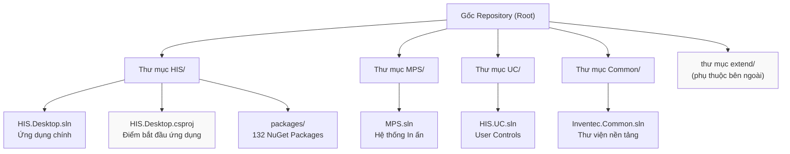
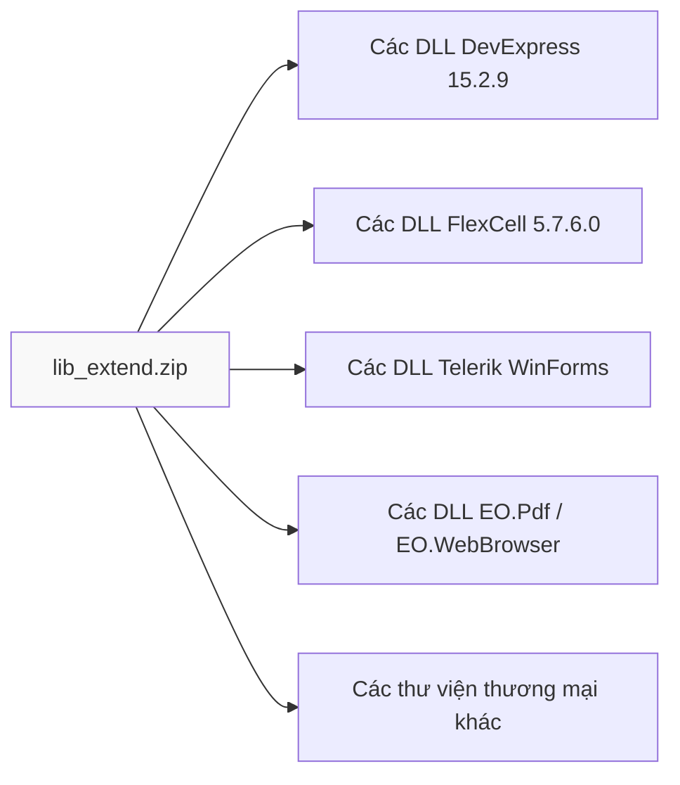
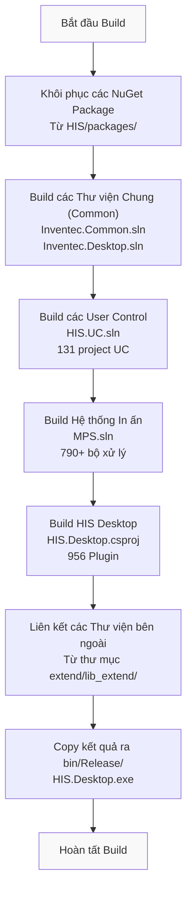

## Mục đích và Phạm vi

Trang này cung cấp tài liệu chi tiết về quá trình cài đặt hoàn chỉnh để build (xây dựng) và phát triển Hệ thống Thông tin Bệnh viện HisNguonMo từ mã nguồn. Tài liệu bao gồm các yêu cầu tiên quyết, cách lấy các phụ thuộc bên ngoài (external dependencies), cấu hình repository và quy trình build cho ứng dụng chính HIS Desktop.

Để biết thông tin về kiến trúc tổng thể của hệ thống và cách tổ chức các module, xem thêm tại [Tổng quan Kiến trúc](#1). Để biết chi tiết về chu kỳ phát triển plugin, xem [Kiến trúc Hệ thống Plugin](../01-architecture/plugin-system/01-overview.md).

---

## Yêu cầu Tiên quyết

### Hệ điều hành và Môi trường thực thi (Runtime)

| Thành phần | Phiên bản | Ghi chú |
|-----------|---------|-------|
| Hệ điều hành Windows | 7 hoặc mới hơn | Yêu cầu cho ứng dụng desktop WinForms |
| .NET Framework | 4.5 | Framework mục tiêu cho tất cả các project |
| Visual Studio | 2012 hoặc mới hơn | Khuyến nghị: VS 2015+ để có công cụ hỗ trợ tốt hơn |
| MSBuild | 12.0 hoặc mới hơn | Thường đi kèm với Visual Studio |

### Bản quyền Thư viện Bên thứ ba

Mã nguồn phụ thuộc vào một số thư viện UI và báo cáo thương mại yêu cầu phải có bản quyền hợp lệ:

| Thư viện | Phiên bản | Mục đích |
|---------|---------|---------|
| DevExpress WinForms | 15.2.9 | Framework UI chính cho tất cả các form và control |
| FlexCell | 5.7.6.0 | Tạo báo cáo Excel/PDF trong module MPS |
| Telerik WinForms | - | Các UI control bổ sung |
| BarTender | 10.1.0 | Khả năng in mã vạch |

**Lưu ý**: Các file bản quyền của DevExpress 15.2.9 (`.licx`) là bắt buộc nhưng bị loại khỏi hệ thống quản lý mã nguồn thông qua [.gitignore:5]().

### Các Công cụ Phát triển

```
Git for Windows - Quản lý phiên bản (Version control)
NuGet CLI (tùy chọn) - Quản lý các package (các package đã được tải sẵn)
Text Editor - Dùng để chỉnh sửa các file cấu hình
```

Nguồn tham khảo: [.gitignore:1-10](), [[`.devin/wiki.json:12-13`](../../../.devin/wiki.json#L12-L13)](../../../.devin/wiki.json#L12-L13), [[`Common/HIS.Common.Treatment/HIS.Common.Treatment/HIS.Common.Treatment.csproj:12`](../../Common/HIS.Common.Treatment/HIS.Common.Treatment/HIS.Common.Treatment.csproj#L12)](../../Common/HIS.Common.Treatment/HIS.Common.Treatment/HIS.Common.Treatment.csproj#L12)

---

## Tổng quan Cấu trúc Repository

Repository được tổ chức thành bốn file solution chính, mỗi file đại diện cho một module lớn:



Nguồn tham khảo: [[`.devin/wiki.json:30-31`](../../../.devin/wiki.json#L30-L31)](../../../.devin/wiki.json#L30-L31), [[`.devin/wiki.json:290`](../../../.devin/wiki.json#L290)](../../../.devin/wiki.json#L290)

---

## Phụ thuộc Bên ngoài (External Dependencies)

Hệ thống HisNguonMo yêu cầu hai gói phụ thuộc bên ngoài **không được bao gồm trong repository Git** do hạn chế về bản quyền và kích thước file:

### lib_extend.zip - Các Thư viện Phụ thuộc

Chứa các thư viện bên thứ ba đã được build sẵn cần thiết để biên dịch (build) ứng dụng:



### extend.zip - Các Thành phần chạy lúc Runtime

Chứa các thành phần thực thi, file cấu hình và tài nguyên bổ sung:

```
Nội dung file extend.zip:
├── Plugins/ - Các assembly plugin đã build sẵn
├── Config/ - Các mẫu file cấu hình (templates)
├── Resources/ - Icon, hình ảnh, file đa ngôn ngữ
└── Dependencies/ - Các thư viện chỉ dùng lúc chạy (runtime-only)
```

### Hướng dẫn cách lấy các gói này

Các gói này phải được tải xuống từ server của Vietsens hoặc được cung cấp bởi những người quản lý dự án. Liên hệ với đội kỹ thuật để nhận:

1. **lib_extend.zip** - Giải nén vào thư mục `<repo_root>/extend/lib_extend/`
2. **extend.zip** - Giải nén vào thư mục `<repo_root>/extend/`

Nguồn tham khảo: [[`.devin/wiki.json:12-13`](../../../.devin/wiki.json#L12-L13)](../../../.devin/wiki.json#L12-L13), [[`.devin/wiki.json:290`](../../../.devin/wiki.json#L290)](../../../.devin/wiki.json#L290)

---

## Quy trình Cài đặt (Setup)

### Bước 1: Clone Repository

```bash
git clone https://github.com/thangpnb/HIS.git
cd HIS
```

Kích thước repository khoảng 1-2 GB do số lượng lớn các plugin (956) và bộ xử lý in (790+).

### Bước 2: Giải nén các Phụ thuộc bên ngoài

```bash
# Giả sử lib_extend.zip và extend.zip đang ở trong thư mục Downloads
# Giải nén lib_extend.zip vào thư mục extend/lib_extend/
# Giải nén extend.zip vào thư mục extend/

# Kiểm tra lại cấu trúc thư mục:
# <repo_root>/
#   ├── HIS/
#   ├── MPS/
#   ├── UC/
#   ├── Common/
#   └── extend/
#       ├── lib_extend/
#       │   ├── DevExpress.*.dll
#       │   ├── FlexCell.*.dll
#       │   └── ...
#       └── [các file extend khác]
```

### Bước 3: Kiểm tra các Package NuGet

Thư mục `HIS/packages/` chứa 132 package NuGet đã được tải sẵn. Hãy kiểm tra xem thư mục này có tồn tại và đầy đủ các file hay không:

```
HIS/packages/
├── EntityFramework.6.x.x/
├── Newtonsoft.Json.x.x.x/
├── [130 package khác]
```

Nếu thiếu các package, hãy thực hiện khôi phục (restore):

```bash
cd HIS
nuget restore HIS.Desktop.sln
```

### Bước 4: Cấu hình Đường dẫn Build

Cập nhật đường dẫn tham chiếu (reference paths) nếu vị trí thư mục `extend` khác với mặc định. Kiểm tra các đường dẫn tham chiếu trong file project như [[`Common/HIS.Common.Treatment/HIS.Common.Treatment/HIS.Common.Treatment.csproj:34-36`](../../Common/HIS.Common.Treatment/HIS.Common.Treatment/HIS.Common.Treatment.csproj#L34-L36)](../../Common/HIS.Common.Treatment/HIS.Common.Treatment/HIS.Common.Treatment.csproj#L34-L36):

```xml
<Reference Include="IMSys.DbConfig.HIS_RS">
  <HintPath>..\..\..\..\RELEASE\IMSys.DbConfig\IMSys.DbConfig.HIS_RS\IMSys.DbConfig.HIS_RS.dll</HintPath>
</Reference>
```

Nguồn tham khảo: [[`.devin/wiki.json:290`](../../../.devin/wiki.json#L290)](../../../.devin/wiki.json#L290), [.gitignore:1-10]()

---

## Quy trình Build (Biên dịch)

### Cấu trúc Lệnh Build

Mục tiêu build chính là [[`HIS.Desktop.csproj`](../../HIS.Desktop.csproj)](../../HIS.Desktop.csproj), đây là điểm bắt đầu của ứng dụng:

```bash
MSBuild.exe HIS.Desktop.csproj /p:Configuration=Release /p:Platform=AnyCPU
```

### Các Tham số Cấu hình Build

| Tham số | Giá trị | Mô tả |
|-----------|--------|-------------|
| `/p:Configuration` | `Debug` hoặc `Release` | Chế độ cấu hình build |
| `/p:Platform` | `AnyCPU` | Kiến trúc nền tảng mục tiêu |
| `/t:Build` | (mặc định) | Mục tiêu build (Clean, Rebuild, Build) |
| `/v:detailed` | (tùy chọn) | Mức độ hiển thị thông tin chi tiết để xử lý lỗi |

### Luồng Build Hoàn chỉnh



### Các Lệnh Build theo từng Module

#### 1. Thư viện Chung (Common Libraries)

```bash
cd Common
MSBuild.exe Inventec.Common.sln /p:Configuration=Release /p:Platform=AnyCPU
```

Build 46 project tiện ích bao gồm:
- `Inventec.Common.Logging`
- `Inventec.Common.WebApiClient`
- `Inventec.Common.ElectronicBill` (319 file)
- `Inventec.Common.FlexCelPrint`
- `Inventec.Common.QRCoder`

#### 2. Framework Inventec Desktop

```bash
cd Common
MSBuild.exe Inventec.Desktop.sln /p:Configuration=Release /p:Platform=AnyCPU
```

Build 27 project framework desktop bao gồm:
- `Inventec.Desktop.Core` (208 file) - Tìm kiếm và quản lý chu kỳ sống của plugin
- `Inventec.Desktop.Plugins.ChangePassword`
- `Inventec.Desktop.Plugins.Updater`

#### 3. Thư viện User Controls

```bash
cd UC
MSBuild.exe HIS.UC.sln /p:Configuration=Release /p:Platform=AnyCPU
```

Build 131 thành phần UI có thể tái sử dụng bao gồm:
- `HIS.UC.FormType` (329 file)
- `His.UC.CreateReport` (165 file)
- `His.UC.UCHein` (153 file)

#### 4. Hệ thống In ấn Y tế (Medical Print System)

```bash
cd MPS
MSBuild.exe MPS.sln /p:Configuration=Release /p:Platform=AnyCPU
```

Build:
- `MPS.ProcessorBase` (30 file)
- 790+ bộ xử lý in (`MPS.Processor.Mps000xxx`)

#### 5. Ứng dụng HIS Desktop

```bash
cd HIS
MSBuild.exe HIS.Desktop.csproj /p:Configuration=Release /p:Platform=AnyCPU
```

Đây là **bước build cuối cùng** để tạo ra file `HIS.Desktop.exe`.

Nguồn tham khảo: [[`.devin/wiki.json:290`](../../../.devin/wiki.json#L290)](../../../.devin/wiki.json#L290), [[`Common/HIS.Common.Treatment/HIS.Common.Treatment.sln:1-21`](../../Common/HIS.Common.Treatment/HIS.Common.Treatment.sln#L1-L21)](../../Common/HIS.Common.Treatment/HIS.Common.Treatment.sln#L1-L21), [[`Common/HIS.Common.Treatment/HIS.Common.Treatment/HIS.Common.Treatment.csproj:1-57`](../../Common/HIS.Common.Treatment/HIS.Common.Treatment/HIS.Common.Treatment.csproj#L1-L57)](../../Common/HIS.Common.Treatment/HIS.Common.Treatment/HIS.Common.Treatment.csproj#L1-L57)

---

## Cấu trúc Đầu ra (Output)

Sau khi build thành công, kết quả sẽ nằm trong thư mục `HIS/bin/Release/`:

```
HIS/bin/Release/
├── HIS.Desktop.exe             # File thực thi chính của ứng dụng
├── HIS.Desktop.exe.config      # File cấu hình ứng dụng
├── HIS.Desktop.ADO.dll         # Các mô hình dữ liệu (data models)
├── HIS.Desktop.ApiConsumer.dll # Lớp API client
├── HIS.Desktop.Common.dll      # Các tiện ích chung
├── HIS.Desktop.LocalStorage.*.dll  # Cấu hình & cache
├── Plugins/                    # 956 plugin assembly
│   ├── HIS.Desktop.Plugins.*.dll
│   ├── ACS.Desktop.Plugins.*.dll
│   ├── EMR.Desktop.Plugins.*.dll
│   └── [các plugin khác]
├── DevExpress.*.dll           # Các thư viện DevExpress
├── FlexCell.dll               # Thư viện FlexCell
├── Inventec.*.dll             # Các thư viện chung
└── [các phụ thuộc khác]
```

### Kết quả Build theo từng Module

| Module | Kết quả chính | Số lượng file | Phụ thuộc |
|--------|---------------|------------|--------------|
| Common | `Inventec.*.dll` | 46 DLL | Chỉ các thư viện bên ngoài |
| UC | `HIS.UC.*.dll` | 131 DLL | Common + DevExpress |
| MPS | `MPS.*.dll` | 790+ DLL | Common + FlexCell |
| HIS | `HIS.Desktop.exe` | 1 EXE + 956 plugin DLL | Tất cả các thành phần trên |

---

## Xác minh bản Build

### Bước 1: Kiểm tra Build Log

Đảm bảo không có lỗi trong kết quả của MSBuild:

```
Build succeeded.
    0 Warning(s)
    0 Error(s)

Time Elapsed 00:05:23.45
```

### Bước 2: Kiểm tra các file đầu ra

```bash
# Kiểm tra file thực thi chính có tồn tại hay không
ls HIS/bin/Release/HIS.Desktop.exe

# Kiểm tra số lượng plugin (nên có khoảng 956)
ls HIS/bin/Release/Plugins/*.dll | wc -l

# Kiểm tra các phụ thuộc quan trọng
ls HIS/bin/Release/DevExpress.*.dll
ls HIS/bin/Release/Inventec.*.dll
```

### Bước 3: Chạy ứng dụng kiểm tra

```bash
cd HIS/bin/Release
./HIS.Desktop.exe
```

Ứng dụng sẽ khởi chạy và hiển thị màn hình đăng nhập. Các lỗi khởi động thường gặp:
- Thiếu bản quyền DevExpress → Xuất hiện hộp thoại bản quyền (License dialog)
- Thiếu cấu hình backend API → Lỗi kết nối
- Thiếu cơ sở dữ liệu → Lỗi khởi tạo cơ sở dữ liệu

Nguồn tham khảo: [.gitignore:2-4]()

---

## Các lỗi thường gặp khi Build (Common Build Issues)

### Lỗi 1: Thiếu Phụ thuộc Bên ngoài

**Triệu chứng**: Lỗi build tham chiếu đến `DevExpress.*`, `FlexCell.*`, hoặc các DLL bên ngoài khác.

**Cách khắc phục**:
```bash
# Kiểm tra thư mục extend/lib_extend/ có tồn tại và chứa các file DLL hay không
ls extend/lib_extend/DevExpress.*.dll
ls extend/lib_extend/FlexCell.*.dll

# Nếu thiếu, hãy giải nén lại file lib_extend.zip
```

### Lỗi 2: Lỗi đường dẫn Tham chiếu (Reference Path)

**Triệu chứng**: Lỗi build như "Could not resolve reference 'IMSys.DbConfig.HIS_RS'".

**Cách khắc phục**: Cập nhật `HintPath` trong các file `.csproj` sao cho khớp với vị trí thư mục `extend` của bạn.

Ví dụ từ file [[`Common/HIS.Common.Treatment/HIS.Common.Treatment/HIS.Common.Treatment.csproj:34-36`](../../Common/HIS.Common.Treatment/HIS.Common.Treatment/HIS.Common.Treatment.csproj#L34-L36)](../../Common/HIS.Common.Treatment/HIS.Common.Treatment/HIS.Common.Treatment.csproj#L34-L36):
```xml
<Reference Include="IMSys.DbConfig.HIS_RS">
  <HintPath>..\..\..\..\RELEASE\IMSys.DbConfig\IMSys.DbConfig.HIS_RS\IMSys.DbConfig.HIS_RS.dll</HintPath>
</Reference>
```

### Lỗi 3: Lỗi Package NuGet

**Triệu chứng**: Gặp lỗi "Package X not found" hoặc "Unable to resolve package".

**Cách khắc phục**:
```bash
cd HIS
nuget restore HIS.Desktop.sln
```

### Lỗi 4: File bản quyền DevExpress (License Files)

**Triệu chứng**: Gặp lỗi "License not found" trong khi build.

**Cách khắc phục**: Các file `.licx` của DevExpress bị loại bỏ qua [.gitignore:5](). Bản quyền DevExpress 15.2.9 hợp lệ phải được:
1. Cài đặt trên Visual Studio
2. File bản quyền được tạo lại cho mỗi máy của lập trình viên
3. Không được commit lên hệ thống quản lý mã nguồn

### Lỗi 5: Sai lệch Nền tảng Mục tiêu (Platform Target)

**Triệu chứng**: Lỗi runtime "Could not load file or assembly".

**Cách khắc phục**: Đảm bảo tất cả các project đều sử dụng `AnyCPU`:
```bash
MSBuild.exe HIS.Desktop.csproj /p:Platform=AnyCPU
```

### Lỗi 6: Tràn bộ nhớ (Out of Memory) trong khi Build

**Triệu chứng**: MSBuild bị treo hoặc crash trong khi build 956 plugin.

**Cách khắc phục**:
```bash
# Build ở chế độ Release (tốn ít bộ nhớ hơn)
MSBuild.exe HIS.Desktop.csproj /p:Configuration=Release

# Hoặc build các solution riêng lẻ:
MSBuild.exe Common/Inventec.Common.sln /p:Configuration=Release
MSBuild.exe UC/HIS.UC.sln /p:Configuration=Release
MSBuild.exe MPS/MPS.sln /p:Configuration=Release
MSBuild.exe HIS/HIS.Desktop.sln /p:Configuration=Release
```

Nguồn tham khảo: [.gitignore:1-10](), [[`.devin/wiki.json:290`](../../../.devin/wiki.json#L290)](../../../.devin/wiki.json#L290)

---

## Luồng công việc Phát triển (Development Workflow)

### Build từng phần (Incremental Builds)

Sau lần build đầy đủ đầu tiên, chỉ rebuild lại các project có thay đổi:

```bash