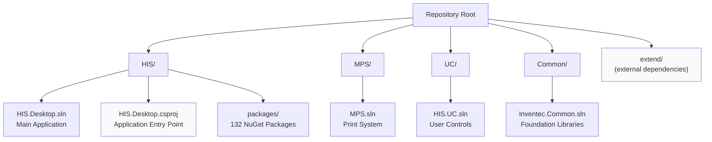
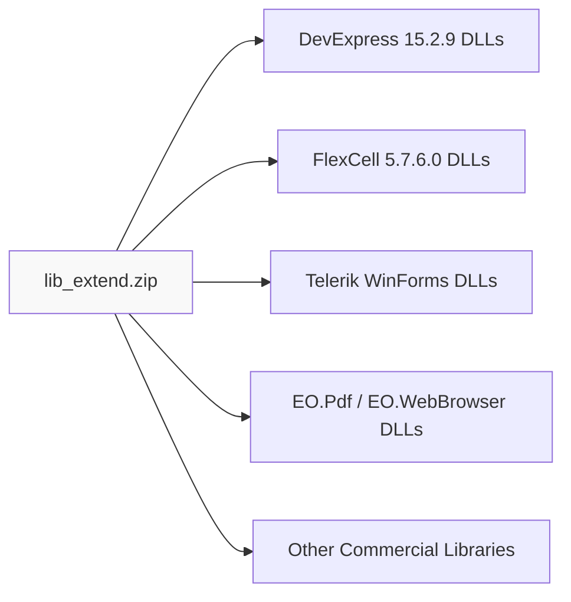
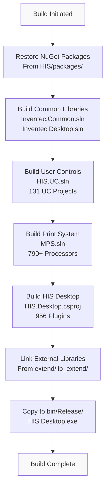

## Purpose and Scope

This page documents the complete setup process for building and developing the HisNguonMo Hospital Information System from source code. It covers prerequisites, external dependency acquisition, repository configuration, and build procedures for the main HIS Desktop application.

For information about the overall system architecture and module organization, see [Architecture Overview](#1). For details on the plugin development lifecycle, see [Plugin System Architecture](../01-architecture/plugin-system.md).

---

## Prerequisites

### Operating System and Runtime

| Component | Version | Notes |
|-----------|---------|-------|
| Windows OS | 7 or later | Required for WinForms desktop application |
| .NET Framework | 4.5 | Target framework for all projects |
| Visual Studio | 2012 or later | Recommended: VS 2015+ for better tooling |
| MSBuild | 12.0 or later | Usually bundled with Visual Studio |

### Required Third-Party Licenses

The codebase depends on several commercial UI and reporting libraries that require valid licenses:

| Library | Version | Purpose |
|---------|---------|---------|
| DevExpress WinForms | 15.2.9 | Primary UI framework for all forms and controls |
| FlexCell | 5.7.6.0 | Excel/PDF report generation in MPS module |
| Telerik WinForms | - | Additional UI controls |
| BarTender | 10.1.0 | Barcode printing capabilities |

**Note**: DevExpress 15.2.9 license files (`.licx`) are required but excluded from source control via [.gitignore:5]().

### Development Tools

```
Git for Windows - Version control
NuGet CLI (optional) - Package management (packages are pre-downloaded)
Text Editor - For configuration file editing
```

Sources: [.gitignore:1-10](), [[`.devin/wiki.json:12-13`](../../../.devin/wiki.json#L12-L13)](../../../.devin/wiki.json#L12-L13), [[`Common/HIS.Common.Treatment/HIS.Common.Treatment/HIS.Common.Treatment.csproj:12`](../../Common/HIS.Common.Treatment/HIS.Common.Treatment/HIS.Common.Treatment.csproj#L12)](../../Common/HIS.Common.Treatment/HIS.Common.Treatment/HIS.Common.Treatment.csproj#L12)

---

## Repository Structure Overview

The repository is organized into four main solution files, each representing a major module:



Sources: [[`.devin/wiki.json:30-31`](../../../.devin/wiki.json#L30-L31)](../../../.devin/wiki.json#L30-L31), [[`.devin/wiki.json:290`](../../../.devin/wiki.json#L290)](../../../.devin/wiki.json#L290)

---

## External Dependencies

The HisNguonMo system requires two external dependency packages that are **not included in the Git repository** due to licensing restrictions and file size:

### lib_extend.zip - Library Dependencies

Contains compiled third-party libraries required for building the application:



### extend.zip - Runtime Components

Contains runtime components, configuration files, and additional resources:

```
extend.zip contents:
├── Plugins/ - Pre-compiled plugin assemblies
├── Config/ - Configuration templates
├── Resources/ - Icons, images, localization files
└── Dependencies/ - Runtime-only libraries
```

### Acquisition Instructions

These packages must be downloaded from Vietsens server or provided by the project maintainers. Contact the technical team to obtain:

1. **lib_extend.zip** - Extract to `<repo_root>/extend/lib_extend/`
2. **extend.zip** - Extract to `<repo_root>/extend/`

Sources: [[`.devin/wiki.json:12-13`](../../../.devin/wiki.json#L12-L13)](../../../.devin/wiki.json#L12-L13), [[`.devin/wiki.json:290`](../../../.devin/wiki.json#L290)](../../../.devin/wiki.json#L290)

---

## Setup Procedure

### Step 1: Clone Repository

```bash
git clone https://github.com/thangpnb/HIS.git
cd HIS
```

The repository size is approximately 1-2 GB due to the large number of plugins (956) and print processors (790+).

### Step 2: Extract External Dependencies

```bash
# Assuming lib_extend.zip and extend.zip are in Downloads folder
# Extract lib_extend.zip to extend/lib_extend/
# Extract extend.zip to extend/

# Verify directory structure:
# <repo_root>/
#   ├── HIS/
#   ├── MPS/
#   ├── UC/
#   ├── Common/
#   └── extend/
#       ├── lib_extend/
#       │   ├── DevExpress.*.dll
#       │   ├── FlexCell.*.dll
#       │   └── ...
#       └── [other extend files]
```

### Step 3: Verify NuGet Packages

The `HIS/packages/` folder contains 132 pre-downloaded NuGet packages. Verify this folder exists and is populated:

```
HIS/packages/
├── EntityFramework.6.x.x/
├── Newtonsoft.Json.x.x.x/
├── [130 other packages]
```

If packages are missing, restore them:

```bash
cd HIS
nuget restore HIS.Desktop.sln
```

### Step 4: Configure Build Paths

Update project reference paths if the `extend` folder location differs from the default. Check reference paths in project files like [[`Common/HIS.Common.Treatment/HIS.Common.Treatment/HIS.Common.Treatment.csproj:34-36`](../../Common/HIS.Common.Treatment/HIS.Common.Treatment/HIS.Common.Treatment.csproj#L34-L36)](../../Common/HIS.Common.Treatment/HIS.Common.Treatment/HIS.Common.Treatment.csproj#L34-L36):

```xml
<Reference Include="IMSys.DbConfig.HIS_RS">
  <HintPath>..\..\..\..\RELEASE\IMSys.DbConfig\IMSys.DbConfig.HIS_RS\IMSys.DbConfig.HIS_RS.dll</HintPath>
</Reference>
```

Sources: [[`.devin/wiki.json:290`](../../../.devin/wiki.json#L290)](../../../.devin/wiki.json#L290), [.gitignore:1-10]()

---

## Build Process

### Build Command Structure

The primary build target is [[`HIS.Desktop.csproj`](../../HIS.Desktop.csproj)](../../HIS.Desktop.csproj), which serves as the application entry point:

```bash
MSBuild.exe HIS.Desktop.csproj /p:Configuration=Release /p:Platform=AnyCPU
```

### Build Configuration Parameters

| Parameter | Values | Description |
|-----------|--------|-------------|
| `/p:Configuration` | `Debug` or `Release` | Build configuration mode |
| `/p:Platform` | `AnyCPU` | Target platform architecture |
| `/t:Build` | (default) | Build target (Clean, Rebuild, Build) |
| `/v:detailed` | (optional) | Verbosity level for troubleshooting |

### Complete Build Flow



### Build Commands by Module

#### 1. Common Libraries

```bash
cd Common
MSBuild.exe Inventec.Common.sln /p:Configuration=Release /p:Platform=AnyCPU
```

Builds 46 utility projects including:
- `Inventec.Common.Logging`
- `Inventec.Common.WebApiClient`
- `Inventec.Common.ElectronicBill` (319 files)
- `Inventec.Common.FlexCelPrint`
- `Inventec.Common.QRCoder`

#### 2. Inventec Desktop Framework

```bash
cd Common
MSBuild.exe Inventec.Desktop.sln /p:Configuration=Release /p:Platform=AnyCPU
```

Builds 27 desktop framework projects including:
- `Inventec.Desktop.Core` (208 files) - Plugin discovery and lifecycle
- `Inventec.Desktop.Plugins.ChangePassword`
- `Inventec.Desktop.Plugins.Updater`

#### 3. User Controls Library

```bash
cd UC
MSBuild.exe HIS.UC.sln /p:Configuration=Release /p:Platform=AnyCPU
```

Builds 131 reusable UI components including:
- `HIS.UC.FormType` (329 files)
- `His.UC.CreateReport` (165 files)
- `His.UC.UCHein` (153 files)

#### 4. Medical Print System

```bash
cd MPS
MSBuild.exe MPS.sln /p:Configuration=Release /p:Platform=AnyCPU
```

Builds:
- `MPS.ProcessorBase` (30 files)
- 790+ print processors (`MPS.Processor.Mps000xxx`)

#### 5. HIS Desktop Application

```bash
cd HIS
MSBuild.exe HIS.Desktop.csproj /p:Configuration=Release /p:Platform=AnyCPU
```

This is the **final build step** that produces `HIS.Desktop.exe`.

Sources: [[`.devin/wiki.json:290`](../../../.devin/wiki.json#L290)](../../../.devin/wiki.json#L290), [[`Common/HIS.Common.Treatment/HIS.Common.Treatment.sln:1-21`](../../Common/HIS.Common.Treatment/HIS.Common.Treatment.sln#L1-L21)](../../Common/HIS.Common.Treatment/HIS.Common.Treatment.sln#L1-L21), [[`Common/HIS.Common.Treatment/HIS.Common.Treatment/HIS.Common.Treatment.csproj:1-57`](../../Common/HIS.Common.Treatment/HIS.Common.Treatment/HIS.Common.Treatment.csproj#L1-L57)](../../Common/HIS.Common.Treatment/HIS.Common.Treatment/HIS.Common.Treatment.csproj#L1-L57)

---

## Output Structure

After a successful build, the output is located in `HIS/bin/Release/`:

```
HIS/bin/Release/
├── HIS.Desktop.exe             # Main application executable
├── HIS.Desktop.exe.config      # Application configuration
├── HIS.Desktop.ADO.dll         # Data models
├── HIS.Desktop.ApiConsumer.dll # API client layer
├── HIS.Desktop.Common.dll      # Shared utilities
├── HIS.Desktop.LocalStorage.*.dll  # Configuration & cache
├── Plugins/                    # 956 plugin assemblies
│   ├── HIS.Desktop.Plugins.*.dll
│   ├── ACS.Desktop.Plugins.*.dll
│   ├── EMR.Desktop.Plugins.*.dll
│   └── [other plugins]
├── DevExpress.*.dll           # DevExpress libraries
├── FlexCell.dll               # FlexCell library
├── Inventec.*.dll             # Common libraries
└── [other dependencies]
```

### Build Artifacts by Module

| Module | Primary Output | File Count | Dependencies |
|--------|---------------|------------|--------------|
| Common | `Inventec.*.dll` | 46 DLLs | External libs only |
| UC | `HIS.UC.*.dll` | 131 DLLs | Common + DevExpress |
| MPS | `MPS.*.dll` | 790+ DLLs | Common + FlexCell |
| HIS | `HIS.Desktop.exe` | 1 EXE + 956 plugin DLLs | All above |

---

## Build Verification

### Step 1: Check Build Logs

Verify no errors in MSBuild output:

```
Build succeeded.
    0 Warning(s)
    0 Error(s)

Time Elapsed 00:05:23.45
```

### Step 2: Verify Output Files

```bash
# Check main executable exists
ls HIS/bin/Release/HIS.Desktop.exe

# Check plugin count (should be ~956)
ls HIS/bin/Release/Plugins/*.dll | wc -l

# Check key dependencies
ls HIS/bin/Release/DevExpress.*.dll
ls HIS/bin/Release/Inventec.*.dll
```

### Step 3: Test Application Launch

```bash
cd HIS/bin/Release
./HIS.Desktop.exe
```

The application should launch and display the login screen. Common startup issues:
- Missing DevExpress license → License dialog appears
- Missing backend API configuration → Connection error
- Missing database → Database initialization error

Sources: [.gitignore:2-4]()

---

## Common Build Issues

### Issue 1: Missing External Dependencies

**Symptom**: Build errors referencing `DevExpress.*`, `FlexCell.*`, or other external DLLs

**Solution**:
```bash
# Verify extend/lib_extend/ folder exists and contains DLLs
ls extend/lib_extend/DevExpress.*.dll
ls extend/lib_extend/FlexCell.*.dll

# If missing, re-extract lib_extend.zip
```

### Issue 2: Reference Path Errors

**Symptom**: Build errors like "Could not resolve reference 'IMSys.DbConfig.HIS_RS'"

**Solution**: Update HintPath in `.csproj` files to match your `extend` folder location.

Example from [[`Common/HIS.Common.Treatment/HIS.Common.Treatment/HIS.Common.Treatment.csproj:34-36`](../../Common/HIS.Common.Treatment/HIS.Common.Treatment/HIS.Common.Treatment.csproj#L34-L36)](../../Common/HIS.Common.Treatment/HIS.Common.Treatment/HIS.Common.Treatment.csproj#L34-L36):
```xml
<Reference Include="IMSys.DbConfig.HIS_RS">
  <HintPath>..\..\..\..\RELEASE\IMSys.DbConfig\IMSys.DbConfig.HIS_RS\IMSys.DbConfig.HIS_RS.dll</HintPath>
</Reference>
```

### Issue 3: NuGet Package Errors

**Symptom**: "Package X not found" or "Unable to resolve package"

**Solution**:
```bash
cd HIS
nuget restore HIS.Desktop.sln
```

### Issue 4: DevExpress License Files

**Symptom**: "License not found" errors during build

**Solution**: DevExpress `.licx` files are excluded via [.gitignore:5](). Valid DevExpress 15.2.9 licenses must be:
1. Installed in Visual Studio
2. License files regenerated for each developer machine
3. Not committed to source control

### Issue 5: Platform Target Mismatch

**Symptom**: "Could not load file or assembly" runtime errors

**Solution**: Ensure all projects use `AnyCPU`:
```bash
MSBuild.exe HIS.Desktop.csproj /p:Platform=AnyCPU
```

### Issue 6: Out of Memory During Build

**Symptom**: MSBuild crashes or hangs during build of 956 plugins

**Solution**:
```bash
# Build in Release mode (uses less memory)
MSBuild.exe HIS.Desktop.csproj /p:Configuration=Release

# Or build solutions separately:
MSBuild.exe Common/Inventec.Common.sln /p:Configuration=Release
MSBuild.exe UC/HIS.UC.sln /p:Configuration=Release
MSBuild.exe MPS/MPS.sln /p:Configuration=Release
MSBuild.exe HIS/HIS.Desktop.sln /p:Configuration=Release
```

Sources: [.gitignore:1-10](), [[`.devin/wiki.json:290`](../../../.devin/wiki.json#L290)](../../../.devin/wiki.json#L290)

---

## Development Workflow

### Incremental Builds

After initial full build, rebuild only changed projects:

```bash