MSBuild.exe HIS.Common.Treatment.csproj /p:Configuration=Release
```

For complete build instructions, see [Build & Development Setup](../99-development/build-setup.md).

Sources: [[`Common/HIS.Common.Treatment/HIS.Common.Treatment/HIS.Common.Treatment.csproj:1-57`](../../Common/HIS.Common.Treatment/HIS.Common.Treatment/HIS.Common.Treatment.csproj#L1-L57)](../../Common/HIS.Common.Treatment/HIS.Common.Treatment/HIS.Common.Treatment.csproj#L1-L57)

## Hướng dẫn Phát triển

### Thêm các Tiện ích Chung (Common Utilities) mới

**Quy trình:**
1. Tạo project mới dưới namespace phù hợp:
   - `Inventec.Common.*` - các tiện ích chung
   - `Inventec.Desktop.*` - các phần mở rộng cho desktop framework
   - `HIS.Common.*` - các tiện ích đặc thù cho HIS

2. Cấu hình Project:
   - Target .NET Framework 4.5
   - Sử dụng các quy ước đặt tên thống nhất
   - Thêm các comment tài liệu XML cho các public API

3. Cập nhật các file solution:
   - Thêm vào [[`Inventec.Common.sln`](../../Inventec.Common.sln)](../../Inventec.Common.sln) hoặc [[`Inventec.Desktop.sln`](../../Inventec.Desktop.sln)](../../Inventec.Desktop.sln)
   - Cấu hình các phụ thuộc khi build (build dependencies)

4. Tài liệu (Documentation):
   - Cập nhật trang wiki với tiện ích mới
   - Cung cấp các ví dụ sử dụng
   - Viết tài liệu về các yêu cầu cấu hình

### Tiêu chuẩn Mã nguồn (Code Standards)

**Quy ước đặt tên (Naming Conventions):**
- Namespaces: PascalCase (ví dụ: `Inventec.Common.Logging`)
- Classes: PascalCase (ví dụ: `LogSystem`)
- Methods: PascalCase (ví dụ: `GetMedicines`)
- Parameters: camelCase (ví dụ: `patientId`)

**Tài liệu (Documentation):**
- Tất cả các public class đều yêu cầu comment XML
- Các method có tham số yêu cầu thẻ `<param>`
- Các logic phức tạp yêu cầu comment nội dòng (inline comments)

**Xử lý lỗi (Error Handling):**
- Sử dụng các khối `try-catch` cho các lệnh gọi bên ngoài
- Ghi log các exception bằng `LogSystem.Error()`
- Trả về các thông báo lỗi có ý nghĩa cho phía gọi

### Kiểm thử (Testing)

**Unit Testing:**
- Tạo project kiểm thử cho mỗi thư viện Common
- Sử dụng framework NUnit hoặc MSTest
- Mục tiêu đạt trên 70% độ bao phủ mã nguồn (code coverage) cho các luồng xử lý quan trọng

**Integration Testing:**
- Kiểm thử các API client với mock server
- Kiểm thử việc lưu bộ nhớ đệm (caching) với instance Redis thử nghiệm
- Xác minh kết quả đầu ra của việc tạo tài liệu (document generation)

Sources: [[`.devin/wiki.json:240-247`](../../../.devin/wiki.json#L240-L247)](../../../.devin/wiki.json#L240-L247)

# Inventec Common Utilities


## Purpose and Scope

This document covers the **Inventec.Common** utility library collection located in `Common/Inventec.Common/`, which provides 46 foundational utility projects (890 files total) used throughout the HIS application. These utilities provide cross-cutting concerns including electronic invoicing, document generation, barcode/QR code handling, caching, web API communication, logging, and data processing.

For the Desktop framework that provides plugin engine and lifecycle management, see [Inventec Desktop Framework](../03-technical-specs/common-libraries/libraries.md#inventec-desktop). For shared UI controls, see [Inventec UC Shared Controls](../03-technical-specs/common-libraries/libraries.md#inventec-uc).

## Component Organization

The 46 Inventec.Common projects are organized into several functional categories:

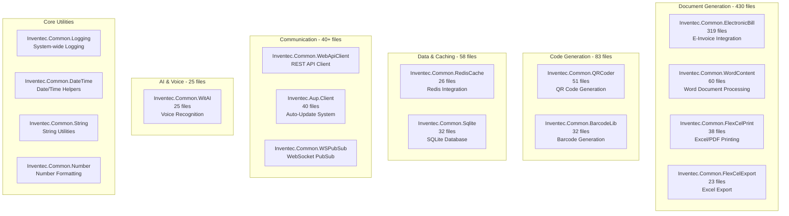

**Sources:** [`.devin/wiki.json:250-257`](../../../.devin/wiki.json#L250-L257)

## Major Components by Size

### Electronic Bill Integration (319 files)

`Inventec.Common.ElectronicBill` is the largest utility component, providing integration with Vietnamese tax authority e-invoice systems.

| Purpose | E-Invoice generation, signing, submission to tax authority |
|---------|-----------------------------------------------------------|
| Location | Common/Inventec.Common/Inventec.Common.ElectronicBill/ |
| File Count | 319 files |
| Key Features | XML generation, digital signature, tax authority API integration, multi-vendor support |
| Used By | HIS billing plugins, transaction plugins |

This component handles compliance with Vietnamese electronic invoice regulations (Decree 119/2018/NĐ-CP), supporting multiple e-invoice service providers.

**Sources:** [`.devin/wiki.json:254-256`](../../../.devin/wiki.json#L254-L256)

### Word Document Processing (60 files)

`Inventec.Common.WordContent` provides utilities for generating and manipulating Microsoft Word documents.

| Purpose | Word document generation from templates |
|---------|----------------------------------------|
| Location | Common/Inventec.Common/Inventec.Common.WordContent/ |
| File Count | 60 files |
| Key Features | Template-based generation, merge fields, table population |
| Used By | Report generation plugins, EMR document creation |

**Sources:** [`.devin/wiki.json:254-256`](../../../.devin/wiki.json#L254-L256)

### QR Code Generation (51 files)

`Inventec.Common.QRCoder` implements QR code generation for patient identification, prescription tracking, and medical records.


**Sources:** [`.devin/wiki.json:254-256`](../../../.devin/wiki.json#L254-L256)

### FlexCell Print & Export (38 + 23 files)

`Inventec.Common.FlexCelPrint` and `Inventec.Common.FlexCelExport` provide Excel and PDF generation capabilities using the FlexCell library.

| Component | Purpose | File Count |
|-----------|---------|------------|
| FlexCelPrint | Template-based Excel/PDF printing | 38 files |
| FlexCelExport | Data export to Excel format | 23 files |

These components are extensively used by the MPS (Medical Print System) for generating medical forms and reports.

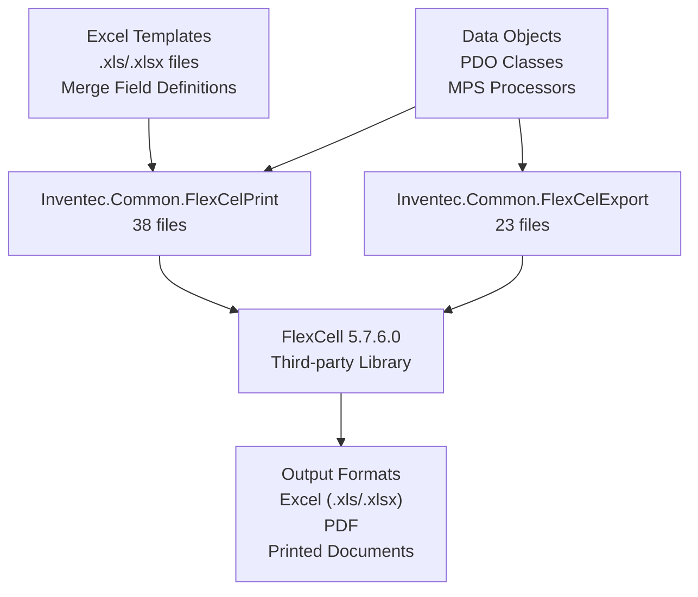

**Sources:** [`.devin/wiki.json:12-13`](../../../.devin/wiki.json#L12-L13, [`.devin/wiki.json:254-256`](../../../.devin/wiki.json#L254-L256)

### Barcode Library (32 files)

`Inventec.Common.BarcodeLib` generates various barcode formats for medication tracking, patient identification, and inventory management.

| Supported Formats | Code128, Code39, EAN13, EAN8, UPC-A, UPC-E |
|-------------------|---------------------------------------------|
| Output | Image files, printer-ready formats |
| Integration | Works with BarTender 10.1.0 for label printing |

**Sources:** [`.devin/wiki.json:12-13`](../../../.devin/wiki.json#L12-L13, [`.devin/wiki.json:254-256`](../../../.devin/wiki.json#L254-L256)

### SQLite Database (32 files)

`Inventec.Common.Sqlite` provides SQLite embedded database functionality for local caching and offline data storage.

**Use Cases:**
- Configuration storage
- Offline transaction queue
- Local reference data cache
- Application state persistence

**Sources:** [`.devin/wiki.json:254-256`](../../../.devin/wiki.json#L254-L256)

### Redis Cache (26 files)

`Inventec.Common.RedisCache` implements distributed caching using Redis for session management and data caching across multiple application instances.

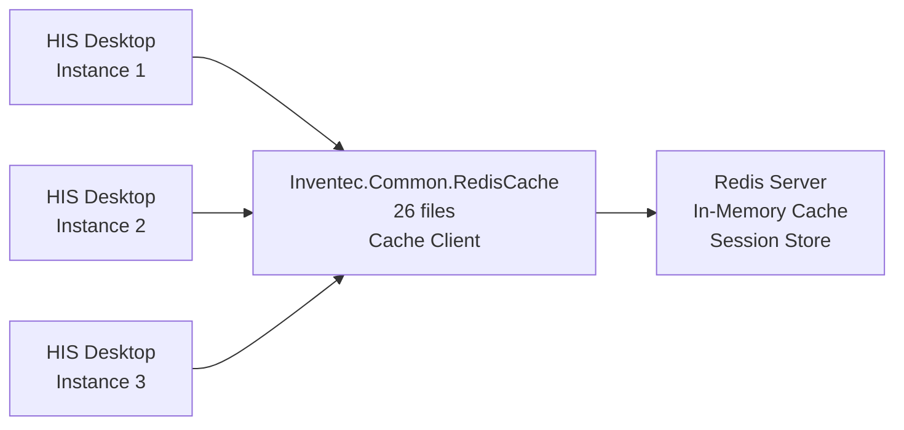

**Sources:** [`.devin/wiki.json:254-256`](../../../.devin/wiki.json#L254-L256)

### Voice Recognition (25 files)

`Inventec.Common.WitAI` integrates with Wit.ai for voice recognition capabilities in clinical documentation.

| Purpose | Voice-to-text for medical dictation |
|---------|-------------------------------------|
| Location | Common/Inventec.Common/Inventec.Common.WitAI/ |
| File Count | 25 files |
| API Integration | Wit.ai cloud service |

**Sources:** [`.devin/wiki.json:254-256`](../../../.devin/wiki.json#L254-L256)

## Communication & Integration Utilities

### WebApiClient

`Inventec.Common.WebApiClient` provides the foundational HTTP client infrastructure for all REST API communication in the HIS system.

**Core Components:**

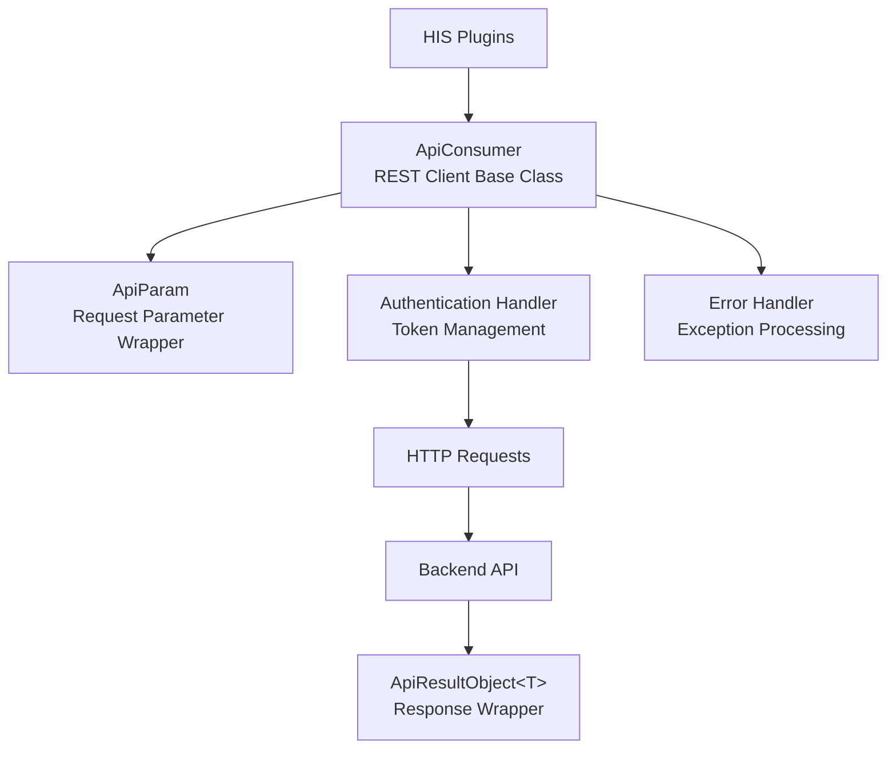

**Key Classes:**
- `Inventec.Common.WebApiClient.ApiConsumer` - HTTP client wrapper [[`Common/Inventec.Aup.Client/Inventec.Aup.Client/ApiConsumerStore.cs:29`](../../Common/Inventec.Aup.Client/Inventec.Aup.Client/ApiConsumerStore.cs#L29)](../../Common/Inventec.Aup.Client/Inventec.Aup.Client/ApiConsumerStore.cs#L29)
- `Inventec.Common.WebApiClient.ApiParam` - Request parameter container [[`Common/Inventec.Aup.Client/Inventec.Aup.Client/FileUpload.cs:54`](../../Common/Inventec.Aup.Client/Inventec.Aup.Client/FileUpload.cs#L54)](../../Common/Inventec.Aup.Client/Inventec.Aup.Client/FileUpload.cs#L54)
- `ApiResultObject<T>` - Generic response wrapper [[`Common/Inventec.Aup.Client/Inventec.Aup.Client/FileUpload.cs:73`](../../Common/Inventec.Aup.Client/Inventec.Aup.Client/FileUpload.cs#L73)](../../Common/Inventec.Aup.Client/Inventec.Aup.Client/FileUpload.cs#L73)

**Sources:** [`Common/Inventec.Aup.Client/Inventec.Aup.Client/ApiConsumerStore.cs:1-32`](../../Common/Inventec.Aup.Client/Inventec.Aup.Client/ApiConsumerStore.cs#L1-L32, [`Common/Inventec.Aup.Client/Inventec.Aup.Client/FileUpload.cs:1-150`](../../Common/Inventec.Aup.Client/Inventec.Aup.Client/FileUpload.cs#L1-L150)

### Auto-Update Client (Inventec.Aup.Client)

The `Inventec.Aup.Client` library (40 files) provides automatic application update capabilities.

**Architecture:**

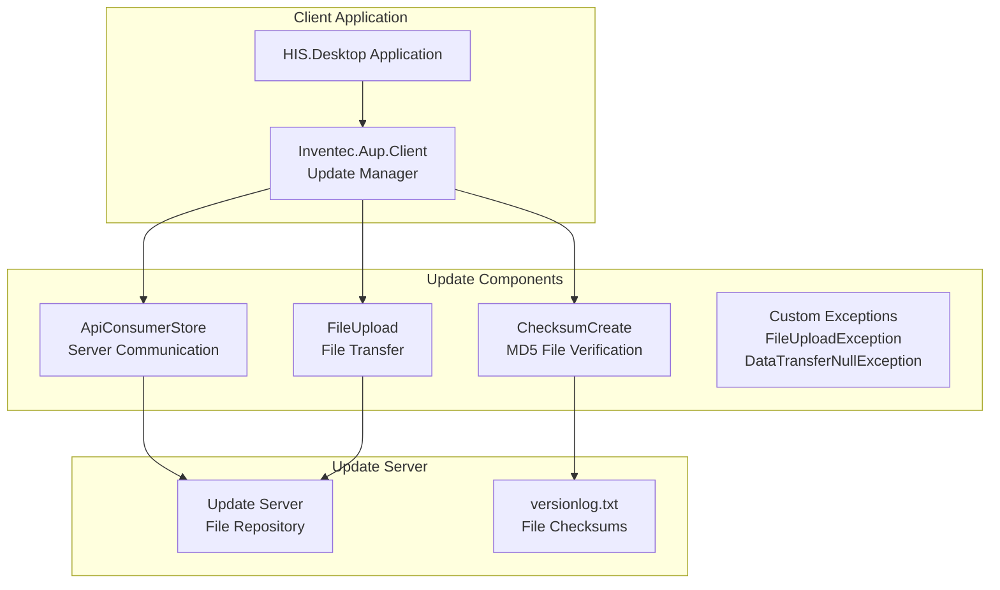

**Key Classes:**

| Class | Purpose | File |
|-------|---------|------|
| `ApiConsumerStore` | Provides `ApiConsumer` instance configured for update server | [[`Common/Inventec.Aup.Client/Inventec.Aup.Client/ApiConsumerStore.cs:27-31`](../../Common/Inventec.Aup.Client/Inventec.Aup.Client/ApiConsumerStore.cs#L27-L31)](../../Common/Inventec.Aup.Client/Inventec.Aup.Client/ApiConsumerStore.cs#L27-L31) |
| `ChecksumCreate` | Calculates MD5 checksums for file verification | [[`Common/Inventec.Aup.Client/Inventec.Aup.Client/ChecksumCreate.cs:29-71`](../../Common/Inventec.Aup.Client/Inventec.Aup.Client/ChecksumCreate.cs#L29-L71)](../../Common/Inventec.Aup.Client/Inventec.Aup.Client/ChecksumCreate.cs#L29-L71) |
| `FileUpload` | Uploads files to update server | [[`Common/Inventec.Aup.Client/Inventec.Aup.Client/FileUpload.cs:30-149`](../../Common/Inventec.Aup.Client/Inventec.Aup.Client/FileUpload.cs#L30-L149)](../../Common/Inventec.Aup.Client/Inventec.Aup.Client/FileUpload.cs#L30-L149) |
| `FileUploadException` | Custom exception for upload failures | [[`Common/Inventec.Aup.Client/Inventec.Aup.Client/FileUploadException.cs:27-46`](../../Common/Inventec.Aup.Client/Inventec.Aup.Client/FileUploadException.cs#L27-L46)](../../Common/Inventec.Aup.Client/Inventec.Aup.Client/FileUploadException.cs#L27-L46) |
| `DataTransferNullException` | Exception for null data transfer responses | [[`Common/Inventec.Aup.Client/Inventec.Aup.Client/DataTransferNullException.cs:27-46`](../../Common/Inventec.Aup.Client/Inventec.Aup.Client/DataTransferNullException.cs#L27-L46)](../../Common/Inventec.Aup.Client/Inventec.Aup.Client/DataTransferNullException.cs#L27-L46) |

**Version File Format:**

The update system uses a `versionlog.txt` file that contains checksums for all files:

```
[relative_path]||[MD5_hash]
Example:
HIS.Desktop.exe||a1b2c3d4e5f6g7h8i9j0k1l2m3n4o5p6
Plugins/Register.dll||f6e5d4c3b2a1098765432109876543210
```

**Update Process:**

1. `ChecksumCreate.GetAllFileInpath()` scans all files in application directory [[`Common/Inventec.Aup.Client/Inventec.Aup.Client/ChecksumCreate.cs:35-47`](../../Common/Inventec.Aup.Client/Inventec.Aup.Client/ChecksumCreate.cs#L35-L47)](../../Common/Inventec.Aup.Client/Inventec.Aup.Client/ChecksumCreate.cs#L35-L47)
2. `CalculateMD5()` computes MD5 hash for each file [[`Common/Inventec.Aup.Client/Inventec.Aup.Client/ChecksumCreate.cs:49-59`](../../Common/Inventec.Aup.Client/Inventec.Aup.Client/ChecksumCreate.cs#L49-L59)](../../Common/Inventec.Aup.Client/Inventec.Aup.Client/ChecksumCreate.cs#L49-L59)
3. `Create()` generates `versionlog.txt` with file paths and checksums [[`Common/Inventec.Aup.Client/Inventec.Aup.Client/ChecksumCreate.cs:61-69`](../../Common/Inventec.Aup.Client/Inventec.Aup.Client/ChecksumCreate.cs#L61-L69)](../../Common/Inventec.Aup.Client/Inventec.Aup.Client/ChecksumCreate.cs#L61-L69)
4. `FileUpload.UploadFile()` transfers files to update server [[`Common/Inventec.Aup.Client/Inventec.Aup.Client/FileUpload.cs:43-93`](../../Common/Inventec.Aup.Client/Inventec.Aup.Client/FileUpload.cs#L43-L93)](../../Common/Inventec.Aup.Client/Inventec.Aup.Client/FileUpload.cs#L43-L93)

**Sources:** [`Common/Inventec.Aup.Client/Inventec.Aup.Client/ApiConsumerStore.cs:1-32`](../../Common/Inventec.Aup.Client/Inventec.Aup.Client/ApiConsumerStore.cs#L1-L32, [`Common/Inventec.Aup.Client/Inventec.Aup.Client/ChecksumCreate.cs:1-72`](../../Common/Inventec.Aup.Client/Inventec.Aup.Client/ChecksumCreate.cs#L1-L72, [`Common/Inventec.Aup.Client/Inventec.Aup.Client/FileUpload.cs:1-150`](../../Common/Inventec.Aup.Client/Inventec.Aup.Client/FileUpload.cs#L1-L150, [`Common/Inventec.Aup.Client/Inventec.Aup.Client/FileUploadException.cs:1-47`](../../Common/Inventec.Aup.Client/Inventec.Aup.Client/FileUploadException.cs#L1-L47, [`Common/Inventec.Aup.Client/Inventec.Aup.Client/DataTransferNullException.cs:1-47`](../../Common/Inventec.Aup.Client/Inventec.Aup.Client/DataTransferNullException.cs#L1-L47)

### WebSocket PubSub

`Inventec.Common.WSPubSub` provides WebSocket-based publish-subscribe messaging for real-time notifications and inter-module communication.

**Integration:**
- Used by `HIS.Desktop.LocalStorage.PubSub` for plugin communication
- Enables real-time patient call notifications
- Supports distributed event broadcasting

**Sources:** [`.devin/wiki.json:280-283`](../../../.devin/wiki.json#L280-L283)

## Core Utility Libraries

### Logging System

`Inventec.Common.Logging` provides centralized logging functionality used throughout the application.

**Key Features:**
- Structured logging with `LogSystem.Debug()`, `LogSystem.Info()`, `LogSystem.Error()`
- Trace data helpers via `LogUtil.TraceData()` and `LogUtil.GetMemberName()`
- Integration with file-based log storage in `Logs/` directory

**Usage Example from Auto-Update System:**

```csharp
// Logging file scan results
Inventec.Common.Logging.LogSystem.Debug(
    "files count in Get All Files Inpath" + 
    Inventec.Common.Logging.LogUtil.TraceData(
        Inventec.Common.Logging.LogUtil.GetMemberName(() => path), path) + 
    "____" + 
    Inventec.Common.Logging.LogUtil.TraceData(
        Inventec.Common.Logging.LogUtil.GetMemberName(() => files.Count), files.Count)
);
```

**Sources:** [`Common/Inventec.Aup.Client/Inventec.Aup.Client/ChecksumCreate.cs:18`](../../Common/Inventec.Aup.Client/Inventec.Aup.Client/ChecksumCreate.cs#L18)#L18), [`Common/Inventec.Aup.Client/Inventec.Aup.Client/ChecksumCreate.cs:45`](../../Common/Inventec.Aup.Client/Inventec.Aup.Client/ChecksumCreate.cs#L45)#L45), [`Common/Inventec.Aup.Client/Inventec.Aup.Client/ChecksumCreate.cs:63-68`](../../Common/Inventec.Aup.Client/Inventec.Aup.Client/ChecksumCreate.cs#L63-L68, [`Common/Inventec.Aup.Client/Inventec.Aup.Client/FileUpload.cs:60-64`](../../Common/Inventec.Aup.Client/Inventec.Aup.Client/FileUpload.cs#L60-L64)

### Date/Time Utilities

`Inventec.Common.DateTime` provides date and time formatting, parsing, and calculation utilities for Vietnamese medical system requirements.

### String Utilities

`Inventec.Common.String` offers string manipulation helpers including:
- Vietnamese character normalization
- Medical code formatting
- Text sanitization for database storage

### Number Utilities

`Inventec.Common.Number` handles number formatting for currency, measurements, and medical values with proper localization support.

**Sources:** [`.devin/wiki.json:250-257`](../../../.devin/wiki.json#L250-L257)

## Dependency Flow

The following diagram shows how Inventec.Common utilities are consumed by higher-level modules:

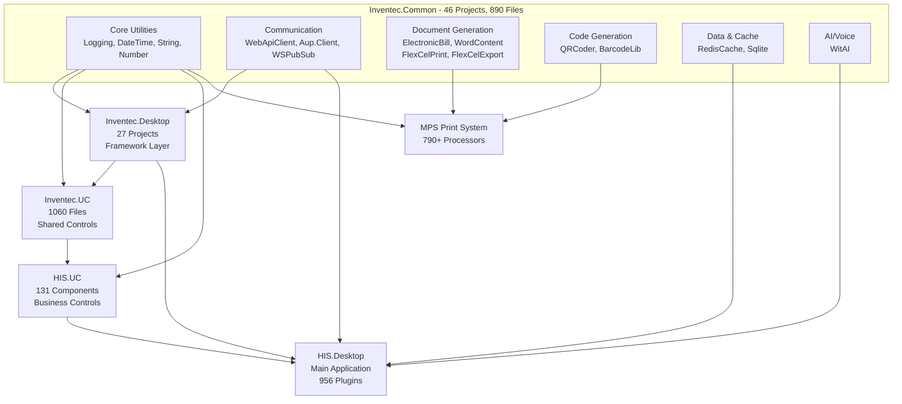

**Usage Patterns:**

| Utility Category | Primary Consumers | Usage Pattern |
|------------------|-------------------|---------------|
| WebApiClient | HIS.Desktop.ApiConsumer, Plugins | Direct REST API calls to backend |
| ElectronicBill | Billing plugins, Transaction plugins | E-invoice generation and submission |
| FlexCelPrint/Export | MPS processors | Medical form template rendering |
| QRCoder/BarcodeLib | MPS processors, Registration plugins | Code generation for tracking |
| RedisCache | HIS.Desktop.LocalStorage | Distributed session and data caching |
| Logging | All components | System-wide diagnostic logging |

**Sources:** [`.devin/wiki.json:1-295`](../../../.devin/wiki.json#L1-L295)

## External Dependencies

Inventec.Common utilities rely on several third-party libraries:

| Library | Version | Purpose | Used By |
|---------|---------|---------|---------|
| FlexCell | 5.7.6.0 | Excel/PDF generation | FlexCelPrint, FlexCelExport |
| Newtonsoft.Json | Latest | JSON serialization | WebApiClient, all API communication |
| StackExchange.Redis | Latest | Redis client | RedisCache |
| System.Data.SQLite | Latest | SQLite database | Sqlite |

**Sources:** [`.devin/wiki.json:12-13`](../../../.devin/wiki.json#L12-L13, [`Common/Inventec.Aup.Client/Inventec.Aup.Client/FileUpload.cs:73`](../../Common/Inventec.Aup.Client/Inventec.Aup.Client/FileUpload.cs#L73)

# Inventec Desktop Framework


## Purpose and Scope

The Inventec Desktop Framework is a foundational desktop application framework located in `Common/Inventec.Desktop/` that provides the core plugin architecture, lifecycle management, and essential desktop utilities for the HIS system. It consists of 27 projects totaling approximately 455 files, with `Inventec.Desktop.Core` (208 files) serving as the central plugin engine.

This page documents the framework's plugin discovery mechanism, base plugins, and auto-update system. For information about other Inventec common utilities, see [Inventec Common Utilities](../03-technical-specs/common-libraries/libraries.md#inventec-common). For HIS-specific plugin implementations, see [Plugin System Architecture](../01-architecture/plugin-system/01-overview.md).

---

## Framework Architecture Overview

The Inventec Desktop Framework provides the technical foundation that enables the HIS application's plugin-based architecture. It consists of three primary layers:

### Layer Structure

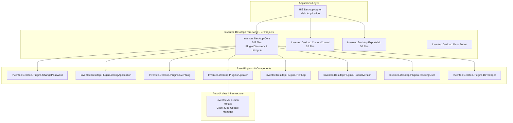

**Sources:** [`.devin/wiki.json:240-267`](../../../.devin/wiki.json#L240-L267)

---

## Inventec.Desktop.Core - Plugin Engine

The `Inventec.Desktop.Core` component (208 files) implements the core plugin discovery, loading, and lifecycle management mechanisms. This is the engine that enables the 956+ plugins in the HIS system to function.

### Key Responsibilities

| Responsibility | Description |
|---------------|-------------|
| **Plugin Discovery** | Scans assemblies and identifies plugin implementations |
| **Lifecycle Management** | Manages plugin initialization, activation, and disposal |
| **Dependency Resolution** | Resolves inter-plugin dependencies and load order |
| **Module Registration** | Registers plugin modules with the application container |
| **Plugin Communication** | Facilitates inter-plugin messaging and events |

### Plugin Discovery Mechanism

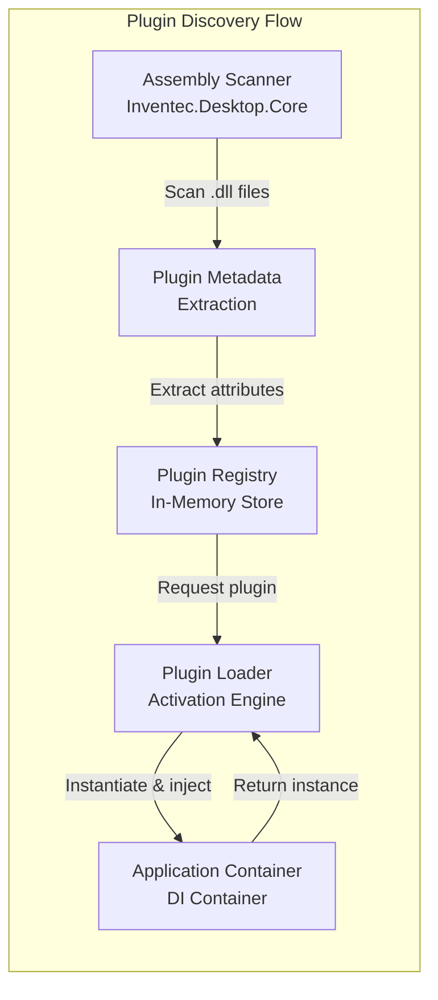

The plugin discovery process operates at application startup:

1. **Assembly Scanning**: Core scans specified directories for assemblies containing plugin implementations
2. **Metadata Extraction**: Extracts plugin metadata including name, version, dependencies, and entry point
3. **Registration**: Registers discovered plugins in an in-memory registry
4. **Lazy Loading**: Plugins are instantiated only when requested by the application
5. **Dependency Injection**: Core injects required dependencies into plugin constructors

**Sources:** [`.devin/wiki.json:61-67`](../../../.devin/wiki.json#L61-L67, [`.devin/wiki.json:263-267`](../../../.devin/wiki.json#L263-L267)

---

## Base Plugins

The framework includes 8 foundational plugins that provide essential desktop application functionality. These plugins are available to all HIS application instances.

### Base Plugin Catalog

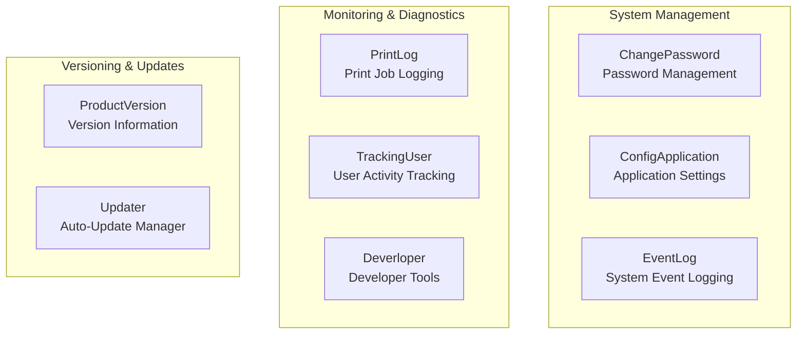

### Plugin Descriptions

| Plugin | Location | Purpose |
|--------|----------|---------|
| **ChangePassword** | `Inventec.Desktop.Plugins.ChangePassword` | Provides UI and logic for user password changes. Integrates with authentication backend. |
| **ConfigApplication** | `Inventec.Desktop.Plugins.ConfigApplication` | Manages application-level configuration settings. Provides UI for system administrators. |
| **Deverloper** | `Inventec.Desktop.Plugins.Deverloper` | Developer tools and diagnostics. Includes debugging utilities and system inspection features. |
| **EventLog** | `Inventec.Desktop.Plugins.EventLog` | System event logging viewer. Displays application events, errors, and audit trails. |
| **Plugin** | `Inventec.Desktop.Plugins.Plugin` | Base plugin infrastructure and utilities. |
| **PrintLog** | `Inventec.Desktop.Plugins.PrintLog` | Tracks and displays print job history. Useful for auditing print operations. |
| **ProductVersion** | `Inventec.Desktop.Plugins.ProductVersion` | Displays current application version information and build details. |
| **TrackingUser** | `Inventec.Desktop.Plugins.TrackingUser` | Tracks user activities and session information for audit purposes. |
| **Updater** | `Inventec.Desktop.Plugins.Updater` | Manages auto-update process. Coordinates with `Inventec.Aup.Client` for update downloads. |

**Sources:** [`.devin/wiki.json:263-267`](../../../.devin/wiki.json#L263-L267)

---

## Auto-Update System (Inventec.Aup.Client)

The `Inventec.Aup.Client` component (40 files) provides robust client-side automatic update capabilities. This system ensures HIS Desktop applications can be updated remotely without manual intervention.

### Update System Architecture

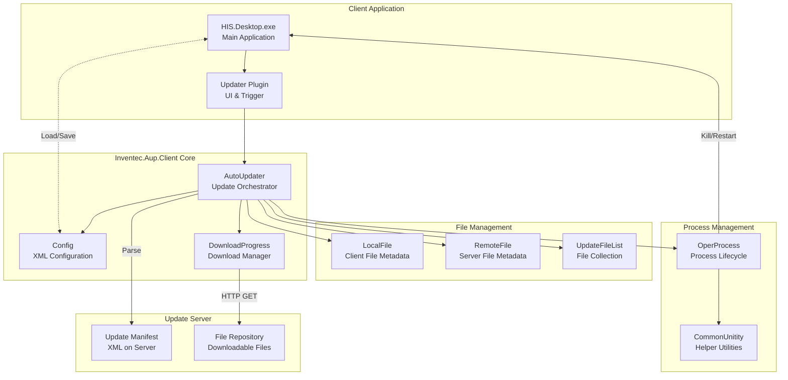

**Sources:** [`Common/Inventec.Aup.Client/Inventec.Aup.Client/AutoUpdater/AutoUpdateHelper/AutoUpdater.cs:1-450`](../../Common/Inventec.Aup.Client/Inventec.Aup.Client/AutoUpdater/AutoUpdateHelper/AutoUpdater.cs#L1-L450)

### Core Components

#### AutoUpdater Class

The `AutoUpdater` class [[`Common/Inventec.Aup.Client/Inventec.Aup.Client/AutoUpdater/AutoUpdateHelper/AutoUpdater.cs:48-449`](../../Common/Inventec.Aup.Client/Inventec.Aup.Client/AutoUpdater/AutoUpdateHelper/AutoUpdater.cs#L48-L449)](../../Common/Inventec.Aup.Client/Inventec.Aup.Client/AutoUpdater/AutoUpdateHelper/AutoUpdater.cs#L48-L449) is the main orchestrator implementing the `IAutoUpdater` interface [[`Common/Inventec.Aup.Client/Inventec.Aup.Client/AutoUpdater/AutoUpdateHelper/IAutoUpdater.cs:38-44`](../../Common/Inventec.Aup.Client/Inventec.Aup.Client/AutoUpdater/AutoUpdateHelper/IAutoUpdater.cs#L38-L44)](../../Common/Inventec.Aup.Client/Inventec.Aup.Client/AutoUpdater/AutoUpdateHelper/IAutoUpdater.cs#L38-L44).

**Key Fields:**
```
- config: Config                           // Configuration state
- listRemotFile: Dictionary<string, RemoteFile>  // Server file catalog
- downloadList: List<DownloadFileInfo>     // Files to download
- bNeedRestart: bool                       // Restart flag
- postProcess: string                      // Post-update executable
```

**Constructor Signature:**
[[`Common/Inventec.Aup.Client/Inventec.Aup.Client/AutoUpdater/AutoUpdateHelper/AutoUpdater.cs:68-86`](../../Common/Inventec.Aup.Client/Inventec.Aup.Client/AutoUpdater/AutoUpdateHelper/AutoUpdater.cs#L68-L86)](../../Common/Inventec.Aup.Client/Inventec.Aup.Client/AutoUpdater/AutoUpdateHelper/AutoUpdater.cs#L68-L86)
```
AutoUpdater(string cfgAupUri, string cfgServerConfigUrl, 
            string preThreadName, string exePath, string preCmd)
```

#### Config Class

The `Config` class [[`Common/Inventec.Aup.Client/Inventec.Aup.Client/AutoUpdater/AutoUpdateHelper/Config.cs:41-123`](../../Common/Inventec.Aup.Client/Inventec.Aup.Client/AutoUpdater/AutoUpdateHelper/Config.cs#L41-L123)](../../Common/Inventec.Aup.Client/Inventec.Aup.Client/AutoUpdater/AutoUpdateHelper/Config.cs#L41-L123) manages update configuration using XML serialization.

**Configuration Properties:**

| Property | Type | Description |
|----------|------|-------------|
| `Enabled` | `bool` | Master enable/disable flag for updates |
| `ServerUrl` | `string` | Update server XML manifest URL |
| `UserName` | `string` | Authentication username (if required) |
| `PassWord` | `string` | Authentication password (if required) |
| `TryTimes` | `string` | Number of retry attempts for failed downloads |
| `UpdateFileList` | `UpdateFileList` | Collection of tracked local files |

**Methods:**
- `LoadConfig(string file)`: Deserializes configuration from XML [[`Common/Inventec.Aup.Client/Inventec.Aup.Client/AutoUpdater/AutoUpdateHelper/Config.cs:87-103`](../../Common/Inventec.Aup.Client/Inventec.Aup.Client/AutoUpdater/AutoUpdateHelper/Config.cs#L87-L103)](../../Common/Inventec.Aup.Client/Inventec.Aup.Client/AutoUpdater/AutoUpdateHelper/Config.cs#L87-L103)
- `SaveConfig(string file)`: Serializes configuration to XML [[`Common/Inventec.Aup.Client/Inventec.Aup.Client/AutoUpdater/AutoUpdateHelper/Config.cs:105-111`](../../Common/Inventec.Aup.Client/Inventec.Aup.Client/AutoUpdater/AutoUpdateHelper/Config.cs#L105-L111)](../../Common/Inventec.Aup.Client/Inventec.Aup.Client/AutoUpdater/AutoUpdateHelper/Config.cs#L105-L111)
- `GetFileHash(string filePath)`: Computes file hash for integrity checking [[`Common/Inventec.Aup.Client/Inventec.Aup.Client/AutoUpdater/AutoUpdateHelper/Config.cs:113-120`](../../Common/Inventec.Aup.Client/Inventec.Aup.Client/AutoUpdater/AutoUpdateHelper/Config.cs#L113-L120)](../../Common/Inventec.Aup.Client/Inventec.Aup.Client/AutoUpdater/AutoUpdateHelper/Config.cs#L113-L120)

#### Update File Tracking

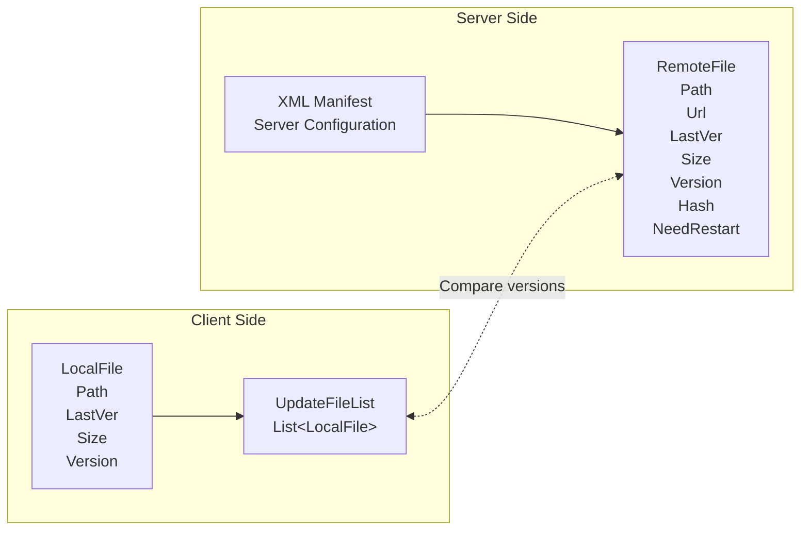

The `UpdateFileList` class [[`Common/Inventec.Aup.Client/Inventec.Aup.Client/AutoUpdater/AutoUpdateHelper/UpdateFileList.cs:37-41`](../../Common/Inventec.Aup.Client/Inventec.Aup.Client/AutoUpdater/AutoUpdateHelper/UpdateFileList.cs#L37-L41)](../../Common/Inventec.Aup.Client/Inventec.Aup.Client/AutoUpdater/AutoUpdateHelper/UpdateFileList.cs#L37-L41) is a simple typed collection:
```csharp
public class UpdateFileList : List<LocalFile>
```

**Sources:** [`Common/Inventec.Aup.Client/Inventec.Aup.Client/AutoUpdater/AutoUpdateHelper/Config.cs:1-124`](../../Common/Inventec.Aup.Client/Inventec.Aup.Client/AutoUpdater/AutoUpdateHelper/Config.cs#L1-L124, [`Common/Inventec.Aup.Client/Inventec.Aup.Client/AutoUpdater/AutoUpdateHelper/UpdateFileList.cs:1-41`](../../Common/Inventec.Aup.Client/Inventec.Aup.Client/AutoUpdater/AutoUpdateHelper/UpdateFileList.cs#L1-L41)

### Update Flow

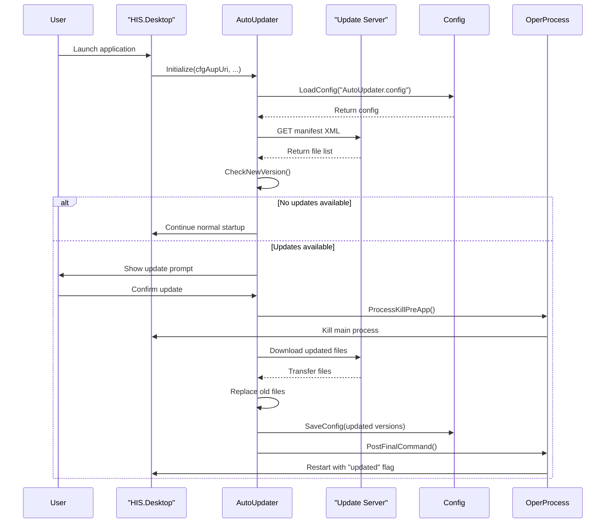

**Sources:** [`Common/Inventec.Aup.Client/Inventec.Aup.Client/AutoUpdater/AutoUpdateHelper/AutoUpdater.cs:90-245`](../../Common/Inventec.Aup.Client/Inventec.Aup.Client/AutoUpdater/AutoUpdateHelper/AutoUpdater.cs#L90-L245)

### Version Checking Algorithm

The version checking logic [[`Common/Inventec.Aup.Client/Inventec.Aup.Client/AutoUpdater/AutoUpdateHelper/AutoUpdater.cs:90-137`](../../Common/Inventec.Aup.Client/Inventec.Aup.Client/AutoUpdater/AutoUpdateHelper/AutoUpdater.cs#L90-L137)](../../Common/Inventec.Aup.Client/Inventec.Aup.Client/AutoUpdater/AutoUpdateHelper/AutoUpdater.cs#L90-L137) compares local and remote files:

1. **Parse Remote XML**: Downloads and parses server manifest to build `Dictionary<string, RemoteFile>`
2. **Compare Versions**: For each local file in `config.UpdateFileList`:
   - If file exists on server with different version: add to `downloadList`
   - Update local metadata with server version information
   - Set `bNeedRestart = true` if file requires restart
3. **Identify New Files**: Files in remote manifest but not in local list are added to `downloadList`
4. **Return Result**: Returns `true` if any files need updating

**Version Comparison:**
[[`Common/Inventec.Aup.Client/Inventec.Aup.Client/AutoUpdater/AutoUpdateHelper/AutoUpdater.cs:116-129`](../../Common/Inventec.Aup.Client/Inventec.Aup.Client/AutoUpdater/AutoUpdateHelper/AutoUpdater.cs#L116-L129)](../../Common/Inventec.Aup.Client/Inventec.Aup.Client/AutoUpdater/AutoUpdateHelper/AutoUpdater.cs#L116-L129)
```csharp
string v1 = rf.Verison;    // Remote version (GUID or semantic version)
string v2 = file.Version;   // Local version
if (v1 != v2) {
    downloadList.Add(new DownloadFileInfo(...));
    file.Version = rf.Verison;  // Update local tracking
    if (rf.NeedRestart) bNeedRestart = true;
}
```

**Sources:** [`Common/Inventec.Aup.Client/Inventec.Aup.Client/AutoUpdater/AutoUpdateHelper/AutoUpdater.cs:90-137`](../../Common/Inventec.Aup.Client/Inventec.Aup.Client/AutoUpdater/AutoUpdateHelper/AutoUpdater.cs#L90-L137)

### First-Run Synchronization

When the client runs for the first time without an existing configuration file, the system synchronizes with the server:

[[`Common/Inventec.Aup.Client/Inventec.Aup.Client/AutoUpdater/AutoUpdateHelper/AutoUpdater.cs:139-203`](../../Common/Inventec.Aup.Client/Inventec.Aup.Client/AutoUpdater/AutoUpdateHelper/AutoUpdater.cs#L139-L203)](../../Common/Inventec.Aup.Client/Inventec.Aup.Client/AutoUpdater/AutoUpdateHelper/AutoUpdater.cs#L139-L203)

The `syncFileClientAndServer()` method:
1. Recursively scans the client installation directory using `PopuAllDirectory()`
2. Excludes system paths: `\Logs\`, `\.svn\`, `\~$`
3. For each file, extracts metadata and compares with server manifest
4. Generates `LocalFile` entries with version information
5. Populates `config.UpdateFileList` with initial state

**Hash Verification:**
[[`Common/Inventec.Aup.Client/Inventec.Aup.Client/AutoUpdater/AutoUpdateHelper/AutoUpdater.cs:192-195`](../../Common/Inventec.Aup.Client/Inventec.Aup.Client/AutoUpdater/AutoUpdateHelper/AutoUpdater.cs#L192-L195)](../../Common/Inventec.Aup.Client/Inventec.Aup.Client/AutoUpdater/AutoUpdateHelper/AutoUpdater.cs#L192-L195)
```csharp
var curFileHash = Config.GetFileHash(f.FullName);
if (f.Length.ToString() != size.ToString() || curFileHash != hashCode) {
    localFile.Version = Guid.NewGuid().ToString();  // Force update
}
```

**Sources:** [`Common/Inventec.Aup.Client/Inventec.Aup.Client/AutoUpdater/AutoUpdateHelper/AutoUpdater.cs:139-203`](../../Common/Inventec.Aup.Client/Inventec.Aup.Client/AutoUpdater/AutoUpdateHelper/AutoUpdater.cs#L139-L203)

### Process Management

The `OperProcess` class [[`Common/Inventec.Aup.Client/Inventec.Aup.Client/AutoUpdater/OperProcess.cs:29-88`](../../Common/Inventec.Aup.Client/Inventec.Aup.Client/AutoUpdater/OperProcess.cs#L29-L88)](../../Common/Inventec.Aup.Client/Inventec.Aup.Client/AutoUpdater/OperProcess.cs#L29-L88) handles application lifecycle during updates:

**Key Methods:**

| Method | Purpose |
|--------|---------|
| `InitUpdateEnvironment()` | Closes main application before update [[`Common/Inventec.Aup.Client/Inventec.Aup.Client/AutoUpdater/OperProcess.cs:32-38`](../../Common/Inventec.Aup.Client/Inventec.Aup.Client/AutoUpdater/OperProcess.cs#L32-L38)](../../Common/Inventec.Aup.Client/Inventec.Aup.Client/AutoUpdater/OperProcess.cs#L32-L38) |
| `StartProcess()` | Restarts application after update [[`Common/Inventec.Aup.Client/Inventec.Aup.Client/AutoUpdater/OperProcess.cs:43-52`](../../Common/Inventec.Aup.Client/Inventec.Aup.Client/AutoUpdater/OperProcess.cs#L43-L52)](../../Common/Inventec.Aup.Client/Inventec.Aup.Client/AutoUpdater/OperProcess.cs#L43-L52) |
| `CloseExe(params string[])` | Kills specified process by name [[`Common/Inventec.Aup.Client/Inventec.Aup.Client/AutoUpdater/OperProcess.cs:71-79`](../../Common/Inventec.Aup.Client/Inventec.Aup.Client/AutoUpdater/OperProcess.cs#L71-L79)](../../Common/Inventec.Aup.Client/Inventec.Aup.Client/AutoUpdater/OperProcess.cs#L71-L79) |
| `IfExist(string)` | Checks if process is running [[`Common/Inventec.Aup.Client/Inventec.Aup.Client/AutoUpdater/OperProcess.cs:81-85`](../../Common/Inventec.Aup.Client/Inventec.Aup.Client/AutoUpdater/OperProcess.cs#L81-L85)](../../Common/Inventec.Aup.Client/Inventec.Aup.Client/AutoUpdater/OperProcess.cs#L81-L85) |

**ProcessKillPreApp Implementation:**

The updater terminates related processes before applying updates [[`Common/Inventec.Aup.Client/Inventec.Aup.Client/AutoUpdater/AutoUpdateHelper/AutoUpdater.cs:277-344`](../../Common/Inventec.Aup.Client/Inventec.Aup.Client/AutoUpdater/AutoUpdateHelper/AutoUpdater.cs#L277-L344)](../../Common/Inventec.Aup.Client/Inventec.Aup.Client/AutoUpdater/AutoUpdateHelper/AutoUpdater.cs#L277-L344):

```csharp
void ProcessKillPreApp()
{
    // Kill HLS WCF service
    var processHLS = Process.GetProcesses()
        .Where(o => o.ProcessName.Contains("HLS.WCFClient")).ToList();
    
    // Kill EMR signature processor
    var processSignService = Process.GetProcesses()
        .Where(o => o.ProcessName == "EMR.SignProcessor" ...).ToList();
    
    // Kill notification service
    var processNotify = Process.GetProcesses()
        .Where(o => o.ProcessName.Contains("HIS.Desktop.Notify")).ToList();
    
    // Kill main application
    var processPreApp = Process.GetProcesses()
        .Where(o => o.ProcessName.Equals(preThreadName) ...).ToList();
        
    // Terminate all processes
    foreach(var process in [all processes]) {
        process.Kill();
    }
}
```

**Sources:** [`Common/Inventec.Aup.Client/Inventec.Aup.Client/AutoUpdater/OperProcess.cs:1-88`](../../Common/Inventec.Aup.Client/Inventec.Aup.Client/AutoUpdater/OperProcess.cs#L1-L88, [`Common/Inventec.Aup.Client/Inventec.Aup.Client/AutoUpdater/AutoUpdateHelper/AutoUpdater.cs:277-344`](../../Common/Inventec.Aup.Client/Inventec.Aup.Client/AutoUpdater/AutoUpdateHelper/AutoUpdater.cs#L277-L344)

### File Path Handling

The `CommonUnitity` class [[`Common/Inventec.Aup.Client/Inventec.Aup.Client/AutoUpdater/AutoUpdateHelper/CommonUnitity.cs:41-145`](../../Common/Inventec.Aup.Client/Inventec.Aup.Client/AutoUpdater/AutoUpdateHelper/CommonUnitity.cs#L41-L145)](../../Common/Inventec.Aup.Client/Inventec.Aup.Client/AutoUpdater/AutoUpdateHelper/CommonUnitity.cs#L41-L145) provides utilities for file path manipulation:

**SystemBinUrl Static Field:**
[[`Common/Inventec.Aup.Client/Inventec.Aup.Client/AutoUpdater/AutoUpdateHelper/CommonUnitity.cs:43`](../../Common/Inventec.Aup.Client/Inventec.Aup.Client/AutoUpdater/AutoUpdateHelper/CommonUnitity.cs#L43)](../../Common/Inventec.Aup.Client/Inventec.Aup.Client/AutoUpdater/AutoUpdateHelper/CommonUnitity.cs#L43)
```csharp
public static string SystemBinUrl = AppDomain.CurrentDomain.BaseDirectory;
```

**GetFolderUrl Method:**
[[`Common/Inventec.Aup.Client/Inventec.Aup.Client/AutoUpdater/AutoUpdateHelper/CommonUnitity.cs:82-143`](../../Common/Inventec.Aup.Client/Inventec.Aup.Client/AutoUpdater/AutoUpdateHelper/CommonUnitity.cs#L82-L143)](../../Common/Inventec.Aup.Client/Inventec.Aup.Client/AutoUpdater/AutoUpdateHelper/CommonUnitity.cs#L82-L143)

Extracts the relative folder path from a download URL, handling platform-specific subdirectories (`x86`, `x64`, `Aup`):

```csharp
public static string GetFolderUrl(DownloadFileInfo file, 
                                   string tempFolderUrl = "", 
                                   string postProcess = "")
{
    // Parse URL to extract folder structure
    // Skip platform-specific prefixes (x86/x64 or Aup)
    // Create temporary folders as needed
    // Return relative folder path
}
```

**Sources:** [`Common/Inventec.Aup.Client/Inventec.Aup.Client/AutoUpdater/AutoUpdateHelper/CommonUnitity.cs:1-145`](../../Common/Inventec.Aup.Client/Inventec.Aup.Client/AutoUpdater/AutoUpdateHelper/CommonUnitity.cs#L1-L145)

### Configuration Constants

The `ConstFile` class [[`Common/Inventec.Aup.Client/Inventec.Aup.Client/AutoUpdater/AutoUpdateHelper/ConstFile.cs:38-51`](../../Common/Inventec.Aup.Client/Inventec.Aup.Client/AutoUpdater/AutoUpdateHelper/ConstFile.cs#L38-L51)](../../Common/Inventec.Aup.Client/Inventec.Aup.Client/AutoUpdater/AutoUpdateHelper/ConstFile.cs#L38-L51) defines system-wide constants:

| Constant | Value | Purpose |
|----------|-------|---------|
| `TEMPFOLDERNAME` | `"TempFolderBak"` | Temporary backup folder name |
| `CONFIGFILEKEY` | `"config_"` | Configuration file prefix |
| `CONFIGFILE` | `"config"` | Configuration file extension |
| `FILENAME` | `"AutoUpdater.config"` | Standard config filename |
| `AUP_FILENAME` | `"AUPAutoUpdater.config"` | AUP-specific config filename |
| `ROOLBACKFILE` | `"WEBSiteUpdate.exe"` | Rollback executable name |
| `MESSAGETITLE` | `"Cập nhật tự động"` | Update dialog title (Vietnamese) |
| `CANCELORNOT` | `"Bạn có muốn hủy cập nhật hay không"` | Cancel confirmation message |
| `APPLYTHEUPDATE` | `"Chương trình cần được khởi động lại..."` | Restart prompt message |
| `NOTNETWORK` | `"Cập nhật không thành công..."` | Network error message |

**Sources:** [`Common/Inventec.Aup.Client/Inventec.Aup.Client/AutoUpdater/AutoUpdateHelper/ConstFile.cs:1-51`](../../Common/Inventec.Aup.Client/Inventec.Aup.Client/AutoUpdater/AutoUpdateHelper/ConstFile.cs#L1-L51)

### Rollback Mechanism

The updater supports rollback in case of update failure [[`Common/Inventec.Aup.Client/Inventec.Aup.Client/AutoUpdater/AutoUpdateHelper/AutoUpdater.cs:247-275`](../../Common/Inventec.Aup.Client/Inventec.Aup.Client/AutoUpdater/AutoUpdateHelper/AutoUpdater.cs#L247-L275)](../../Common/Inventec.Aup.Client/Inventec.Aup.Client/AutoUpdater/AutoUpdateHelper/AutoUpdater.cs#L247-L275):

```csharp
public void RollBack()
{
    foreach (DownloadFileInfo file in downloadFileListTemp)
    {
        // Construct old file path (*.old backup)
        string oldPath = Path.Combine(SystemBinUrl, file.FileName);
        if (oldPath.EndsWith("_")) 
            oldPath = oldPath.Substring(0, oldPath.Length - 1);
            
        // Restore from backup
        MoveFolderToOld(oldPath + ".old", oldPath);
    }
}
```

The system creates `.old` backup files before applying updates, allowing recovery if the update process fails.

**Sources:** [`Common/Inventec.Aup.Client/Inventec.Aup.Client/AutoUpdater/AutoUpdateHelper/AutoUpdater.cs:247-275`](../../Common/Inventec.Aup.Client/Inventec.Aup.Client/AutoUpdater/AutoUpdateHelper/AutoUpdater.cs#L247-L275)

---

## Integration with HIS Desktop

### Plugin Loading in HIS Application

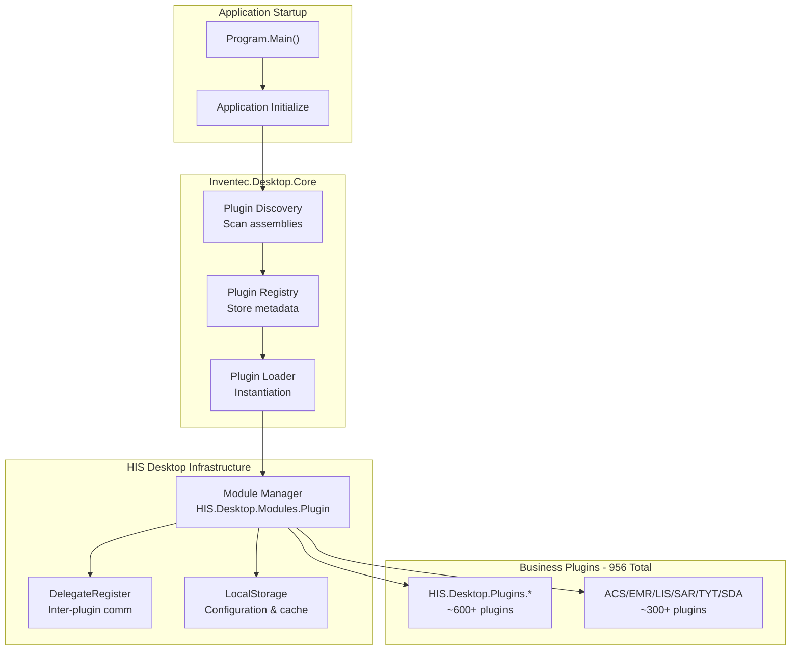

The integration sequence:

1. **Startup**: `HIS.Desktop.exe` initializes the Inventec.Desktop.Core framework
2. **Discovery**: Core scans plugin directories (`HIS/Plugins/`) for plugin assemblies
3. **Registration**: Discovered plugins register with module manager
4. **Lazy Loading**: Plugins instantiate on-demand when user navigates to features
5. **Communication**: Plugins communicate via `DelegateRegister` and `PubSub` patterns

**Sources:** [`.devin/wiki.json:61-67`](../../../.devin/wiki.json#L61-L67, [`.devin/wiki.json:263-267`](../../../.devin/wiki.json#L263-L267)

### Configuration File Locations

| Configuration File | Location | Purpose |
|--------------------|----------|---------|
| [[`AutoUpdater.config`](../../AutoUpdater.config)](../../AutoUpdater.config) | [`{AppDirectory}/AutoUpdater.config`](../../{AppDirectory}/AutoUpdater.config) | Main application update configuration |
| [[`AUPAutoUpdater.config`](../../AUPAutoUpdater.config)](../../AUPAutoUpdater.config) | [`{AppDirectory}/AUPAutoUpdater.config`](../../{AppDirectory}/AUPAutoUpdater.config) | AUP updater self-update configuration |

The updater determines which configuration to use based on the `preThreadName` parameter:
- If `preThreadName` is specified: uses [[`AutoUpdater.config`](../../AutoUpdater.config)](../../AutoUpdater.config) (updating main application)
- If empty: uses [[`AUPAutoUpdater.config`](../../AUPAutoUpdater.config)](../../AUPAutoUpdater.config) (self-updating the updater)

[[`Common/Inventec.Aup.Client/Inventec.Aup.Client/AutoUpdater/AutoUpdateHelper/AutoUpdater.cs:81`](../../Common/Inventec.Aup.Client/Inventec.Aup.Client/AutoUpdater/AutoUpdateHelper/AutoUpdater.cs#L81)](../../Common/Inventec.Aup.Client/Inventec.Aup.Client/AutoUpdater/AutoUpdateHelper/AutoUpdater.cs#L81)

**Sources:** [`Common/Inventec.Aup.Client/Inventec.Aup.Client/AutoUpdater/AutoUpdateHelper/AutoUpdater.cs:68-86`](../../Common/Inventec.Aup.Client/Inventec.Aup.Client/AutoUpdater/AutoUpdateHelper/AutoUpdater.cs#L68-L86, [`Common/Inventec.Aup.Client/Inventec.Aup.Client/AutoUpdater/AutoUpdateHelper/ConstFile.cs:43-44`](../../Common/Inventec.Aup.Client/Inventec.Aup.Client/AutoUpdater/AutoUpdateHelper/ConstFile.cs#L43-L44)

---

## Additional Framework Components

Beyond the core plugin engine and update system, the Inventec Desktop Framework includes:

### Inventec.Desktop.CustomControl

Contains custom WinForms controls (26 files) used across the desktop application. These provide consistent UI elements with HIS-specific styling and behavior.

### Inventec.Desktop.ExportXML

Provides XML export functionality (30 files) for generating structured data exports from the HIS system. Used by plugins that need to export data in XML format for interoperability.

### Inventec.Desktop.MenuButton

Implements a specialized menu button control for the HIS Desktop toolbar, providing dropdown menu functionality with plugin activation.

**Sources:** [`.devin/wiki.json:260-267`](../../../.devin/wiki.json#L260-L267)

---

## Summary

The Inventec Desktop Framework provides essential infrastructure for the HIS Desktop application:

- **Plugin Architecture**: 208-file core engine enables 956+ business plugins
- **Base Plugins**: 8 foundational plugins provide system management, monitoring, and update capabilities
- **Auto-Update System**: Robust 40-file update client ensures applications stay current without manual intervention
- **Process Management**: Handles application lifecycle during updates with graceful shutdown and restart
- **Version Tracking**: XML-based configuration tracks file versions and enables rollback
- **Configuration Persistence**: XML serialization maintains update state across sessions

This framework serves as the foundation for the entire plugin-based architecture documented in [Plugin System Architecture](../01-architecture/plugin-system/01-overview.md), enabling the modular design of the HIS system.

# Inventec UC Shared Controls


## Purpose and Scope

`Common/Inventec.UC/` is the foundational user control library containing 1060 files of reusable UI components that form the base layer for all UI controls in the HisNguonMo system. This library provides low-level, generic controls that are domain-agnostic and used throughout the entire application stack.

**Scope**: This page documents the base `Inventec.UC` library located in `Common/Inventec.UC/`. For domain-specific hospital business controls (131 components like `HIS.UC.FormType`, `HIS.UC.PatientSelect`), see [UC Components Library](../03-technical-specs/uc-controls/form-type-controls.md). For the overall desktop framework that manages plugin lifecycle, see [Inventec Desktop Framework](../03-technical-specs/common-libraries/libraries.md#inventec-desktop).

**Key Distinction**: 
- `Inventec.UC` (this page): Generic, reusable UI controls - 1060 files
- `HIS.UC.*` (page [1.3](../03-technical-specs/uc-controls/form-type-controls.md)): Domain-specific hospital business controls - 131 components
- `Inventec.Desktop.Core`: Plugin discovery and lifecycle management

Sources: [[`.devin/wiki.json:1-295`](../../../.devin/wiki.json#L1-L295)](../../../.devin/wiki.json#L1-L295)

---

## Architecture Overview

### Component Hierarchy

The UC library implements a two-tier architecture where `Inventec.UC` provides the foundation layer and `HIS.UC.*` components build domain-specific functionality on top of it.

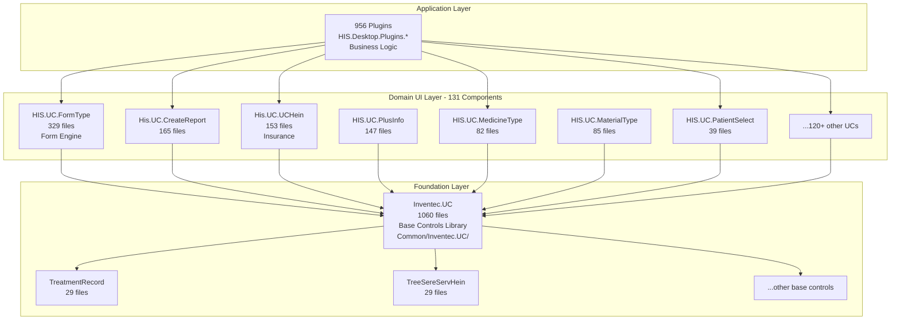

**Architecture Pattern**: The library follows a layered dependency model where:
1. **Foundation Layer** (`Inventec.UC`): Provides generic, reusable controls with no business logic
2. **Domain Layer** (`HIS.UC.*`): Extends foundation controls with hospital-specific behavior
3. **Application Layer** (Plugins): Composes domain controls into complete business workflows

Sources: [[`.devin/wiki.json:199-246`](../../../.devin/wiki.json#L199-L246)](../../../.devin/wiki.json#L199-L246)

---

### Dependency Flow

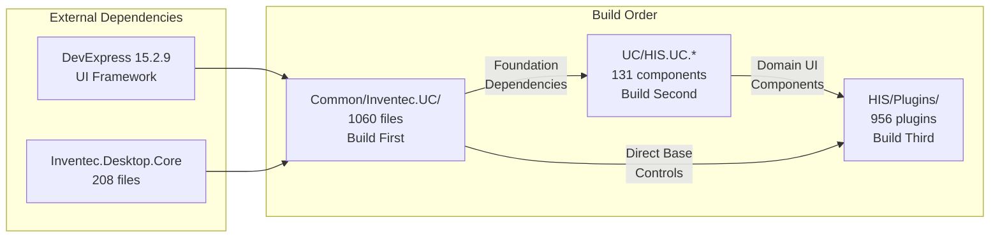

**Key Characteristics**:
- **Build Order**: `Inventec.UC` must be compiled before any `HIS.UC.*` projects
- **No Business Logic**: Contains only UI rendering and interaction patterns
- **Framework Integration**: Wraps and extends DevExpress controls with custom behavior
- **Reusability**: Single implementation used by all 131 domain-specific UCs

Sources: [[`.devin/wiki.json:1-23`](../../../.devin/wiki.json#L1-L23)](../../../.devin/wiki.json#L1-L23), [[`.devin/wiki.json:241-247`](../../../.devin/wiki.json#L241-L247)](../../../.devin/wiki.json#L241-L247)

---

## Core Component Categories

### Known Major Components

Based on the architectural documentation, `Inventec.UC` includes these documented components:

| Component | Files | Purpose |
|-----------|-------|---------|
| `TreatmentRecord` | 29 | Treatment record display and management controls |
| `TreeSereServHein` | 29 | Tree view for service and insurance (Hein) data hierarchies |

### Component Categories by Functionality

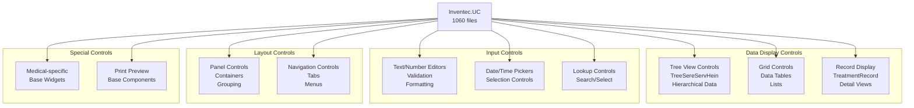

**Control Categories**:
1. **Data Display**: Grid, tree, and record controls for presenting data
2. **Input Controls**: Editors, pickers, and selection controls with validation
3. **Layout Controls**: Panels, containers, and navigation components
4. **Special Controls**: Domain-agnostic medical UI patterns and print components

Sources: [[`.devin/wiki.json:270-273`](../../../.devin/wiki.json#L270-L273)](../../../.devin/wiki.json#L270-L273)

---

## Integration with HIS.UC Components

### Control Extension Pattern

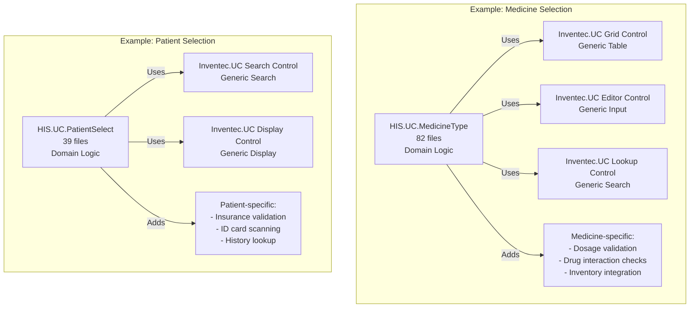

**Extension Pattern**:
1. **Base Control**: `Inventec.UC` provides generic rendering and interaction
2. **Domain Logic**: `HIS.UC.*` components add business rules and validation
3. **Data Binding**: Domain components handle API integration and caching
4. **Event Handling**: Base controls provide events, domain components define handlers

Sources: [[`.devin/wiki.json:199-238`](../../../.devin/wiki.json#L199-L238)](../../../.devin/wiki.json#L199-L238)

---

## Usage Patterns in Plugins

### Control Instantiation Flow

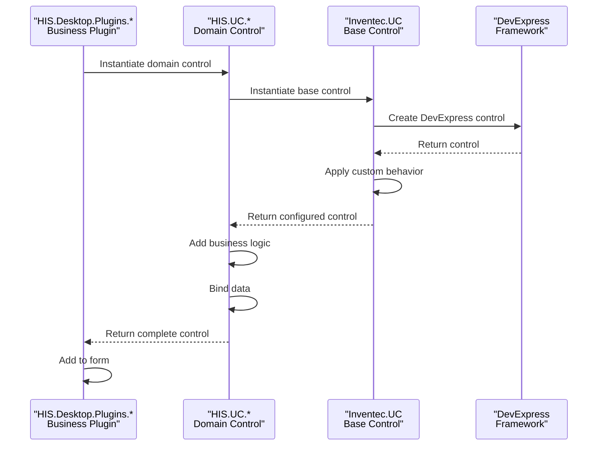

**Instantiation Steps**:
1. Plugin requests domain-specific control (e.g., `HIS.UC.MedicineType`)
2. Domain control instantiates required base controls from `Inventec.UC`
3. Base controls wrap DevExpress controls with custom behavior
4. Domain control adds validation, business rules, and event handlers
5. Plugin receives fully configured control for display

Sources: [[`.devin/wiki.json:1-23`](../../../.devin/wiki.json#L1-L23)](../../../.devin/wiki.json#L1-L23), [[`.devin/wiki.json:199-207`](../../../.devin/wiki.json#L199-L207)](../../../.devin/wiki.json#L199-L207)

---

## Component Structure and Organization

### File Organization Pattern

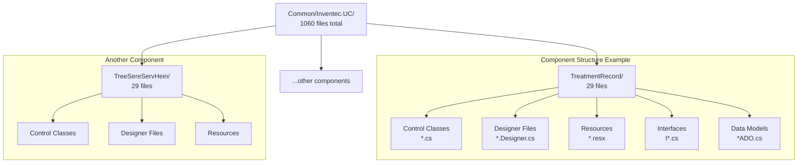

**Typical Component Structure**:
- **Control Classes** (`.cs`): Main control implementation
- **Designer Files** ([[`.Designer.cs`](../../.Designer.cs)](../../.Designer.cs)): Auto-generated UI layout code
- **Resources** (`.resx`): Localization strings, images, icons
- **Interfaces** ([`I*.cs`](../../I*.cs)): Contract definitions for extensibility
- **Data Models** ([`*ADO.cs`](../../*ADO.cs)): Data transfer objects for the control

Sources: [[`.devin/wiki.json:270-273`](../../../.devin/wiki.json#L270-L273)](../../../.devin/wiki.json#L270-L273)

---

## Integration with Desktop Framework

### Framework Dependencies

```mermaid
graph TB
    subgraph "Inventec.UC Dependencies"
        InventecUC["Inventec.UC<br/>1060 files"]
    end
    
    subgraph "Required Frameworks"
        DesktopCore["Inventec.Desktop.Core<br/>208 files<br/>Plugin Infrastructure"]
        DesktopCommon["Inventec.Desktop.Common<br/>Shared Types"]
        CustomControl["Inventec.Desktop.CustomControl<br/>26 files<br/>Enhanced Controls"]
    end
    
    subgraph "External Dependencies"
        DevExpress["DevExpress 15.2.9<br/>WinForms Controls"]
        DotNet["NET Framework 4.5<br/>Base Controls"]
    end
    
    subgraph "Common Utilities"
        Logging["Inventec.Common.Logging<br/>Diagnostic Logging"]
        WebApiClient["Inventec.Common.WebApiClient<br/>API Communication"]
    end
    
    InventecUC -->|"Extends"| CustomControl
    InventecUC -->|"Uses"| DesktopCommon
    InventecUC -->|"Integrates"| DesktopCore
    
    CustomControl -->|"Wraps"| DevExpress
    CustomControl -->|"Extends"| DotNet
    
    InventecUC -.->|"Optional"| Logging
    InventecUC -.->|"For Data-bound Controls"| WebApiClient
```

**Framework Integration**:
- **Desktop Core**: Plugin-aware controls that respond to application lifecycle events
- **Custom Controls**: Enhanced DevExpress controls with additional functionality
- **Common Utilities**: Optional integration for logging and data binding

Sources: [[`.devin/wiki.json:241-273`](../../../.devin/wiki.json#L241-L273)](../../../.devin/wiki.json#L241-L273)

---

## Control Lifecycle and Events

### Standard Control Lifecycle

```mermaid
stateDiagram-v2
    [*] --> Construction: Plugin instantiates control
    Construction --> Initialization: Control constructor
    Initialization --> Configuration: Set properties
    Configuration --> DataBinding: Bind data source
    DataBinding --> Rendering: Render to screen
    Rendering --> Interactive: User interaction
    Interactive --> DataUpdate: Data changes
    DataUpdate --> Validation: Validate input
    Validation --> Interactive: Valid
    Validation --> Error: Invalid
    Error --> Interactive: Correction
    Interactive --> Cleanup: Plugin closes
    Cleanup --> [*]
    
    note right of Construction
        Base control from Inventec.UC
        instantiated
    end note
    
    note right of Configuration
        Domain-specific settings
        applied by HIS.UC.*
    end note
    
    note right of Validation
        Business rules enforced
        by domain control
    end note
```

**Lifecycle Stages**:
1. **Construction**: `Inventec.UC` base control instantiated
2. **Initialization**: Control resources loaded, event handlers attached
3. **Configuration**: Domain-specific properties set by `HIS.UC.*` wrapper
4. **Data Binding**: Connected to data sources (API, cache, or local)
5. **Rendering**: Displayed in plugin form
6. **Interactive**: Responds to user input with validation
7. **Cleanup**: Resources released when plugin closes

Sources: [[`.devin/wiki.json:1-23`](../../../.devin/wiki.json#L1-L23)](../../../.devin/wiki.json#L1-L23)

---

## Data Binding Patterns

### Control Data Flow

```mermaid
graph LR
    subgraph "Data Sources"
        API["HIS.Desktop.ApiConsumer<br/>REST API calls"]
        LocalStorage["HIS.Desktop.LocalStorage<br/>BackendData Cache"]
        Plugin["Plugin Local State"]
    end
    
    subgraph "Inventec.UC Control"
        DataSource["Control.DataSource<br/>Property"]
        BindingContext["BindingContext<br/>Change Tracking"]
        DisplayMember["DisplayMember<br/>Formatting"]
        ValueMember["ValueMember<br/>Selection"]
    end
    
    subgraph "Display"
        UI["Rendered UI<br/>User Interaction"]
    end
    
    API -->|"Fresh Data"| DataSource
    LocalStorage -->|"Cached Data"| DataSource
    Plugin -->|"Filtered Data"| DataSource
    
    DataSource --> BindingContext
    BindingContext --> DisplayMember
    BindingContext --> ValueMember
    
    DisplayMember --> UI
    ValueMember --> UI
    
    UI -->|"Selection Events"| BindingContext
    BindingContext -->|"Changed Data"| Plugin
```

**Data Binding Features**:
- **Multi-source Support**: Can bind to API, cache, or in-memory collections
- **Change Tracking**: Automatic detection of data modifications
- **Formatting**: Display and value member separation for complex types
- **Event Propagation**: Selection and change events bubble to parent controls

Sources: [[`.devin/wiki.json:1-23`](../../../.devin/wiki.json#L1-L23)](../../../.devin/wiki.json#L1-L23), [[`.devin/wiki.json:241-273`](../../../.devin/wiki.json#L241-L273)](../../../.devin/wiki.json#L241-L273)

---

## Relationship with Print System

### Print Control Integration

```mermaid
graph TB
    subgraph "Print Request Flow"
        Plugin["HIS.Desktop.Plugins.*<br/>Requests Print"]
        DomainUC["HIS.UC.*<br/>Prepares Display Data"]
        InventecUC["Inventec.UC<br/>Provides Print Preview"]
    end
    
    subgraph "MPS Print System"
        MPSProcessor["MPS.Processor.Mps000xxx<br/>Print Processor"]
        FlexCell["FlexCell 5.7.6.0<br/>Document Generation"]
    end
    
    subgraph "Inventec.Common Print"
        FlexCelPrint["Inventec.Common.FlexCelPrint<br/>38 files<br/>Print Utilities"]
        BarcodeLib["Inventec.Common.BarcodeLib<br/>32 files<br/>Barcode Generation"]
    end
    
    Plugin -->|"Print Command"| DomainUC
    DomainUC -->|"Display Data"| InventecUC
    InventecUC -->|"Print Preview"| FlexCelPrint
    FlexCelPrint -->|"Template"| MPSProcessor
    MPSProcessor -->|"Generate"| FlexCell
    BarcodeLib -->|"Barcode Data"| MPSProcessor
```

**Print Support**:
- **Print Preview Controls**: Base controls in `Inventec.UC` provide print preview functionality
- **Template Integration**: Works with MPS print processors for document generation
- **Barcode Support**: Integrates with `Inventec.Common.BarcodeLib` for barcode rendering
- **Export Functions**: Base controls support export to PDF, Excel, and other formats

Sources: [[`.devin/wiki.json:11-18`](../../../.devin/wiki.json#L11-L18)](../../../.devin/wiki.json#L11-L18), [[`.devin/wiki.json:180-198`](../../../.devin/wiki.json#L180-L198)](../../../.devin/wiki.json#L180-L198)

---

## Known Components Detail

### TreatmentRecord Component

**Purpose**: Provides base controls for displaying and managing treatment record information across multiple plugins.

**Files**: 29 files in `Common/Inventec.UC/TreatmentRecord/`

**Used By**:
- `HIS.UC.TreatmentFinish` (94 files) - Treatment completion workflows
- `HIS.UC.ExamTreatmentFinish` (103 files) - Examination completion
- Treatment-related plugins across the system

**Key Features**:
- Treatment history display
- Timeline visualization
- Record navigation
- Print formatting support

Sources: [[`.devin/wiki.json:270-273`](../../../.devin/wiki.json#L270-L273)](../../../.devin/wiki.json#L270-L273)

---

### TreeSereServHein Component

**Purpose**: Provides tree view controls for displaying hierarchical service and insurance (Hein) data relationships.

**Files**: 29 files in `Common/Inventec.UC/TreeSereServHein/`

**Used By**:
- `His.UC.UCHein` (153 files) - Insurance workflow controls
- Service-related UCs
- Billing and transaction plugins

**Key Features**:
- Hierarchical data display
- Service group organization
- Insurance coverage visualization
- Selection and filtering

Sources: [[`.devin/wiki.json:270-273`](../../../.devin/wiki.json#L270-L273)](../../../.devin/wiki.json#L270-L273)

---

## Development Guidelines

### Creating New Base Controls

When developing new controls for `Inventec.UC`, follow these principles:

**Design Principles**:
1. **Domain-Agnostic**: No hospital-specific business logic
2. **Reusable**: Design for multiple use cases across different plugins
3. **Extensible**: Provide virtual methods and events for customization
4. **Consistent**: Follow existing control patterns and naming conventions
5. **Documented**: Include XML documentation for public APIs

**File Structure**:
```
Inventec.UC/
└── NewControl/
    ├── NewControl.cs                    // Main control class
    ├── NewControl.Designer.cs           // Generated UI layout
    ├── NewControl.resx                  // Resources
    ├── INewControl.cs                   // Public interface
    ├── NewControlADO.cs                 // Data model
    ├── NewControlValidation.cs          // Validation logic
    └── NewControlEvents.cs              // Event definitions
```

**Integration Steps**:
1. Implement base control with generic behavior
2. Test with multiple data sources and scenarios
3. Document public API and extension points
4. Create sample usage in documentation
5. Update build configuration to include in Common/Inventec.UC.sln

Sources: [[`.devin/wiki.json:1-295`](../../../.devin/wiki.json#L1-L295)](../../../.devin/wiki.json#L1-L295)

---

## Build Configuration

### Compilation Order

```mermaid
graph TB
    subgraph "Build Sequence"
        Step1["1. Build Common/Inventec.UC.sln<br/>1060 files<br/>Foundation Controls"]
        Step2["2. Build UC/HIS.UC.sln<br/>131 components<br/>Domain Controls"]
        Step3["3. Build HIS/HIS.Desktop.sln<br/>956 plugins<br/>Application"]
    end
    
    subgraph "Dependencies"
        DevExp["DevExpress 15.2.9<br/>Pre-installed"]
        DotNet["NET Framework 4.5<br/>Pre-installed"]
        InventecDesktop["Inventec.Desktop.Core<br/>Pre-built"]
    end
    
    DevExp --> Step1
    DotNet --> Step1
    InventecDesktop --> Step1
    
    Step1 -->|"Output DLL"| Step2
    Step2 -->|"Output DLLs"| Step3
```

**Build Requirements**:
- **.NET Framework 4.5** or higher
- **DevExpress 15.2.9** with valid license
- **MSBuild** or Visual Studio 2013+
- **Inventec.Desktop.Core** pre-compiled

**Output Location**: Compiled assemblies placed in `Common/Inventec.UC/bin/Release/` and referenced by downstream projects.

Sources: [[`.devin/wiki.json:284-293`](../../../.devin/wiki.json#L284-L293)](../../../.devin/wiki.json#L284-L293)

---

## Summary

`Inventec.UC` is the largest common component in the HisNguonMo system with 1060 files, providing the foundational layer of reusable UI controls. It sits between the DevExpress framework and domain-specific `HIS.UC.*` components, offering generic, extensible controls that are enhanced with business logic by upper layers.

**Key Characteristics**:
- **Foundation Layer**: Base controls for all UI components
- **Domain-Agnostic**: No hospital-specific business logic
- **Extensive Library**: 1060 files of reusable controls
- **Two-Tier Architecture**: Foundation for 131 domain-specific UCs
- **Framework Integration**: Extends DevExpress with custom behavior

**Major Components**:
- `TreatmentRecord` (29 files) - Treatment record display controls
- `TreeSereServHein` (29 files) - Hierarchical service/insurance trees
- Additional base controls for grids, editors, lookups, and layouts

**Usage**: All 956 plugins indirectly depend on `Inventec.UC` through the `HIS.UC.*` domain controls, making it a critical foundation component that must be compiled first in the build process.

Sources: [[`.devin/wiki.json:1-295`](../../../.devin/wiki.json#L1-L295)](../../../.devin/wiki.json#L1-L295)