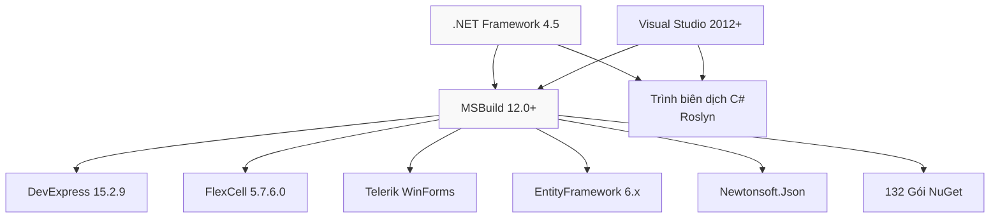

# Các Lệnh Build và Dọn dẹp Thư mục

Tài liệu này cung cấp danh sách các lệnh hữu ích để quản lý quá trình build và dọn dẹp các artifact trong solution HIS.

### Dọn dẹp các thư mục đầu ra (Output Folders)

Sử dụng lệnh sau để xóa tất cả các thư mục `bin` và `obj` trong các module:

```bash
# Xóa thư mục bin và obj của các module chính
rm -rf HIS/bin HIS/obj
rm -rf MPS/bin MPS/obj
rm -rf UC/bin UC/obj
rm -rf Common/bin Common/obj
```

Theo nội dung file [.gitignore:2-4](), các thư mục `bin/`, `obj/`, và `.vs/` được loại trừ khỏi hệ thống quản lý phiên bản (version control).

Nguồn: [.gitignore:1-10](), [[`.devin/wiki.json:65-67`](../../../.devin/wiki.json#L65-L67)](../../../.devin/wiki.json#L65-L67)

---

## Ma trận Môi trường Build

### Các cấu hình được hỗ trợ

| Cấu hình (Configuration) | Mục đích | Tối ưu hóa | Symbol | Kích thước |
|--------------------------|----------|------------|---------|------------|
| **Debug** | Phát triển (Development) | Không | Full PDB | ~2 GB |
| **Release** | Triển khai (Production) | Đầy đủ | Tối thiểu | ~1 GB |

### Các phụ thuộc Framework



### Nền tảng đích (Platform Targets)

Tất cả các project đều nhắm tới `AnyCPU` như đã chỉ định trong [[`Common/HIS.Common.Treatment/HIS.Common.Treatment/HIS.Common.Treatment.csproj:6`](../../Common/HIS.Common.Treatment/HIS.Common.Treatment/HIS.Common.Treatment.csproj#L6)](../../Common/HIS.Common.Treatment/HIS.Common.Treatment/HIS.Common.Treatment.csproj#L6):

```xml
<Platform Condition=" '$(Platform)' == '' ">AnyCPU</Platform>
```

Điều này cho phép ứng dụng chạy dưới dạng 32-bit hoặc 64-bit tùy thuộc vào hệ điều hành.

Nguồn: [[`.devin/wiki.json:12-13`](../../../.devin/wiki.json#L12-L13)](../../../.devin/wiki.json#L12-L13), [[`Common/HIS.Common.Treatment/HIS.Common.Treatment/HIS.Common.Treatment.csproj:1-57`](../../Common/HIS.Common.Treatment/HIS.Common.Treatment/HIS.Common.Treatment.csproj#L1-L57)](../../Common/HIS.Common.Treatment/HIS.Common.Treatment/HIS.Common.Treatment.csproj#L1-L57)

---

## Các lưu ý về Tích hợp Liên tục (CI)

### Luồng build tự động (Automated Build Pipeline)

Để cấu hình CI/CD:

1. **Quản lý mã nguồn**: Kho Git tại https://github.com/thangpnb/HIS
2. **Phụ thuộc bên ngoài (External Dependencies)**: Lưu trữ `lib_extend.zip` và `extend.zip` trong kho lưu trữ artifact
3. **Yêu cầu Build Agent**: Build agent Windows cài đặt .NET Framework 4.5 SDK
4. **Script Build**:

```batch
REM Script Build CI
cd %WORKSPACE%

REM Giải nén các phụ thuộc
unzip lib_extend.zip -d extend/lib_extend/
unzip extend.zip -d extend/

REM Restore các gói NuGet
cd HIS
nuget restore HIS.Desktop.sln

REM Build tất cả các module
MSBuild.exe ..\Common\Inventec.Common.sln /p:Configuration=Release /p:Platform=AnyCPU
MSBuild.exe ..\UC\HIS.UC.sln /p:Configuration=Release /p:Platform=AnyCPU
MSBuild.exe ..\MPS\MPS.sln /p:Configuration=Release /p:Platform=AnyCPU
MSBuild.exe HIS.Desktop.sln /p:Configuration=Release /p:Platform=AnyCPU

REM Đóng gói kết quả đầu ra
cd bin\Release
zip -r ..\..\HIS.Desktop.%BUILD_NUMBER%.zip *
```

### Quản lý License trong CI

Các license của DevExpress yêu cầu xử lý đặc biệt:
- **Không** commit các file `.licx` theo [.gitignore:5]()
- Lưu trữ các file license hợp lệ trong biến môi trường bảo mật của CI
- Nhúng license trong quá trình thiết lập build agent

### Bộ nhớ đệm Build (Build Caching)

Sử dụng cache cho các thành phần sau để tăng tốc độ build:
- Thư mục `HIS/packages/` (132 gói NuGet)
- Thư mục `extend/lib_extend/` (các file DLL bên ngoài)
- Kết quả build trung gian (các thư mục `obj/` có thể được cache giữa các lần build)

Nguồn: [.gitignore:5](), [[`.devin/wiki.json:290`](../../../.devin/wiki.json#L290)](../../../.devin/wiki.json#L290)

---

## Tài liệu Bổ sung

### Tài liệu liên quan

- [Tổng quan Kiến trúc](#1) - Cấu trúc hệ thống và tổ chức module
- [HIS Desktop Core](../01-architecture/overview.md) - Điểm nhập ứng dụng và khởi tạo
- [Kiến trúc Hệ thống Plugin](../01-architecture/plugin-system/01-overview.md) - Hướng dẫn phát triển plugin
- [Hệ thống In ấn MPS](../02-modules/his-desktop/business-plugins.md#mps-print) - Phát triển trình xử lý in ấn

### Vị trí các file Solution

| Solution | Đường dẫn | Projects | Mục đích |
|----------|-----------|----------|----------|
| HIS.Desktop.sln | [[`HIS/HIS.Desktop.sln`](../../HIS/HIS.Desktop.sln)](../../HIS/HIS.Desktop.sln) | ~100 | Ứng dụng chính + plugins |
| MPS.sln | [[`MPS/MPS.sln`](../../MPS/MPS.sln)](../../MPS/MPS.sln) | ~800 | Hệ thống in ấn |
| HIS.UC.sln | [[`UC/HIS.UC.sln`](../../../../HIS.UC.sln)](../../../../HIS.UC.sln) | 131 | Các User control |
| Inventec.Common.sln | [[`Common/Inventec.Common.sln`](../../Common/Inventec.Common.sln)](../../Common/Inventec.Common.sln) | 46 | Các tiện ích chung |

Ví dụ cấu trúc solution từ [[`Common/HIS.Common.Treatment/HIS.Common.Treatment.sln:1-21`](../../Common/HIS.Common.Treatment/HIS.Common.Treatment.sln#L1-L21)](../../Common/HIS.Common.Treatment/HIS.Common.Treatment.sln#L1-L21):

```
Microsoft Visual Studio Solution File, Format Version 12.00
# Visual Studio 2012
Project("{FAE04EC0-301F-11D3-BF4B-00C04F79EFBC}") = "HIS.Common.Treatment", ...
GlobalSection(SolutionConfigurationPlatforms) = preSolution
    Debug|Any CPU = Debug|Any CPU
    Release|Any CPU = Release|Any CPU
EndGlobalSection
```

### Liên kết bên ngoài

- Repository: https://github.com/thangpnb/HIS
- License: GPL v3.0
- .NET Framework 4.5: https://dotnet.microsoft.com/download/dotnet-framework/net45

Nguồn: [[`.devin/wiki.json:1-293`](../../../.devin/wiki.json#L1-L293)](../../../.devin/wiki.json#L1-L293), [[`Common/HIS.Common.Treatment/HIS.Common.Treatment.sln:1-21`](../../Common/HIS.Common.Treatment/HIS.Common.Treatment.sln#L1-L21)](../../Common/HIS.Common.Treatment/HIS.Common.Treatment.sln#L1-L21)

5:["$","$L15",null,{"repoName":"thangpnb/HIS","hasConfig":true,"canSteer":true,"children":["$","$L16",null,{"wiki":{"metadata":{"repo_name":"thangpnb/HIS","commit_hash":"93813c77","generated_at":"2026-01-02T03:32:14.572389","config":{"repo_notes":[{"content":"HisNguonMo là phần mềm HIS (Hospital Information System) nguồn mở của Việt Nam, phát hành theo giấy phép GPL v3.0. Ứng dụng chạy trên Windows, viết bằng C# .NET Framework 4.5. Project chia làm 4 module chính: HIS/ (main project + nghiệp vụ plugins), MPS/ (in ấn/báo cáo với 400+ mẫu in), UC/ (131 UI components dùng chung), Common/ (thư viện utilities). Entry point là HIS.Desktop.csproj.","author":"Project Lead"},{"content":"Kiến trúc Plugin-based: Folder HIS/Plugins/ chứa 956 plugins, mỗi plugin là một tính năng nghiệp vụ bệnh viện độc lập. Plugins được phân loại theo prefix: HIS.Desktop.Plugins.* (nghiệp vụ chính), ACS.Desktop.Plugins.* (Access Control), EMR.Desktop.Plugins.* (Electronic Medical Record), LIS.Desktop.Plugins.* (Laboratory), SAR.Desktop.Plugins.* (Reports), SDA.Desktop.Plugins.* (System Data), TYT.Desktop.Plugins.* (Trạm Y Tế).","author":"Technical Lead"},{"content":"Dependencies chính: DevExpress 15.2.9 (UI framework), FlexCell 5.7.6.0 (in ấn/báo cáo Excel), Telerik WinForms (UI controls), Newtonsoft.Json (JSON), EntityFramework (ORM), EO.Pdf/EO.WebBrowser (PDF/web integration), BarTender 10.1.0 (barcode). Cần tải lib_extend.zip từ server riêng trước khi build.","author":"Technical Lead"},{"content":"MPS (Medical Print System) chứa 790+ print processors (MPS.Processor.Mps000xxx) cho các loại biểu mẫu y tế khác nhau: đơn thuốc, phiếu xét nghiệm, hóa đơn, giấy chuyển viện, v.v. Mỗi processor có 2 folder: logic (Mps000xxx) và data object (Mps000xxx.PDO).","author":"Technical Lead"},{"content":"UC (User Controls) chứa 131 reusable UI components được nhúng trong plugins: HIS.UC.Medicine* (thuốc), HIS.UC.Patient* (bệnh nhân), HIS.UC.Icd* (mã bệnh), HIS.UC.Treatment* (điều trị), HIS.UC.Service* (dịch vụ), His.UC.UCHein (bảo hiểm y tế). Mỗi UC là một project riêng biệt.","author":"Technical Lead"}],"pages":[{"title":"Architecture Overview","purpose":"Tổng quan kiến trúc hệ thống HIS nguồn mở: cấu trúc 4 module chính (HIS, MPS, UC, Common), cách các module tương tác, plugin architecture, và data flow giữa các tầng. Bao gồm sơ đồ dependencies giữa các projects và solution files (.sln).","parent":null,"page_notes":[{"content":"4 solution files chính: HIS/HIS.Desktop.sln (main app), MPS/MPS.sln (print system), UC/HIS.UC.sln (user controls), Common/Inventec.Common.sln. Dependencies flow: Common -> UC -> HIS, MPS được gọi từ HIS để in ấn.","author":null}]},{"title":"HIS Desktop Core","purpose":"Document HIS/HIS.Desktop/ - entry point của ứng dụng. Bao gồm cách khởi tạo, main form, session management, và cách load plugins. Focus vào các project con như HIS.Desktop.ApiConsumer, HIS.Desktop.Common, HIS.Desktop.Utility, HIS.Desktop.ADO.","parent":"Architecture Overview","page_notes":[{"content":"HIS.Desktop chứa 83 files, là entry point. HIS.Desktop.ADO (74 files) chứa data models. HIS.Desktop.Utility (55 files) chứa helper functions. HIS.Desktop.Common chứa shared interfaces và base classes cho plugins.","author":null}]},{"title":"LocalStorage & Configuration","purpose":"Document các project HIS.Desktop.LocalStorage.* - hệ thống quản lý cấu hình và cache local. Bao gồm ConfigApplication, ConfigSystem, HisConfig, BackendData (69 files), PubSub pattern cho communication giữa các module, SdaConfigKey (30 files).","parent":"HIS Desktop Core","page_notes":[{"content":"LocalStorage projects: BackendData (cache API data), ConfigApplication, ConfigSystem, HisConfig, LisConfig, EmrConfig, Branch, Location, PubSub (event communication). SdaConfigKey chứa configuration keys cho system data.","author":null}]},{"title":"API Consumer Layer","purpose":"Document HIS.Desktop.ApiConsumer/ (13 files) - layer giao tiếp với backend API. Cách gọi REST API, xử lý response, error handling, và authentication flow. Kết hợp với Inventec.Common.WebApiClient.","parent":"HIS Desktop Core","page_notes":null},{"title":"Plugin System Architecture","purpose":"Document kiến trúc plugin trong HIS/Plugins/. Giải thích cách plugin được tổ chức (HIS.Desktop.Plugins.*), cách đăng ký plugin, lifecycle của plugin, và communication pattern giữa plugins qua DelegateRegister và PubSub. Bao gồm HIS.Desktop.Modules.Plugin và HIS.Desktop.Library.CacheClient.","parent":"HIS Desktop Core","page_notes":[{"content":"Tổng cộng 956 plugins trong HIS/Plugins/. Mỗi plugin thường có structure: [PluginName].cs (entry), Run/, ADO/, Base/, Properties/. Plugins giao tiếp qua HIS.Desktop.DelegateRegister và HIS.Desktop.LocalStorage.PubSub.","author":null}]},{"title":"HIS Core Business Plugins","purpose":"Overview các nhóm plugin nghiệp vụ HIS chính: Register (đăng ký khám 81-102 files), Treatment (điều trị 56-101 files), Exam (khám bệnh), Prescription (kê đơn 117-203 files), Tracking (theo dõi 59 files). Các plugin quan trọng: AssignPrescriptionPK (203 files), ServiceExecute (119 files), TreatmentFinish (101 files).","parent":"Plugin System Architecture","page_notes":[{"content":"Các plugin lớn nhất: AssignPrescriptionPK (203 files) - kê đơn thuốc, AssignPrescriptionCLS (136 files) - chỉ định CLS, AssignPrescriptionKidney (132 files) - lọc thận, ServiceExecute (119 files) - thực hiện dịch vụ, TreatmentFinish (101 files) - kết thúc điều trị.","author":null}]},{"title":"Transaction & Billing Plugins","purpose":"Document các plugin thanh toán và giao dịch: Transaction, TransactionBill (48 files), TransactionDeposit, TransactionDebt, InvoiceCreate, PharmacyCashier (31 files), DepositRequest (30 files). Xử lý thu tiền, hóa đơn điện tử, công nợ.","parent":"Plugin System Architecture","page_notes":[{"content":"TransactionBill (48 files) - thanh toán viện phí, TransactionBillKiosk (36 files) - kiosk tự động, TransactionDebtCollect (39 files) - thu công nợ, EInvoiceCreate - hóa đơn điện tử, ElectronicBillTotal.","author":null}]},{"title":"Medicine & Material Plugins","purpose":"Document các plugin quản lý thuốc và vật tư: MedicineType, MaterialType, ExpMest* (xuất kho), ImpMest* (nhập kho 80 files), MediStock* (kho), Bid* (đấu thầu), Import/Export blood. Bao gồm cả MediStockSummary (49 files), MedicalStoreV2 (49 files).","parent":"Plugin System Architecture","page_notes":[{"content":"ImpMestCreate (80 files) - nhập kho, ExpMestSaleCreate (78 files) - bán thuốc, MediStockSummary (49 files) - tổng hợp kho, MedicalStoreV2 (49 files) - cửa hàng thuốc, BidCreate (47 files) - tạo thầu.","author":null}]},{"title":"Patient Call & Display Plugins","purpose":"Document các plugin gọi bệnh nhân: CallPatient (nhiều phiên bản V3-V8), CallPatientCLS, CallPatientCashier, CallPatientExam, CallPatientSample. Tích hợp với hệ thống xếp hàng và màn hình hiển thị.","parent":"Plugin System Architecture","page_notes":[{"content":"Nhiều phiên bản CallPatient: V3 (24 files), V4 (32 files), V5 (26 files), V6 (26 files), Ver5 (39 files), Ver7 (25 files). CallPatientTypeAlter (52 files) - thay đổi loại bệnh nhân.","author":null}]},{"title":"ACS Access Control Plugins","purpose":"Document các plugin ACS (Access Control System): AcsUser (30 files), AcsRole, AcsApplication, AcsModule, AcsControl, AcsRoleUser. Quản lý phân quyền người dùng, vai trò, và module access.","parent":"Plugin System Architecture","page_notes":[{"content":"13 ACS plugins: AcsUser (30 files), AcsRole (25 files), AcsRoleUser (25 files), AcsRoleBase (25 files), AcsApplication (24 files), AcsModule (24 files), AcsModuleGroup (24 files), AcsControl (24 files), ImportAcsRoleUser.","author":null}]},{"title":"EMR Electronic Medical Record Plugins","purpose":"Document các plugin EMR: EmrDocument (42 files), EmrFlow, EmrSign, EmrSignDocumentList (23 files), EmrBusiness, EmrConfig, EmrDocumentList. Quản lý hồ sơ bệnh án điện tử, ký số, và luồng phê duyệt.","parent":"Plugin System Architecture","page_notes":[{"content":"16 EMR plugins: EmrDocument (42 files), EmrSignDocumentList (23 files), EmrSignerFlow (22 files), EmrFlow (21 files), EmrTreatmentList (21 files), EmrSign (18 files). Tích hợp ký số và luồng phê duyệt.","author":null}]},{"title":"LIS Laboratory Plugins","purpose":"Document các plugin LIS (Laboratory Information System): LisSample, LisSampleList, LisMachine, LisMachineIndex, LisAntibiotic, LisBacterium, LisSampleCondition (24 files), LisWellPlate. Quản lý xét nghiệm và kết nối máy.","parent":"Plugin System Architecture","page_notes":[{"content":"12 LIS plugins: LisSampleCondition (24 files), LisMachine (24 files), LisMachineIndex (22 files), LisSampleList (21 files), LisSampleUpdate (36 files), LisSampleAggregation (27 files), LisWellPlate (26 files).","author":null}]},{"title":"SAR Report Plugins","purpose":"Document các plugin SAR (System of Advanced Reports): SarReportTemplate (38 files), SarPrintType (34 files), SarRetyFofi (28 files), SarPrintList (25 files), SarReportType (23 files). Quản lý mẫu báo cáo và in ấn tùy chỉnh.","parent":"Plugin System Architecture","page_notes":[{"content":"15 SAR plugins: SarReportTemplate (38 files), SarPrintType (34 files), SarRetyFofi (28 files), SarPrintList (25 files), SarReportType (23 files), SarFormField (21 files), SarReport (21 files), SarReportTypeGroup (21 files).","author":null}]},{"title":"TYT Commune Health Station Plugins","purpose":"Document các plugin TYT (Trạm Y Tế): TYTFetusExam, TYTFetusBorn, TYTMalaria, TYTTuberculosis, TYTKhh, TYTNerves, TytDeath, TytHiv. Quản lý y tế cơ sở và các chương trình sức khỏe cộng đồng.","parent":"Plugin System Architecture","page_notes":[{"content":"17 TYT plugins cho y tế cơ sở: TytDeath (22 files), TytHiv (22 files), TYTFetusBorn (19 files), TYTTuberculosis (19 files), TYTMalaria (18 files), TYTFetusExam (17 files), TYTGDSK (17 files).","author":null}]},{"title":"SDA System Data Plugins","purpose":"Document các plugin SDA (System Data Administration): SdaField (25 files), SdaExecuteSql (26 files), SdaNational (38 files), SdaDistrict, SdaCommune, SdaEthnic, SdaReligion, SdaProvince, SdaHideControl (24 files). Quản lý dữ liệu danh mục hệ thống.","parent":"Plugin System Architecture","page_notes":[{"content":"14 SDA plugins: SdaNational (38 files) - quốc gia, SdaExecuteSql (26 files) - thực thi SQL, SdaField (25 files) - trường dữ liệu, SdaHideControl (24 files) - ẩn controls, SdaModuleField (21 files).","author":null}]},{"title":"Library Helper Plugins","purpose":"Document các plugin HIS.Desktop.Plugins.Library.*: PrintBordereau (69 files), PrintOtherForm (94 files), ElectronicBill (101 files), DrugInterventionInfo, TreatmentEndTypeExt (43 files), PrintTreatmentFinish. Các thư viện helper dùng chung.","parent":"Plugin System Architecture","page_notes":[{"content":"36 Library plugins: ElectronicBill (101 files) - hóa đơn điện tử, PrintOtherForm (94 files) - in biểu mẫu khác, PrintBordereau (69 files) - in bảng kê, TreatmentEndTypeExt (43 files) - loại kết thúc điều trị.","author":null}]},{"title":"MPS Print System","purpose":"Document MPS/ - hệ thống in ấn và báo cáo. Bao gồm MPS.ProcessorBase (30 files) - base classes, MPS.Processor/ (790+ processors cho từng loại biểu mẫu Mps000xxx), MPS/ (594 files) - core printing. Integration với FlexCell để xuất Excel/PDF.","parent":"Architecture Overview","page_notes":[{"content":"MPS.Processor chứa 790+ folders, mỗi cặp Mps000xxx + Mps000xxx.PDO là một processor. Ví dụ: Mps000001-Mps000499 cho các biểu mẫu y tế khác nhau. MPS.ProcessorBase (30 files) chứa abstract base classes.","author":null}]},{"title":"Print Processor Development","purpose":"Hướng dẫn tạo print processor mới trong MPS. Cách extend ProcessorBase, define template, binding data với PDO (Print Data Object), và register processor. Cấu trúc: Processor class + PDO class.","parent":"MPS Print System","page_notes":[{"content":"Mỗi processor có 2 folders: Mps000xxx (logic, 4-15 files) và Mps000xxx.PDO (data objects, 3-10 files). Processors lớn: Mps000304 (19 files), Mps000321 (17 files), Mps000463 (15 files).","author":null}]},{"title":"UC Components Library","purpose":"Document UC/ - thư viện User Controls dùng chung với 131 components. Các UC quan trọng: HIS.UC.FormType (329 files), HIS.UC.ExamTreatmentFinish (103 files), HIS.UC.TreatmentFinish (94 files), His.UC.UCHein (153 files), His.UC.CreateReport (165 files).","parent":"Architecture Overview","page_notes":[{"content":"131 UC projects. Lớn nhất: HIS.UC.FormType (329 files), His.UC.CreateReport (165 files), His.UC.UCHein (153 files), HIS.UC.PlusInfo (147 files), HIS.UC.ExamTreatmentFinish (103 files), HIS.UC.TreatmentFinish (94 files).","author":null}]},{"title":"Form Type Controls","purpose":"Document HIS.UC.FormType/ (329 files) - hệ thống form types phức tạp nhất trong UC. Giải thích các loại form, cách tạo form mới, và binding patterns. Đây là core component cho tất cả các form nhập liệu.","parent":"UC Components Library","page_notes":null},{"title":"Patient & Treatment UCs","purpose":"Document các UC liên quan đến bệnh nhân và điều trị: HIS.UC.PatientSelect (39 files), HIS.UC.TreatmentFinish (94 files), HIS.UC.ExamTreatmentFinish (103 files), HIS.UC.Hospitalize (53 files), HIS.UC.Death (47 files), HIS.UC.UCPatientRaw (47 files).","parent":"UC Components Library","page_notes":[{"content":"UCs bệnh nhân/điều trị: ExamTreatmentFinish (103 files), TreatmentFinish (94 files), Hospitalize (53 files), Death (47 files), UCPatientRaw (47 files), UCHeniInfo (47 files), PatientSelect (39 files), KskContract (59 files).","author":null}]},{"title":"Medicine & ICD UCs","purpose":"Document các UC liên quan đến thuốc và mã bệnh: HIS.UC.MedicineType (82 files), HIS.UC.MaterialType (85 files), HIS.UC.Icd (65 files), HIS.UC.SecondaryIcd (61 files), HIS.UC.MedicineInStock, HIS.UC.MaterialInStock.","parent":"UC Components Library","page_notes":[{"content":"UCs thuốc/vật tư: MaterialType (85 files), MedicineType (82 files), Icd (65 files), SecondaryIcd (61 files), DHST (54 files), DateEditor (55 files), TreeSereServ7V2 (52 files).","author":null}]},{"title":"Service & Room UCs","purpose":"Document các UC liên quan đến dịch vụ và phòng: HIS.UC.ServiceRoom (48 files), HIS.UC.ServiceUnit (48 files), HIS.UC.RoomExamService (40 files), HIS.UC.ServiceRoomInfo (43 files), HIS.UC.Sick (43 files), HIS.UC.National (41 files).","parent":"UC Components Library","page_notes":null},{"title":"Common Libraries","purpose":"Document Common/ - thư viện nền tảng với 12 major components. Bao gồm Inventec.Common/ (46 sub-projects), Inventec.Desktop/ (27 sub-projects), Inventec.UC/ (1060 files), Inventec.Fss.Client, Inventec.WCF, Inventec.Speech, Inventec.DicomViewer (134 files).","parent":"Architecture Overview","page_notes":[{"content":"12 major components: Inventec.UC (1060 files), Inventec.Common (890 files), Inventec.Desktop (455 files), Inventec.DicomViewer (134 files), Inventec.DrawTools (86 files), Inventec.Aup.Client (40 files), Inventec.Speech (31 files).","author":null}]},{"title":"Inventec Common Utilities","purpose":"Document Common/Inventec.Common/ với 46 utility projects: Logging, DateTime, String, Number, FlexCelPrint (38 files), FlexCelExport (23 files), QRCoder (51 files), ElectronicBill (319 files), RedisCache (26 files), WebApiClient, WordContent (60 files).","parent":"Common Libraries","page_notes":[{"content":"46 Inventec.Common projects. Lớn nhất: ElectronicBill (319 files), WordContent (60 files), QRCoder (51 files), FlexCelPrint (38 files), BarcodeLib (32 files), Sqlite (32 files), RedisCache (26 files), WitAI (25 files).","author":null}]},{"title":"Inventec Desktop Framework","purpose":"Document Common/Inventec.Desktop/ với 27 projects - framework base cho desktop application. Bao gồm Inventec.Desktop.Core (208 files), CustomControl (26 files), ExportXML (30 files), MenuButton, Plugins.* (ChangePassword, ConfigApplication, EventLog, Updater).","parent":"Common Libraries","page_notes":[{"content":"27 Inventec.Desktop projects. Core (208 files) - plugin discovery và lifecycle. 8 base plugins: ChangePassword, ConfigApplication, Deverloper, EventLog, Plugin, PrintLog, ProductVersion, TrackingUser, Updater.","author":null}]},{"title":"Inventec UC Shared Controls","purpose":"Document Common/Inventec.UC/ (1060 files) - largest common component. Các shared controls cơ bản được sử dụng trong toàn bộ application. Bao gồm TreatmentRecord (29 files), TreeSereServHein (29 files).","parent":"Common Libraries","page_notes":null},{"title":"Data Models & ADO","purpose":"Document HIS.Desktop.ADO/ (74 files) - các data models và Active Data Objects. Cách define model, mapping với backend entities, và sử dụng trong plugins. Kết hợp với EntityFramework.","parent":"HIS Desktop Core","page_notes":null},{"title":"Notification & Events","purpose":"Document HIS.Desktop.Notify/ (25 files) và HIS.Desktop.LocalStorage.PubSub/ (9 files) - hệ thống notification và event handling. Cách subscribe/publish events giữa các modules và plugins. Tích hợp với Inventec.Common.WSPubSub.","parent":"HIS Desktop Core","page_notes":null},{"title":"Build & Development Setup","purpose":"Hướng dẫn setup môi trường phát triển: clone repo, download lib_extend.zip và extend.zip, cấu hình MSBuild, build HIS.Desktop.csproj. Yêu cầu .NET Framework 4.5, DevExpress 15.2.9 license, và các dependencies nguồn đóng. Sử dụng packages/ folder cho NuGet.","parent":"Architecture Overview","page_notes":[{"content":"Build command: MSBuild.exe HIS.Desktop.csproj /p:Configuration=Release /p:Platform=AnyCPU. Cần download lib_extend.zip (thư viện) và extend.zip (runtime components) từ server Vietsens. HIS/packages/ chứa 132 NuGet packages.","author":null}]}]},"config_source":"repo"},"pages":[{"page_plan":{"id":"1","title":"Architecture Overview"},"content":"$17"},{"page_plan":{"id":"1.1","title":"HIS Desktop Core"},"content":"$18"},{"page_plan":{"id":"1.1.1","title":"LocalStorage & Configuration"},"content":"$19"},{"page_plan":{"id":"1.1.2","title":"API Consumer Layer"},"content":"$1a"},{"page_plan":{"id":"1.1.3","title":"Plugin System Architecture"},"content":"$1b"},{"page_plan":{"id":"1.1.3.1","title":"HIS Core Business Plugins"},"content":"$1c"},{"page_plan":{"id":"1.1.3.2","title":"Transaction & Billing Plugins"},"content":"$1d"},{"page_plan":{"id":"1.1.3.3","title":"Medicine & Material Plugins"},"content":"$1e"},{"page_plan":{"id":"1.1.3.4","title":"Patient Call & Display Plugins"},"content":"$1f"},{"page_plan":{"id":"1.1.3.5","title":"ACS Access Control Plugins"},"content":"$20"},{"page_plan":{"id":"1.1.3.6","title":"EMR Electronic Medical Record Plugins"},"content":"$21"},{"page_plan":{"id":"1.1.3.7","title":"LIS Laboratory Plugins"},"content":"$22"},{"page_plan":{"id":"1.1.3.8","title":"SAR Report Plugins"},"content":"$23"},{"page_plan":{"id":"1.1.3.9","title":"TYT Commune Health Station Plugins"},"content":"$24"},{"page_plan":{"id":"1.1.3.10","title":"SDA System Data Plugins"},"content":"$25"},{"page_plan":{"id":"1.1.3.11","title":"Library Helper Plugins"},"content":"$26"},{"page_plan":{"id":"1.1.4","title":"Data Models & ADO"},"content":"$27"},{"page_plan":{"id":"1.1.5","title":"Notification & Events"},"content":"$28"},{"page_plan":{"id":"1.2","title":"MPS Print System"},"content":"$29"},{"page_plan":{"id":"1.2.1","title":"Print Processor Development"},"content":"$2a"},{"page_plan":{"id":"1.3","title":"UC Components Library"},"content":"$2b"},{"page_plan":{"id":"1.3.1","title":"Form Type Controls"},"content":"$2c"},{"page_plan":{"id":"1.3.2","title":"Patient & Treatment UCs"},"content":"$2d"},{"page_plan":{"id":"1.3.3","title":"Medicine & ICD UCs"},"content":"$2e"},{"page_plan":{"id":"1.3.4","title":"Service & Room UCs"},"content":"$2f"},{"page_plan":{"id":"1.4","title":"Common Libraries"},"content":"$30"},{"page_plan":{"id":"1.4.1","title":"Inventec Common Utilities"},"content":"$31"},{"page_plan":{"id":"1.4.2","title":"Inventec Desktop Framework"},"content":"$32"},{"page_plan":{"id":"1.4.3","title":"Inventec UC Shared Controls"},"content":"$33"},{"page_plan":{"id":"1.5","title":"Build & Development Setup"},"content":"$34"}]},"children":"$L35"}]}]